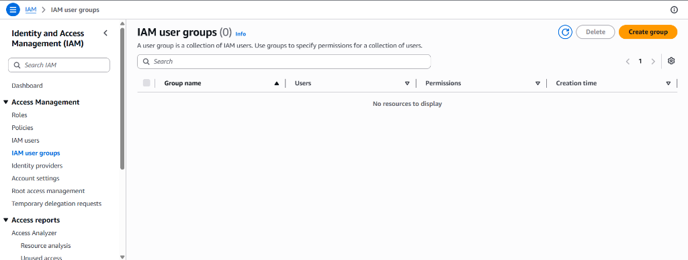
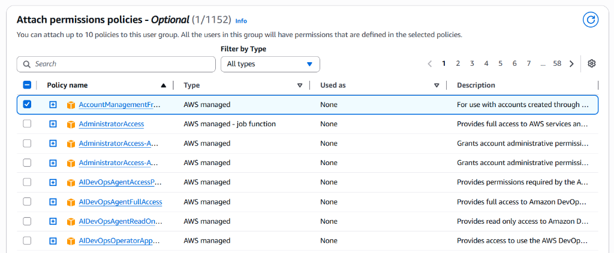
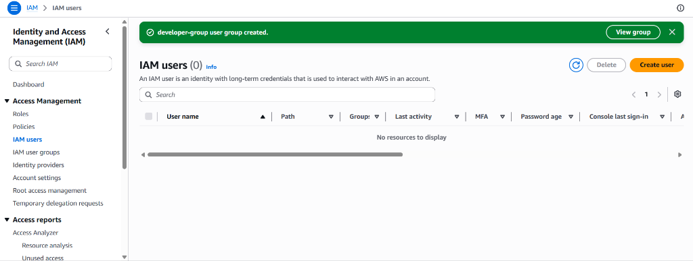
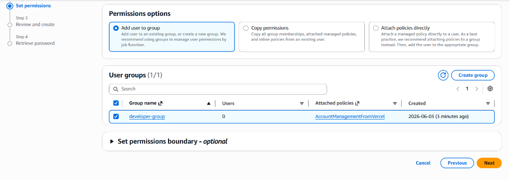
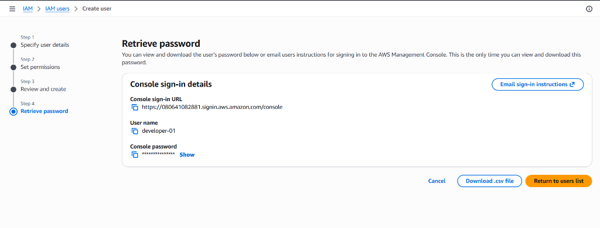
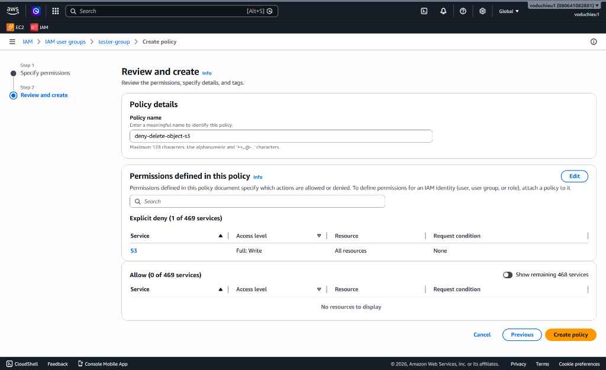
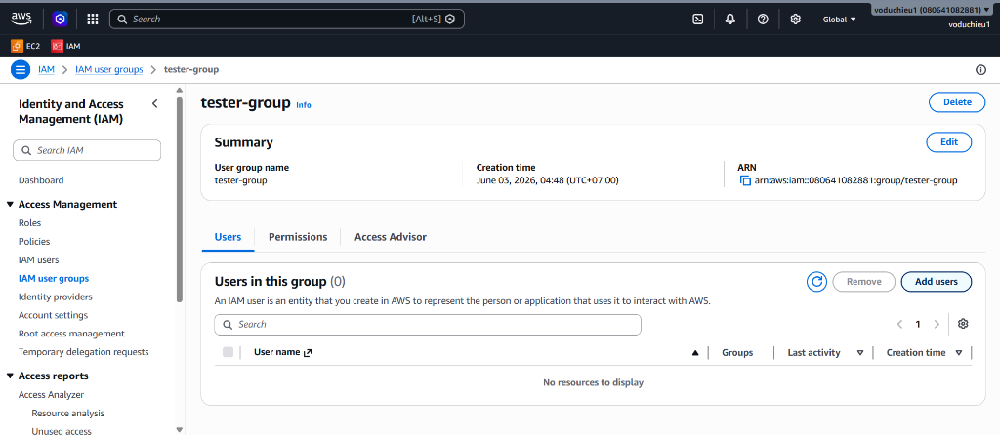
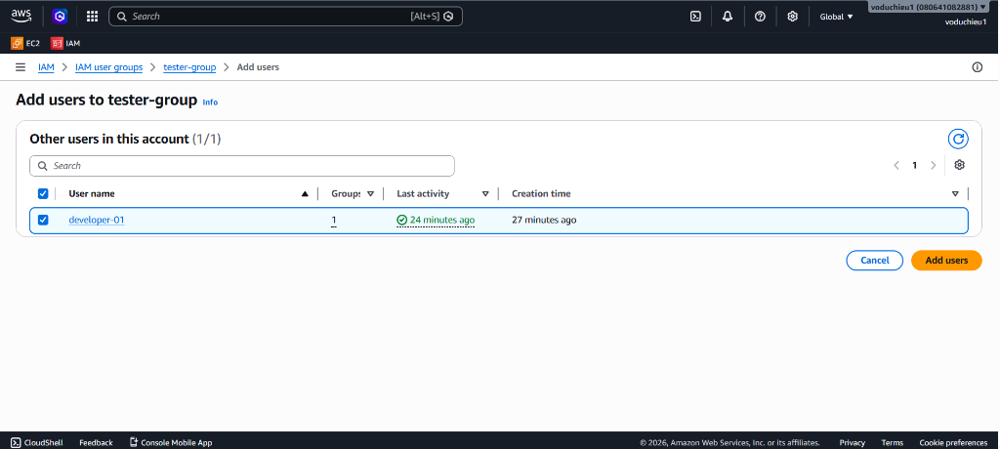

# Hướng Dẫn Thực Hành: Làm Quen Với User/Group và Policy

Tài liệu này hướng dẫn từng bước chi tiết (step-by-step) để thực hành tạo một nhóm người dùng (User Group) có quyền quản trị, khởi tạo người dùng (IAM User) mới và gán vào nhóm, tải thông tin đăng nhập và thực hiện kiểm tra quyền truy cập trên AWS Management Console.

---

## 1. Tạo nhóm người dùng (User Group) có quyền AdministratorAccess

Để tạo nhóm người dùng mới:
1.  Truy cập **AWS Management Console** -> Chọn dịch vụ **IAM**.
2.  Tại menu bên trái, chọn **User groups** -> Nhấp nút **Create group** ở góc phải.

3.  **Cấu hình thông tin nhóm**:
    - **User group name**: Nhập tên nhóm (ví dụ: `developer-group`).
4.  **Gán chính sách (Attach permissions policies)**:
    - Tại danh sách chính sách, tìm kiếm và tích chọn chính sách **AdministratorAccess** (hoặc chính sách phù hợp như ảnh minh họa).

5.  Nhấp nút **Create group** ở phía cuối trang để hoàn tất tạo nhóm.

---

## 2. Tạo người dùng (IAM User) và thêm vào nhóm (Group)

Để tạo người dùng mới và thêm vào nhóm vừa tạo:
1.  Tại menu bên trái của IAM, chọn **Users** -> Nhấp chọn **Create user**.

2.  **Thiết lập thông tin User**:
    - **User name**: Nhập tên người dùng (ví dụ: `developer-01`).
    - Tích chọn **Provide user access to the AWS Management Console** nếu muốn cấp quyền đăng nhập giao diện web.
    - Cấu hình tùy chọn mật khẩu (Autogenerated password hoặc Custom password) -> Nhấp **Next**.
3.  **Thiết lập quyền hạn (Set permissions)**:
    - Chọn mục **Add user to group**.
    - Tại danh sách nhóm bên dưới, tích chọn nhóm bạn vừa tạo (ví dụ: `developer-group`).

4.  Nhấp **Next** -> Xem lại thông tin cấu hình -> Nhấp **Create user**.
5.  **Tải xuống thông tin xác thực**:
    - Tại trang hoàn tất (Retrieve password), nhấp nút **Download .csv file** để lưu trữ thông tin đăng nhập (gồm Console đăng nhập URL, Username, và Password) về máy tính cá nhân.

---

## 3. Đăng nhập Console và kiểm thử các dịch vụ (Launch Instance, S3...)

Để kiểm tra quyền hạn của người dùng mới:
1.  Mở một trình duyệt ẩn danh (Incognito) hoặc trình duyệt khác để tránh xung đột với tài khoản chính hiện tại.
2.  Sử dụng đường dẫn **Console sign-in URL** trong tệp `.csv` vừa tải về (hoặc trên màn hình hiển thị ở Bước 2) để truy cập trang đăng nhập AWS.
3.  Nhập **User name** (ví dụ: `developer-01`) và **Console password** được cung cấp trong tệp `.csv`.
4.  Sau khi đăng nhập thành công vào AWS Console bằng tài khoản `developer-01`:
    - Truy cập dịch vụ **EC2** -> Thực hành tạo thử một máy chủ ảo (**Launch Instance**).
    - Truy cập dịch vụ **S3** -> Thực hành tạo thử một Bucket mới để kiểm thử.
    - Vì User thuộc nhóm có quyền `AdministratorAccess`, các hành động khởi tạo trên sẽ diễn ra thành công mà không gặp bất kỳ lỗi từ chối quyền truy cập nào.

> [!NOTE]
> Khi đăng nhập lần đầu với user `developer-01`, bạn có thể thấy một số thông báo dạng `Access denied` đối với một số dịch vụ mặc định trên màn hình Console Home (ví dụ: `servicecatalog:ListApplications` như hình bên dưới). Điều này là bình thường vì các widget hoặc dịch vụ này có thể yêu cầu quyền hạn cụ thể khác không nằm trong chính sách quản trị thông thường của tài khoản hoặc bị giới hạn bởi SCP ở cấp độ AWS Organization.
>
> 

---

## 4. Tạo nhóm người dùng (User Group) "tester-group" chỉ có quyền ReadOnlyAccess

Để tạo một nhóm chỉ có quyền đọc dữ liệu (Read-only Access) cho các thành viên thử nghiệm (Tester):

1.  Tại menu bên trái của IAM, chọn **User groups** -> Nhấp chọn **Create group**.
2.  **Thiết lập thông tin nhóm**:
    - **User group name**: Nhập tên nhóm là `tester-group`.
3.  **Gán chính sách (Attach permissions policies)**:
    - Tìm kiếm từ khóa `ReadOnlyAccess` tại ô filter chính sách.
    - Tích chọn chính sách **ReadOnlyAccess** (đây là chính sách AWS Managed cấp quyền chỉ đọc cho hầu hết các dịch vụ AWS).

4.  Nhấp nút **Create user group** ở góc dưới bên phải để hoàn tất tạo nhóm.

---

## 5. Thêm Custom Inline Deny Policy "deny-delete-object-s3" vào nhóm "tester-group"

Để ngăn chặn các thành viên trong nhóm `tester-group` xóa hoặc chỉnh sửa dữ liệu trên S3 (dù họ có quyền ReadOnlyAccess nhưng ta muốn chặn cụ thể các hành động nhạy cảm này bằng một chính sách Deny rõ ràng):

1.  Tại giao diện quản lý chi tiết của nhóm `tester-group` mới tạo, chuyển sang tab **Permissions**.
2.  Nhấp vào nút **Add permissions** ở góc phải -> Chọn **Create inline policy**.

3.  **Thiết lập Policy bằng Visual Editor**:
    - Chọn service **S3**.
    - Tại mục **Actions allowed**, tích chọn tất cả các hành động ghi/xóa (bằng cách chọn mục **Write** -> tích chọn **All write actions (s3:*)** như hình dưới).
    - Tại mục **Resources**, chọn **All**.

4.  **Chuyển sang JSON Editor**:
    - Nhấp chọn tab **JSON** ở phía trên trình chỉnh sửa policy.
    - Thay đổi giá trị trường `"Effect"` từ `"Allow"` thành `"Deny"`. Điều này sẽ chặn toàn bộ các quyền ghi/xóa đối với dịch vụ S3.
    - Trình biên dịch JSON sẽ tự động liệt kê các hành động ghi/xóa của S3 như hình dưới.

5.  Nhấp **Next** ở góc dưới bên phải để chuyển sang bước **Review and create**.
6.  **Đặt tên cho Policy**:
    - **Policy name**: Nhập tên chính sách là `deny-delete-object-s3`.
    - Xem lại cấu hình chính sách (như hiển thị bên dưới, mục **Explicit deny** hiển thị `S3` với cấp độ truy cập `Full: Write` trên tất cả tài nguyên).
7.  Nhấp nút **Create policy** để đính kèm trực tiếp chính sách này vào nhóm `tester-group`.

---

## 6. Thêm người dùng (IAM User) vào nhóm "tester-group" và nguyên tắc ưu tiên chính sách (Deny > Allow)

Để đưa các tài khoản người dùng cần kiểm thử vào nhóm `tester-group` vừa phân quyền:

1.  Tại giao diện quản lý chi tiết của nhóm `tester-group`, chuyển sang tab **Users**.
2.  Nhấp nút **Add users** ở góc phải danh sách người dùng.

3.  **Chọn người dùng cần thêm**:
    - Trong danh sách người dùng, tích chọn người dùng cần thêm vào nhóm (ví dụ: `developer-01`).
    - Nhấp nút **Add users** ở góc dưới bên phải để hoàn tất.

> [!IMPORTANT]
> **Lưu ý quan trọng: Nguyên tắc ưu tiên quyền trong AWS IAM (Deny overrides Allow)**
> *   Lúc này, người dùng `developer-01` đang thuộc đồng thời hai nhóm:
>     1. Nhóm `developer-group` (có chính sách `AdministratorAccess` cho phép toàn bộ hành động).
>     2. Nhóm `tester-group` (có chính sách `ReadOnlyAccess` + Inline Policy `deny-delete-object-s3` cấm ghi/xóa trên S3).
> *   **Kết quả phân quyền**: Mặc dù người dùng có quyền quản trị tối cao từ nhóm `developer-group`, theo cơ chế đánh giá quyền hạn của AWS, **Deny luôn có mức ưu tiên cao nhất**. Do đó, mọi hành động ghi/xóa dữ liệu (chẳng hạn như xóa Object, xóa Bucket) trên S3 của user `developer-01` đều sẽ bị từ chối truy cập. Quyền đọc dữ liệu vẫn hoạt động bình thường dựa trên chính sách ReadOnlyAccess.

