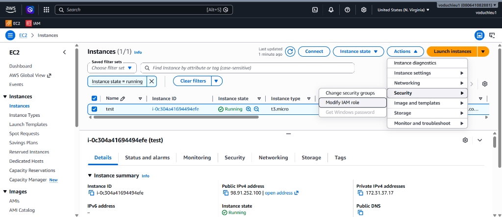
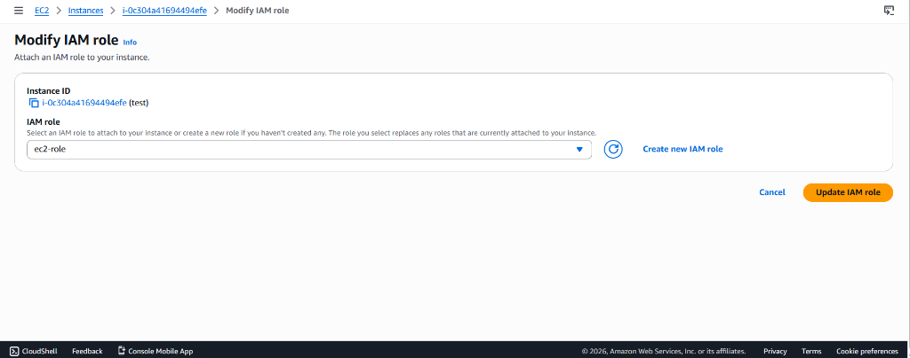

# Hướng Dẫn Thực Hành: Cấu Hình IAM Role Cho EC2 Truy Cập S3

Tài liệu này hướng dẫn các bước tạo một IAM Role cấp quyền truy cập S3 cho máy chủ EC2, gán Role vào EC2 Instance và tiến hành kiểm tra kết nối tài nguyên trực tiếp từ máy chủ thông qua dòng lệnh.

---

> [!NOTE]
> **Lưu ý cốt lõi về IAM Role:** 
> IAM Role là phương thức cấp quyền cho một thực thể AWS (như EC2 Instance, ECS Container, Lambda Function...) để nó có thể tương tác với một tài nguyên khác của AWS. Mặc định, các tài nguyên trên AWS **không thể tự tương tác với nhau** nếu chúng ta không cấp quyền rõ ràng thông qua IAM Role hoặc Policy.

---

## 1. Chuẩn Bị: Khởi Tạo EC2 Instance và Kết Nối SSH

1. Nếu chưa có EC2 Instance, thực hiện khởi tạo một máy chủ Linux (ví dụ: Amazon Linux) theo hướng dẫn tại [Amazon EC2 Hands-on Lab(Linux)](../1.%20EC2/1.%20Amazon%20EC2%20Hands-on%20Lab%28Linux%29.md).
2. Thực hiện kết nối SSH vào Instance vừa tạo từ máy tính cá nhân của bạn.

---

## 2. Tạo IAM Role Cho Phép Quyền Truy Cập S3 (AmazonS3FullAccess)

Admin tiến hành tạo một IAM Role cho phép EC2 Instance gọi các dịch vụ S3:

1. Truy cập **IAM Console** > Chọn mục **Roles** ở menu bên trái > Nhấp nút **Create role**.

   

2. **Cấu hình thông tin Trusted Entity**:
   - Chọn Trusted entity type: **AWS service**.
   - Chọn Service or use case: **EC2**.
   - Chọn Use case phía dưới: **EC2** (Allows EC2 instances to call AWS services on your behalf) > Nhấp **Next**.

   

3. **Gán chính sách phân quyền (Attach Permissions policies)**:
   - Tại ô tìm kiếm chính sách, nhập từ khóa `s3full`.
   - Tìm kiếm và tích chọn chính sách AWS Managed: **AmazonS3FullAccess** > Nhấp **Next**.

   

4. **Đặt tên và hoàn tất**:
   - Nhập tên cho Role (ví dụ: `ec2-role`).
   - Kiểm tra lại cấu hình thực thể tin cậy (Trust policy) và danh sách chính sách đã đính kèm.
   - Nhấp chọn **Create role** ở góc dưới cùng bên phải để tạo.

   

---

## 3. Gán Role vừa tạo vào EC2 Instance

1. Truy cập **EC2 Console** > Chọn **Instances** từ menu bên trái.
2. Tích chọn EC2 Instance muốn gán (ví dụ: `test`) > Chọn menu **Actions** ở góc trên bên phải > Chọn **Security** > Chọn **Modify IAM role**.

   

3. Tại ô tìm kiếm IAM Role, chọn `ec2-role` vừa tạo > Nhấp **Update IAM role** để lưu cấu hình.

   

---

## 4. KT (Kiểm tra) kết quả và giải thích cơ chế

1. Quay lại cửa sổ dòng lệnh đã SSH vào máy chủ EC2 Linux ở Bước 1.
2. Chạy lệnh liệt kê danh sách S3 bucket hiện tại để kiểm tra (KT):
   ```bash
   aws s3 ls
   ```

> [!NOTE]
> **Giải thích lý do thành công:**
> EC2 không cần cấu hình access key vẫn tương tác được với resource khác (S3) vì đang sử dụng qua cơ chế role. Khi gán Role cho EC2, AWS sẽ tự động cấp phát thông tin xác thực tạm thời (temporary credentials) cho EC2 thông qua Instance Metadata Service (IMDS).

> [!IMPORTANT]
> **Lưu ý đặc biệt:** Nếu muốn chạy ứng dụng hay các tác vụ trên EC2, chúng ta **không nên** sử dụng phương pháp tạo và gán Access Key. Access Key chỉ nên dùng cho môi trường máy cá nhân (local) để đảm bảo an toàn bảo mật.
