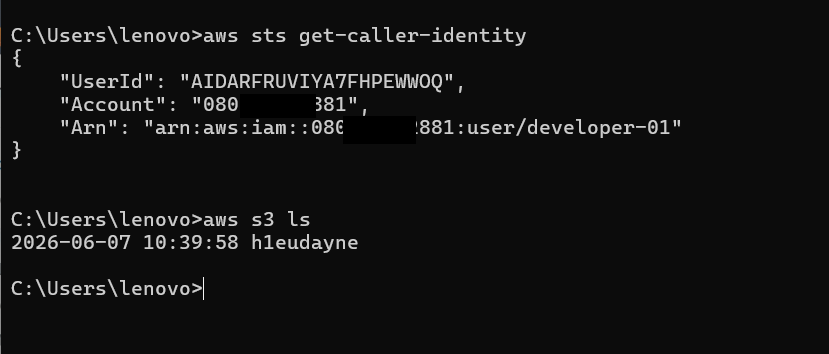
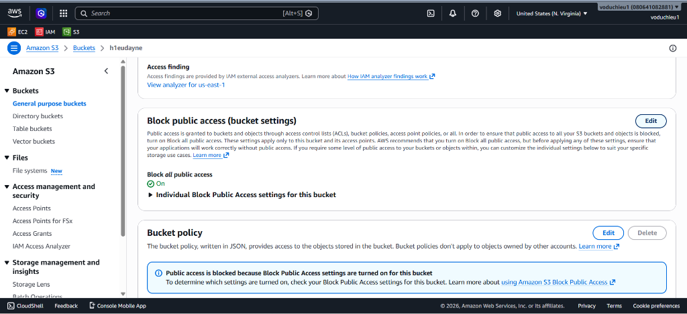
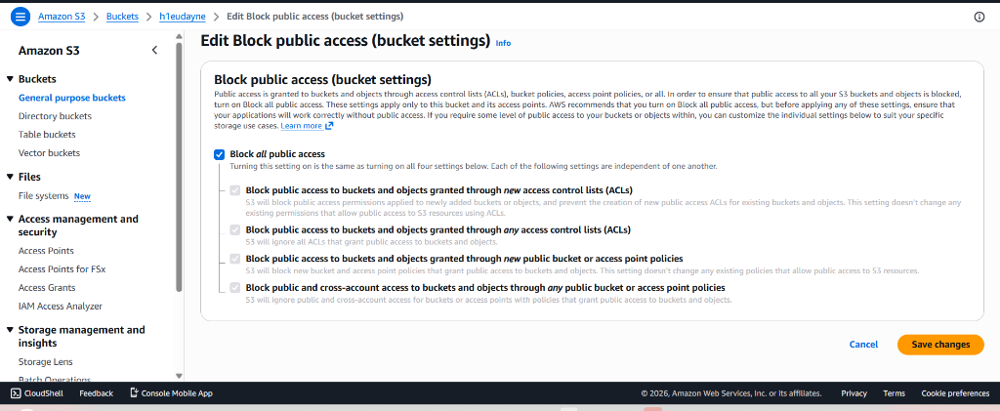
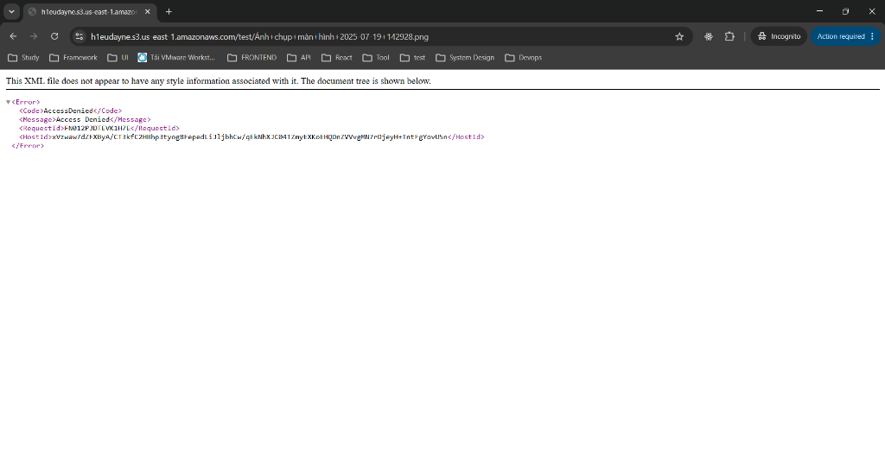

# Amazon S3 Pre-signed URL Hands-on Lab

Bài thực hành này hướng dẫn bạn các bước chi tiết để cấu hình và kiểm nghiệm tính năng **Pre-signed URL** (Đường dẫn ký trước) trên Amazon S3 nhằm cấp quyền truy cập tạm thời cho một đối tượng riêng tư.

---

## Các bước thực hiện chi tiết

### Bước 1: Kiểm tra cấu hình kết nối AWS CLI
Trước khi thực hiện ký tạo URL từ dòng lệnh, bạn cần đảm bảo máy tính đã được cài đặt và cấu hình thông tin xác thực AWS CLI chính xác:

* Mở Terminal (Command Prompt hoặc PowerShell).
* Chạy lệnh sau để kiểm tra danh tính tài khoản IAM hiện tại đang kết nối:
  ```bash
  aws sts get-caller-identity
  ```
  * Xác nhận kết quả trả về hiển thị đúng `UserId`, `Account` và `Arn` của người dùng IAM của bạn (ví dụ: `developer-01`).
* Tiếp tục chạy lệnh hiển thị danh sách các S3 Buckets đang quản lý để kiểm nghiệm kết nối:
  ```bash
  aws s3 ls
  ```
  * Xác nhận trong danh sách hiển thị có chứa bucket bạn đang thực hành (ví dụ: `h1eudayne`).



---

### Bước 2: Upload file lên S3 và kiểm tra chặn truy cập công khai (Block Public Access)
Để kiểm tra tính bảo mật của Pre-signed URL, chúng ta cần chắc chắn rằng đối tượng trên S3 đang ở chế độ riêng tư hoàn toàn (mặc định bị chặn truy cập công khai):

* **B1 (Upload đối tượng)**: Upload một tệp tin (ví dụ: hình ảnh `Ảnh chụp màn hình...` hoặc tệp tài liệu) lên S3 Bucket của bạn.
* **B2 (Kiểm tra cấu hình chặn truy cập công khai)**:
  * Truy cập vào S3 Bucket của bạn trên AWS Console.
  * Chọn tab **Permissions** (Quyền truy cập).
  * Tìm đến mục **Block public access (bucket settings)** và đảm bảo tùy chọn **Block *all* public access** đang ở trạng thái **On** (Đang bật).
  
  

  * *Lưu ý*: Nếu tùy chọn này chưa bật, nhấp vào nút **Edit** ở bên phải, tích chọn **Block all public access**, bấm **Save changes** để hoàn tất kích hoạt.
  
  

* **B3 (Xác nhận trạng thái riêng tư - AccessDenied)**:
  * Click trực tiếp vào đối tượng bạn vừa upload, lấy đường dẫn URL công khai của đối tượng (dạng: `https://<bucket-name>.s3.<region>.amazonaws.com/<key>`).
  * Mở trình duyệt web ẩn danh và dán đường dẫn này để truy cập.
  * Xác nhận trình duyệt trả về lỗi cấu trúc XML thông báo **`AccessDenied`** (Không cho phép truy cập). Điều này chứng minh tệp tin đang được bảo mật an toàn và không thể xem trực tiếp qua internet.


