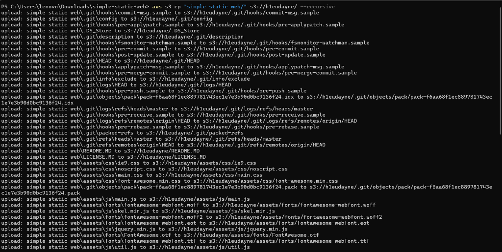
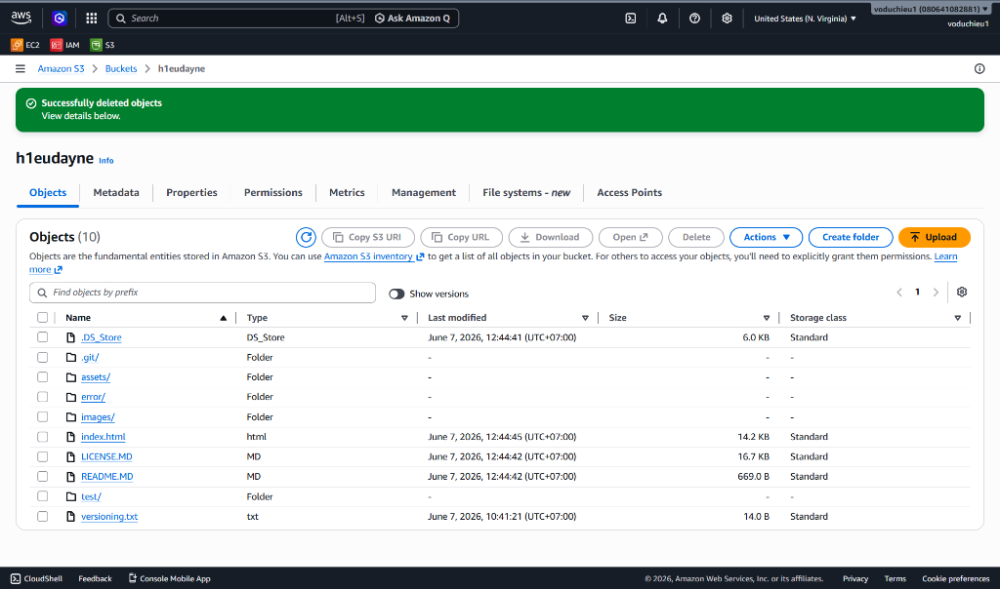
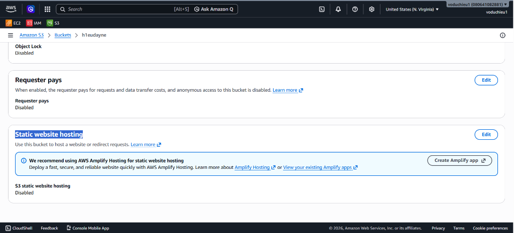
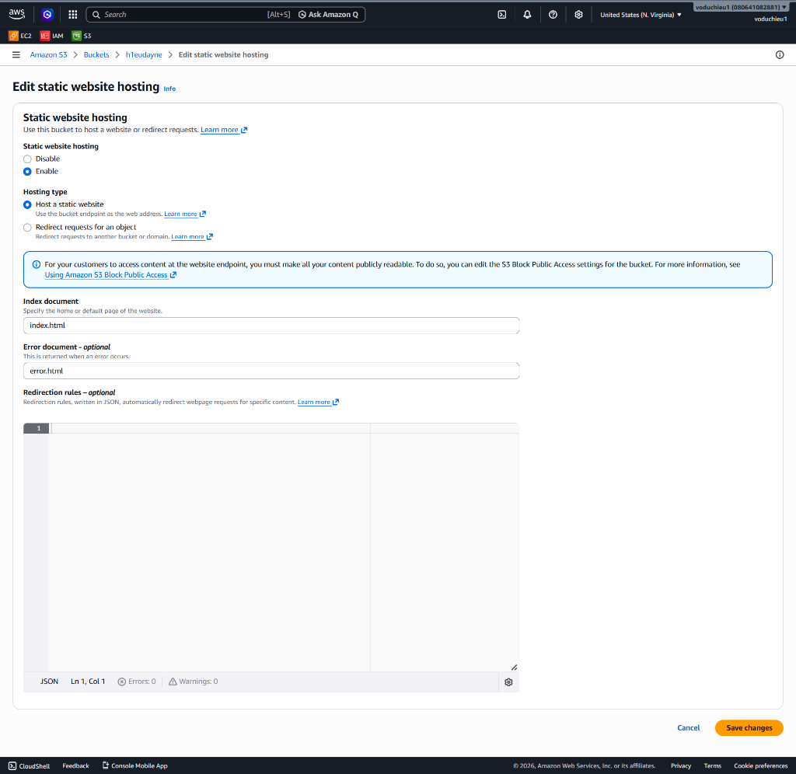
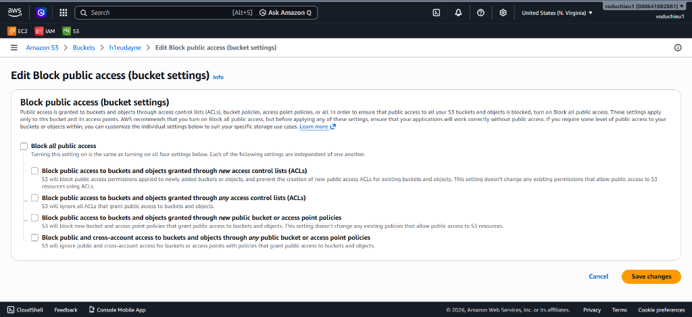
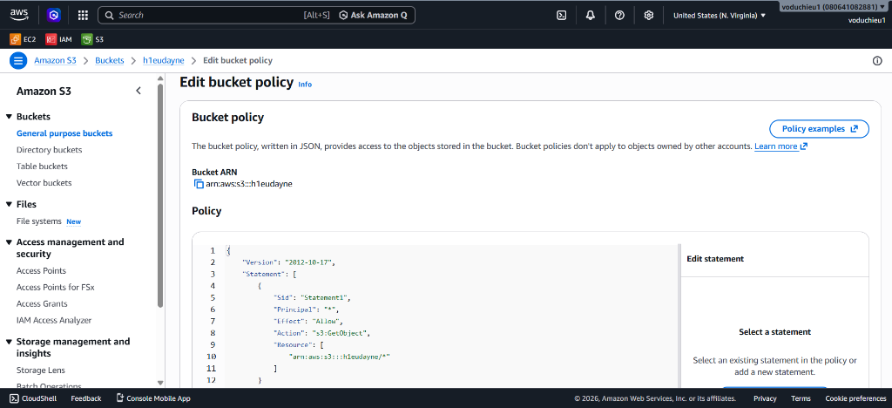
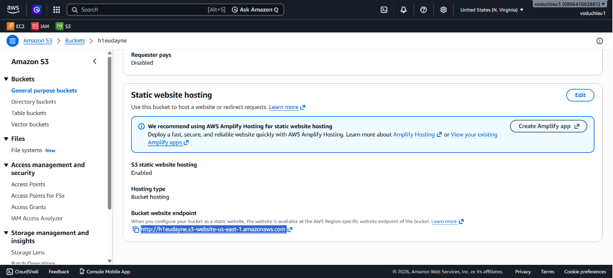
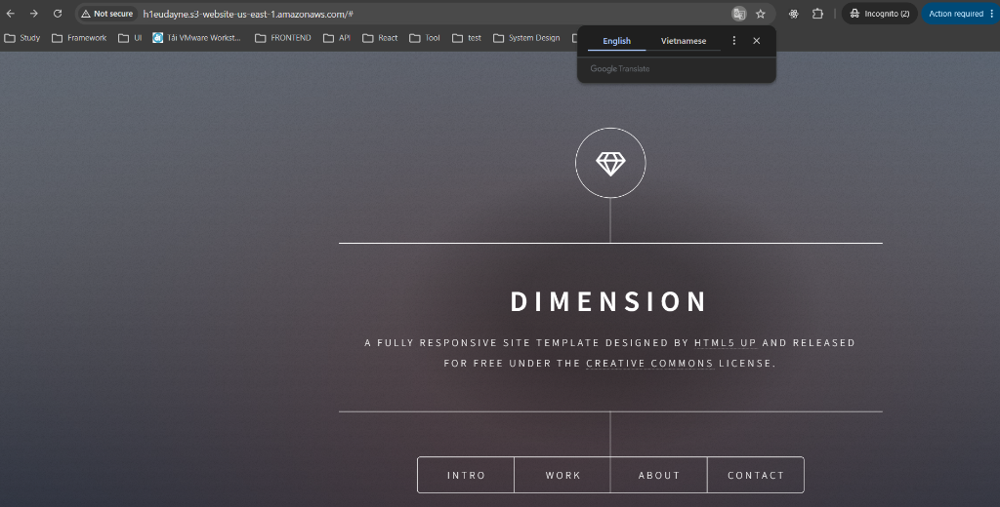

# Thực Hành Cấu Hình Website Tĩnh trên Amazon S3 (Amazon S3 Static Website Hosting Lab)

## I. Mục tiêu lab
* Upload mã nguồn trang web tĩnh (HTML, CSS, JS) lên S3 Bucket bằng công cụ AWS CLI.
* Đảm bảo cấu trúc tệp trang chủ `index.html` nằm ở thư mục gốc của bucket.
* Bật tính năng S3 Static Website Hosting và kiểm nghiệm lỗi 403.
* Cấu hình mở Public Access và thiết lập Bucket Policy cho phép người dùng Internet truy cập và hiển thị thành công website.

---

## II. Các bước thực hiện chi tiết

### Bước 1: Upload mã nguồn của website lên S3
1. Mở cửa sổ dòng lệnh (PowerShell hoặc Terminal) tại thư mục chứa source code trang web tĩnh trên máy cục bộ của bạn.
2. Chạy lệnh sao chép đệ quy `aws s3 cp` với tham số `--recursive` để tải toàn bộ mã nguồn lên S3 Bucket:
   ```bash
   aws s3 cp "simple static web/" s3://h1eudayne/ --recursive
   ```
   *(Thay đổi đường dẫn thư mục và tên bucket phù hợp với tài khoản của bạn).*



3. Sau khi upload thành công, hãy đăng nhập vào AWS Console, mở bucket của bạn và chuyển tới tab **Objects**. 
4. Xác minh rằng tệp tin trang chủ **`index.html` bắt buộc phải ở level gốc (thư mục gốc)** của bucket, không nằm lồng trong bất kỳ thư mục con nào khác.



---

### Bước 2: Bật tính năng Static Website Hosting trên Bucket
1. Chuyển sang tab **Properties** (Thuộc tính) của Bucket.
2. Cuộn xuống phần dưới cùng tìm tới mục **Static website hosting** (Trạng thái mặc định là *Disabled*) và chọn nút **Edit** (Chỉnh sửa).



3. Trong trang cấu hình:
   * **Static website hosting**: Tích chọn **Enable**.
   * **Hosting type**: Tích chọn **Host a static website** (Lưu trữ một website tĩnh).
   * **Index document**: Nhập `index.html` (Tên tệp tin trang chủ của website).
   * **Error document - optional**: Nhập `error.html` (Tên tệp tin hiển thị khi xảy ra lỗi, ví dụ lỗi 404 không tìm thấy trang).
4. Nhấp nút **Save changes** để lưu lại cấu hình.



5. Sau khi lưu, AWS sẽ cung cấp cho bạn một đường dẫn URL tại cuối tab Properties dưới mục **Bucket website endpoint** có định dạng như sau:
   `http://h1eudayne.s3-website-us-east-1.amazonaws.com`
   
   > [!WARNING]
   * > Nếu bạn thử nhấp vào liên kết này lúc này, trình duyệt sẽ trả về lỗi **`403 Forbidden` (Access Denied)**. 
   * > Nguyên nhân là do mặc định toàn bộ dữ liệu trên S3 đều ở trạng thái private (chặn truy cập công khai). Bạn phải thực hiện tiếp Bước 3 để mở quyền đọc cho công chúng.

---

### Bước 3: Cấu hình mở quyền truy cập công khai (Public Access) cho Bucket
1. Chuyển sang tab **Permissions** (Quyền truy cập) của Bucket.
2. Tại mục đầu tiên **Block public access (bucket settings)**, nhấp chọn nút **Edit**.
3. Bỏ tích chọn ở mục **Block all public access** (Chặn tất cả quyền truy cập công khai) để tắt tất cả các tùy chọn chặn bên dưới.
4. Nhấp nút **Save changes** (Lưu thay đổi) và nhập từ khóa `confirm` vào hộp thoại xuất hiện để xác nhận.



---

### Bước 4: Cấu hình chính sách Bucket Policy cho phép mọi người truy cập công khai
1. Tại tab **Permissions**, cuộn xuống mục **Bucket policy** và chọn **Edit**.
2. Nhập chính sách JSON sau để cấp quyền đọc đối tượng cho tất cả mọi người (`s3:GetObject`):
   ```json
   {
       "Version": "2012-10-17",
       "Statement": [
           {
               "Sid": "PublicReadGetObject",
               "Effect": "Allow",
               "Principal": "*",
               "Action": "s3:GetObject",
               "Resource": "arn:aws:s3:::h1eudayne/*"
           }
       ]
   }
   ```
   *(Lưu ý: Thay thế `h1eudayne` bằng tên S3 Bucket thực tế của bạn).*



3. Nhấp nút **Save changes** ở cuối trang để lưu lại chính sách.

---

### Bước 5: Kiểm tra kết quả hoạt động (Testing)
1. Quay lại tab **Properties** (Thuộc tính) của Bucket và cuộn xuống mục **Static website hosting**.
2. Sao chép địa chỉ URL tại dòng **Bucket website endpoint**:
   `http://h1eudayne.s3-website-us-east-1.amazonaws.com`



3. Dán địa chỉ URL này vào thanh địa chỉ của trình duyệt web (khuyên dùng tab ẩn danh/incognito) để kiểm tra.
4. Xác minh giao diện trang web tĩnh được hiển thị đầy đủ và chính xác (trong ví dụ là trang web **DIMENSION** hoạt động hoàn toàn ổn định qua giao diện web).


