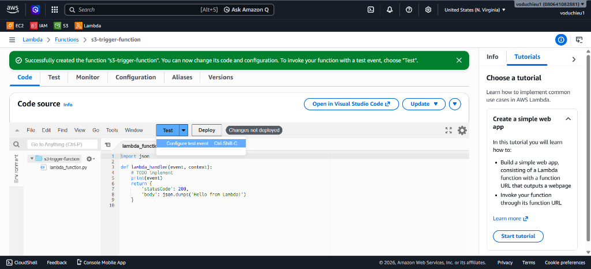
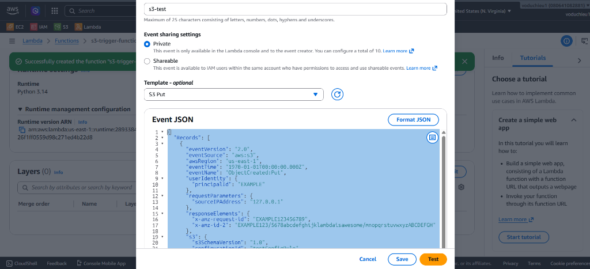

# Thực Hành Kết Hợp S3 Event Trigger với AWS Lambda (Amazon S3 Event Notifications Lab)

## I. Mục tiêu lab
* Tạo một **AWS Lambda Function** đơn giản viết bằng Python để bắt và ghi nhận sự kiện (Event) được kích hoạt từ S3.
* Cấu hình **S3 Event Notification** tự động kích hoạt (Trigger) Lambda Function khi có tệp tin được tải lên (Upload) một thư mục cụ thể trên S3.
* Kiểm tra tính hoạt động của liên kết Trigger giữa S3 và Lambda.

---

## II. Các bước thực hiện chi tiết

### Bước 1: Tạo Lambda Function đơn giản
1. Đăng nhập vào **AWS Management Console** và mở dịch vụ **AWS Lambda**.
2. Nhấp chọn nút **Create function** (Tạo hàm) ở góc trên bên phải.
3. Chọn tùy chọn **Author from scratch** (Tự xây dựng từ đầu).
4. Thiết lập các thông tin cơ bản:
   * **Function name**: Nhập `s3-trigger-function`.
   * **Runtime**: Chọn phiên bản Python khả dụng (Ví dụ: `Python 3.14` hoặc phiên bản Python mới nhất).
   * **Permissions**: Giữ nguyên mặc định để Lambda tự động khởi tạo một IAM role có quyền cơ bản để ghi log lên Amazon CloudWatch (`s3-trigger-function-role-...`).
5. Cuộn xuống dưới cùng và nhấp nút **Create function** ở góc dưới cùng bên phải.


---

### Bước 2: Chỉnh sửa mã nguồn Lambda Function
1. Sau khi function được tạo thành công, chuyển đến phần **Code source** ở tab **Code**.
2. Mở file mã nguồn `lambda_function.py`.
3. Thay thế đoạn mã mặc định bằng code Python để in ra (log) thông tin sự kiện nhận được từ S3:
```python
import json

def lambda_handler(event, context):
    # Ghi nhận toàn bộ cấu trúc event JSON nhận được
    print("Received event: " + json.dumps(event, indent=2))
    
    # Lấy thông tin Tên Bucket và Object Key từ Record đầu tiên
    try:
        bucket_name = event['Records'][0]['s3']['bucket']['name']
        object_key = event['Records'][0]['s3']['object']['key']
        print(f"Bucket Name: {bucket_name}")
        print(f"Object Key: {object_key}")
    except Exception as e:
        print(f"Error parsing event: {str(e)}")
        
    return {
        'statusCode': 200,
        'body': json.dumps('Hello from Lambda!')
    }
```
4. Nhấn nút **Deploy** phía trên trình soạn thảo code để lưu và áp dụng mã nguồn mới.
5. Để chuẩn bị chạy thử sự kiện, nhấp vào nút mũi tên nhỏ cạnh nút **Test** và chọn **Configure test event** (Cấu hình sự kiện thử nghiệm).



---

### Bước 3: Cấu hình và chạy thử Test Event giả lập S3
1. Trong cửa sổ cấu hình Test Event:
   * **Event name**: Điền `s3-test`.
   * **Event sharing settings**: Chọn `Private` (Chỉ dùng riêng cho bạn).
   * **Template - optional**: Tìm kiếm và chọn template tên là `S3 Put` để giả lập sự kiện upload file lên S3.
   * Hệ thống sẽ tự động điền mẫu dữ liệu JSON. Dữ liệu này chứa đầy đủ các thuộc tính của một event thực tế, bao gồm thông tin chi tiết về bucket và object ở đường dẫn JSON `event['Records'][0]['s3']`.
2. Nhấn nút **Save** để lưu lại cấu hình sự kiện kiểm thử.
3. Sau đó, nhấp nút **Test** để thực thi chạy thử hàm. Tab **Execution results** sẽ hiển thị trạng thái thực thi thành công và ghi nhận logs chứa cấu trúc JSON mẫu vừa thiết lập.



---

### Bước 4: Thiết lập Event Notification trên S3 Bucket
1. Mở giao diện điều khiển dịch vụ **Amazon S3** và nhấp chọn tên Bucket của bạn (Ví dụ: `h1eudayne`).
2. Để giới hạn phạm vi kích hoạt sự kiện, bạn nên tạo một thư mục riêng biệt (Ví dụ: `test-trigger/`).
3. Chuyển sang tab **Properties** (Thuộc tính) của Bucket.
4. Cuộn xuống phần **Event notifications** (Thông báo sự kiện) và nhấp chọn nút **Create event notification** (Tạo thông báo sự kiện).
5. Thiết lập các thông số cấu hình sự kiện:
   * **Event name**: Nhập `trigger-lambda-test`.
   * **Prefix - optional**: Điền `test-trigger/` (Chỉ kích hoạt sự kiện khi tệp tin được tải lên thư mục này).
   * **Suffix - optional**: Điền `.zip` (Chỉ kích hoạt sự kiện khi tệp tải lên có định dạng đuôi mở rộng là zip).
   * **Event types**: Trong mục **Object creation**, tích chọn **All object create events** (Tất cả sự kiện tạo đối tượng, bao gồm Put, Post, Copy).
   * **Destination**: Chọn **Lambda function**.
   * **Specify Lambda function**: Chọn **Choose from your Lambda functions** và chọn hàm `s3-trigger-function` mà bạn vừa tạo ở Bước 1.
6. Nhấp chọn nút **Save changes** dưới cùng để lưu lại cấu hình.


---

### Bước 5: Kiểm tra kết nối Trigger và Hoàn thành
1. Quay lại trang quản lý **AWS Lambda Function** của hàm `s3-trigger-function`.
2. Tại phần **Function overview** (Tổng quan hàm), bạn sẽ thấy biểu đồ hiển thị khối **S3** đã được tích hợp làm nguồn kích hoạt (Trigger) trực tiếp cho hàm Lambda.
3. Nhấp chọn khối **S3** trong sơ đồ để xem thông tin chi tiết cấu hình liên kết (chỉ ra đúng tên Bucket và tiền tố/hậu tố đã cấu hình).
4. **Kiểm tra thực tế**:
   * Truy cập S3 Bucket và tải một file zip (ví dụ: `archive.zip`) vào bên trong thư mục `test-trigger/`.
   * Chuyển sang tab **Monitor** (Giám sát) trên Lambda Console → chọn **View CloudWatch logs** để xem nhật ký hệ thống.
   * Bạn sẽ thấy một bản log ghi nhận thông tin thực tế của file vừa tải lên:
     ```text
     Bucket Name: h1eudayne
     Object Key: test-trigger/archive.zip
     ```


