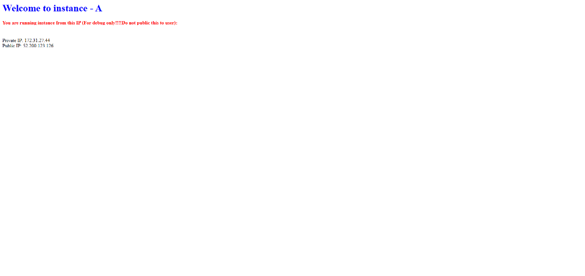
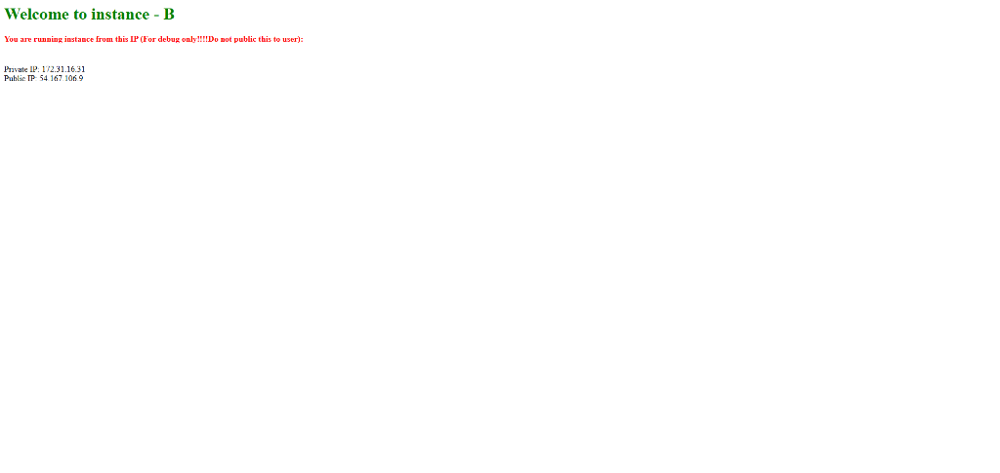
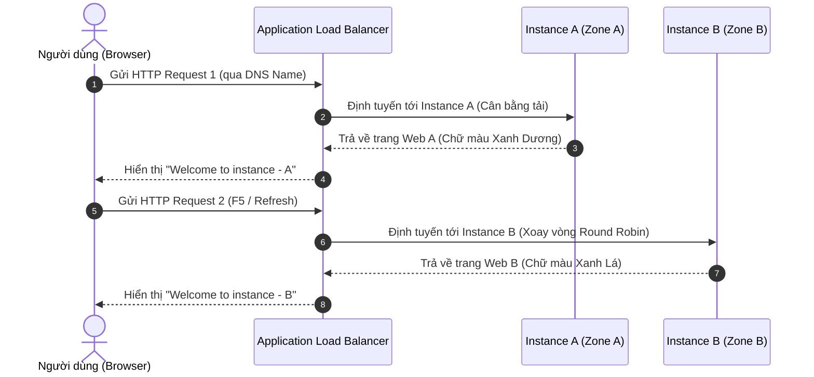

# Hướng Dẫn Thực Hành: Cân Bằng Tải Với Elastic Load Balancing (ELB)

Tài liệu này cung cấp hướng dẫn từng bước chi tiết (step-by-step) để thực hành cấu hình cân bằng tải bằng **Application Load Balancer (ALB)** trên AWS. Chúng ta sẽ khởi tạo hai máy chủ EC2 chạy trang web tĩnh có giao diện khác nhau thông qua **User Data**, nhóm chúng vào một **Target Group** và cấu hình ALB để tự động phân phối lưu lượng truy cập.

## Sơ đồ kiến trúc bài thực hành

Dưới đây là sơ đồ tổng quan mô tả luồng kết nối và cách các thành phần trong bài thực hành này được kết hợp với nhau:


*Hình: Sơ đồ kiến trúc luồng dữ liệu đi qua Load Balancer tới Target Group chứa 2 EC2 instances.*

---

## Các bước thực hiện

### Bước 1: Khởi tạo EC2 Instance A (`webserver-a`) với User Data

1. Truy cập **AWS Management Console** -> Chọn dịch vụ **EC2**.
2. Nhấp chọn nút **Launch Instance**.
3. **Cấu hình thông tin cơ bản**:
   * **Name**: `webserver-a`
   * **Application and OS Images (AMI)**: Chọn **Amazon Linux 2023 AMI** (Free Tier eligible).
   * **Instance Type**: Chọn `t2.micro`.
   * **Key pair**: Chọn cặp khóa `.pem` của bạn để truy cập SSH khi cần.
4. **Cấu hình kịch bản tự động hóa (User Data) cho Instance A**:
   * Cuộn xuống dưới cùng và nhấp chọn mục **Advanced Details** để mở rộng cấu hình chuyên sâu.
   * Tìm trường cấu hình **User data** ở dưới cùng và dán đoạn script Bash sau (để hiển thị tiêu đề màu xanh dương - **Blue**). Bạn có thể tải file mẫu trực tiếp tại đây: [user-data-instance-a.sh](../../templates/elb/user-data-instance-a.sh)

```bash
#!/bin/bash
# 1. Cài đặt Apache Web Server và khởi động dịch vụ
yum install httpd -y
service httpd start
chkconfig httpd on

# 2. Di chuyển vào thư mục gốc của trang web
cd /var/www/html

# 3. Ghi đè file index.html với giao diện Instance A
echo "<h1 style='color:blue;'>Welcome to instance - A</h1>" >> index.html
echo "<h4 style='color:red;'>You are running instance from this IP (For debug only!!!!Do not public this to user):</h4>" >> index.html

# 4. Sử dụng IMDSv2 để lấy Session Token bảo mật
export TOKEN=`curl -X PUT "http://169.254.169.254/latest/api/token" -H "X-aws-ec2-metadata-token-ttl-seconds: 21600"`

# 5. Truy xuất Private IP từ Metadata
echo "<br>Private IP: " >> index.html
curl -H "X-aws-ec2-metadata-token: $TOKEN" -v http://169.254.169.254/latest/meta-data/local-ipv4 >> index.html

# 6. Truy xuất Public IP từ Metadata
echo "<br>Public IP: " >> index.html
curl -H "X-aws-ec2-metadata-token: $TOKEN" -v http://169.254.169.254/latest/meta-data/public-ipv4 >> index.html
echo "</html>" >> index.html
```


*Hình 1: Cấu hình kịch bản User Data cho Instance A trên AWS Console.*

5. Nhấp chọn **Launch Instance** để khởi chạy máy chủ A.

---

### Bước 2: Khởi tạo EC2 Instance B (`webserver-b`) với User Data

Thực hiện tự tương tự các bước trên để tạo instance thứ hai:
1. Nhấp chọn **Launch Instance**.
2. **Cấu hình thông tin cơ bản**:
   * **Name**: `webserver-b`
   * **AMI & Instance Type**: Chọn giống hệt Instance A (**Amazon Linux 2023** và `t2.micro`).
3. **Cấu hình kịch bản tự động hóa (User Data) cho Instance B**:
   * Tại mục **Advanced Details** -> **User data**, dán đoạn script Bash sau (để hiển thị tiêu đề màu xanh lá - **Green**). Bạn có thể tải file mẫu trực tiếp tại đây: [user-data-instance-b.sh](../../templates/elb/user-data-instance-b.sh)

```bash
#!/bin/bash
# 1. Cài đặt Apache Web Server và khởi động dịch vụ
yum install httpd -y
service httpd start
chkconfig httpd on

# 2. Di chuyển vào thư mục gốc của trang web
cd /var/www/html

# 3. Ghi đè file index.html với giao diện Instance B
echo "<h1 style='color:green;'>Welcome to instance - B</h1>" >> index.html
echo "<h4 style='color:red;'>You are running instance from this IP (For debug only!!!!Do not public this to user):</h4>" >> index.html

# 4. Sử dụng IMDSv2 để lấy Session Token bảo mật
export TOKEN=`curl -X PUT "http://169.254.169.254/latest/api/token" -H "X-aws-ec2-metadata-token-ttl-seconds: 21600"`

# 5. Truy xuất Private IP từ Metadata
echo "<br>Private IP: " >> index.html
curl -H "X-aws-ec2-metadata-token: $TOKEN" -v http://169.254.169.254/latest/meta-data/local-ipv4 >> index.html

# 6. Truy xuất Public IP từ Metadata
echo "<br>Public IP: " >> index.html
curl -H "X-aws-ec2-metadata-token: $TOKEN" -v http://169.254.169.254/latest/meta-data/public-ipv4 >> index.html
echo "</html>" >> index.html
```


*Hình 2: Cấu hình kịch bản User Data cho Instance B trên AWS Console.*

4. Nhấp chọn **Launch Instance** để khởi chạy máy chủ B.

---

### Bước 3: Kiểm tra trạng thái hoạt động của các Instances

Quay lại danh sách **Instances** của dịch vụ EC2 để kiểm tra trạng thái của cả hai máy chủ.
* Đảm bảo cả `webserver-a` và `webserver-b` đều chuyển sang trạng thái **Running**.
* Ghi lại địa chỉ **Public IP** của 2 instances để so sánh sau này.


*Hình 3: Cụm máy chủ ảo webserver-a và webserver-b đã khởi tạo thành công.*

---

### Bước 4: Cấu hình Inbound Rules cho Security Group mặc định

Để người dùng ngoài internet có thể truy cập vào trang web thông qua Load Balancer và bạn có thể quản trị máy chủ từ xa:
1. Tại danh sách Instance, nhấp vào tab **Security** của một trong 2 instances và truy cập vào **Security Group** đang được gắn (ví dụ: nhóm bảo mật `default`).
2. Chọn **Edit inbound rules** và bổ sung/chỉnh sửa các luật sau:
   * **Rule 1 (Cho phép HTTP)**:
     * **Type**: `HTTP` (Port 80).
     * **Source**: Chọn `Custom` và nhập `0.0.0.0/0` để cho phép lưu lượng web từ mọi nơi truy cập.
   * **Rule 2 (Cho phép SSH)**:
     * **Type**: `SSH` (Port 22).
     * **Source**: Chọn `My IP` để bảo mật cổng SSH chỉ mở riêng cho địa chỉ IP mạng của bạn.
3. Nhấp chọn **Save rules** để áp dụng cấu hình.


*Hình 4: Cấu hình các luật Inbound mở cổng HTTP 80 và SSH 22 cho Security Group.*

---

### Bước 5: Kiểm tra hoạt động của từng Instance qua Public IP

Trước khi đưa các Instance vào Target Group và cấu hình Load Balancer, chúng ta cần kiểm tra xem các Web Server trên từng máy chủ đã cài đặt thành công và có thể truy cập độc lập qua Public IP hay chưa:

1. Copy địa chỉ **Public IP** của `webserver-a` (ví dụ: `52.200.123.126`) và truy cập bằng trình duyệt qua giao thức HTTP: `http://<PUBLIC_IP_WEBSERVER_A>`.
   * Giao diện của **Instance A** sẽ xuất hiện với tiêu đề màu xanh dương: **`Welcome to instance - A`**.
2. Copy địa chỉ **Public IP** của `webserver-b` (ví dụ: `54.167.106.9`) và truy cập tương tự: `http://<PUBLIC_IP_WEBSERVER_B>`.
   * Giao diện của **Instance B** sẽ xuất hiện với tiêu đề màu xanh lá: **`Welcome to instance - B`**.



*Hình 5: Kiểm tra hoạt động của Instance A thành công.*



*Hình 6: Kiểm tra hoạt động của Instance B thành công.*

---

### Bước 6: Tạo Target Group (`tg-01`) và đăng ký Targets

1. Tại cột quản trị bên trái của EC2, cuộn xuống mục **Load Balancing** -> Chọn **Target Groups**.


*Hình 7: Truy cập menu Target Groups từ thanh điều hướng EC2.*

2. Nhấp chọn **Create target group**.
3. **Cấu hình thông tin nhóm**:
   * **Target type**: Chọn **Instances**.
   * **Target group name**: `tg-01`
   * **Protocol & Port**: Chọn **HTTP** trên Port **80**.
   * **VPC**: Chọn VPC mặc định của bạn.
   * **Health checks**: Chọn giao thức **HTTP** với đường dẫn **Path** là `/`. Các cấu hình kiểm tra sức khỏe nâng cao (như Timeout: 5s, Interval: 20s, Success codes: 200) và Attribute giữ mặc định.


*Hình 8: Thiết lập cấu hình sức khỏe (Health checks) và trình tối ưu hóa (Target optimizer).*

4. Nhấn **Next**.
5. **Đăng ký Targets**:
   * Tại danh sách các instance khả dụng ở bảng phía trên, tích chọn cả `webserver-a` và `webserver-b`.
   * Tại trường **Ports for the selected instances**, điền port là `80` và nhấp chọn nút **Include as pending below**.
   * Đảm bảo cả hai máy chủ xuất hiện trong danh sách **Review targets** phía dưới với trạng thái là `Running` và cổng `80`.


*Hình 9: Xác nhận và đăng ký các instances đích vào Target Group dưới dạng pending.*

6. Nhấp chọn **Create target group**.

---

### Bước 7: Tạo Application Load Balancer (ALB)

1. Tại cột quản trị bên trái của EC2, cuộn xuống mục **Load Balancing** -> Chọn **Load Balancers**.


*Hình 10: Truy cập menu Load Balancers từ thanh điều hướng EC2.*

2. Nhấp chọn **Create load balancer**. Trong phần **Application Load Balancer**, nhấp chọn **Create**.


*Hình 11: Lựa chọn loại Application Load Balancer để khởi tạo.*

3. **Cấu hình thông số Load Balancer**:
   * **Load balancer name**: `alb-01`
   * **Scheme**: Chọn **Internet-facing** (nhận lưu lượng từ Internet).
   * **IP address type**: Chọn **IPv4**.
4. **Network mapping**:
   * **VPC**: Chọn VPC mặc định.
   * **Mappings (Availability Zones)**: Tích chọn **TẤT CẢ các Availability Zone khả dụng** (ví dụ: `us-east-1a`, `us-east-1b`, `us-east-1c`, `us-east-1d`, `us-east-1e`, `us-east-1f`).
   
   > [!TIP]
   > AWS luôn khuyến nghị lựa chọn tất cả các zone khả dụng khi khởi tạo ELB để tối đa hóa tính dự phòng và tính sẵn sàng cao (High Availability) cho hệ thống.

   > [!WARNING]
   > **Quan trọng**: Nếu Load Balancer được khởi tạo mà không chọn Availability Zone có chứa EC2 Instance của bạn, khi người dùng truy cập qua DNS Name của Load Balancer sẽ gặp lỗi không kết nối được (**502 Bad Gateway**) do ELB không thể tiếp cận và định tuyến lưu lượng tới các instances thuộc zone bị bỏ sót đó. Vì vậy, hãy luôn nhớ chọn tối đa số zone có thể khi cấu hình Network mapping cho ELB.

5. **Security groups**:
   * Chọn Security Group cho phép nhận traffic từ internet cổng `80` (trong bài thực hành này, chọn nhóm bảo mật mặc định `default` chứa luật HTTP 80 đã cấu hình ở Bước 4).
6. **Listeners and routing**:
   * **Protocol & Port**: Chọn **HTTP** trên Port **80**.
   * **Default action**: Chọn hành động **Forward to** và trỏ tới Target Group **`tg-01`** vừa tạo ở Bước 6.


*Hình 12: Chi tiết cấu hình các thông số và định tuyến cho Application Load Balancer.*

7. Nhấp chọn **Create load balancer** ở góc dưới cùng bên phải để hoàn tất.

---

### Bước 8: Kiểm tra tính năng Load Balancing

1. Đợi vài phút để trạng thái của Load Balancer chuyển từ `Provisioning` sang **`Active`**.
2. Tại màn hình Target Group `tg-01`, kiểm tra tab **Targets** để đảm bảo trạng thái sức khỏe (**Health status**) của cả 2 instances đều là **`Healthy`**.
3. Chọn Load Balancer `alb-01` vừa tạo, tìm và sao chép địa chỉ **DNS name** (ví dụ: `alb-01-1234479115.us-east-1.elb.amazonaws.com`).


*Hình 13: Trạng thái Load Balancer chuyển sang Active và thông tin DNS name.*

4. Mở trình duyệt web và truy cập vào địa chỉ DNS Name trên:
   ```text
   http://<DNS_NAME_CUA_ALB>
   ```
5. **Quan sát và kiểm tra**:
   * Lần tải trang đầu tiên: Trình duyệt sẽ hiển thị trang web của **Instance A** với tiêu đề màu xanh dương: `Welcome to instance - A`.

     

     *Hình 14: Truy cập trang web của Instance A thành công qua DNS của ALB.*

   * Nhấn nút **F5 (Refresh)** lại trình duyệt: Trang web sẽ tự động chuyển sang trang web của **Instance B** với tiêu đề màu xanh lá: `Welcome to instance - B`.

     

     *Hình 15: ALB tự động chuyển luồng traffic sang Instance B khi Refresh trang.*

   * Tiếp tục tải lại trang, bạn sẽ thấy lưu lượng truy cập liên tục xoay vòng (Round Robin) qua lại giữa 2 máy chủ ảo, hiển thị luân phiên Private IP khác nhau của từng máy.

Điều này chứng minh Application Load Balancer hoạt động chính xác, tự động định tuyến và cân bằng tải thành công giữa các zone khác nhau!



---

## Thực Hành Nâng Cao: Định tuyến qua nhiều Target Group khác nhau (Phân tách Port)

Trong phần này, chúng ta sẽ thực hiện cấu hình nâng cao nhằm phân tách định tuyến lưu lượng truy cập từ client đến các máy chủ qua các port khác nhau của Load Balancer. Cụ thể:
- Client truy cập vào Load Balancer qua cổng **HTTP 80** sẽ được ALB điều hướng đến **Target Group `tg-01`** (chỉ chứa `webserver-a`).
- Client truy cập vào Load Balancer qua cổng **HTTP 8080** sẽ được ALB điều hướng đến **Target Group `tg-02`** (chỉ chứa `webserver-b`).

> [!IMPORTANT]
> Đối với phía Client, họ truy cập Load Balancer qua hai cổng khác nhau là `80` và `8080`. Tuy nhiên ở phía backend, cả hai máy chủ EC2 (`webserver-a` và `webserver-b`) vẫn đang lắng nghe và phản hồi lưu lượng trên cổng HTTP gốc là **80**.

### Sơ đồ kiến trúc cấu hình nâng cao


*Hình 16: Sơ đồ luồng định tuyến của ALB sang hai Target Group độc lập qua port 80 và 8080.*

---

### Các bước thực hiện

#### Bước 1: Gỡ bỏ Instance B (`webserver-b`) khỏi Target Group `tg-01`

1. Truy cập **EC2** -> **Target Groups** -> Chọn Target Group `tg-01`.
2. Chọn tab **Targets**. Trong danh sách **Registered targets**, tích chọn máy chủ `webserver-b`.
3. Nhấp chọn nút **Deregister**.


*Hình 17: Gỡ bỏ webserver-b ra khỏi Target Group tg-01.*

4. Đợi vài phút để trạng thái của instance chuyển từ `Draining` sang hủy đăng ký hoàn toàn. Lúc này `tg-01` chỉ còn lại duy nhất `webserver-a`.

#### Bước 2: Tạo Target Group mới (`tg-02`) và đăng ký Instance B

1. Chọn **Target Groups** -> Chọn **Create target group**.
2. **Cấu hình thông tin nhóm**:
   * **Target type**: Chọn **Instances**.
   * **Target group name**: `tg-02`
   * **Protocol & Port**: Chọn **HTTP** trên Port **80** (máy chủ vẫn lắng nghe cổng 80).
   * **VPC**: Chọn VPC mặc định của bạn.
   * **Health checks**: Chọn giao thức **HTTP** với đường dẫn **Path** là `/`.


*Hình 18: Cấu hình thuộc tính cho Target Group mới tg-02.*

3. Nhấp chọn **Next**.
4. **Đăng ký Targets**:
   * Tích chọn máy chủ `webserver-b`.
   * Tại mục **Ports for the selected instances**, điền cổng là `80` và nhấp chọn nút **Include as pending below**.


*Hình 19: Đăng ký instance webserver-b làm target cho tg-02 ở cổng 80.*

5. Nhấp chọn **Create target group**.

#### Bước 3: Thêm Listener cổng 8080 cho Load Balancer

1. Chọn mục **Load Balancers** -> Tích chọn Load Balancer `alb-01` của bạn.
2. Cuộn xuống tab **Listeners and routing** -> Nhấp chọn nút **Add listener** ở góc phải bảng.
3. **Cấu hình Listener mới**:
   * **Protocol**: `HTTP`
   * **Port**: Điền cổng `8080` (đây là cổng Load Balancer sẽ mở để lắng nghe kết nối từ Client).
   * **Routing actions**: Chọn **Forward to target groups** và trỏ tới Target Group **`tg-02`** (vừa tạo ở Bước 2).


*Hình 20: Thiết lập Listener HTTP:8080 điều hướng luồng traffic đến tg-02.*

4. Nhấp chọn **Add listener** ở góc dưới cùng bên phải để lưu cấu hình.

---

### Bước 4: Cấu hình bổ sung Inbound Rules cho Security Group của ALB

Khi bạn thêm Listener mới chạy trên cổng `8080` nhưng chưa cập nhật nhóm bảo mật (Security Group), AWS Console sẽ hiển thị cảnh báo về khả năng kết nối bị ảnh hưởng (Reachability may be impacted). Chúng ta cần mở cổng `8080` trên Security Group của ALB để Client ngoài internet có thể truy cập:

1. Tại màn hình chi tiết Load Balancer `alb-01`, chọn tab **Security**. Bạn sẽ thấy cảnh báo màu vàng về việc chặn lưu lượng trên Listener mới. Nhấp chọn nút **View security groups** (hoặc nhấp thẳng vào tên Security Group đang được gán, ví dụ: nhóm bảo mật mặc định `default`).


*Hình 21: AWS Console hiển thị cảnh báo Reachability may be impacted.*

2. Chọn Security Group tương ứng -> Nhấp chọn **Edit inbound rules**.
3. Thêm một rule mới với cấu hình sau:
   - **Type**: Chọn `Custom TCP`.
   - **Port range**: Điền `8080`.
   - **Source**: Chọn `Anywhere-IPv4` (`0.0.0.0/0`) để cho phép mọi lưu lượng từ bên ngoài truy cập vào cổng 8080.


*Hình 22: Thêm luật Custom TCP cổng 8080 từ nguồn Anywhere.*

4. Nhấp chọn **Save rules** để áp dụng cấu hình.

---

### Bước 5: Kiểm tra hoạt động định tuyến thực tế qua 2 port

1. Sao chép địa chỉ **DNS name** của Load Balancer `alb-01` (ví dụ: `alb-01-1234479115.us-east-1.elb.amazonaws.com`).
2. Mở trình duyệt và kiểm chứng truy cập với cả 2 cổng:
   - **Cổng HTTP 80 (Mặc định)**:
     Truy cập địa chỉ `http://<DNS_NAME_CUA_ALB>`. Trình duyệt sẽ luôn định tuyến tới trang web màu xanh dương của **Instance A**:
     
     
     
     *Hình 23: Truy cập qua cổng 80 mặc định trả về giao diện của Instance A.*
     
   - **Cổng HTTP 8080**:
     Truy cập địa chỉ `http://<DNS_NAME_CUA_ALB>:8080`. Trình duyệt sẽ luôn định tuyến tới trang web màu xanh lá của **Instance B**:
     
     
     
     *Hình 24: Truy cập qua cổng 8080 trả về giao diện của Instance B.*

Điều này chứng minh Application Load Balancer hoạt động chính xác, định tuyến chuẩn luồng traffic dựa trên Port của Listener của khách hàng tới từng Target Group tương ứng!

Chúc mừng bạn đã hoàn thành cấu hình nâng cao định tuyến lưu lượng qua nhiều Target Group thành công!

---

## Thực Hành Nâng Cao: Phân chia Tỉ Lệ Traffic (Weight-based Routing) trên cùng 1 Port

Trong phần này, chúng ta sẽ thiết lập một kịch bản thực tế hơn: thay vì phân tách định tuyến theo cổng, chúng ta sẽ phân chia lưu lượng truy cập của người dùng trên **cùng một cổng HTTP 80** vào hai Target Group `tg-01` và `tg-02` theo tỉ lệ trọng số **1:3** (tương đương 25% traffic vào `webserver-a` và 75% traffic vào `webserver-b`).

---

### Các bước thực hiện

#### Bước 1: Xóa Listener cổng 8080

Để dọn dẹp cấu hình cũ và đưa toàn bộ traffic về cổng 80:
1. Truy cập **EC2** -> **Load Balancers** -> Chọn Load Balancer `alb-01` của bạn.
2. Tại tab **Listeners and rules**, tích chọn Listener **HTTP:8080**.
3. Nhấp chọn nút **Manage listener** ở góc bên phải bảng -> Chọn **Delete listener**.


*Hình 25: Chọn và xóa Listener HTTP:8080.*

4. Xác nhận xóa. Lúc này bảng Listeners chỉ còn duy nhất Listener **HTTP:80**.

#### Bước 2: Cấu hình phân chia tỉ lệ trọng số (Weight-based Routing) trên Listener 80

1. Tích chọn Listener **HTTP:80** trong danh sách.
2. Nhấp chọn nút **Manage listener** -> Chọn **Edit listener**.


*Hình 26: Chọn Edit listener cho cổng HTTP:80.*

3. Tại mục **Default action** -> **Routing action**:
   - Hành động vẫn giữ nguyên là **Forward to target groups**.
   - Tại dòng của Target Group **`tg-01`**, điền trọng số **Weight** là `1` (Percent tự động tính toán là 25%).
   - Nhấp chọn nút **+ Add target group** để thêm dòng định tuyến thứ hai.
   - Tại dòng của Target Group mới, chọn **`tg-02`** và điền trọng số **Weight** là `3` (Percent tự động tính toán là 75%).


*Hình 27: Cấu hình trọng số (Weight) 1 và 3 tương ứng tỉ lệ 25% và 75% cho 2 Target Group.*

4. Nhấp chọn **Save changes** ở góc dưới cùng bên phải để lưu lại.

---

### Bước 3: Kiểm tra hoạt động phân chia traffic

1. Mở trình duyệt web (hoặc sử dụng công cụ dòng lệnh như `curl` để gửi liên tục các request) truy cập vào địa chỉ DNS Name của ALB qua cổng HTTP 80 mặc định:
   ```text
   http://<DNS_NAME_CUA_ALB>
   ```
2. **Quan sát kết quả**:
   - Bạn sẽ thấy tỉ lệ hiển thị của trang web **Instance B** (chữ màu xanh lá) xuất hiện nhiều gấp 3 lần so với trang web của **Instance A** (chữ màu xanh dương) khi tải lại trang liên tục.
   - Cứ trung bình 4 lần tải trang (Refresh), sẽ có khoảng 3 lần định tuyến tới `webserver-b` (75%) và chỉ 1 lần định tuyến tới `webserver-a` (25%).

Chúc mừng bạn đã hoàn thành thiết lập phân chia tỉ lệ lưu lượng truy cập (Weight-based Routing) trên Application Load Balancer thành công!

---

## Thực Hành Nâng Cao: Cấu hình Stickiness Session (Phiên truy cập cố định)

Trong thực tế, có nhiều hệ thống website sử dụng công nghệ cũ (Legacy Applications) hoặc các ứng dụng Stateful quản lý session (phiên làm việc) của người dùng trực tiếp trên **bộ nhớ RAM của từng máy chủ**. Trong các trường hợp này, nếu cân bằng tải thông thường (như Round-Robin hoặc Weight-based) chuyển hướng liên tục request của người dùng qua các máy chủ khác nhau, người dùng sẽ liên tục bị mất phiên làm việc (bị logout hoặc mất dữ liệu giỏ hàng).

Để giải quyết vấn đề này, ta cấu hình tính năng **Stickiness Session (Session Affinity)** trên Application Load Balancer để khóa phiên kết nối của một client cụ thể vào duy nhất một server cố định trong một khoảng thời gian.

---

### Các bước thực hiện

#### Bước 1: Truy cập cấu hình chỉnh sửa Listener của Load Balancer
1. Truy cập **EC2** -> **Load Balancers** -> Tích chọn Load Balancer `alb-01` của bạn.
2. Tại tab **Listeners and rules**, chọn Listener **HTTP:80** -> Nhấp chọn nút **Actions** -> Chọn **Edit listener**.


*Hình 28: Chọn tính năng Edit listener cho Listener HTTP:80.*

#### Bước 2: Kích hoạt tính năng Group-level Stickiness trên Listener
> [!IMPORTANT]
> **Nguyên tắc cấu hình**:
> Để cấu hình Stickiness Session hoạt động hoàn chỉnh, ta **bắt buộc phải kích hoạt tính năng này ở cả 2 cấp độ**: Cấp độ **Load Balancer (Listener)** và Cấp độ **Target Group (Attributes)**.

1. Tại giao diện chỉnh sửa Listener HTTP:80, di chuyển xuống phần cấu hình **Forward to target groups**.
2. Tích chọn vào checkbox **Enable group-level stickiness**.
3. **Stickiness duration**: Thiết lập khoảng thời gian muốn duy trì phiên kết nối cố định (ví dụ: nhập `1` và chọn đơn vị là **hours**). ALB hỗ trợ khoảng thời gian từ 1 giây đến tối đa 7 ngày.
4. Nhấp chọn nút **Save changes** ở góc dưới bên phải để lưu cấu hình.


*Hình 29: Kích hoạt tính năng group-level stickiness trên Listener của Load Balancer.*

#### Bước 3: Kích hoạt và cấu hình Stickiness trên Target Group (Attributes)
Tiếp theo, ta cần cấu hình thuộc tính của Target Group để hoàn tất định tuyến cố định đến từng máy chủ EC2 con:

1. Truy cập **EC2** -> **Target Groups** -> Tích chọn Target Group **`tg-01`**.
2. Nhấp chọn nút **Actions** ở góc trên bên phải -> Chọn **Edit target group attributes**.


*Hình 30: Chọn tính năng Edit target group attributes cho Target Group tg-01.*

3. Tại giao diện **Edit target group attributes**:
   * Cuộn xuống mục **Target selection configuration**.
   * Bật tùy chọn **Stickiness** (chuyển công tắc sang trạng thái **On**).
   * **Stickiness type**: Chọn **Load balancer generated cookie** (mặc định - ALB tự động sinh cookie).
   * **Stickiness duration**: Đặt thời gian duy trì phiên tương tự như đã đặt ở Listener (ví dụ: `1` **hours**).
   * Nhấp chọn nút **Save changes** ở dưới cùng để lưu lại cấu hình.


*Hình 31: Thiết lập bật Stickiness và đặt thời gian phiên ở cấp độ Target Group.*

---

### Bước 3: Kiểm tra hoạt động Stickiness Session

1. Mở trình duyệt web của bạn và truy cập địa chỉ DNS Name của ALB:
   ```text
   http://<DNS_NAME_CUA_ALB>
   ```
2. Giả sử ở lần truy cập đầu tiên, bạn được ALB định tuyến tới **Instance B** (giao diện màu xanh lá).
3. Thực hiện nhấn **F5 (Refresh)** liên tục trang web nhiều lần.
4. **Quan sát kết quả**:
   - Khác với cơ chế phân phối Round-Robin hay Weight-based trước đó (traffic liên tục xoay vòng hoặc đổi giao diện), giờ đây trình duyệt của bạn **chỉ hiển thị duy nhất giao diện của Instance B** (tiêu đề xanh lá) trong mọi lần tải trang.
   - Điều này xảy ra do ALB đã tạo một cookie ở trình duyệt của bạn để nhận diện và luôn định tuyến request từ client của bạn quay lại đúng máy chủ `webserver-b`.
5. **Thử nghiệm bổ sung**:
   - Hãy thử mở một trình duyệt khác (ví dụ: dùng Microsoft Edge nếu bạn đang dùng Chrome) hoặc mở một cửa sổ ẩn danh (**Incognito**).
   - Truy cập lại địa chỉ DNS Name của ALB. Bạn có thể được định tuyến tới **Instance A** (xanh dương). Một khi đã định tuyến vào Instance A, nếu bạn Refresh liên tục, trình duyệt ẩn danh đó sẽ luôn bị "dính chặt" vào Instance A.

Chúc mừng bạn đã hoàn thành thiết lập cấu hình Stickiness Session trên Application Load Balancer thành công!


