# Hướng Dẫn Thực Hành: Auto Scaling Group (Giai đoạn chuẩn bị Base Image)

Tài liệu này hướng dẫn chi tiết từng bước (step-by-step) cách thực hiện **Giai đoạn chuẩn bị Base Image** (hay còn gọi là tạo Golden Image) cho hệ thống Auto Scaling trên AWS. Đây là bước nền tảng để đóng gói cấu hình máy chủ, giúp Auto Scaling tự động nhân bản (Scale Out) các máy chủ ảo EC2 giống hệt nhau khi có yêu cầu.

## Sơ đồ kiến trúc giai đoạn chuẩn bị

Dưới đây là sơ đồ mô tả luồng hoạt động từ một máy chủ web gốc cho đến khi đóng gói thành bản AMI làm cơ sở dữ liệu cho Launch Template của Auto Scaling Group:


*Hình 1: Luồng đóng gói máy chủ Web Server A chứa dịch vụ Apache (httpd) thành AMI để cung cấp cho Launch Template.*

---

## Các bước thực hiện chi tiết

### Bước 1: Truy cập máy chủ gốc qua SSH (Vào EC2)

Để cấu hình máy chủ đóng vai trò là "bản thiết kế gốc" (Golden Image) cho tất cả các máy ảo con sau này, trước hết ta cần đăng nhập trực tiếp vào hệ điều hành của instance đó.

1. Truy cập **AWS Management Console** -> Chọn dịch vụ **EC2** -> Chọn **Instances**.
2. Tích chọn máy chủ gốc của bạn (ví dụ: `my-server-a`), nhấp chọn nút **Connect**.
3. Tại giao diện kết nối, chọn tab **SSH client**. Bạn sẽ thấy hướng dẫn kết nối kèm theo ví dụ lệnh SSH mẫu ở phía dưới.
   
   
   
   *Hình 2: Lấy thông tin tài khoản và địa chỉ DNS công khai để SSH trên AWS Console.*

4. Mở cửa sổ dòng lệnh (**Command Prompt** hoặc **Windows PowerShell**) trên máy tính cá nhân của bạn, di chuyển đến thư mục chứa file khóa bảo mật (ví dụ: `test.pem`).
5. Thực thi lệnh SSH để đăng nhập vào máy chủ.
   
   > [!WARNING]
   > **Xử lý sự cố Connection timed out (Cổng 22)**:
   > Trong thực tế, bạn có thể gặp phải lỗi `ssh: connect to host ... port 22: Connection timed out` như hình dưới đây. Nguyên nhân phổ biến nhất là do **Security Group** của máy chủ chưa cho phép cổng 22 nhận traffic từ IP của bạn, hoặc đường truyền mạng internet đang bị chặn. Hãy kiểm tra lại Inbound Rules của Security Group và cập nhật luật SSH từ nguồn IP của bạn (`My IP`).

   
   
   *Hình 3: Thực hiện kết nối SSH qua Windows PowerShell (khắc phục lỗi timeout cổng 22 thành công).*

---

### Bước 2: Kích hoạt tự khởi động cho dịch vụ Web (Enable httpd)

Khi máy chủ mới được sinh ra bởi Auto Scaling, hệ thống cần tự động hoạt động ngay lập tức mà không cần bất kỳ sự can thiệp thủ công nào từ quản trị viên. Do đó, việc cấu hình để dịch vụ web (Apache - httpd) khởi động cùng hệ điều hành là bắt buộc.

1. Sau khi SSH thành công vào instance, thực thi lệnh sau để kích hoạt dịch vụ tự khởi chạy cùng OS:
   ```bash
   sudo systemctl enable httpd
   ```
   *(Hoặc sử dụng lệnh legacy `sudo chkconfig httpd on` tùy thuộc vào phiên bản hệ điều hành của bạn)*.
   
2. **Tại sao bước này lại quan trọng?**
   * **Bản chất**: Khi xảy ra sự kiện **Scale Out** (tăng tải, cần thêm máy chủ), Auto Scaling Group sẽ tự động tạo thêm (launch) các instance mới tinh. Lúc đó sẽ không có quản trị viên nào rảnh rỗi để SSH vào từng máy ảo con và gõ lệnh start dịch vụ web.
   * Lệnh `enable` đảm bảo rằng ngay khi hệ điều hành ảo của instance mới vừa boot xong, dịch vụ Apache web server (`httpd`) sẽ tự động được khởi động lên và sẵn sàng nhận traffic phân phối từ Load Balancer.

---

### Bước 3: Tạo AMI (Amazon Machine Image) từ Instance đang chạy

Sau khi đã cài đặt và cấu hình hoàn tất máy chủ gốc (bao gồm việc `enable httpd`), chúng ta tiến hành đóng gói toàn bộ trạng thái hiện tại của máy chủ thành một Base Image (khuôn mẫu).

1. Quay lại danh sách **Instances** trên EC2 Console.
2. Tích chọn máy chủ gốc `my-server-a` -> Nhấp chọn nút **Actions** ở menu phía trên -> Chọn **Image and templates** -> Chọn **Create image**.

   
   
   *Hình 4: Chọn tính năng tạo ảnh máy ảo (AMI) từ instance đang chạy.*

3. **Cấu hình chi tiết AMI**:
   * **Image name**: Đặt tên gợi nhớ cho bản đóng gói (ví dụ: `webserver-ami`).
   * **Image description**: Mô tả ngắn gọn (ví dụ: `Base image with httpd auto-start enabled for ASG`).
   * **Reboot instance**: 
     * **Tích chọn (Reboot)**: AWS sẽ khởi động lại EC2 instance trước khi tiến hành chụp Snapshot của ổ đĩa. Cách này giúp đảm bảo tính toàn vẹn dữ liệu (data consistency) cao nhất vì hệ điều hành đã được tắt an toàn và không có dữ liệu nào đang ghi dở.
     * **Bỏ tích (No reboot)**: AWS sẽ tạo ảnh trực tiếp mà không tắt máy chủ. Dịch vụ của bạn không bị gián đoạn (no downtime), tuy nhiên có nguy cơ mất mát dữ liệu nhỏ nếu có tiến trình đang ghi đĩa dở dang tại thời điểm chụp ảnh.
   * **Instance volumes**: Giữ nguyên thông số dung lượng ổ đĩa EBS mặc định gắn kèm.

   
   
   *Hình 5: Thiết lập tên AMI và tùy chọn Reboot trước khi khởi tạo ảnh.*

4. Nhấp chọn **Create image** để hoàn tất. Hệ thống sẽ bắt đầu đóng gói và bạn có thể theo dõi trạng thái AMI mới này tại mục **Images** -> **AMIs** ở thanh điều hướng bên trái.

Bản AMI này giờ đây đã chứa toàn bộ mã nguồn ứng dụng, cấu hình hệ thống, và cấu hình tự động chạy của dịch vụ `httpd`. Đây chính là "Base Image" chuẩn để chúng ta sử dụng làm thông tin đầu vào cho **Launch Template** ở các bước tiếp theo.

---

### Bước 4: Khởi tạo Launch Template (Mẫu cấu hình khởi chạy)

**Launch Template (Mẫu cấu hình khởi chạy)** đóng vai trò là bản thiết kế hướng dẫn chi tiết để EC2 Auto Scaling Group biết cách khởi chạy (launch) các EC2 instances con một cách tự động khi có yêu cầu Scale Out hoặc Self-healing.

1. Tại thanh điều hướng bên trái của dịch vụ EC2, cuộn đến mục **Instances** -> Chọn **Launch Templates**.
   
   
   
   *Hình 6: Truy cập menu Launch Templates từ sidebar quản trị EC2.*

2. Nhấp chọn nút **Create launch template** ở góc trên cùng bên phải.
3. **Cấu hình thông số Launch Template chi tiết**:
   * **Launch template name**: `web-launch-template`
   * **Template version description**: Mô tả ngắn gọn (ví dụ: `A prod webserver for MyApp`).
   * **Auto Scaling guidance**: Tích chọn checkbox **Provide guidance to help me set up a template that I can use with EC2 Auto Scaling**. Tùy chọn này giúp AWS tối ưu hóa giao diện và cấu hình tương thích nhất cho ASG.
   * **Application and OS Images (Amazon Machine Image)**:
     * Nhấp chọn tab **My AMIs** -> Chọn mục **Owned by me**.
     * Hệ thống sẽ tự động hiển thị bản **AMI** (`webserver-ami`) mà bạn đã đóng gói ở **Bước 3**. Hãy tích chọn nó.
   * **Instance type**: Chọn loại `t2.micro` (hoặc cấu hình phần cứng tương đương với nhu cầu của bạn).
   * **Key pair (login)**: Chọn cặp khóa bảo mật `.pem` của bạn (ví dụ: `test`) để có thể SSH quản trị instances con khi cần thiết.
   * **Network settings**:
     * **Subnet (Mạng con)**: Chọn **Don't include in launch template** (Không đưa vào template).
       
       > [!NOTE]
       > **Lưu ý quan trọng**: Ta để trống Subnet tại Launch Template để nhường quyền quyết định phân phối đều máy chủ con qua nhiều Availability Zones khác nhau cho Auto Scaling Group cấu hình ở bước sau.
       
     * **Firewall (security groups)**: Chọn **Select existing security group** và tìm đến Security Group mong muốn (ví dụ: nhóm bảo mật `default` đã cấu hình mở cổng 80 và 22 ở các bài lab trước).
   * **Resource tags**: Nhấp chọn **Add new tag** để đặt nhãn tự động gắn cho các instances ảo được tạo ra sau này:
     * **Key**: `Name` | **Value**: `Webserver`
     * **Resource types**: Tích chọn cả **Instances** và **Volumes**.

   
   
   *Hình 7: Thiết lập các thông số cấu hình cốt lõi cho Launch Template trên AWS Console.*

4. Cuộn xuống và nhấp chọn nút **Create launch template** ở góc phải màn hình để hoàn tất khởi tạo.

Mẫu cấu hình Launch Template này hiện đã sẵn sàng và liên kết với bản AMI gốc. Ở giai đoạn tiếp theo, ta sẽ dùng mẫu này để thiết lập cấu hình co giãn tự động hoàn chỉnh cho Auto Scaling Group.

---

### Bước 5: Khởi tạo Auto Scaling Group (ASG)

Sau khi có Launch Template, ta tiến hành tạo Auto Scaling Group và liên kết trực tiếp với Target Group để phân phối traffic.

1. Tại thanh điều hướng bên trái của dịch vụ EC2, cuộn xuống dưới cùng đến mục **Auto Scaling** -> Chọn **Auto Scaling Groups**.
   
   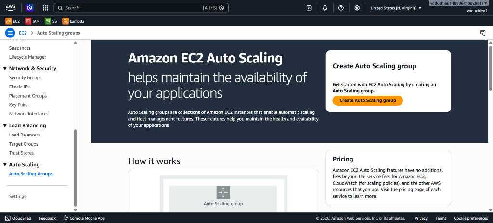
   
   *Hình 8: Giao diện chào mừng khởi tạo Auto Scaling group.*

2. Nhấp chọn nút **Create Auto Scaling group**.
3. **Step 1: Choose launch template**:
   * **Auto Scaling group name**: Nhập `test-asg`.
   * **Launch template**: Chọn `web-launch-template` (phiên bản `Default (1)` vừa tạo ở Bước 4).
   * Nhấp chọn **Next**.
   
   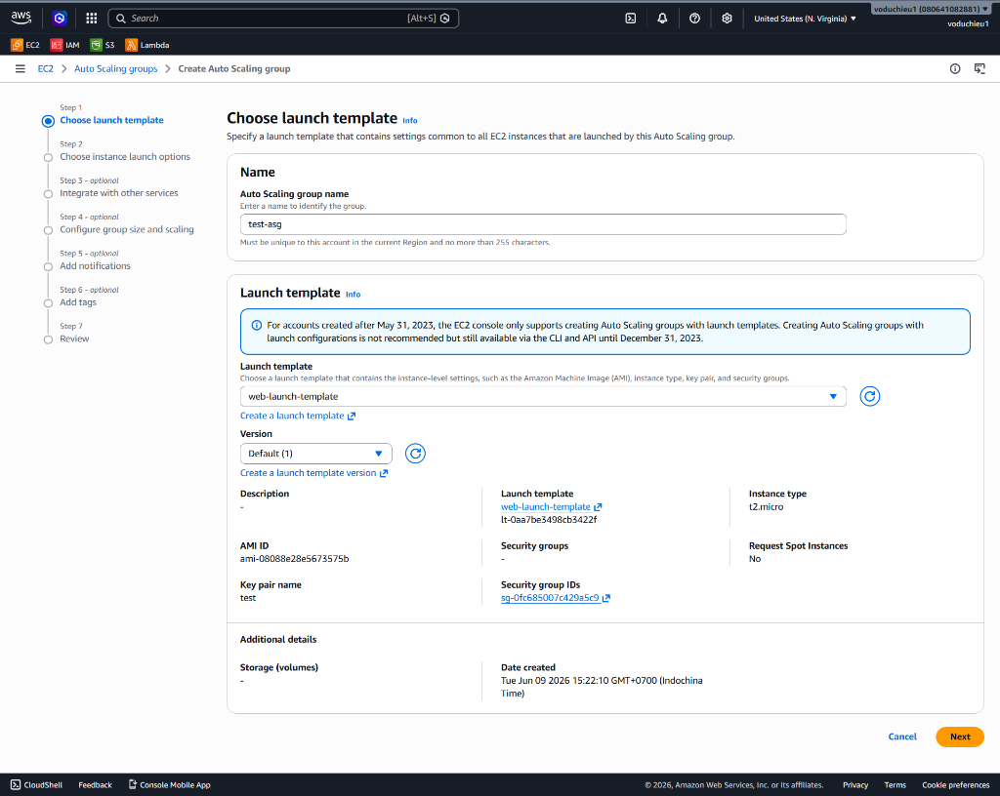
   
   *Hình 9: Chọn mẫu cấu hình khởi chạy cho Auto Scaling Group.*

4. **Step 2: Choose instance launch options**:
   * **VPC**: Chọn VPC mặc định (phải khớp với VPC của Target Group).
   * **Availability Zones and subnets**: Tích chọn **TẤT CẢ các Availability Zones và Subnets** đang có trong VPC của bạn (ví dụ: `us-east-1a`, `us-east-1b`, `us-east-1c`...). Việc chọn nhiều zone giúp ASG phân phối tải đồng đều và nâng cao khả năng chịu lỗi.
   * Nhấp chọn **Next**.
   
   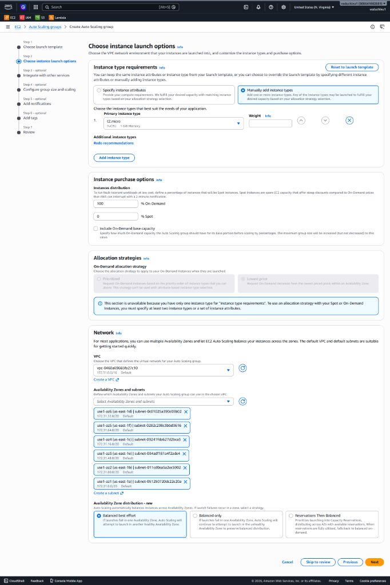
   
   *Hình 10: Lựa chọn toàn bộ Availability Zones để phân bổ máy chủ con.*

5. **Step 3: Integrate with other services - optional (Điểm mấu chốt)**:
   * **Load balancing**: Chọn tùy chọn **Attach to an existing load balancer**.
   * **Attach to an existing load balancer**: Chọn **Choose from your load balancer target groups**.
   * **Existing load balancer target groups**: Tìm và nhấp chọn Target Group **`tg-01 | HTTP`** (được liên kết với Application Load Balancer `alb-01` đã khởi tạo trước đó).
   * **Health check grace period**: Nhập `300` giây (thời gian chờ khởi động để bỏ qua check sức khỏe ban đầu).
   * Nhấp chọn **Next**.
   
   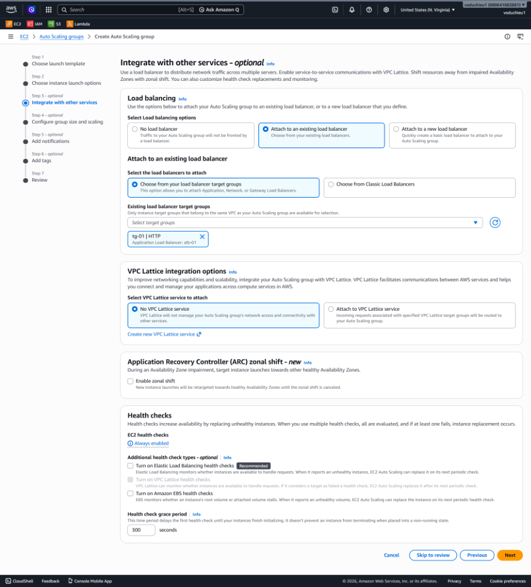
   
   *Hình 11: Liên kết Auto Scaling Group trực tiếp vào Target Group tg-01 của Load Balancer.*

6. **Step 4: Configure group size and scaling - optional**:
   * **Desired capacity (Số lượng mong muốn)**: Nhập `2` (Hệ thống sẽ cố gắng duy trì chạy 2 instances ổn định).
   * **Min desired capacity (Số lượng tối thiểu)**: Nhập `2` (Không cho phép giảm xuống dưới 2).
   * **Max desired capacity (Số lượng tối đa)**: Nhập `4` (Giới hạn tối đa là 4 để kiểm soát chi phí).
   * **Automatic scaling**: Chọn **No scaling policies** (Tạm thời không dùng chính sách tự động co giãn ở bước này).
   * Nhấp chọn **Next** đi qua các bước Notification, Tags, hoặc nhấp chọn thẳng nút **Skip to review**.
   
   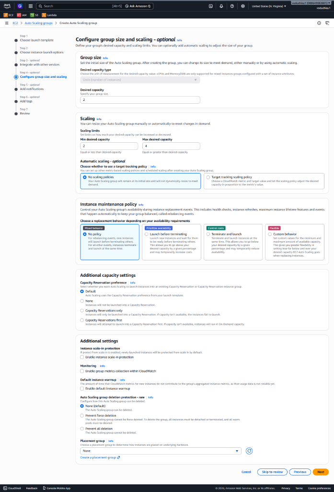
   
   *Hình 12: Thiết lập thông số số lượng máy chủ mong muốn, tối thiểu và tối đa.*

7. **Step 7: Review**:
   * Kiểm tra lại toàn bộ thông tin tổng hợp của Auto Scaling Group vừa cấu hình.
   * Nhấp chọn nút **Create Auto Scaling group** ở dưới cùng bên phải để hoàn tất.

Hệ thống ASG sẽ lập tức khởi chạy 2 máy chủ ảo con (`Webserver`) dựa trên cấu hình trong Launch Template và tự động đăng ký (register) chúng vào Target Group `tg-01` để bắt đầu gánh tải cho web server.

---

### Bước 6: Kiểm tra kết quả hoạt động (Verification)

Sau khi tạo xong Auto Scaling Group, ta cần kiểm tra xem hệ thống có tự động khởi tạo máy chủ con và phân phối tải đúng như thiết kế hay không.

1. **Kiểm tra trạng thái của Auto Scaling Group**:
   * Quay lại danh sách **Auto Scaling Groups**.
   * Đảm bảo group `test-asg` hiển thị trạng thái **Status** là **`At desired capacity`**.
   * Kiểm tra thông số cột **Instances** hiển thị giá trị là `2` và **Instance health** đạt trạng thái **`2/2 Healthy`** (Cả 2 instances con đều khỏe mạnh).
   
   
   
   *Hình 13: Auto Scaling Group test-asg hoạt động ổn định và quản lý đủ 2 instances.*

2. **Kiểm tra các EC2 instances con được khởi tạo tự động**:
   * Truy cập vào menu **Instances** trên EC2 Console.
   * Bạn sẽ thấy xuất hiện **2 máy chủ ảo mới** có tên là **`Webserver`** (đúng theo Tag đã định nghĩa trong Launch Template).
   * Cả 2 instances này đều tự động chuyển sang trạng thái **`Running`**.
   * Để ý cột **Availability Zone**: Một máy chủ được khởi chạy tại zone `us-east-1b` và máy chủ còn lại được khởi chạy tại zone `us-east-1c`. Điều này chứng minh ASG đã tự động phân phối đều các máy chủ qua các Availability Zones khác nhau để tối ưu hóa tính sẵn sàng của hệ thống.
   
   
   
   *Hình 14: Hai máy chủ con Webserver đã được tự động tạo và phân phối sang các Availability Zones khác nhau.*

3. **Kiểm tra tự động đăng ký Targets & Xác thực hoạt động qua DNS**:
   * Truy cập **Target Groups** -> Chọn Target Group `tg-01` -> Xem tab **Targets**. Bạn sẽ thấy 2 instance `Webserver` mới này đã được tự động đăng ký thành target của Target Group.
   * Tiếp theo, truy cập mục **Load Balancers** -> Chọn Load Balancer `alb-01` của bạn -> Sao chép địa chỉ **DNS name** hiển thị ở thông tin chi tiết phía dưới (ví dụ: `alb-01-1234479115.us-east-1.elb.amazonaws.com`).
     
     
     
     *Hình 15: Lấy thông tin DNS Name của Application Load Balancer.*

   * Mở trình duyệt web bất kỳ và truy cập bằng địa chỉ DNS Name trên qua giao thức HTTP:
     ```text
     http://<DNS_NAME_CUA_ALB>
     ```
   * **Kết quả hiển thị**: Trình duyệt sẽ hiển thị trang web chào mừng thành công từ máy chủ con. Thông tin IP nội bộ hiển thị trên trang web (ví dụ: Private IP: `172.31.30.98` và Public IP tương ứng) chính là thông số của một trong các máy chủ mới do ASG tự động tạo ra.
     
     
     
     *Hình 16: Xác thực truy cập thành công qua DNS Name của Load Balancer trỏ tới EC2 do ASG quản lý.*

---

## Thực Hành Nâng Cao 1: Kiểm nghiệm tính năng Tự phục hồi sự cố (Self-healing)

Một trong những ưu điểm vượt trội của Auto Scaling Group là khả năng tự phát hiện máy chủ lỗi và khởi tạo lại máy chủ mới để duy trì độ sẵn sàng cao nhất cho ứng dụng mà không cần quản trị viên can thiệp thủ công.

1. **Giả lập sự cố máy chủ**:
   * Truy cập **EC2** -> **Instances**.
   * Chọn 1 trong 2 instance có tên **`Webserver`** đang chạy do ASG quản lý.
   * Chọn **Instance state** -> Chọn **Stop instance** (hoặc **Terminate instance**).
2. **Quan sát hành vi tự phục hồi**:
   * Đợi khoảng 1 - 2 phút, nhấp Refresh lại danh sách Instances.
   * Bạn sẽ thấy instance cũ chuyển sang trạng thái **`Stopped`** hoặc **`Terminated`**.
   * Ngay lập tức, ASG sẽ tự động phát hiện số lượng instance chạy thực tế (`1`) nhỏ hơn Desired capacity (`2`) và tự động khởi tạo **1 instance Webserver mới** thay thế đang ở trạng thái **`Running (Initializing)`**.
   
   
   
   *Hình 17: Máy chủ cũ bị dừng (Stopped) và ASG tự động tạo máy chủ con mới (Running) thay thế.*

---

## Thực Hành Nâng Cao 2: Kiểm nghiệm Co giãn thủ công (Manual Scaling)

Trong các trường hợp biết trước lịch tải tăng cao (ví dụ: ngày lễ, flash sale), bạn có thể chủ động tăng quy mô của cụm máy chủ trực tiếp từ trang quản trị ASG.

1. **Điều chỉnh thông số quy mô**:
   * Truy cập **EC2** -> **Auto Scaling Groups** -> Chọn group **`test-asg`**.
   * Tại tab **Details**, tìm đến mục **Capacity overview** và nhấp chọn nút **Edit**.
   
   
   
   *Hình 18: Giao diện tổng quan quy mô của test-asg trước khi chỉnh sửa.*

2. **Cập nhật số lượng máy chủ**:
   * Tại cửa sổ **Group size**, thay đổi các giá trị sau:
     * **Desired capacity**: Thay đổi từ `2` thành `3`.
     * **Min desired capacity**: Thay đổi từ `2` thành `3`.
   * Nhấp chọn nút **Update**.
   
   
   
   *Hình 19: Cập nhật Desired và Min capacity lên 3.*

3. **Xác thực kết quả co giãn**:
   * **Kiểm tra Instances**: Quay lại menu **EC2** -> **Instances**. Bạn sẽ thấy có tổng cộng **3 máy chủ Webserver đang chạy** (Running), tức là ASG đã tự động tạo thêm instance thứ 3 ngay khi lưu cấu hình.
   
   
   
   *Hình 20: Hệ thống đã chạy đồng thời 3 máy chủ Webserver khỏe mạnh.*

   * **Kiểm tra Lịch sử hoạt động (Activity History)**:
     * Chọn group **`test-asg`** -> Chọn tab **Activity**.
     * Bạn sẽ thấy toàn bộ lịch sử hoạt động chi tiết:
       1. *Terminating EC2 instance*: Dừng máy chủ lỗi (ở Bước nâng cao 1).
       2. *Launching a new EC2 instance*: Tạo máy mới tự phục hồi (ở Bước nâng cao 1).
       3. *Launching a new EC2 instance... changing the desired capacity from 2 to 3*: Tạo máy mới do thay đổi quy mô thủ công (ở Bước nâng cao 2).
   
   
   
   *Hình 21: Nhật ký các hoạt động tự phục hồi và co giãn thành công của ASG.*

---

## Thực Hành Nâng Cao 3: Thiết lập Co giãn động tự động (Dynamic Scaling)

Để hệ thống tự động phản ứng với sự biến động thực tế của lưu lượng tải người dùng mà không cần chỉnh sửa thủ công, ta thiết lập chính sách co giãn động dựa trên chỉ số giám sát mạng của hệ thống.

1. **Khởi tạo Dynamic Scaling Policy**:
   * Truy cập **EC2** -> **Auto Scaling Groups** -> Chọn group **`test-asg`**.
   * Chọn tab **Automatic scaling** -> Tại mục **Dynamic scaling policies**, nhấp chọn nút **Create dynamic scaling policy**.
   * Cấu hình chính sách theo dõi chỉ số mạng (Network):
     * **Policy type**: Chọn **Target tracking scaling** (Co giãn theo dõi mục tiêu).
     * **Scaling policy name**: Nhập `Target Tracking Policy - Network`.
     * **Metric type**: Chọn **Average network in (bytes)** (Lưu lượng mạng nhận vào trung bình của các instance).
     * **Target value**: Nhập **`2000`** (AWS sẽ cố gắng điều chỉnh số lượng máy chủ để giữ chỉ số mạng trung bình ở mức 2000 bytes).
     * **Instance warmup**: Nhập `300` giây (thời gian chờ máy chủ mới khởi động ổn định trước khi tính toán tải tiếp theo).
   * Nhấp chọn **Create** để lưu chính sách.
   
   
   
   *Hình 22: Thiết lập chính sách Target Tracking dựa trên lưu lượng mạng trung bình là 2000 bytes.*

2. **Kiểm tra các cảnh báo (Alarms) tự sinh trên CloudWatch**:
   * **Bản chất hoạt động**: Khi ta tạo chính sách Target Tracking với chỉ số mạng là 2000, AWS sẽ **tự động tạo ra 2 Alarm (cảnh báo) tương ứng trên CloudWatch** để giám sát ngưỡng cao và ngưỡng thấp:
     * **1 Alarm High (> 2000)**: Khi lưu lượng mạng vượt quá 2000 bytes, Alarm High kích hoạt (`In alarm`) -> Trigger gửi tới ASG để tự động khởi chạy thêm EC2 instance con (Scale Out) giúp gánh bớt tải.
     * **1 Alarm Low (< 1800)**: Khi lưu lượng mạng giảm xuống dưới ngưỡng 1800 bytes, Alarm Low kích hoạt -> Trigger gửi tới ASG để giảm bớt số lượng máy chủ con (Scale In) nhằm tiết kiệm chi phí.
   * Truy cập dịch vụ **CloudWatch** -> Chọn **Alarms** -> **All alarms**. Bạn sẽ thấy xuất hiện 2 alarms tự sinh có tên bắt đầu bằng `TargetTracking-test-asg-...`:
   
   
   
   *Hình 23: Cặp cảnh báo AlarmHigh (giám sát tăng tải) và AlarmLow (giám sát giảm tải) do ASG tự động tạo trên CloudWatch.*

3. **Kiểm tra kết quả tự động co giãn (Scale Out)**:
   * Khi hệ thống nhận traffic lớn làm lưu lượng mạng vượt ngưỡng, cảnh báo Alarm High chuyển sang màu đỏ (`In alarm`).
   * Truy cập **EC2** -> **Instances**: Bạn sẽ thấy ASG lập tức tự động tạo thêm EC2 instances mới (nâng tổng số lượng instance chạy đồng thời lên thành 4 máy chủ, chạm mức Max Capacity mà ta đã giới hạn ở các bước cấu hình trước).
   
   
   
   *Hình 24: Cụm máy chủ đã tự động Scale Out lên 4 instances Running để chia tải lưu lượng mạng.*

---

## Thực Hành Nâng Cao 4: Cấu hình Co giãn theo lịch trình (Scheduled Scaling)

Trong thực tế vận hành, có nhiều trường hợp tải của hệ thống biến động một cách có chu kỳ và dự đoán trước được (ví dụ: lượng truy cập tăng vọt vào khung giờ vàng từ 20:00 - 22:00 hàng ngày, hoặc giảm mạnh vào ban đêm). Để chủ động tối ưu hiệu năng và chi phí, ta thiết lập chính sách co giãn theo lịch trình (Scheduled Scaling).

### Các bước thực hiện chi tiết

1. **Truy cập menu Scheduled Actions**:
   * Truy cập **EC2** -> **Auto Scaling Groups** -> Chọn group **`test-asg`**.
   * Chọn tab **Automatic scaling** -> Cuộn xuống mục **Scheduled actions** và nhấp chọn nút **Create scheduled action** (ở góc phải hoặc ở giữa giao diện nếu chưa có hành động nào).

   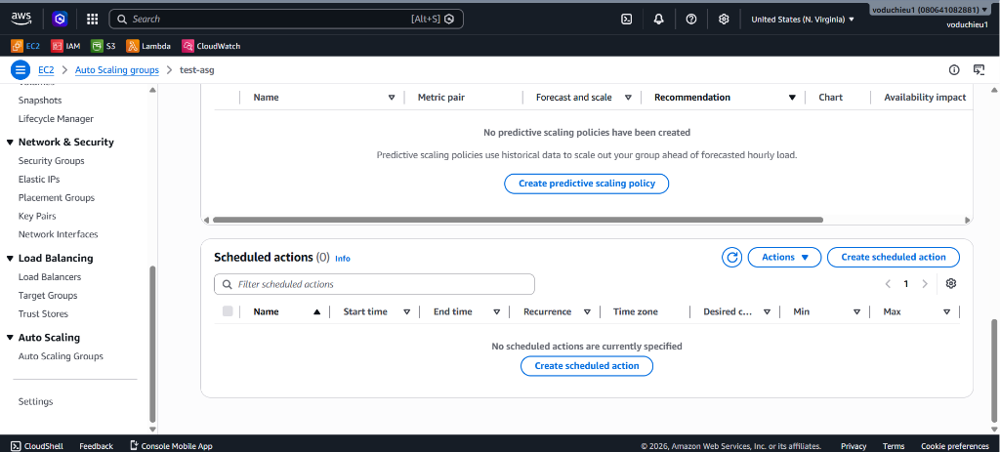

   *Hình 25: Giao diện quản lý Scheduled actions trong cấu hình Auto Scaling Group.*

2. **Cấu hình Scheduled Action đầu tiên (Scale Out - Tăng tải giờ cao điểm)**:
   * **Name**: `Scale Out test`
   * **Desired capacity**: Nhập `4` (Yêu cầu hệ thống chạy 4 instances để gánh tải).
   * **Min**: Nhập `4` (Đảm bảo số lượng tối thiểu là 4).
   * **Max**: Nhập `4` (Giới hạn tối đa là 4).
   * **Recurrence (Lặp lại)**: Chọn **Every day** (Hàng ngày). Hệ thống sẽ tự động sinh biểu thức Cron tương ứng là `5 20 * * *` (chạy vào lúc 20:05 hàng ngày).
   * **Time zone**: Chọn múi giờ địa phương **Asia/Saigon** (GMT+7).
   * **Start time**: Đặt ngày bắt đầu (ví dụ: `2026/06/09`) và giờ bắt đầu tương ứng với lịch trình lặp lại (ví dụ: `20:05`).
   * Nhấp chọn nút **Create** ở góc dưới cùng bên phải.

   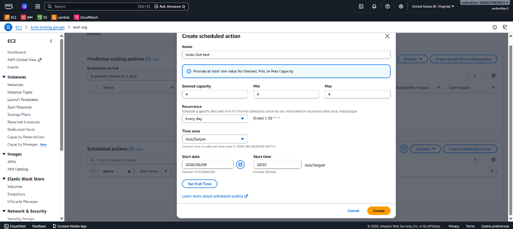

   *Hình 26: Thiết lập chi tiết cho Scheduled Action - Scale Out test để tăng quy mô vào lúc 20:05.*

3. **Cấu hình Scheduled Action thứ hai (Scale In - Giảm tải tiết kiệm chi phí)**:
   * Để đưa hệ thống về trạng thái bình thường sau khung giờ cao điểm nhằm tối ưu chi phí, ta tạo thêm một Scheduled Action thứ hai.
   * Nhấp chọn tiếp nút **Create scheduled action**:
     * **Name**: `Scale In Test`
     * **Desired capacity**: Nhập `2`.
     * **Min**: Nhập `2`.
     * **Max**: Nhập `10`.
     * **Recurrence**: Chọn **Every day** (Hoặc thiết lập thủ công Cron `0 23 * * *` để chạy vào lúc 23:00 hàng ngày).
     * **Time zone**: Chọn **Asia/Saigon** (GMT+7).
     * **Start time**: Đặt ngày bắt đầu và giờ bắt đầu là `23:00`.
   * Nhấp chọn nút **Create**.
   * Sau khi hoàn tất, danh sách **Scheduled actions** của bạn sẽ hiển thị đầy đủ thông tin của cả 2 chính sách Scale Out và Scale In:

   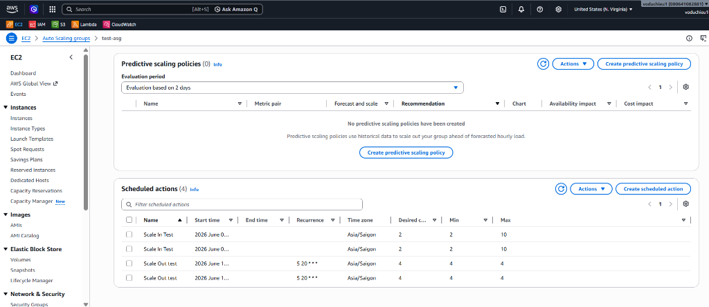

   *Hình 27: Danh sách các Scheduled Actions đã được tạo cấu hình thành công.*

4. **Xác thực kết quả hoạt động (Verification)**:
   * **Kiểm tra Instances**: Khi đến đúng mốc thời gian đã hẹn (ví dụ: 20:05), Scheduled Action `Scale Out test` sẽ tự động được kích hoạt. ASG sẽ cập nhật lại quy mô mong muốn và tối thiểu thành `4`.
   * Quay lại menu **EC2** -> **Instances**, bạn sẽ thấy hệ thống đã tự động tạo thêm các máy chủ con mới và đang chạy đồng thời **4 instances Webserver** khỏe mạnh:

   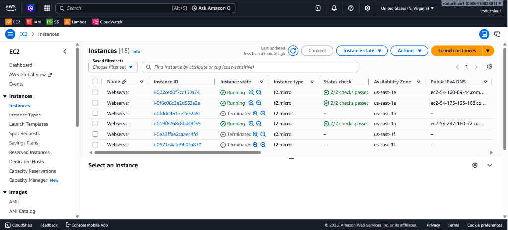

   *Hình 28: Danh sách các instances tự động khởi chạy sau khi Scheduled Action kích hoạt.*

   * **Kiểm tra Lịch sử hoạt động (Activity History)**:
     * Chọn group **`test-asg`** -> Chọn tab **Activity**.
     * Nhật ký hệ thống sẽ ghi nhận rõ ràng sự kiện co giãn do lịch trình kích hoạt:
       * *Launching a new EC2 instance... changing the desired capacity from 2 to 4 in response to a scheduled action...*

   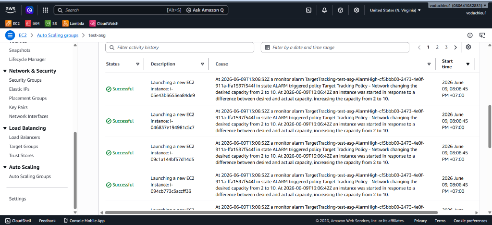

   *Hình 29: Lịch sử hoạt động của ASG ghi nhận việc thay đổi số lượng máy chủ mong muốn theo lịch trình.*

> [!TIP]
> **Lưu ý múi giờ (Time zone) và biểu thức Cron**:
> * Luôn kiểm tra kỹ múi giờ (`Time zone`) khi cấu hình để tránh việc lệch múi giờ của AWS (mặc định là UTC) dẫn đến việc co giãn diễn ra sai thời điểm mong muốn.
> * Việc kết hợp giữa **Scheduled Scaling** (chu kỳ cố định) và **Dynamic Scaling** (dựa trên tải thực tế) là mô hình phổ biến giúp hệ thống vận hành an toàn và tiết kiệm chi phí tối đa.

---

## Thực Hành Nâng Cao 5: Cập nhật cấu hình Launch Template và Cập nhật ASG (Rollout Update)

Trong quá trình vận hành dự án thực tế, các yêu cầu cập nhật phiên bản ứng dụng (deploy code mới), vá lỗi bảo mật hệ điều hành hoặc thay đổi cấu hình phần cứng của cụm máy chủ ảo diễn ra rất thường xuyên. Ở phần này, ta sẽ tìm hiểu cách cập nhật cấu hình **Launch Template** và cập nhật **Auto Scaling Group** để áp dụng cấu hình mới cho các máy chủ con, kèm theo mẹo (tip) triển khai cập nhật nhanh.

### Các bước thực hiện chi tiết

1. **Tạo phiên bản mới cho Launch Template (Modify Template)**:
   * Truy cập **EC2** -> **Launch Templates** -> Tích chọn template của bạn (ví dụ: `web-launch-template`).
   * Nhấp chọn nút **Actions** ở góc trên bên phải -> Chọn **Modify template (Create new version)**.

   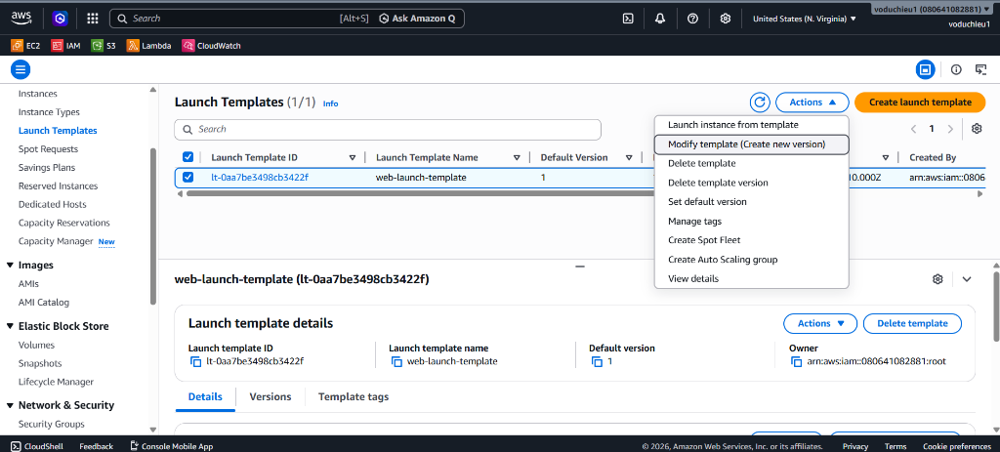

   *Hình 30: Chọn tính năng tạo phiên bản mới (Modify template) của Launch Template.*

2. **Cấu hình phiên bản cập nhật**:
   * Tại giao diện **Modify template (Create new version)**, bạn có hai phương án phổ biến để cập nhật ứng dụng:
     * **Cách 1: Sử dụng AMI mới được cài sẵn (Golden Image mới)**: Nếu bạn đã đóng gói code mới vào một AMI mới (ví dụ: `webserver-ami-v2`), hãy tìm chọn bản AMI này tại mục **Application and OS Images (Amazon Machine Image)** để thay thế bản AMI cũ.
     * **Cách 2: Sử dụng Script khởi chạy (User Data Script)**: Để kiểm thử nhanh mà không cần đóng gói lại AMI, bạn cuộn xuống mục **Advanced details**, tại phần **User data** ở dưới cùng, nhập đoạn mã script cập nhật. Ví dụ script ghi đè nội dung trang web:
       ```bash
       #!/bin/bash
       echo "<h1>Day la ung dung phien ban moi (Version 2) duoc deploy tu dong!</h1>" > /var/www/html/index.html
       ```
   * Nhấp chọn nút **Create template version** ở dưới cùng bên phải để hoàn tất tạo phiên bản (Version 2).

   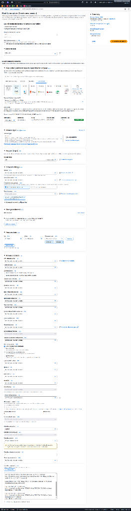

   *Hình 31: Thiết lập cấu hình cập nhật (AMI mới hoặc script User Data) cho Launch Template.*

3. **Cập nhật Auto Scaling Group sử dụng phiên bản mới**:
   * Truy cập **EC2** -> **Auto Scaling Groups** -> Chọn group **`test-asg`**.
   * Tại tab **Details**, tìm đến mục **Launch template** và nhấp chọn nút **Edit**.
   * Tại mục **Version**, đổi cấu hình từ `Default (1)` sang **`Latest (2)`** (hoặc chọn phiên bản cố định là `2`). Việc chọn `Latest` giúp ASG luôn tự động sử dụng phiên bản Launch Template mới nhất mỗi khi bạn thực hiện sửa đổi sau này.
   * Cuộn xuống dưới cùng và nhấp chọn **Update** để áp dụng cấu hình mới.

   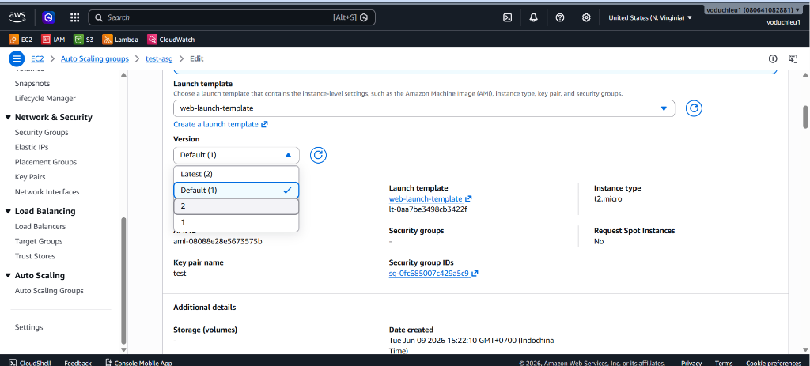

   *Hình 32: Cập nhật phiên bản Launch Template lên bản mới nhất trong cấu hình ASG.*

4. **Xác thực và mẹo cập nhật nhanh cụm máy chủ (Rollout Tip)**:

   > [!IMPORTANT]
   > **Cơ chế cập nhật mặc định của ASG**:
   > Sau khi bạn nhấn **Update** thành công trong cấu hình ASG, **các máy chủ EC2 instances cũ đang chạy sẽ KHÔNG tự động dừng lại hoặc khởi chạy lại ngay lập tức**. Chúng vẫn sẽ tiếp tục chạy phiên bản cấu hình cũ (Version 1). Cấu hình mới (Version 2) chỉ được áp dụng cho các instances mới được tạo ra từ thời điểm này trở đi (khi có Scale Out, hoặc khi một máy cũ bị Unhealthy và ASG tự phục hồi).

   * **Mẹo (Tip) thực hiện cập nhật đồng loạt ngay lập tức (không cần dùng Instance Refresh)**:
     Để thay thế toàn bộ cụm máy chủ cũ sang phiên bản mới một cách nhanh chóng và an toàn:
     1. **Bước 1**: Truy cập **EC2** -> **Auto Scaling Groups** -> Chọn `test-asg` -> Nhấp **Edit** phần Capacity.
     2. **Bước 2**: Tạm thời **nâng gấp đôi** giá trị của **Desired capacity** và **Min capacity** (ví dụ: từ `2` lên `4`). ASG sẽ lập tức khởi chạy thêm 2 instances mới. 2 máy mới này sẽ tự động được áp dụng cấu hình mới (Version 2) từ Launch Template.
     3. **Bước 3**: Chờ cho đến khi 2 instances mới ở trạng thái chạy bình thường (`Running`) và đã vượt qua kiểm tra sức khỏe của Target Group (`Healthy`).
     4. **Bước 4**: Quay lại sửa **Desired capacity** và **Min capacity** về lại **giá trị ban đầu** (ví dụ: giảm từ `4` xuống `2`).
     5. **Kết quả**: Theo chính sách hủy máy mặc định (**Termination Policy**) của AWS Auto Scaling, hệ thống sẽ ưu tiên tiêu diệt (terminate) các instances cũ hơn và chạy phiên bản Launch Template cũ hơn trước. Nhờ đó, cụm máy chủ của bạn sẽ chỉ còn lại các máy mới chạy phiên bản cập nhật (Version 2) mà dịch vụ không hề bị gián đoạn (Zero Downtime).

---

Chúc mừng bạn đã hoàn thành thiết lập hệ thống tự động co giãn (Auto Scaling Group) kết hợp với bộ cân bằng tải (Application Load Balancer) thành công! Các bài lab thực hành từ cơ bản đến nâng cao (Self-healing, Manual, Dynamic, Scheduled, và Rollout Update) đã hoàn tất một cách trọn vẹn.
