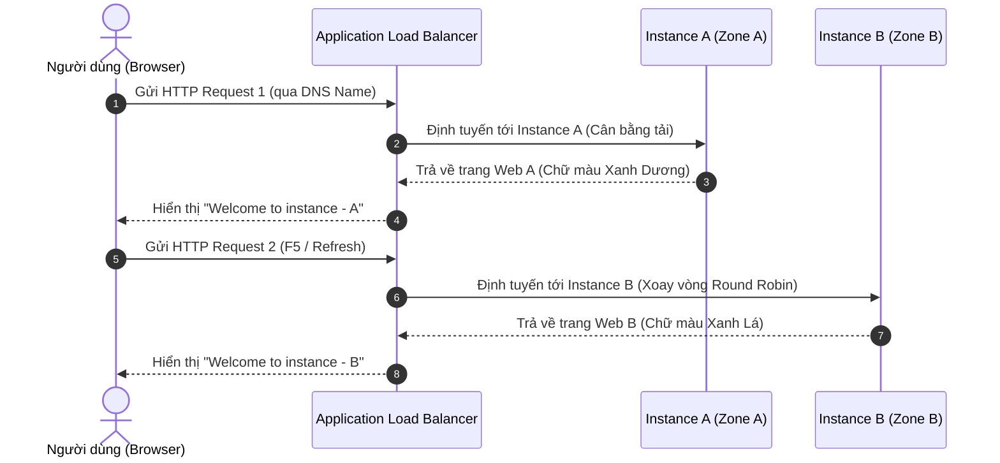

# Hướng Dẫn Thực Hành: Cân Bằng Tải Với Elastic Load Balancing (ELB)

Tài liệu này cung cấp hướng dẫn từng bước chi tiết (step-by-step) để thực hành cấu hình cân bằng tải bằng **Application Load Balancer (ALB)** trên AWS. Chúng ta sẽ khởi tạo hai máy chủ EC2 chạy trang web tĩnh có giao diện khác nhau thông qua **User Data**, nhóm chúng vào một **Target Group** và cấu hình ALB để tự động phân phối lưu lượng truy cập.

---

## Các bước thực hiện

### Bước 1: Khởi tạo EC2 Instance A (`webserver-a`) với User Data

1. Truy cập **AWS Management Console** -> Chọn dịch vụ **EC2**.
2. Nhấp chọn nút **Launch Instance**.
3. **Cấu hình thông tin cơ bản**:
   * **Name**: `webserver-a`
   * **Application and OS Images (AMI)**: Chọn **Amazon Linux 2023 AMI** (Free Tier eligible).
   * **Instance Type**: Chọn `t2.micro`.
   * **Key pair**: Chọn cặp khóa `.pem` của bạn để truy cập SSH khi cần.
4. **Cấu hình kịch bản tự động hóa (User Data) cho Instance A**:
   * Cuộn xuống dưới cùng và nhấp chọn mục **Advanced Details** để mở rộng cấu hình chuyên sâu.
   * Tìm trường cấu hình **User data** ở dưới cùng và dán đoạn script Bash sau (để hiển thị tiêu đề màu xanh dương - **Blue**). Bạn có thể tải file mẫu trực tiếp tại đây: [user-data-instance-a.sh](../../templates/elb/user-data-instance-a.sh)

```bash
#!/bin/bash
# 1. Cài đặt Apache Web Server và khởi động dịch vụ
yum install httpd -y
service httpd start
chkconfig httpd on

# 2. Di chuyển vào thư mục gốc của trang web
cd /var/www/html

# 3. Ghi đè file index.html với giao diện Instance A
echo "<h1 style='color:blue;'>Welcome to instance - A</h1>" >> index.html
echo "<h4 style='color:red;'>You are running instance from this IP (For debug only!!!!Do not public this to user):</h4>" >> index.html

# 4. Sử dụng IMDSv2 để lấy Session Token bảo mật
export TOKEN=`curl -X PUT "http://169.254.169.254/latest/api/token" -H "X-aws-ec2-metadata-token-ttl-seconds: 21600"`

# 5. Truy xuất Private IP từ Metadata
echo "<br>Private IP: " >> index.html
curl -H "X-aws-ec2-metadata-token: $TOKEN" -v http://169.254.169.254/latest/meta-data/local-ipv4 >> index.html

# 6. Truy xuất Public IP từ Metadata
echo "<br>Public IP: " >> index.html
curl -H "X-aws-ec2-metadata-token: $TOKEN" -v http://169.254.169.254/latest/meta-data/public-ipv4 >> index.html
echo "</html>" >> index.html
```


*Hình 1: Cấu hình kịch bản User Data cho Instance A trên AWS Console.*

5. Nhấp chọn **Launch Instance** để khởi chạy máy chủ A.

---

### Bước 2: Khởi tạo EC2 Instance B (`webserver-b`) với User Data

Thực hiện tự tương tự các bước trên để tạo instance thứ hai:
1. Nhấp chọn **Launch Instance**.
2. **Cấu hình thông tin cơ bản**:
   * **Name**: `webserver-b`
   * **AMI & Instance Type**: Chọn giống hệt Instance A (**Amazon Linux 2023** và `t2.micro`).
3. **Cấu hình kịch bản tự động hóa (User Data) cho Instance B**:
   * Tại mục **Advanced Details** -> **User data**, dán đoạn script Bash sau (để hiển thị tiêu đề màu xanh lá - **Green**). Bạn có thể tải file mẫu trực tiếp tại đây: [user-data-instance-b.sh](../../templates/elb/user-data-instance-b.sh)

```bash
#!/bin/bash
# 1. Cài đặt Apache Web Server và khởi động dịch vụ
yum install httpd -y
service httpd start
chkconfig httpd on

# 2. Di chuyển vào thư mục gốc của trang web
cd /var/www/html

# 3. Ghi đè file index.html với giao diện Instance B
echo "<h1 style='color:green;'>Welcome to instance - B</h1>" >> index.html
echo "<h4 style='color:red;'>You are running instance from this IP (For debug only!!!!Do not public this to user):</h4>" >> index.html

# 4. Sử dụng IMDSv2 để lấy Session Token bảo mật
export TOKEN=`curl -X PUT "http://169.254.169.254/latest/api/token" -H "X-aws-ec2-metadata-token-ttl-seconds: 21600"`

# 5. Truy xuất Private IP từ Metadata
echo "<br>Private IP: " >> index.html
curl -H "X-aws-ec2-metadata-token: $TOKEN" -v http://169.254.169.254/latest/meta-data/local-ipv4 >> index.html

# 6. Truy xuất Public IP từ Metadata
echo "<br>Public IP: " >> index.html
curl -H "X-aws-ec2-metadata-token: $TOKEN" -v http://169.254.169.254/latest/meta-data/public-ipv4 >> index.html
echo "</html>" >> index.html
```


*Hình 2: Cấu hình kịch bản User Data cho Instance B trên AWS Console.*

4. Nhấp chọn **Launch Instance** để khởi chạy máy chủ B.

---

### Bước 3: Kiểm tra trạng thái hoạt động của các Instances

Quay lại danh sách **Instances** của dịch vụ EC2 để kiểm tra trạng thái của cả hai máy chủ.
* Đảm bảo cả `webserver-a` và `webserver-b` đều chuyển sang trạng thái **Running**.
* Ghi lại địa chỉ **Public IP** của 2 instances để so sánh sau này.


*Hình 3: Cụm máy chủ ảo webserver-a và webserver-b đã khởi tạo thành công.*

---

### Bước 4: Cấu hình Inbound Rules cho Security Group mặc định

Để người dùng ngoài internet có thể truy cập vào trang web thông qua Load Balancer và bạn có thể quản trị máy chủ từ xa:
1. Tại danh sách Instance, nhấp vào tab **Security** của một trong 2 instances và truy cập vào **Security Group** đang được gắn (ví dụ: nhóm bảo mật `default`).
2. Chọn **Edit inbound rules** và bổ sung/chỉnh sửa các luật sau:
   * **Rule 1 (Cho phép HTTP)**:
     * **Type**: `HTTP` (Port 80).
     * **Source**: Chọn `Custom` và nhập `0.0.0.0/0` để cho phép lưu lượng web từ mọi nơi truy cập.
   * **Rule 2 (Cho phép SSH)**:
     * **Type**: `SSH` (Port 22).
     * **Source**: Chọn `My IP` để bảo mật cổng SSH chỉ mở riêng cho địa chỉ IP mạng của bạn.
3. Nhấp chọn **Save rules** để áp dụng cấu hình.


*Hình 4: Cấu hình các luật Inbound mở cổng HTTP 80 và SSH 22 cho Security Group.*

---

### Bước 5: Kiểm tra hoạt động của từng Instance qua Public IP

Trước khi đưa các Instance vào Target Group và cấu hình Load Balancer, chúng ta cần kiểm tra xem các Web Server trên từng máy chủ đã cài đặt thành công và có thể truy cập độc lập qua Public IP hay chưa:

1. Copy địa chỉ **Public IP** của `webserver-a` (ví dụ: `52.200.123.126`) và truy cập bằng trình duyệt qua giao thức HTTP: `http://<PUBLIC_IP_WEBSERVER_A>`.
   * Giao diện của **Instance A** sẽ xuất hiện với tiêu đề màu xanh dương: **`Welcome to instance - A`**.
2. Copy địa chỉ **Public IP** của `webserver-b` (ví dụ: `54.167.106.9`) và truy cập tương tự: `http://<PUBLIC_IP_WEBSERVER_B>`.
   * Giao diện của **Instance B** sẽ xuất hiện với tiêu đề màu xanh lá: **`Welcome to instance - B`**.


*Hình 5: Kiểm tra hoạt động của Instance A thành công.*


*Hình 6: Kiểm tra hoạt động của Instance B thành công.*

---

### Bước 6: Tạo Target Group (`tg-a1`) và đăng ký Targets

1. Tại cột quản trị bên trái của EC2, cuộn xuống mục **Load Balancing** -> Chọn **Target Groups**.
2. Nhấp chọn **Create target group**.
3. **Cấu hình thông tin nhóm**:
   * **Target type**: Chọn **Instances**.
   * **Target group name**: `tg-a1`
   * **Protocol & Port**: Chọn **HTTP** trên Port **80**.
   * **VPC**: Chọn VPC mặc định của bạn.
   * **Health checks**: Chọn giao thức **HTTP** với đường dẫn **Path** là `/`.
4. Nhấn **Next**.
5. **Đăng ký Targets**:
   * Tại danh sách các instance khả dụng bên dưới, tích chọn cả `webserver-a` và `webserver-b`.
   * Nhập cổng nhận traffic là `80` và nhấp chọn nút **Include as pending below**.
   * Đảm bảo cả hai máy chủ xuất hiện trong danh sách **Review targets** phía dưới.
6. Nhấp chọn **Create target group**.

---

### Bước 7: Tạo Application Load Balancer (ALB)

1. Tại cột quản trị bên trái của EC2, chọn mục **Load Balancers** -> Nhấp chọn **Create load balancer**.
2. Chọn loại **Application Load Balancer** -> Nhấp chọn **Create**.
3. **Cấu hình thông số Load Balancer**:
   * **Load balancer name**: `my-alb`
   * **Scheme**: Chọn **Internet-facing** (nhận lưu lượng từ Internet).
   * **IP address type**: Chọn **IPv4**.
4. **Network mapping**:
   * **VPC**: Chọn VPC mặc định.
   * **Mappings (Availability Zones)**: Tích chọn **TẤT CẢ các Availability Zone khả dụng** (ví dụ: `us-east-1a`, `us-east-1b`, `us-east-1c`,...).
   
   > [!TIP]
   > AWS luôn khuyến nghị lựa chọn tất cả các zone khả dụng khi khởi tạo ELB để tối đa hóa tính dự phòng và tính sẵn sàng cao (High Availability) cho hệ thống.

5. **Security groups**:
   * Chọn Security Group cho phép nhận traffic từ internet cổng `80` (bạn có thể chọn nhóm bảo mật chứa luật HTTP 80 đã cấu hình ở Bước 4).
6. **Listeners and routing**:
   * **Protocol & Port**: Chọn **HTTP** trên Port **80**.
   * **Default action**: Chọn hành động **Forward to** và trỏ tới Target Group **`tg-a1`** vừa tạo ở Bước 6.
7. Nhấp chọn **Create load balancer**.

---

### Bước 8: Kiểm tra tính năng Load Balancing

1. Đợi vài phút để trạng thái của Load Balancer chuyển từ `Provisioning` sang **`Active`**.
2. Tại màn hình Target Group `tg-a1`, kiểm tra tab **Targets** để đảm bảo trạng thái sức khỏe (**Health status**) của cả 2 instances đều là **`Healthy`**.
3. Chọn Load Balancer `my-alb` vừa tạo, tìm và sao chép địa chỉ **DNS name** (ví dụ: `my-alb-123456789.us-east-1.elb.amazonaws.com`).
4. Mở trình duyệt web và truy cập vào địa chỉ DNS Name trên:
   ```text
   http://<DNS_NAME_CUA_ALB>
   ```
5. **Quan sát và kiểm tra**:
   * Lần tải trang đầu tiên: Trình duyệt sẽ hiển thị trang web của **Instance A** với tiêu đề màu xanh dương: `Welcome to instance - A`.
   * Nhấn nút **F5 (Refresh)** lại trình duyệt: Trang web sẽ tự động chuyển sang trang web của **Instance B** với tiêu đề màu xanh lá: `Welcome to instance - B`.
   * Tiếp tục tải lại trang, bạn sẽ thấy lưu lượng truy cập liên tục xoay vòng (Round Robin) qua lại giữa 2 máy chủ ảo, hiển thị luân phiên Private IP khác nhau của từng máy.

Điều này chứng minh Application Load Balancer hoạt động chính xác, tự động định tuyến và cân bằng tải thành công giữa các zone khác nhau!


