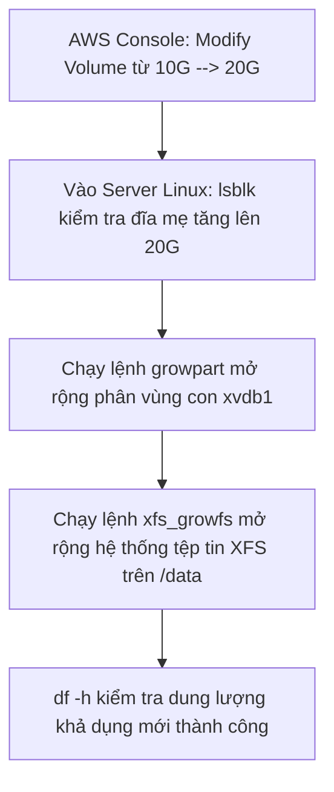

# Hướng Dẫn Thực Hành: Thêm Ổ Cứng Ngoài (EBS Volume) Cho Máy Chủ Linux Server

Tài liệu này cung cấp hướng dẫn từng bước chi tiết (step-by-step) để tạo thêm một ổ cứng ảo EBS Volume phụ ngoài, gắn kết kết nối (Attach) vào máy chủ ảo EC2 chạy hệ điều hành Linux (Amazon Linux 2), phân vùng ổ đĩa bằng `fdisk`, định dạng XFS, cấu hình tự động gắn kết đĩa (auto mount) qua `/etc/fstab` bằng UUID và đặc biệt là kỹ thuật **mở rộng dung lượng ổ đĩa trực tuyến (extend volume online)** bằng `growpart` và `xfs_growfs` khi dung lượng đĩa được tăng từ phía AWS Console.

---

## 1. Các bước thực hiện

### Bước 1: Tạo và gắn EBS Volume phụ vào EC2 Instance
1.  **Kiểm tra Availability Zone (AZ)** của instance Linux của bạn (ví dụ: `ap-southeast-1a`).
2.  Truy cập mục **Elastic Block Store** -> Chọn **Volumes** -> Click **Create Volume**.
3.  Tạo ổ đĩa mới: Chọn loại **gp3**, nhập dung lượng **10 GiB**, chọn chính xác vùng **Availability Zone** trùng với instance của bạn.
4.  Sau khi tạo xong, tích chọn ổ đĩa mới -> Chọn **Actions** -> Chọn **Attach Volume** -> Chọn instance Linux của bạn -> Click **Attach Volume**.

### Bước 2: Đăng nhập và kiểm tra phân bổ đĩa cứng
1.  Sử dụng SSH để kết nối vào máy chủ Linux của bạn:
    ```bash
    ssh -i "duong/dan/my-key.pem" ec2-user@<IP_PUBLIC_CUA_EC2>
    ```
2.  Kiểm tra danh sách các thiết bị lưu trữ dạng khối trên hệ thống:
    ```bash
    lsblk
    ```
    *(Bạn sẽ thấy một thiết bị mới chưa được phân vùng có tên tương tự như `xvdb` hoặc `nvme1n1` với dung lượng là 10G).*

---

### Bước 3: Tạo phân vùng (Partition) và gắn kết (Mount) vào `/data`

1.  **Tạo phân vùng mới bằng công cụ `fdisk`**:
    Chạy lệnh fdisk chỉ định thiết bị mới của bạn (ví dụ ở đây là `/dev/xvdb`):
    ```bash
    sudo fdisk /dev/xvdb
    ```
    *Tại màn hình tương tác của fdisk, thực hiện nhấn các phím sau*:
    *   Nhập **`n`** và nhấn **Enter** (để tạo phân vùng mới - New).
    *   Nhấn **Enter** liên tục để đồng ý với tất cả các thông số mặc định (Partition type, Partition number, First sector, Last sector).
    *   Nhập **`w`** và nhấn **Enter** (để ghi các thay đổi vào đĩa và thoát ra - Write).

2.  **Kiểm tra lại cấu trúc ổ đĩa**:
    ```bash
    lsblk
    ```
    *(Lúc này bạn sẽ thấy xuất hiện phân vùng con là `xvdb1` dưới thiết bị mẹ `xvdb`).*

3.  **Định dạng phân vùng bằng hệ thống tệp tin XFS**:
    ```bash
    sudo mkfs -t xfs /dev/xvdb1
    ```

4.  **Tạo thư mục điểm gắn kết (Mount point)**:
    ```bash
    sudo mkdir /data
    ```

5.  **Gắn kết phân vùng `xvdb1` vào thư mục `/data`**:
    ```bash
    sudo mount /dev/xvdb1 /data
    ```

---

### Bước 4: Kiểm tra dung lượng đĩa đã gắn kết
Kiểm tra dung lượng sử dụng của hệ thống tệp tin:
```bash
df -h
```
*(Đảm bảo trong danh sách hiển thị có dòng thiết bị `/dev/xvdb1` được gắn kết tại `/data` với dung lượng trống xấp xỉ 10G).*

---

### Bước 5: Cấu hình tự động gắn kết ổ đĩa khi khởi động lại máy (Auto-mount)

Nếu bạn không cấu hình bước này, mỗi lần EC2 Instance bị Stop/Start hoặc Reboot, phân vùng `/data` sẽ bị ngắt kết nối và bạn sẽ phải gõ lệnh `mount` thủ công lại. Để tự động hóa, chúng ta sẽ khai báo phân vùng qua tệp cấu hình hệ thống `/etc/fstab` bằng mã định danh UUID.

1.  **Lấy thông tin UUID của phân vùng**:
    Chạy một trong hai lệnh sau để xem mã UUID của `xvdb1`:
    ```bash
    sudo blkid
    ```
    Hoặc lệnh chi tiết:
    ```bash
    sudo lsblk -o +UUID
    ```
    *(Sao chép và lưu lại chuỗi UUID dài của phân vùng `/dev/xvdb1` vừa hiển thị, ví dụ: `UUID=a1b2c3d4-e5f6-7a8b-9c0d-e1f2a3b4c5d6`).*

2.  **Chỉnh sửa tệp tin `/etc/fstab`**:
    Mở file cấu hình bằng trình soạn thảo văn bản `vi` hoặc `nano` dưới quyền sudo:
    ```bash
    sudo vi /etc/fstab
    ```
    *Nhấn phím `i` để bắt đầu chế độ soạn thảo (Insert), di chuyển xuống cuối tệp tin và thêm dòng cấu hình sau*:
    ```text
    UUID=xxxxxxxx-xxxx-xxxx-xxxx-xxxxxxxxxxxx /data xfs defaults,noatime 1 2
    ```
    *(Thay thế `xxxxxxxx-xxxx-xxxx-xxxx-xxxxxxxxxxxx` bằng mã UUID thực tế bạn vừa sao chép ở trên).*
    *Nhấn phím `Esc`, nhập `:wq` và nhấn `Enter` để lưu lại tệp tin.*

---

### Bước 6: Kiểm tra cấu hình tự động gắn kết (Test Auto-mount)

Để đảm bảo tệp tin `/etc/fstab` không bị viết sai cú pháp (nếu viết sai cú pháp, hệ thống Linux sẽ bị lỗi boot và không thể khởi động được ở lần tiếp theo), bạn phải chạy thử nghiệm ngắt và nạp lại:

1.  **Ngắt gắn kết phân vùng đang chạy**:
    ```bash
    sudo umount /data
    ```
    *(Lưu ý: Lệnh chuẩn trong hệ thống Linux là `umount`, không phải là "unmount").*
2.  **Chạy lệnh nạp toàn bộ cấu hình trong fstab**:
    ```bash
    sudo mount -a
    ```
    *(Lệnh này sẽ quét toàn bộ file `/etc/fstab` và nạp lại các ổ đĩa chưa được mount).*
3.  **Kiểm tra lại xem `/data` đã được tự động mount thành công chưa**:
    ```bash
    df -h
    ```
    *(Nếu thiết bị hiển thị bình thường, cấu hình auto-mount của bạn đã hoàn toàn chính xác và an toàn).*

---

## 2. Nâng Cấp Và Mở Rộng Dung Lượng Ổ Cứng Trực Tuyến (Online Extend Volume)

Trong quá trình vận hành, nếu ổ đĩa `/data` 10 GiB bị đầy, bạn có thể tăng dung lượng trực tiếp từ AWS Console và dùng các câu lệnh để mở rộng hệ thống tệp tin ngay lập tức mà không làm gián đoạn dịch vụ.



### Bước 7: Thay đổi kích thước Volume trên AWS Console
1.  Vào AWS EC2 Console -> Elastic Block Store -> **Volumes**.
2.  Tích chọn ổ đĩa 10 GiB của bạn -> Chọn **Actions** -> Chọn **Modify Volume**.
3.  Tại ô **Size**, nhập dung lượng mới lớn hơn (ví dụ: `20` GiB) -> Click **Modify** để xác nhận.
4.  Quay trở lại terminal của EC2 Instance, chạy lệnh kiểm tra:
    ```bash
    lsblk
    ```
    *(Bạn sẽ thấy thiết bị mẹ `xvdb` đã tăng lên `20G`, nhưng phân vùng con `xvdb1` vẫn đang ở dung lượng cũ `10G`).*

### Bước 8: Thực hiện mở rộng phân vùng và hệ thống tệp tin (Extend Volume)

Để hệ điều hành sử dụng được 10G dung lượng mới thêm, chúng ta thực hiện 2 lệnh mở rộng trực tuyến sau:

1.  **Mở rộng phân vùng con (Partition Extension)**:
    Sử dụng công cụ `growpart` chỉ định tên ổ đĩa mẹ và vị trí phân vùng con cần mở rộng (ở đây là thiết bị `/dev/xvdb` và phân vùng số `1`):
    ```bash
    sudo growpart /dev/xvdb 1
    ```
    *(Lưu ý: Có khoảng trắng giữa tên thiết bị và số thứ tự phân vùng).*
    Chạy lại lệnh `lsblk` để kiểm tra: Phân vùng con `xvdb1` đã được tăng lên `20G`.

2.  **Mở rộng hệ thống tệp tin XFS (Filesystem Extension)**:
    Sử dụng công cụ `xfs_growfs` chỉ định thư mục gắn kết `/data`:
    ```bash
    sudo xfs_growfs -d /data
    ```
    *(Nếu hệ thống tệp tin là ext4, bạn sẽ sử dụng lệnh `sudo resize2fs /dev/xvdb1`).*

3.  **Xác nhận kết quả mở rộng**:
    ```bash
    df -h
    ```
    *(Dung lượng khả dụng của ổ đĩa tại phân vùng `/data` đã được cập nhật thành công lên 20G hoàn toàn trực tuyến và không cần khởi động lại máy).*
