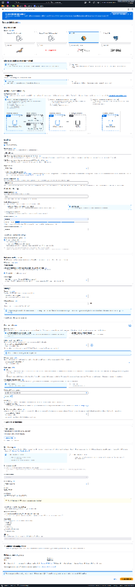
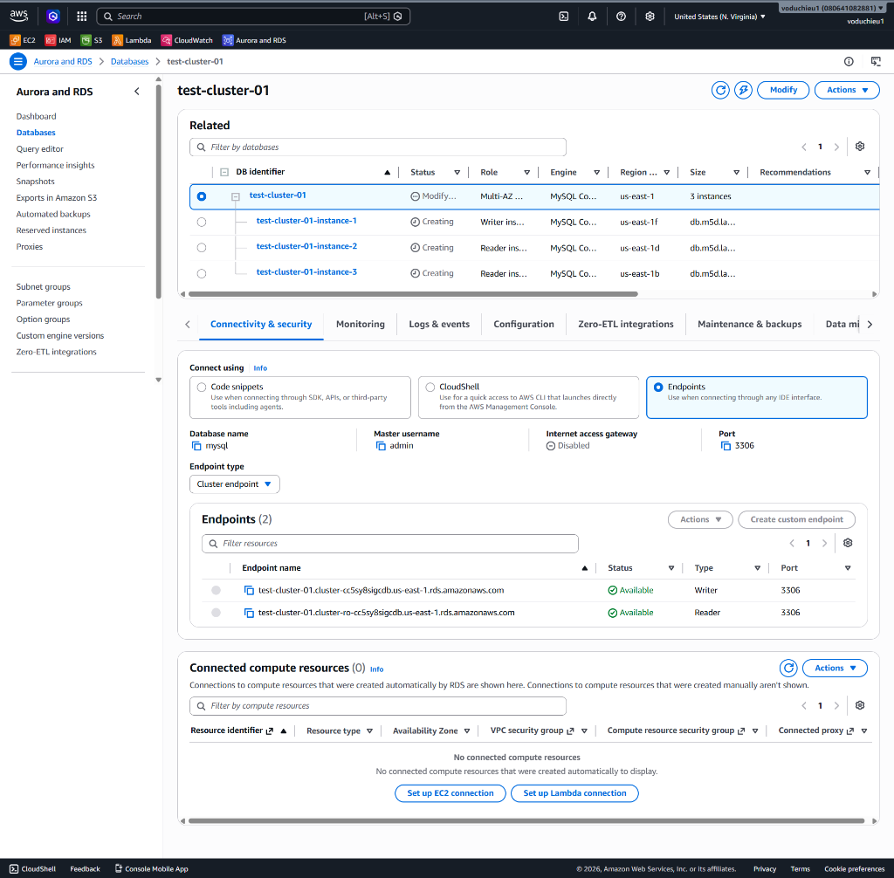
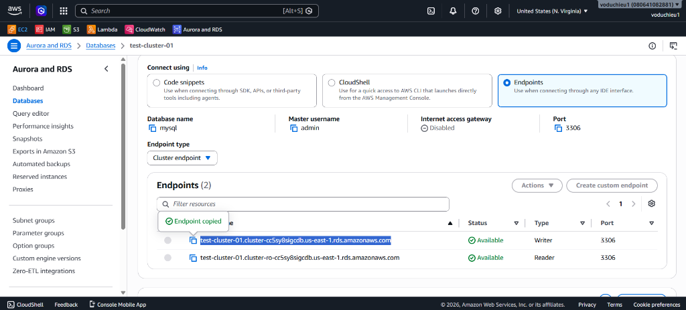

# Amazon RDS Hands-on Lab (RDS DB Cluster)

Bài thực hành này hướng dẫn bạn từng bước khởi tạo một cụm cơ sở dữ liệu quan hệ (**RDS DB Cluster**) sử dụng dịch vụ **Amazon RDS** trên AWS Console. Lab sẽ giúp bạn hiểu rõ cấu trúc của một cụm bao gồm máy chủ ghi (**Writer**) và máy chủ đọc (**Reader**), nguyên tắc quản lý Endpoint ở cấp độ Cluster, và cách kết nối thông qua **Cluster Write Endpoint**.

---

## Các bước thực hiện chi tiết

### Bước 1: Khởi tạo RDS DB Cluster
1. Đăng nhập vào AWS Management Console.
2. Tìm kiếm dịch vụ **RDS** và chọn **Databases** từ menu bên trái.
3. Nhấp vào nút **Create database** màu cam ở góc trên bên phải.
4. Cấu hình các thông số khởi tạo như sau:
   * **Choose a database creation method**: Chọn **Standard create** (hoặc **Full configuration** tùy theo giao diện hiển thị).
   * **Engine options**: Chọn **MySQL** (hoặc **Aurora** tùy theo yêu cầu hệ thống, ở đây lab minh họa với MySQL Community).
   * **Availability Options**: Chọn **Multi-AZ DB cluster** (Khởi tạo một writer instance và hai reader instances trên 3 Availability Zones khác nhau để tối ưu hóa tính sẵn sàng cao và khả năng đọc).
   * **Settings**:
     * **DB cluster identifier**: Đặt tên định danh cho Cluster (ví dụ: `test-cluster-01`).
     * **Master username**: Giữ mặc định `admin`.
     * **Master password**: Thiết lập mật khẩu quản trị cho cụm cơ sở dữ liệu.
   * **Cluster storage configuration**: Chọn loại lưu trữ phù hợp (ví dụ: Aurora Standard hoặc GP3 Cluster).
   * **Instance configuration**: Chọn DB instance class phù hợp (ví dụ dòng `db.m5d.large` hoặc tương đương).
   * Cuộn xuống dưới cùng và nhấp chọn **Create database** để bắt đầu tiến trình khởi tạo Cluster.

---

### Bước 2: Xem danh sách Database và hiểu rõ cơ cấu vai trò (Roles)
Sau khi quá trình khởi tạo hoàn tất, trong danh mục **Databases**, bạn sẽ thấy danh sách cụm cơ sở dữ liệu hiển thị phân cấp như sau:

1. **Cụm tổng thể (Cluster)**: Định danh là `test-cluster-01` có vai trò tổng quan là **Multi-AZ DB cluster** quản lý 3 instances bên dưới.
2. **Writer Instance (Máy chủ Ghi)**: 
   * Tên instance: `test-cluster-01-instance-1`
   * Vai trò (Role): **Writer instance**
   * Vùng khả dụng (AZ): `us-east-1f`
3. **Reader Instances (Máy chủ Chỉ Đọc)**:
   * Tên instance: `test-cluster-01-instance-2` (Role: **Reader instance**, AZ: `us-east-1d`)
   * Tên instance: `test-cluster-01-instance-3` (Role: **Reader instance**, AZ: `us-east-1b`)

> [!IMPORTANT]
> **Lưu ý cực kỳ quan trọng về Endpoint cá nhân (Instance Endpoint):**
> * Dù từng instance đơn lẻ (`instance-1`, `instance-2`, `instance-3`) đều có địa chỉ kết nối (Endpoint) riêng biệt của riêng nó, **chúng ta $\underline{0}$ (KHÔNG) ĐƯỢC dùng các Endpoint riêng lẻ này để kết nối ứng dụng**.
> * **Lý do**: Khi xảy ra sự cố lỗi phần cứng hoặc mất kết nối tại một Availability Zone, AWS sẽ tự động hoán đổi vai trò giữa các instances (ví dụ thăng cấp một Reader lên làm Writer mới). Nếu ứng dụng của bạn cấu hình cứng Endpoint riêng lẻ của instance, kết nối sẽ bị lỗi hoặc ứng dụng sẽ không thể ghi dữ liệu do instance đó đã bị hạ cấp xuống chỉ đọc.

---

### Bước 3: Lấy thông tin Cluster Endpoints và kết nối cơ sở dữ liệu

Để giải quyết vấn đề thay đổi vai trò của các node khi failover, AWS RDS cung cấp hai Endpoint cố định ở cấp độ Cluster tại tab **Connectivity & security**:

1. **Writer Endpoint (Cluster Endpoint)**:
   * **Đặc điểm**: Tự động định tuyến tất cả các kết nối đến instance đang giữ vai trò ghi (**Writer instance** hiện tại).
   * **Sử dụng**: Dành cho ứng dụng của bạn kết nối để thực hiện các câu lệnh ghi và thay đổi dữ liệu (INSERT, UPDATE, DELETE) cũng như các truy vấn đọc.
   * **Ví dụ Endpoint**: `test-cluster-01.cluster-cc5sy8sigcdb.us-east-1.rds.amazonaws.com` (Port 3306)
2. **Reader Endpoint (Cluster Read-Only Endpoint)**:
   * **Đặc điểm**: Tự động chia tải (Load balancing) và định tuyến các kết nối đến tất cả các instance đang có vai trò đọc (**Reader instances**).
   * **Sử dụng**: Dành cho các truy vấn chỉ đọc (SELECT, báo cáo thống kê, slow query) để giảm tải cho Writer instance.
   * **Ví dụ Endpoint**: `test-cluster-01.cluster-ro-cc5sy8sigcdb.us-east-1.rds.amazonaws.com` (Port 3306)

#### Thực hành kết nối thông qua Cluster Write Endpoint:
1. Nhấp chọn Cluster `test-cluster-01`.
2. Tại tab **Connectivity & security**, tìm mục **Endpoints**.
3. Copy địa chỉ **Writer Endpoint** (bấm nút copy bên cạnh địa chỉ endpoint có loại là `Writer`).
4. Mở công cụ Database Client của bạn (ví dụ: DBeaver, MySQL Workbench).
5. Tạo kết nối mới tới MySQL Server:
   * **Host**: Dán địa chỉ **Writer Endpoint** vừa copy.
   * **Port**: `3306`
   * **Username**: `admin`
   * **Password**: Mật khẩu đã thiết lập ở Bước 1.
6. Tiến hành kiểm tra kết nối thành công và thực thi các script SQL CRUD bình thường. Hệ thống sẽ tự động điều phối lệnh ghi của bạn tới instance `test-cluster-01-instance-1` mà không gặp bất cứ trở ngại nào.
