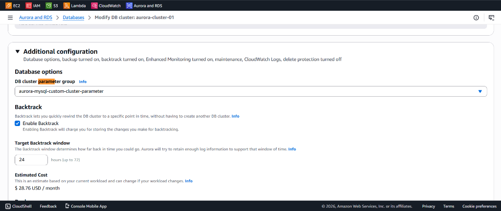
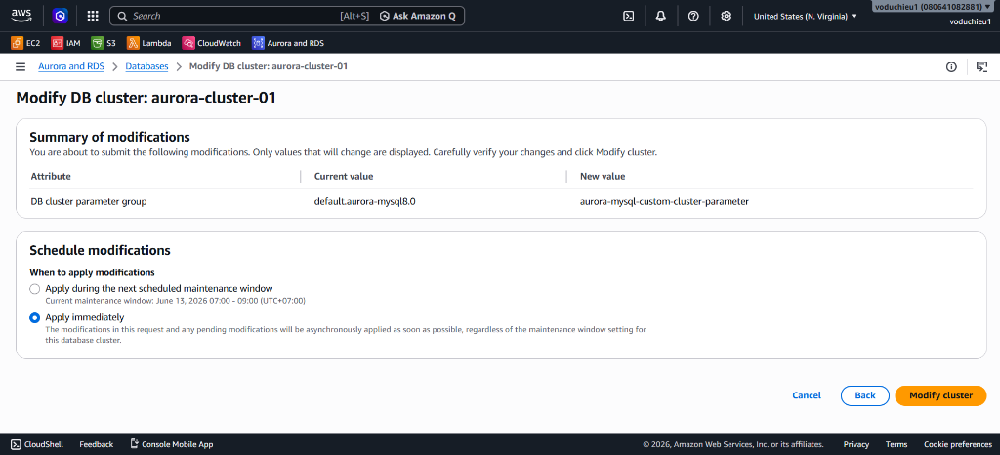
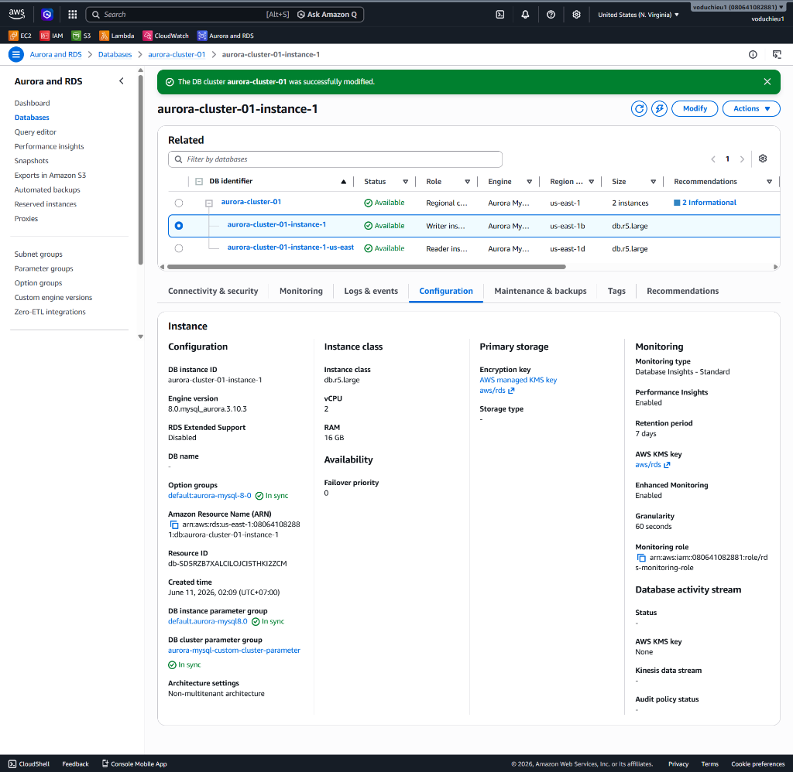
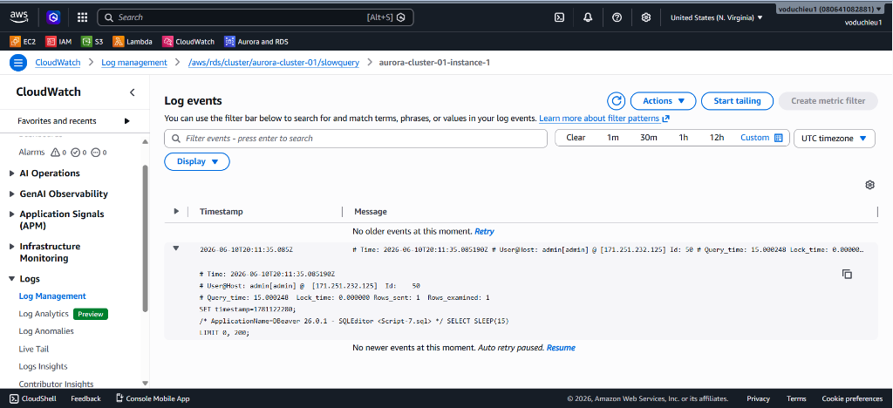

# Amazon RDS Hands-on Lab (Cấu hình Custom Parameter Groups)

Bài thực hành này hướng dẫn bạn cách tạo một **Custom DB Cluster Parameter Group** từ cấu hình mặc định (family `aurora-mysql8.0`), điều chỉnh các tham số tối ưu hóa hiệu năng, dung lượng gói tin và bật ghi nhật ký truy vấn chậm (slow query log). Sau đó, áp dụng Parameter Group này vào cụm cơ sở dữ liệu **Amazon Aurora Cluster** đang chạy và tiến hành kiểm tra trên **CloudWatch Logs**.

---

## Các bước thực hiện chi tiết

### Bước 1: Khởi tạo Custom Parameter Group
1. Truy cập vào AWS Management Console, tìm kiếm và chọn dịch vụ **RDS** (hoặc **Aurora and RDS**).
2. Tại menu điều hướng bên trái, nhấp chọn **Parameter groups**.
3. Nhấp chọn nút **Create parameter group** ở góc trên bên phải.


4. Tại trang **Create parameter group**, nhập các cấu hình chi tiết như sau:
   * **Engine type**: Chọn **Aurora MySQL**.
   * **Parameter group family**: Chọn phiên bản tương ứng, ở đây là **aurora-mysql8.0**.
   * **Type**: Chọn **DB Cluster Parameter Group** (áp dụng cho toàn bộ cụm cluster).
   * **Parameter group name**: Đặt tên dễ nhận diện (ví dụ: `aurora-mysql-custom-cluster-parameter`).
   * **Description**: Nhập mô tả ngắn gọn cho group này.
5. Nhấp chọn nút **Create** ở dưới cùng.


---

### Bước 2: Điều chỉnh các thông số cấu hình
Sau khi tạo thành công, chúng ta cần tiến hành chỉnh sửa các biến cấu hình của Database theo nhu cầu hệ thống:

1. Click vào tên Parameter Group vừa tạo (`aurora-mysql-custom-cluster-parameter`) -> Chọn nút **Edit** (hoặc **Modify**).
2. Lần lượt tìm kiếm các biến và điều chỉnh giá trị của chúng theo bảng bên dưới:

| Tên Parameter | Giá trị thiết lập | Giải thích ý nghĩa |
|---|---|---|
| **`max_connections`** | `100` | Giới hạn tối đa 100 kết nối đồng thời tới cụm Database. |
| **`max_allowed_packet`** | `100000000` | Tăng kích thước gói tin tối đa gửi/nhận lên khoảng 100 MB. |
| **`long_query_time`** | `0.5` | Ngưỡng xác định slow query là từ 0.5 giây trở lên. |
| **`slow_query_log`** | `1` | Kích hoạt (Bật) tính năng ghi nhật ký các truy vấn chậm. |


3. Sau khi chỉnh sửa xong các giá trị, nhấp chọn **Save Changes** ở góc trên cùng bên phải để lưu cấu hình.

---

### Bước 3: Áp dụng Parameter Group vào DB Cluster
1. Tại menu điều hướng bên trái, nhấp chọn **Databases**.
2. Tìm và tích chọn vào cụm **DB Cluster** tổng (Regional cluster), ví dụ: `aurora-cluster-01`.
3. Nhấp chọn nút **Modify** ở thanh công cụ phía trên.


4. Cuộn xuống phần cấu hình **Additional configuration** (Cấu hình bổ sung):
   * Tại mục **DB cluster parameter group**, đổi từ default sang **`aurora-mysql-custom-cluster-parameter`** (Group vừa tạo).



5. Nhấp chọn **Continue** ở cuối trang.
6. Tại trang xác nhận **Summary of modifications**:
   * Kiểm tra thông số thay đổi từ `default.aurora-mysql8.0` sang `aurora-mysql-custom-cluster-parameter`.
   * Tích chọn **Apply immediately** (Áp dụng ngay lập tức) để áp dụng cấu hình này trực tiếp cho cụm database.
   * Click **Modify cluster**.



7. Quay trở lại màn hình danh sách cơ sở dữ liệu, chọn instance Writer (ví dụ: `aurora-cluster-01-instance-1`), chuyển sang tab **Configuration** và kiểm tra trạng thái mục **DB cluster parameter group** chuyển sang trạng thái **`In sync`**.



---

### Bước 4: Kiểm tra và xác thực Slow Query Log trên CloudWatch
1. Mở Database Client (như DBeaver) đã kết nối tới Endpoint của Writer Instance.
2. Thực thi một câu lệnh truy vấn chạy chậm giả lập (vượt quá ngưỡng `long_query_time = 0.5` đã thiết lập ở Bước 2):
   ```sql
   SELECT SLEEP(15);
   ```
3. Truy cập vào AWS Management Console, tìm kiếm dịch vụ **CloudWatch**.
4. Tại menu bên trái, nhấp chọn **Logs** -> **Log groups**.
5. Tìm kiếm và click chọn Log group của cụm cluster: `/aws/rds/cluster/aurora-cluster-01/slowquery`.
6. Chọn Log stream tương ứng với máy chủ Writer (`aurora-cluster-01-instance-1`).
7. **Kết quả**: Bạn sẽ thấy sự kiện ghi nhận câu lệnh `SELECT SLEEP(15)` cùng thông tin chi tiết về User, Host, Query_time (15.000248 giây), Lock_time... được CloudWatch ghi nhận chính xác.


