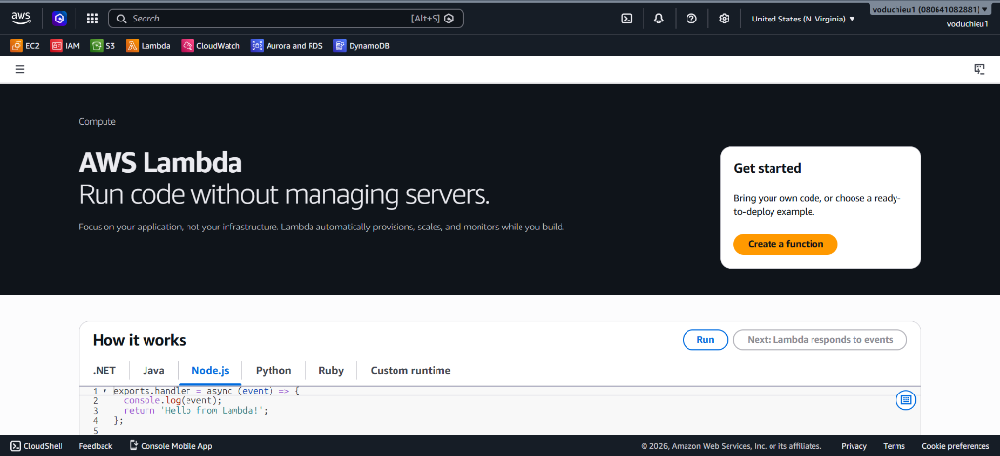
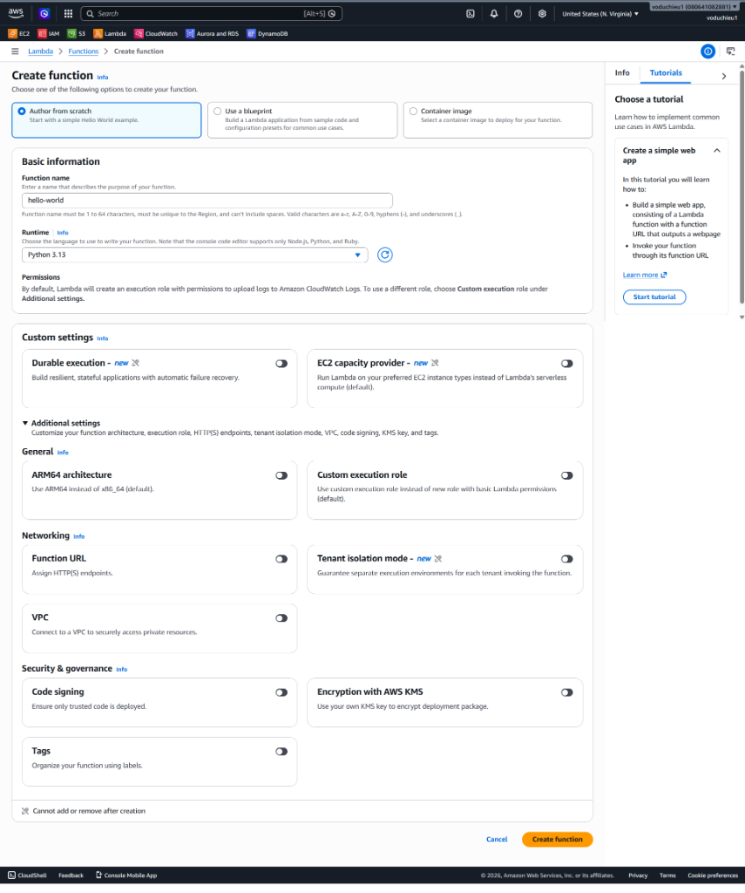
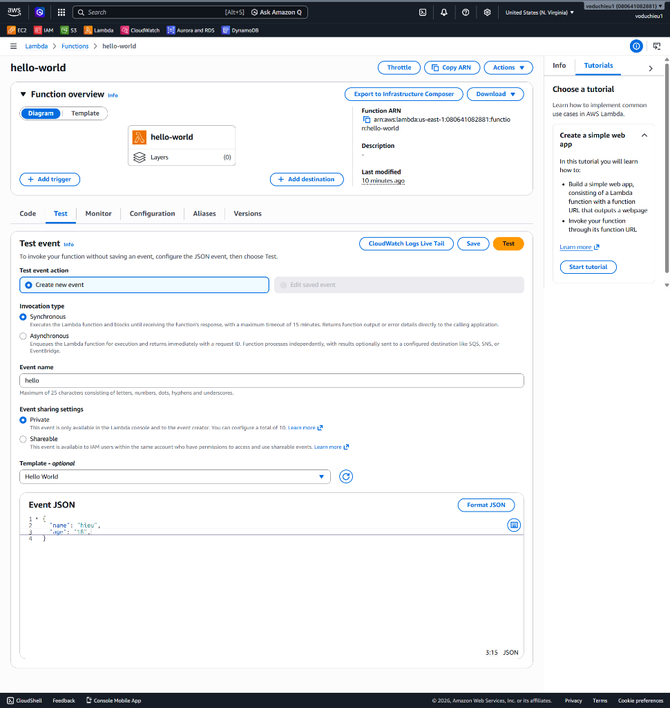
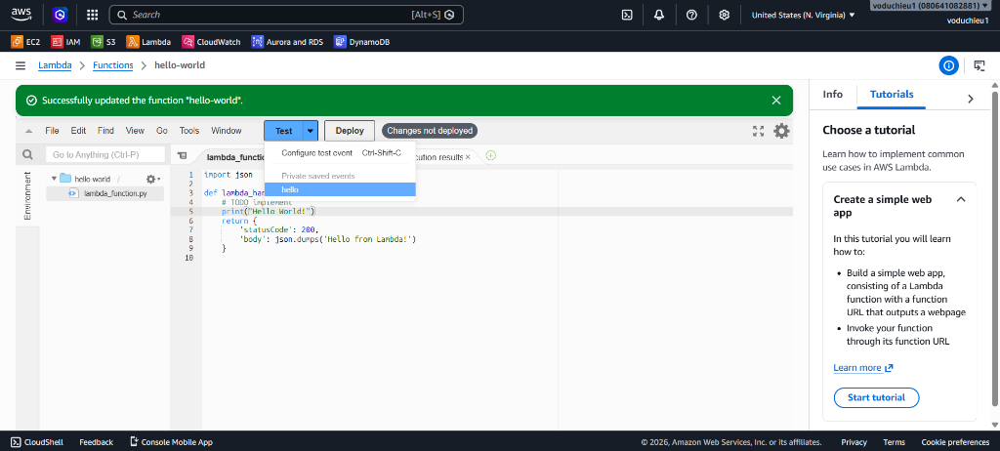
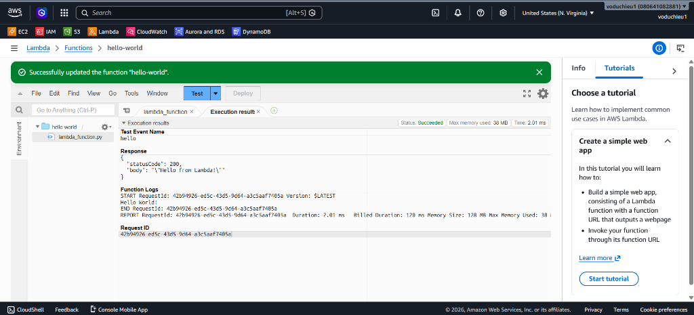

# 1. Hello Lambda (Làm quen với AWS Lambda Console)

Bài thực hành này hướng dẫn bạn từng bước khởi tạo, cấu hình sự kiện kiểm thử (Test Event), viết mã nguồn và thực thi một hàm **AWS Lambda Function** cơ bản sử dụng giao diện quản trị **AWS Management Console**.

---

## I. Mục tiêu bài Lab
* Làm quen với giao diện AWS Lambda Console.
* Khởi tạo thành công một Lambda function đơn giản bằng ngôn ngữ **Python**.
* Cấu hình sự kiện kiểm thử (**Test Event**) để chạy thử hàm.
* Thực thi hàm và kiểm tra kết quả (Response, logs, metrics).

---

## II. Các bước thực hiện chi tiết

### Bước 1: Khởi tạo Lambda Function đơn giản

1. Đăng nhập vào **AWS Management Console**.
2. Tìm kiếm và chọn dịch vụ **Lambda** trên thanh tìm kiếm để truy cập Lambda Dashboard.
3. Nhấp chọn nút **Create function** (Tạo hàm) ở khu vực **Get started**.

<p align="center">
  
</p>

4. Tại trang cấu hình tạo hàm:
   * Chọn tùy chọn **Author from scratch** (Tự xây dựng từ đầu).
   * **Function name** (Tên hàm): Nhập `hello-world`.
   * **Runtime** (Môi trường chạy): Chọn **Python 3.13** (hoặc phiên bản Python mới nhất có sẵn).
   * Các thiết lập khác giữ nguyên cấu hình mặc định (AWS sẽ tự động tạo một IAM Execution Role cơ bản để ghi log lên CloudWatch).
5. Nhấp nút **Create function** ở dưới cùng bên phải. Đợi vài giây để AWS hoàn tất thiết lập tài nguyên.

<p align="center">
  
</p>

---

### Bước 2: Tạo sự kiện kiểm thử (Create Test Event)

Vì Lambda chạy serverless không có giao diện tương tác trực tiếp, chúng ta cần cấu hình một Test Event giả lập sự kiện gửi payload đến hàm:

1. Tại giao diện quản lý hàm `hello-world`, chọn tab **Test**.
2. Thiết lập thông số:
   * **Test event action**: Chọn **Create new event**.
   * **Event name**: Nhập `hello`.
   * **Event sharing settings**: Chọn `Private` (chỉ bạn mới có quyền chạy test này).
   * **Template - optional**: Chọn `Hello World`.
   * **Event JSON**: Bạn có thể tùy chỉnh JSON gửi đi, ví dụ:
     ```json
     {
       "name": "hieu",
       "age": "18"
     }
     ```
3. Nhấp nút **Save** ở phía trên bên phải để lưu cấu hình sự kiện kiểm thử.

<p align="center">
  
</p>

---

### Bước 3: Viết mã nguồn Python và Deploy

1. Quay trở lại tab **Code**.
2. Nhấp đúp mở file `lambda_function.py` trong trình soạn thảo code tích hợp và thay thế nội dung bằng đoạn mã nguồn Python đơn giản dưới đây:
   ```python
   import json

   def lambda_handler(event, context):
       # In dòng chữ "Hello World!" ra log group
       print("Hello World!")
       
       # Trả về mã trạng thái 200 kèm phản hồi
       return {
           'statusCode': 200,
           'body': json.dumps('Hello from Lambda!')
       }
   ```
3. Trong menu xổ xuống bên cạnh nút **Test**, chọn sự kiện kiểm thử `hello` vừa tạo ở Bước 2.
4. **Lưu ý cực kỳ quan trọng**: Mỗi khi sửa đổi mã nguồn hoặc cấu hình, bạn bắt buộc phải nhấp nút **Deploy** để lưu và đẩy phiên bản code mới nhất lên đám mây AWS trước khi tiến hành chạy kiểm thử.

<p align="center">
  
</p>

---

### Bước 4: Thực thi kiểm thử và Kiểm tra kết quả

1. Nhấp nút **Test** để kích hoạt hàm Lambda.
2. Tab **Execution result** (Kết quả thực thi) sẽ hiển thị ngay lập tức trong bảng điều khiển phía dưới:
   * **Status**: `Succeeded` (Trạng thái chạy thành công có màu xanh lá cây).
   * **Response**: Trả về đúng dữ liệu phản hồi được cấu hình trong hàm (`'statusCode': 200`, `'body': '"Hello from Lambda!"'`).
   * **Function Logs**:
     - Dòng log `Hello World!` do hàm `print("Hello World!")` in ra hiển thị rõ ràng.
     - Các thông số vận hành như: *Duration* (Thời gian thực hiện thực tế), *Billed Duration* (Thời gian tính tiền), *Max Memory Used* (Dung lượng bộ nhớ tiêu thụ lớn nhất).

<p align="center">
  
</p>

---

* **Bài trước**: [7. AWS Lambda Use Cases (Các trường hợp sử dụng thực tế)](../../services/7.%20AWS%20Lambda/7.%20AWS%20Lambda%20Use%20Cases.md)
* **Bài tiếp theo**: [2. AWS Lambda Hands-on Lab(Resize Image on S3) (Lab Resize ảnh trên S3)](../../services/7.%20AWS%20Lambda/9.%20AWS%20Lambda%20Hands-on%20Lab%28Resize%20Image%20on%20S3%29.md)
