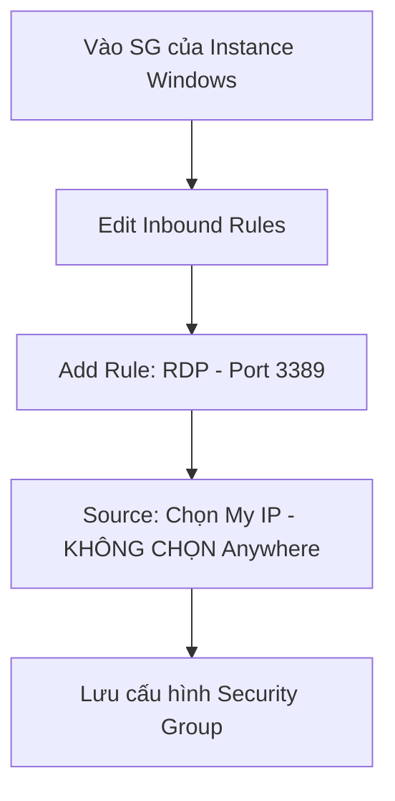

# Hướng Dẫn Thực Hành: Tạo EC2 Sử Dụng Windows Server (RDP Connect)

Tài liệu này cung cấp hướng dẫn từng bước chi tiết (step-by-step) để khởi tạo một máy chủ ảo EC2 chạy hệ điều hành **Windows Server 2022 Base**, cấu hình tường lửa bảo mật, giải mã mật khẩu mặc định và tiến hành kết nối quản trị từ xa bằng giao thức Remote Desktop (RDP).

---

## 1. Khởi Tạo EC2 Instance Từ AMI Windows Server 2022 Base

Để khởi tạo máy chủ ảo Windows Server:
1.  Truy cập vào **AWS Management Console** -> Chọn dịch vụ **EC2**.
2.  Nhấp chọn nút **Launch Instance**.
3.  **Cấu hình thông tin cơ bản**:
    *   **Name**: Đặt tên cho instance (ví dụ: `My-Windows-Server`).
    *   **Application and OS Images (AMI)**: Tìm kiếm và chọn **Microsoft Windows Server 2022 Base** (đảm bảo nhãn *Free Tier eligible*).
    *   **Instance Type**: Chọn dòng miễn phí `t2.micro` hoặc `t3.micro` tùy thuộc vào Region của bạn.
    *   **Key pair (login)**: Chọn lại Key Pair đã tạo từ bài thực hành trước (ví dụ: `my-ec2-key.pem`).
4.  **Cấu hình ổ cứng (Storage - Lưu ý quan trọng)**:
    *   AWS mặc định cấu hình dung lượng ổ đĩa cho Windows Server là **30 GiB** (loại ổ đĩa GP3).
    *    **Lưu ý**: Khác với Linux có thể hoạt động với 8 GiB, hệ điều hành Windows Server yêu cầu dung lượng ổ đĩa tối thiểu là **30 GiB** để có thể boot hệ thống và hoạt động bình thường. Không giảm dung lượng cấu hình này xuống dưới 30 GiB.
5.  Nhấp chọn **Launch Instance** ở góc dưới bên phải để bắt đầu quá trình tạo máy ảo. Quá trình boot và chuẩn bị hệ thống Windows ban đầu thường mất từ 3 đến 5 phút.

---

## 2. Cấu Hình Security Group Cho Phép Kết Nối RDP

Để có thể truy cập vào giao diện đồ họa của Windows Server, bạn cần mở cổng kết nối từ xa.

1.  Tại danh sách EC2 Instance, nhấp vào tên Instance Windows vừa tạo.
2.  Chọn tab **Security** phía dưới -> Nhấp vào liên kết của **Security Group** đang được gắn vào Instance.
3.  Tại giao diện chi tiết của Security Group, chọn tab **Inbound rules** -> Nhấp chọn **Edit inbound rules**.
4.  Tiến hành thêm (Add) 1 luật truy cập như sau:
    *   **Rule (Cho phép kết nối Remote Desktop)**:
        *   *Type*: Chọn **RDP** (Cổng mặc định: 3389).
        *   *Source*: Chọn **My IP** (AWS tự động điền địa chỉ IPv4 hiện tại của mạng internet của bạn).
5.  Nhấp chọn **Save rules** để lưu lại.

> [!IMPORTANT]
> **LƯU Ý BẢO MẬT CỰC KỲ QUAN TRỌNG:**
> Không bao giờ được cấu hình nguồn (Source) của các cổng quản trị nhạy cảm như **RDP (3389)** hoặc **SSH (22)** là Anywhere (`0.0.0.0/0`). Việc mở rộng cổng này cho toàn bộ Internet sẽ khiến máy chủ của bạn trở thành mục tiêu của các cuộc tấn công Brute Force tự động dò quét mật khẩu từ các botnet bên ngoài. Luôn giới hạn nguồn là **My IP** (địa chỉ IP nhà/văn phòng của bạn) hoặc một dải IP tin cậy cụ thể.

---

## 3. Giải Mã Mật Khẩu Administrator Và Kết Nối Remote Desktop

AWS thiết lập bảo mật bằng cách mã hóa mật khẩu đăng nhập ban đầu của tài khoản quản trị viên (`Administrator`) bằng Public Key của cặp khóa bạn đã chọn lúc tạo máy ảo. Do đó, bạn cần sử dụng Private Key tương ứng để giải mã lấy mật khẩu.

### Bước 1: Lấy mật khẩu đăng nhập từ AWS
1.  Tại giao diện EC2 Console, tích chọn máy chủ Windows đang ở trạng thái `Running`.
2.  Nhấp chọn nút **Connect** ở góc trên.
3.  Chuyển sang tab **RDP client**.
4.  Nhấp chọn nút **Get password** màu xanh.
5.  Nhấp nút **Upload private key file** -> Tìm và chọn tệp tin `.pem` đã lưu trên máy tính của bạn (tệp tin `my-ec2-key.pem` tạo ở bài thực hành Linux).
6.  Sau khi khóa được tải lên, nhấp chọn nút **Decrypt password**.
7.  AWS sẽ hiển thị các thông tin kết nối gồm:
    *   **Public IP / Public DNS**
    *   **Username**: `Administrator` (Mặc định).
    *   **Password**: Chuỗi mật khẩu ngẫu nhiên đã được giải mã (Sao chép lại chuỗi mật khẩu này ra bộ nhớ tạm).

### Bước 2: Kết nối Remote Desktop từ máy tính cá nhân
1.  Trên máy tính Windows cá nhân của bạn, mở công cụ tìm kiếm và gõ **Remote Desktop Connection** (hoặc nhấn tổ hợp phím `Windows + R` -> Gõ `mstsc` -> Nhấn `Enter`).
2.  Tại ô **Computer**, dán địa chỉ **Public IPv4** của máy chủ EC2 Windows.
3.  Nhấp chọn nút **Connect**.
4.  Khi bảng yêu cầu thông tin đăng nhập hiện ra:
    *   **Username**: Nhập `Administrator`.
    *   **Password**: Dán chuỗi mật khẩu đã giải mã được sao chép ở Bước 1.
5.  Nếu hiện thông báo cảnh báo về chứng chỉ bảo mật (Certificate Warning), tích chọn *Don't ask me again for connections to this computer* và nhấn **Yes** để đồng ý kết nối.
6.  Màn hình Windows Server 2022 trên đám mây AWS sẽ hiển thị đầy đủ giao diện đồ họa và bạn có thể bắt đầu thao tác quản trị trực tiếp trên máy chủ.
