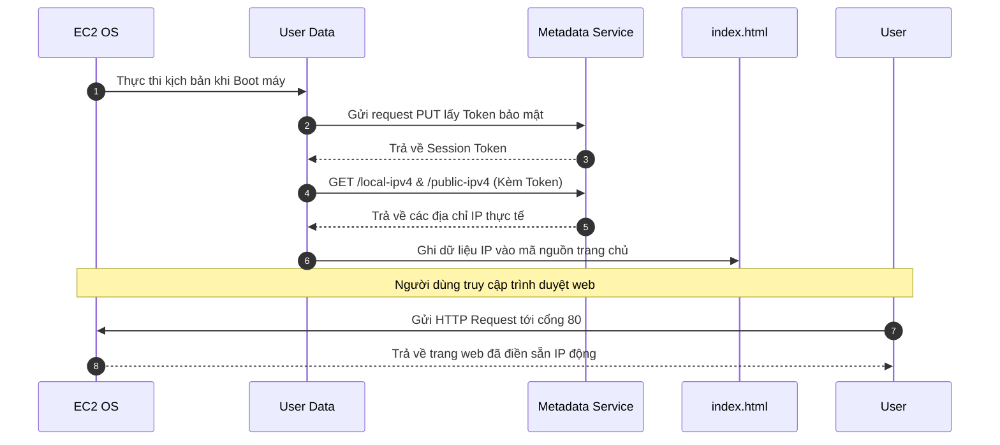

# Hướng Dẫn Thực Hành: Tự Động Hóa Bằng User Data Và Truy Xuất Metadata

Tài liệu này cung cấp hướng dẫn từng bước chi tiết (step-by-step) để tự động hóa hoàn toàn quy trình khởi chạy một máy chủ EC2 trống, tự động cài đặt phần mềm máy chủ Apache thông qua **User Data** và kết hợp truy xuất dữ liệu động **Private/Public IP** từ dịch vụ **Instance Metadata (IMDSv2)** để hiển thị trực tiếp lên trang web tĩnh.

---

## 1. Các bước thực hiện

### Bước 1: Khởi tạo EC2 Instance và cấu hình User Data

1.  Truy cập vào **AWS Management Console** -> Chọn dịch vụ **EC2**.
2.  Nhấp chọn nút **Launch Instance**.
3.  **Cấu hình thông tin cơ bản**:
    *   **Name**: Đặt tên cho instance (ví dụ: `My-Automated-Web-Server`).
    *   **Application and OS Images (AMI)**: Chọn **Amazon Linux 2 AMI** (Free Tier eligible).
    *   **Instance Type**: Chọn `t2.micro` (hoặc `t3.micro` tùy theo Region).
    *   **Key pair**: Chọn cặp khóa `.pem` đã tạo của bạn.
    *   **Network Settings**: Chọn Security Group đã cấu hình mở cổng **HTTP (80)** và **SSH (22)** chỉ từ địa chỉ IP cá nhân của bạn (My IP).
4.  **Cấu hình kịch bản tự động hóa (User Data)**:
    *   Cuộn xuống dưới cùng và nhấp chọn mục **Advanced Details** để mở rộng cấu hình chuyên sâu.
    *   Cuộn xuống trường cấu hình **User data** ở cuối cùng.
    *   Sao chép toàn bộ đoạn script Bash dưới đây và dán (paste) vào ô nhập liệu:

```bash
#!/bin/bash
# 1. Cài đặt Apache Web Server và khởi động dịch vụ
yum install httpd -y
service httpd start
chkconfig httpd on

# 2. Di chuyển vào thư mục gốc của trang web
cd /var/www/html
echo "<html>" > index.html

# 3. Tạo cấu trúc trang web cơ bản
echo "<h1>Welcome to AWS</h1>" >> index.html
echo "<h4>You are running instance from this IP (For debug only!!!!Do not public this to user):</h4>" >> index.html

# 4. Sử dụng IMDSv2 để lấy Session Token bảo mật (thời gian sống 6 tiếng)
export TOKEN=`curl -X PUT "http://169.254.169.254/latest/api/token" -H "X-aws-ec2-metadata-token-ttl-seconds: 21600"`

# 5. Truy xuất Private IP từ Metadata và ghi vào trang web
echo "<br>Private IP: " >> index.html
curl -H "X-aws-ec2-metadata-token: $TOKEN" -v http://169.254.169.254/latest/meta-data/local-ipv4 >> index.html

# 6. Truy xuất Public IP từ Metadata và ghi vào trang web
echo "<br>Public IP: " >> index.html
curl -H "X-aws-ec2-metadata-token: $TOKEN" -v http://169.254.169.254/latest/meta-data/public-ipv4 >> index.html 

echo "</html>" >> index.html
```

> [!NOTE]
> *Lưu ý về cú pháp lệnh*: Đoạn script sử dụng câu lệnh `chkconfig httpd on` để tương thích tốt với cấu hình dịch vụ trên nền tảng Amazon Linux 2. Các lệnh truy xuất metadata hoàn toàn tuân thủ tiêu chuẩn bảo mật **IMDSv2** (yêu cầu tạo Token trước khi GET dữ liệu).

5.  Nhấp chọn **Launch Instance** ở góc dưới bên phải để khởi chạy máy chủ ảo.

---

## 2. Kiểm tra kết quả thực tế

Sau khi máy chủ chuyển sang trạng thái hoạt động:

1.  Tại danh sách **EC2 Instances**, tìm máy chủ `My-Automated-Web-Server` vừa khởi chạy.
2.  Sao chép địa chỉ **Public IPv4 address** của máy chủ này.
3.  Mở trình duyệt web của bạn và truy cập vào địa chỉ IP trên bằng giao thức HTTP:
    ```text
    http://<IP_PUBLIC_CUA_EC2>
    ```
4.  **Quan sát kết quả hiển thị trên trình duyệt**:
    *   Trang web sẽ hiển thị câu chào mặc định.
    *   Hiển thị dòng chữ cảnh báo debug.
    *   Hai dòng địa chỉ **Private IP** và **Public IP** của máy ảo sẽ được hệ thống điền động tự động (lấy trực tiếp từ metadata của máy chủ).



Nếu trang web của bạn hiển thị đúng cấu trúc và tải được các địa chỉ IP, quá trình cấu hình tự động bằng User Data và tương tác Metadata đã hoàn tất thành công.
