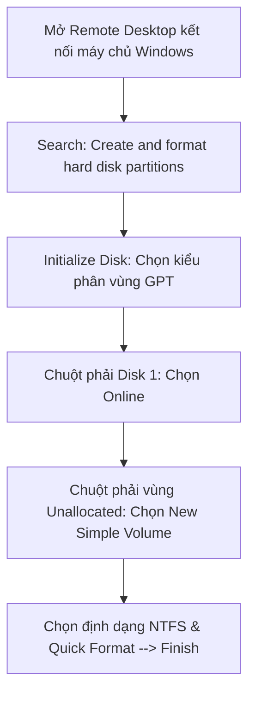

# Hướng Dẫn Thực Hành: Thêm Ổ Cứng Ngoài (EBS Volume) Cho Máy Chủ Windows Server

Tài liệu này cung cấp hướng dẫn từng bước chi tiết (step-by-step) để tạo thêm một ổ đĩa cứng ảo (EBS Volume) ngoài, gắn kết kết nối (Attach) vào máy chủ ảo EC2 chạy hệ điều hành Windows Server, và tiến hành kích hoạt phân vùng đĩa bằng công cụ đồ họa **Disk Management** của Windows để lưu trữ dữ liệu thực tế.

---

## 1. Quy Trình Tạo Và Gắn Ổ Đĩa EBS Volume Phụ

### Bước 1: Kiểm tra Availability Zone (Phân vùng sẵn sàng) của EC2
Mỗi ổ cứng EBS Volume chỉ có thể kết nối với máy chủ EC2 nằm trong cùng một phân vùng vật lý (Availability Zone - AZ). Do đó, bạn cần kiểm tra chính xác vùng chạy của instance trước khi tạo đĩa cứng.

1.  Truy cập **AWS Management Console** -> Dịch vụ **EC2** -> Chọn mục **Instances** ở menu bên trái.
2.  Nhấp vào tên máy chủ Windows Server đang hoạt động của bạn.
3.  Chọn tab **Networking** ở giao diện chi tiết phía dưới.
4.  Tại dòng **Availability zone**, ghi nhớ chính xác phân vùng đang chạy (ví dụ: `ap-southeast-1a`).

### Bước 2: Tạo EBS Volume mới trên AWS
1.  Tại menu quản trị bên trái của dịch vụ EC2, tìm mục **Elastic Block Store** -> Nhấp chọn **Volumes**.
2.  Nhấp chọn nút **Create Volume** ở góc trên bên phải.
3.  **Cấu hình thông số ổ đĩa**:
    *   **Volume type**: Lựa chọn thế hệ mới **General Purpose SSD (gp3)**.
    *   **Size**: Nhập dung lượng cần thêm (ví dụ: `10` GiB).
    *   **Availability Zone**:  **LƯU Ý CỰC KỲ QUAN TRỌNG**: Nhấp chọn chính xác phân vùng AZ của instance bạn vừa kiểm tra ở *Bước 1* (ví dụ: `ap-southeast-1a`). Nếu chọn sai vùng, bạn sẽ không thể kết nối ổ cứng này tới máy ảo.
4.  Nhấp chọn nút **Create Volume** ở dưới cùng.

### Bước 3: Gắn Volume vừa tạo vào EC2 Instance (Attach Volume)
1.  Tại danh sách Volumes, tích chọn ổ cứng `10` GiB mới tạo (Trạng thái ổ đĩa lúc này là `Available` - Đang rảnh).
2.  Nhấp chọn menu **Actions** ở góc phải -> Chọn **Attach Volume**.
3.  **Cấu hình kết nối**:
    *   **Instance**: Nhấp chọn máy chủ Windows Server của bạn trong danh sách gợi ý.
    *   **Device name**: Giữ nguyên tên thiết bị ảo mặc định do AWS cấp phát.
4.  Nhấp chọn nút **Attach Volume**. Trạng thái ổ đĩa sẽ chuyển sang màu xanh dương `in-use` (Đang sử dụng).

---

## 2. Kích Hoạt Và Định Dạng Phân Vùng Trên Hệ Điều Hành Windows Server

Sau khi ổ đĩa vật lý ảo được gắn qua hạ tầng mạng AWS, bạn cần RDP vào trong máy chủ Windows để khai báo và định dạng phân vùng thì hệ điều hành mới có thể sử dụng ổ đĩa này.

### Bước 1: Kết nối Remote Desktop vào máy chủ
Sử dụng công cụ **Remote Desktop Connection (`mstsc`)**, kết nối vào máy chủ Windows của bạn bằng tài khoản `Administrator` và mật khẩu đã giải mã được từ khóa `.pem` của bạn.

### Bước 2: Mở công cụ quản lý đĩa (Disk Management)
1.  Tại màn hình desktop của Windows Server, nhấp vào biểu tượng **Search** (Kính lúp) ở thanh Taskbar hoặc nhấn phím **Windows**.
2.  Nhập cụm từ tìm kiếm: `Create and format hard disk partitions` và nhấn **Enter**.
3.  Hệ thống sẽ mở ra cửa sổ công cụ quản lý đĩa **Disk Management**.

### Bước 3: Khởi tạo ổ đĩa mới (Initialize Disk)
1.  Khi vừa mở Disk Management, hệ thống sẽ tự động phát hiện ổ đĩa mới và hiển thị hộp thoại thông báo **Initialize Disk** (Khởi tạo đĩa cứng).
2.  Chọn kiểu phân vùng: Tích chọn **GPT (GUID Partition Table)**.
3.  Nhấp chọn **OK** để xác nhận.

### Bước 4: Kích hoạt ổ đĩa (Online Volume)
1.  Quan sát phần hiển thị các thanh ổ đĩa ở nửa dưới của giao diện. Bạn sẽ thấy **Disk 1** (dung lượng 10.00 GB) có sọc đen và nhãn là **Unallocated** (Chưa được phân vùng).
2.  Nếu nhãn trạng thái của đĩa hiển thị là *Offline*, nhấp chuột phải vào vùng chữ nhật ghi tên đĩa (**Disk 1**) ở cột ngoài cùng bên trái -> Chọn **Online**.

### Bước 5: Tạo phân vùng mới và định dạng đĩa (New Simple Volume)
1.  Nhấp chuột phải vào thanh biểu đồ sọc đen có nhãn **Unallocated** của **Disk 1** -> Chọn **New Simple Volume...**.
2.  Trình hướng dẫn **New Simple Volume Wizard** hiện ra, nhấp chọn **Next**.
3.  **Specify Volume Size**: Giữ nguyên dung lượng tối đa mặc định -> Nhấp chọn **Next**.
4.  **Assign Drive Letter**: Lựa chọn ký tự gán cho ổ đĩa mới của bạn (ví dụ: ổ `D:` hoặc ổ `E:`) -> Nhấp chọn **Next**.
5.  **Format Partition**: Thiết lập các thông số định dạng:
    *   *File system*: Chọn hệ thống tệp tin **NTFS** (Mặc định cho Windows).
    *   *Allocation unit size*: Chọn *Default*.
    *   *Volume label*: Đặt tên gợi nhớ cho ổ đĩa (ví dụ: `DataVolume`).
    *   Tích chọn **Perform a quick format** (Định dạng nhanh).
6.  Nhấp chọn **Next** -> Xem lại cấu hình tổng hợp và nhấp chọn **Finish** để hoàn tất.

### Bước 6: Xác nhận kết quả
Thanh biểu đồ của **Disk 1** sẽ chuyển sang màu xanh dương cùng trạng thái **Healthy (Primary Partition)**.

Bây giờ, bạn mở trình quản lý tệp tin **File Explorer** -> Chọn thư mục **This PC**. Ổ cứng mới `DataVolume (E:)` dung lượng 10 GB đã hiển thị sẵn sàng cho việc đọc, ghi dữ liệu của ứng dụng của bạn.
