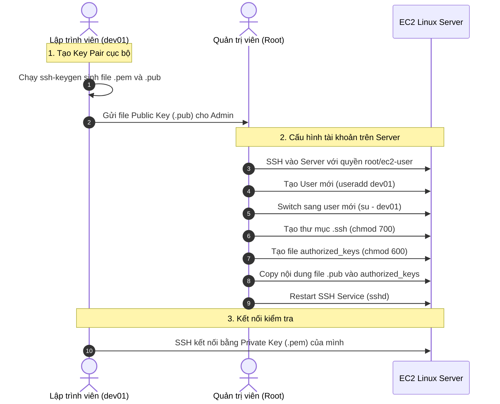

# Hướng Dẫn Thực Hành: Thêm Khóa SSH Của Thành Viên (Member SSH) Vào EC2

Tài liệu này cung cấp hướng dẫn từng bước chi tiết (step-by-step) để cấp quyền truy cập máy chủ EC2 cho một thành viên mới trong dự án (ví dụ: lập trình viên `dev01`) bằng cách khởi tạo cặp khóa bảo mật SSH riêng, tạo tài khoản người dùng không có mật khẩu trực tiếp trên Linux Server, và cấu hình phân quyền thư mục SSH bảo mật.

---

## 1. Quy Trình Các Bước Thực Hiện



---

### Bước 1: Tạo cặp khóa SSH Key Pair cho thành viên (Thực hiện trên máy cá nhân)

Lập trình viên mới (`dev01`) sẽ mở Command Prompt, PowerShell hoặc Terminal trên máy tính cá nhân của mình và chạy lệnh sau để sinh cặp khóa bảo mật (khóa RSA 4096-bit):

```bash
ssh-keygen -t rsa -b 4096 -C "dev01"
```
*Hệ thống sẽ hỏi nơi lưu tệp tin, bạn có thể nhấn Enter để chọn mặc định hoặc đặt tên tệp tin cụ thể (ví dụ: `dev01_key`). Quá trình này sẽ tạo ra 2 tệp tin*:
1.  **File Private Key** (`dev01_key`): Cất giữ cẩn thận trên máy cá nhân để kết nối, tuyệt đối không gửi cho ai.
2.  **File Public Key** (`dev01_key.pub`): **Gửi tệp tin này cho Quản trị viên (Admin)** để nạp vào máy chủ.

---

### Bước 2: Tạo tài khoản người dùng mới trên EC2 (Admin thực hiện)

Quản trị viên SSH vào máy chủ bằng tài khoản mặc định (`ec2-user`) và tiến hành tạo tài khoản mới:

```bash
sudo useradd dev01
```
*( **Lưu ý**: Lệnh này tạo tài khoản người dùng `dev01` nhưng không thiết lập mật khẩu trực tiếp. Việc đăng nhập của tài khoản này sẽ phụ thuộc hoàn toàn vào khóa SSH ở các bước tiếp theo để tăng cường bảo mật).*

---

### Bước 3: Chuyển ngữ cảnh sang tài khoản người dùng mới
Quản trị viên chuyển quyền sang user `dev01` để cấu hình thư mục cá nhân:

```bash
sudo su - dev01
```
Kiểm tra đường dẫn thư mục hiện tại để chắc chắn bạn đã đứng ở thư mục gốc của user:
```bash
pwd
```
*(Kết quả trả ra chính xác phải là: `/home/dev01`).*

---

### Bước 4: Tạo thư mục cấu hình SSH an toàn
Thư mục `.ssh` cần được khởi tạo với quyền truy cập cực kỳ hạn chế để hệ thống bảo mật SSH chấp nhận:

```bash
mkdir .ssh
chmod 700 .ssh
```
*(Quyền `700` đảm bảo chỉ có duy nhất user `dev01` mới có quyền đọc, viết và truy cập thư mục này).*

---

### Bước 5: Tạo tệp tin lưu trữ khóa công cộng (Authorized Keys)
Tạo tệp tin chứa danh sách các khóa công cộng được phép truy cập và thiết lập phân quyền:

```bash
touch .ssh/authorized_keys
chmod 600 .ssh/authorized_keys
```
*(Quyền `600` đảm bảo chỉ duy nhất user `dev01` mới có quyền đọc và viết tệp tin này).*

---

### Bước 6: Nạp nội dung Public Key của thành viên
1.  Mở tệp tin `authorized_keys` bằng trình soạn thảo văn bản `vi`:
    ```bash
    vi .ssh/authorized_keys
    ```
2.  Nhấn phím **`i`** để bắt đầu chế độ soạn thảo (Insert).
3.  Mở tệp tin công cộng `dev01_key.pub` trên máy tính cá nhân của lập trình viên, sao chép (copy) toàn bộ nội dung văn bản bên trong (thường bắt đầu bằng chuỗi `ssh-rsa AAAA... dev01`).
4.  Dán (paste) nội dung khóa công cộng đó vào cửa sổ trình soạn thảo trên server.
5.  Nhấn phím **`Esc`**, gõ **`:wq`** và nhấn **`Enter`** để lưu lại và thoát ra.

---

### Bước 7: Khởi động lại dịch vụ SSH (Thực hiện với quyền Root)
Trở lại quyền của quản trị viên (gõ lệnh `exit` để thoát khỏi user `dev01`), sau đó thực hiện khởi động lại dịch vụ SSH daemon để áp dụng cấu hình phân quyền mới:

```bash
sudo service sshd restart
```
*(Đối với các hệ điều hành mới hơn sử dụng systemd, bạn có thể dùng lệnh: `sudo systemctl restart sshd`).*

---

### Bước 8: Kết nối thử nghiệm (Thành viên thực hiện)

Lập trình viên `dev01` mở Command Prompt/Terminal trên máy tính cá nhân của mình và kết nối tới máy chủ EC2 sử dụng Private Key cá nhân đã tạo ở Bước 1:

```bash
ssh -i "duong/dan/dev01_key" dev01@<IP_PUBLIC_CUA_EC2>
```
*(Thay thế `<IP_PUBLIC_CUA_EC2>` bằng địa chỉ IP công cộng của server).*

Nếu kết nối thành công mà không yêu cầu nhập mật khẩu, cấu hình phân quyền SSH cho thành viên của bạn đã hoàn thành xuất sắc và an toàn.
