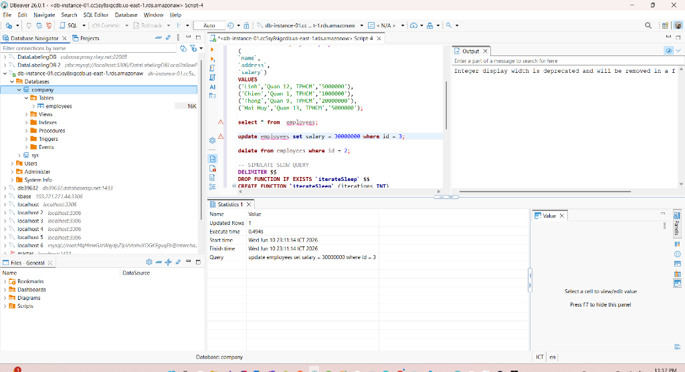
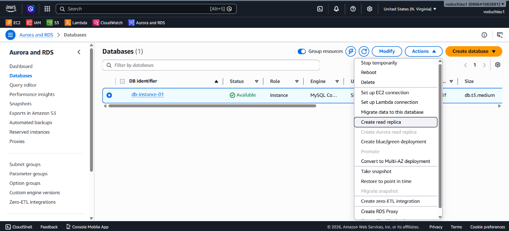
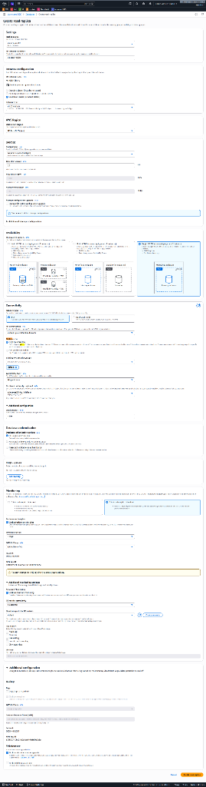
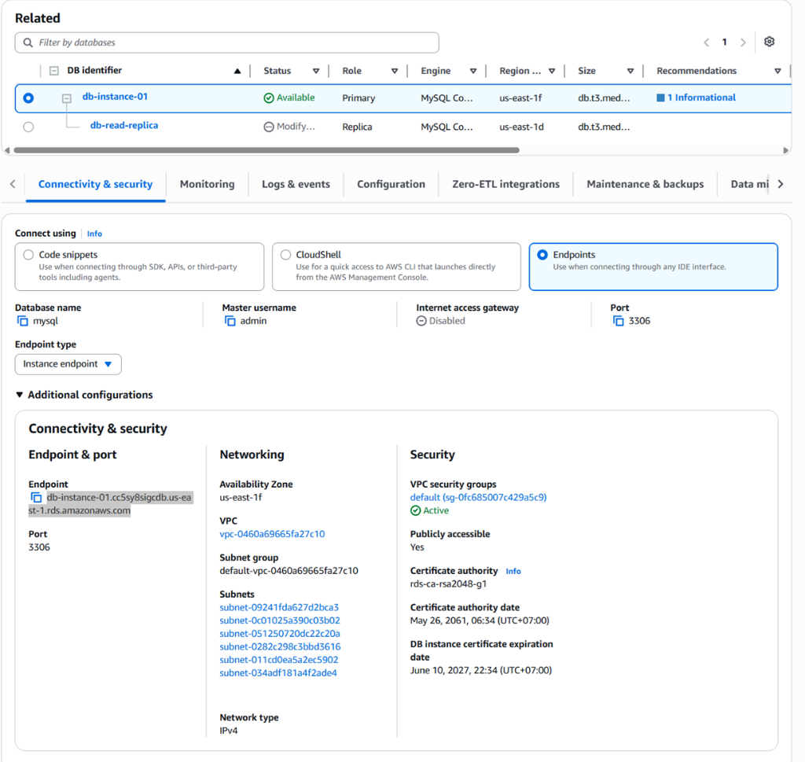
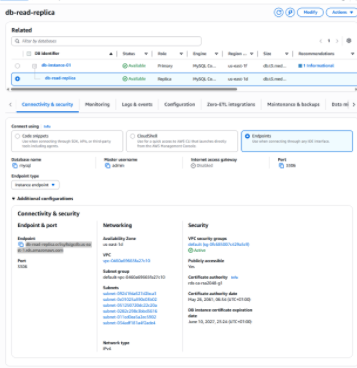

# Amazon RDS Hands-on Lab (Basic RDS Instance Creation)

Bài thực hành này hướng dẫn bạn từng bước khởi tạo một cơ sở dữ liệu quan hệ độc lập (Single RDS Instance) sử dụng dịch vụ **Amazon RDS** trên AWS Console với tùy chọn cấu hình đầy đủ (**Full Configuration**), sử dụng Database Engine **MySQL** và cấu hình phần cứng lớp **db.t3.medium**.

---

## Các bước thực hiện chi tiết

### Bước 1: Truy cập dịch vụ Amazon RDS và chọn phương thức khởi tạo
1. Đăng nhập vào AWS Management Console.
2. Trên thanh tìm kiếm ở trên cùng, gõ **RDS** và chọn dịch vụ **RDS (Relational Database Service)**.
3. Ở menu điều hướng bên trái, chọn **Databases**.
4. Nhấp vào nút **Create database** màu cam ở góc trên bên phải, sau đó chọn tùy chọn **Full configuration** (Cấu hình đầy đủ) từ danh sách thả xuống.


---

### Bước 2: Cấu hình chi tiết RDS Instance
Giao diện khởi tạo cơ sở dữ liệu ở chế độ cấu hình đầy đủ hiện ra, tiến hành cài đặt các thông số như sau:

#### 1. Engine Options (Lựa chọn hệ quản trị)
* **Engine type**: Chọn **MySQL**.
* **Edition**: Giữ nguyên `MySQL Community`.
* **Engine version**: Giữ phiên bản mặc định được khuyến nghị (ví dụ: `8.0.35` hoặc phiên bản mới nhất có sẵn).

#### 2. Templates (Mẫu cấu hình)
* Chọn mẫu **Dev/Test** (Môi trường phát triển và thử nghiệm). Tùy chọn này cho phép bạn cấu hình các loại instance đa dạng bao gồm dòng Burstable (`t` class) như `db.t3.medium` để tối ưu chi phí.

#### 3. Settings (Cấu hình định danh & Tài khoản)
* **DB instance identifier**: Nhập tên định danh cho RDS Instance của bạn (ví dụ: `database-1`).
* **Credentials specification**:
  * **Master username**: Giữ tên mặc định là `admin`.
  * **Master password**: Nhập mật khẩu quản trị và xác nhận mật khẩu (hãy ghi nhớ mật khẩu này để kết nối tới DB sau này).

#### 4. Instance Configuration (Cấu hình phần cứng máy chủ DB)
* **DB instance class**: Chọn **Burstable classes (includes t classes)**.
* Từ danh sách thả xuống, tìm và chọn loại cấu hình **db.t3.medium** (bao gồm 2 vCPUs, 4 GiB RAM, hỗ trợ Network Bandwidth tối đa 0.085 Gbps).

#### 5. Storage (Cấu hình lưu trữ)
* **Storage type**: Chọn **General Purpose SSD (gp3)**.
* **Allocated storage**: Nhập dung lượng lưu trữ tối thiểu mong muốn, ví dụ: **20 GiB**.
* **Storage autoscaling**: Bạn có thể bật tính năng tự động co giãn ổ đĩa nếu dữ liệu lớn dần (giới hạn tối đa có thể cấu hình là 1000 GiB).

#### 6. Connectivity (Cấu hình mạng kết nối)
* **Compute resource**: Chọn **Don't connect to an EC2 compute resource** (Nếu muốn tự cấu hình bảo mật thủ công).
* **VPC**: Chọn Default VPC của bạn.
* **Public access**: Chọn **No** (Đảm bảo an toàn bảo mật, database chỉ được truy cập nội bộ từ các EC2 Instance nằm trong cùng VPC và không công khai ra internet).
* **VPC security group**: Chọn **Create new** để tạo mới một nhóm bảo mật, đặt tên Security Group cho database (ví dụ: `rds-db-sg`).

#### 7. Database Authentication (Phương thức xác thực)
* Chọn **Password authentication** (Sử dụng tài khoản và mật khẩu quản trị để đăng nhập).

#### 8. Additional Configuration (Cấu hình bổ sung)
* Click mở rộng mục này và nhập tên cơ sở dữ liệu mặc định ban đầu tại **Initial database name** (ví dụ: `mydb`).
* Giữ nguyên các cấu hình mặc định khác về Backup (sao lưu tự động), Encryption (mã hóa dữ liệu tĩnh), và Maintenance (bảo trì hệ thống).

* Cuộn xuống góc dưới cùng bên phải của trang và click nút **Create database** màu cam để bắt đầu quá trình khởi tạo instance. Quá trình tạo database thường mất từ 5 đến 10 phút.


---

### Bước 3: Cấu hình mở cổng (Port) kết nối tại Security Group
Mặc dù RDS Instance đã được tạo, để từ môi trường bên ngoài (như máy tính cá nhân hoặc công cụ Database Client) có thể kết nối được tới Database, ta phải cấp quyền truy cập qua cổng mặc định của MySQL là **3306** trong Security Group:

1. Đợi trạng thái DB chuyển sang **Available**. Nhấp vào tên RDS Instance vừa tạo (ví dụ: `db-instance-01`).
2. Tại tab **Connectivity & security**, tìm mục **Security** -> Nhấp vào liên kết của nhóm bảo mật tại phần **VPC security groups** (ví dụ: `default (sg-0fc685007c495c9)`).


3. Trình duyệt chuyển hướng sang bảng điều khiển dịch vụ EC2 tại mục **Security Groups**. Nhấp chọn nhóm bảo mật tương ứng của bạn.
4. Chọn tab **Inbound rules** (Luật đi vào), nhấp chọn nút **Edit inbound rules** ở góc phải.


5. Tại trang cấu hình Inbound Rules, click chọn **Add rule**:
   * **Type**: Chọn **MYSQL/Aurora** (Hệ thống tự động điền Protocol là `TCP` và Port range là `3306`).
   * **Source**: Chọn **My IP** (Hệ thống tự động nhận diện địa chỉ IP ngoại mạng tĩnh máy của bạn, ví dụ: `171.251.232.125/32`) để đảm bảo an toàn bảo mật tối đa. Hoặc chọn **Anywhere-IPv4** (`0.0.0.0/0`) nếu muốn cho phép truy cập từ mọi nơi.
   * Click nút **Save rules** màu cam để lưu cấu hình.


---

### Bước 4: Kết nối tới RDS Instance bằng công cụ Database Client (DBeaver)

#### 1. Lấy thông tin Endpoint kết nối
* Quay lại AWS RDS Console -> chọn Databases -> click vào tên DB Instance của bạn.
* Tại tab **Connectivity & security**, cuộn tới mục **Endpoint & port**.
* Click biểu tượng sao chép để copy nội dung **Endpoint** (địa chỉ máy chủ DB, ví dụ: `db-instance-01.cc5sy8sigcdb.us-east-1.rds.amazonaws.com`).


#### 2. Thiết lập kết nối trên DBeaver
1. Mở ứng dụng **DBeaver** (hoặc bất kỳ Database Client nào của bạn).
2. Tạo kết nối mới (New Database Connection) và chọn **MySQL**.
3. Tại tab **Main**, cấu hình các thông số kết nối:
   * **Connect by**: Chọn `Host`.
   * **Server Host**: Dán địa chỉ Endpoint vừa sao chép từ AWS Console.
   * **Port**: Giữ mặc định `3306`.
   * **Database**: (Để trống hoặc nhập `mydb` nếu bạn có cấu hình Initial database name ban đầu).
   * **Username**: Nhập `admin`.
   * **Password**: Nhập Master Password đã thiết lập ở Bước 2.
4. Click chọn nút **Test Connection...** ở góc dưới cùng bên trái.
5. Cửa sổ **Connection test** hiển thị trạng thái **Connected** thành công kèm thông tin phiên bản MySQL Server và Driver. Click **OK** và chọn **Finish** để hoàn thành kết nối.


---

### Bước 5: Thực thi mã lệnh SQL (CRUD) và Giả lập Slow Query
Sau khi kết nối thành công, bạn sẽ tiến hành thực thi các câu lệnh cơ sở dữ liệu cơ bản. Chúng tôi đã chuẩn bị sẵn một tệp mẫu SQL tại thư mục template của dự án:
* **Đường dẫn tệp mẫu**: [employee_crud_slow_query.sql](../../templates/rds/employee_crud_slow_query.sql)

Hãy mở một Script Editor mới trong DBeaver và chạy lần lượt các nhóm lệnh sau:

1. **Khởi tạo Database & Table**:
   ```sql
   CREATE DATABASE IF NOT EXISTS company;
   USE company;

   CREATE TABLE IF NOT EXISTS employees (
       id INT NOT NULL PRIMARY KEY AUTO_INCREMENT,
       name VARCHAR(100) NOT NULL,
       address VARCHAR(255) NOT NULL,
       salary INT(10) NOT NULL
   );
   ```

2. **Thực thi các lệnh CRUD**:
   * **Insert (Create)**:
     ```sql
     INSERT INTO employees (name, address, salary) VALUES
     ('Linh', 'Quan 12, TPHCM', 5000000),
     ('Chien', 'Quan 1, TPHCM', 1000000),
     ('Thong', 'Quan 9, TPHCM', 20000000),
     ('Hai Huy', 'Quan 13, TPHCM', 5000000);
     ```
   * **Select (Read)**:
     ```sql
     SELECT * FROM employees;
     ```
   * **Update (Update)**:
     ```sql
     UPDATE employees SET salary = 30000000 WHERE id = 3;
     ```
   * **Delete (Delete)**:
     ```sql
     DELETE FROM employees WHERE id = 2;
     ```

3. **Giả lập truy vấn chậm (Slow Query Simulation)**:
   Để kiểm tra các tính năng giám sát sau này, ta định nghĩa một hàm tùy chọn chạy vòng lặp tuần tự hàm `SLEEP(2)` để ép truy vấn chạy chậm vượt ngưỡng thông thường:
   ```sql
   DELIMITER $$
   DROP FUNCTION IF EXISTS `iterateSleep` $$
   CREATE FUNCTION `iterateSleep` (iterations INT)
   RETURNS INT DETERMINISTIC
   BEGIN
       DECLARE remainder INT;
       SET remainder = iterations;
       read_loop: LOOP     
           IF remainder = 0 THEN
               LEAVE read_loop;
           END IF;
           SELECT SLEEP(2) INTO @test;
           SET remainder = remainder - 1;          
       END LOOP;
       RETURN iterations;
   END $$
   DELIMITER ;

   -- Gọi hàm giả lập chạy chậm khoảng 4 giây
   SELECT iterateSleep(2);
   ```



---

### Bước 6: Khởi tạo thêm 1 RDS Instance đóng vai trò Read Replica
Để giảm tải các truy vấn chỉ đọc (như SELECT thống kê, slow query vừa chạy) cho Master Instance chính, ta sẽ khởi tạo thêm 1 node Read Replica:

1. Trở lại AWS RDS Console -> chọn mục **Databases** ở thanh điều hướng bên trái.
2. Tích chọn database chính `db-instance-01` vừa tạo, nhấp chọn menu **Actions** ở phía trên và chọn **Create read replica**.



3. Tại trang cấu hình **Create read replica**, thiết lập thông số:
   * **DB instance identifier**: Nhập tên định danh cho replica (ví dụ: `db-read-replica`).
   * **VPC & Subnet group**: Giữ nguyên cùng VPC với instance chính.
   * Cuộn xuống dưới cùng của trang và click nút **Create read replica** màu cam để khởi tạo.



4. Quá trình nhân bản sẽ được tiến hành. Trên danh sách Database, bạn sẽ thấy mối quan hệ phân cấp:
   * `db-instance-01` (Primary - Vai trò chính: ghi/đọc)
   * `db-read-replica` (Replica - Vai trò phụ: chỉ đọc, trạng thái `Creating` -> `Available`)



5. Sau khi replica chuyển sang trạng thái **Available**, click chọn `db-read-replica` và copy địa chỉ **Endpoint** tại tab **Connectivity & security**.



> [!WARNING]
> * **Lưu ý cực kỳ quan trọng**: Địa chỉ Endpoint của Master Instance chính (`db-instance-01.xxx`) và Read Replica Instance (`db-read-replica.xxx`) là **hoàn toàn khác biệt và riêng biệt**. 
> * Ứng dụng của bạn phải trỏ kết nối ghi tới Master và định tuyến các kết nối đọc tới Read Replica một cách hợp lý để tối ưu hiệu năng.

---

### Bước 7: Kiểm nghiệm tính chất Chỉ Đọc (Read-Only) của Read Replica
Do Read Replica đóng vai trò làm bản sao chỉ đọc (giúp phân tán tải truy vấn SELECT), hệ thống AWS RDS sẽ thiết lập cấu hình chạy ngầm MySQL với tham số `--read-only` để ngăn chặn mọi hành vi thay đổi dữ liệu trực tiếp trên node này. Ta tiến hành kiểm nghiệm như sau:

1. Mở DBeaver và tạo kết nối mới tới **Read Replica** bằng Endpoint của `db-read-replica` vừa sao chép ở Bước 6.
2. Mở Script Editor và thử thực thi các câu lệnh thay đổi dữ liệu (Insert, Update, Delete):
   ```sql
   USE company;
   
   -- Thử cập nhật dữ liệu
   UPDATE employees SET salary = 10000000 WHERE id = 1;
   
   -- Thử xóa dữ liệu
   DELETE FROM employees WHERE id = 5;
   
   -- Thử chèn thêm dữ liệu
   INSERT INTO employees (name, address, salary) VALUES ('Tuan', 'Quan 13, TPHCM', 5000000);
   ```
3. **Kết quả**: Tất cả các lệnh ghi/sửa đổi trên đều bị từ chối thực thi và trả về thông báo lỗi cụ thể từ MySQL Server:
   `Error Code: 1290. The MySQL server is running with the --read-only option so it cannot execute this statement`


---

### Bước 8: Xóa Master Instance để kiểm chứng cơ chế tự thăng cấp (Promotion/Failover)
Trong kiến trúc Master - Read Only, nếu Master Node chính bị lỗi hoặc bị xóa, Read Replica sẽ được thăng cấp (promoted) để trở thành một Database Instance độc lập, sẵn sàng phục vụ cho cả tác vụ đọc và ghi (Read/Write):

1. Tại AWS RDS Console -> chọn mục **Databases**.
2. Click chọn Database chính (Primary) `db-instance-01`.
3. Nhấp chọn menu **Actions** ở góc phải phía trên và chọn **Delete**.


4. Bỏ tích chọn tạo Snapshot sao lưu cuối cùng nếu không cần thiết, tích chọn xác nhận đồng ý xóa và nhập chữ `delete me` vào ô xác nhận, sau đó click **Delete**.
5. Theo dõi danh sách Database và quan sát sự thay đổi:
   * **db-instance-01**: Trạng thái chuyển sang `Deleting` (Đang xóa).
   * **db-read-replica**: Trạng thái chuyển sang `Modifying` (Đang sửa đổi để thăng cấp).
   * **Đặc biệt lưu ý về Vai trò (Role)**: Vai trò của `db-read-replica` lập tức thay đổi từ **Replica** thành **Instance** độc lập (không còn phụ thuộc vào Master cũ).


6. Sau khi quá trình hoàn tất, `db-read-replica` trở thành một database độc lập hoàn toàn. Lúc này, bạn có thể thực hiện thành công các lệnh ghi dữ liệu (INSERT, UPDATE, DELETE) bình thường trên nó.
   * *Lưu ý*: Do đây là mô hình các node riêng biệt và không được quản lý dưới một Cluster chung, Endpoint của máy chủ mới sẽ là Endpoint của `db-read-replica`. Ứng dụng (App) của bạn phải cấu hình cập nhật kết nối thủ công sang Endpoint này để hoạt động tiếp.


