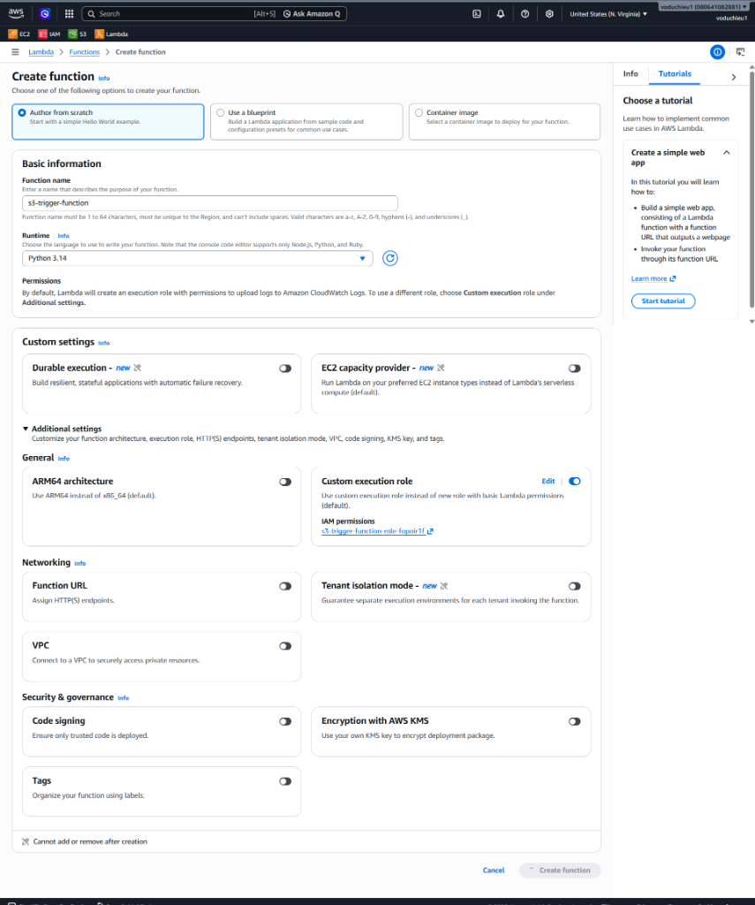
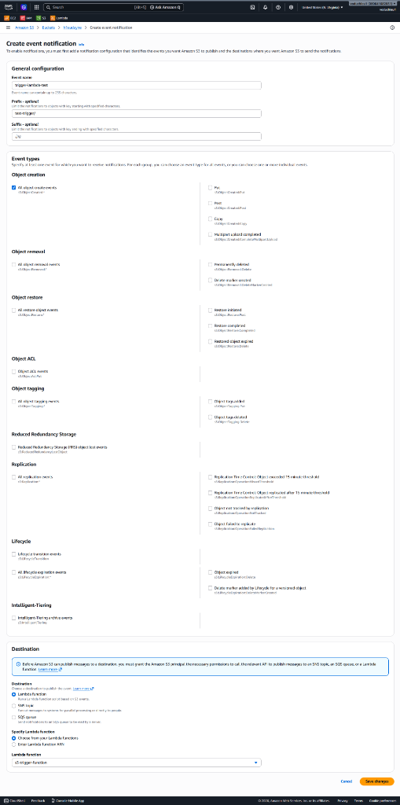
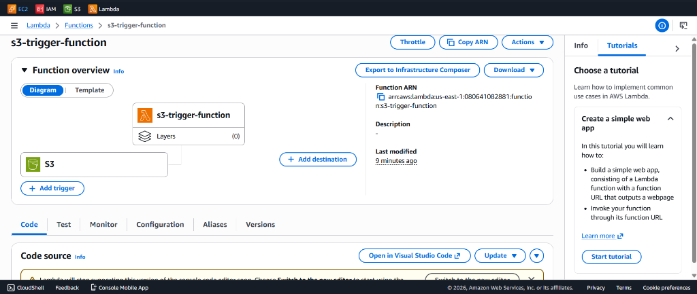
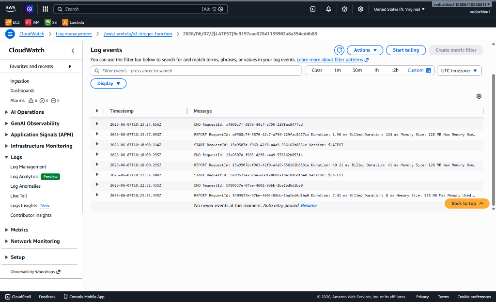

# 2. AWS Lambda Hands-on Lab (Resize ảnh tự động trên Amazon S3)

## I. Tổng quan bài Lab

Bài Lab này hướng dẫn bạn xây dựng một quy trình tự động xử lý hình ảnh hướng sự kiện:
1. Khi người dùng tải một bức ảnh định dạng `.jpg` hoặc `.png` lên S3 Bucket nguồn (ví dụ: `my-bucket-images-source`).
2. S3 phát ra sự kiện `ObjectCreated` và tự động kích hoạt **AWS Lambda Function**.
3. Lambda Function tải hình ảnh từ Bucket nguồn về thư mục tạm `/tmp`, thực hiện co nhỏ kích thước (Resize) về định dạng Thumbnail (`300x300` pixel) bằng thư viện **Pillow**, sau đó tải lên S3 Bucket đích (ví dụ: `my-bucket-images-resized`).

---

## II. Các bước thực hiện chi tiết

### Bước 1: Tạo S3 Buckets
1. Truy cập **Amazon S3 Console**.
2. Tạo hai bucket với các cấu hình mặc định (chặn truy cập công khai):
   * Bucket Nguồn: `my-bucket-images-source` (ví dụ: `h1eudayne-images-source`).
   * Bucket Đích: `my-bucket-images-resized` (ví dụ: `h1eudayne-images-resized`).

---

### Bước 2: Tạo IAM Policy & Role cho Lambda
Lambda cần quyền đọc dữ liệu từ Bucket Nguồn, lưu dữ liệu vào Bucket Đích và ghi Logs lên CloudWatch.

1. Truy cập **IAM Console** $\rightarrow$ **Policies** $\rightarrow$ **Create policy**.
2. Chọn trình chỉnh sửa **JSON** và nhập nội dung sau:
   ```json
   {
       "Version": "2012-10-17",
       "Statement": [
           {
               "Effect": "Allow",
               "Action": [
                   "logs:CreateLogGroup",
                   "logs:CreateLogStream",
                   "logs:PutLogEvents"
               ],
               "Resource": "arn:aws:logs:*:*:*"
           },
           {
               "Effect": "Allow",
               "Action": [
                   "s3:GetObject"
               ],
               "Resource": "arn:aws:s3:::*-source/*"
           },
           {
               "Effect": "Allow",
               "Action": [
                   "s3:PutObject"
               ],
               "Resource": "arn:aws:s3:::*-resized/*"
           }
       ]
   }
   ```
3. Đặt tên Policy là `LambdaS3ResizePolicy` và chọn **Create policy**.
4. Chuyển sang **Roles** $\rightarrow$ **Create role**:
   * **Trusted entity type**: Chọn *AWS service*.
   * **Use case**: Chọn *Lambda*.
   * **Permissions policies**: Tìm và chọn policy `LambdaS3ResizePolicy` vừa tạo.
5. Đặt tên Role là `LambdaS3ResizeExecutionRole` và hoàn thành tạo Role.

---

### Bước 3: Tạo Lambda Function
1. Truy cập **AWS Lambda Console** $\rightarrow$ Chọn **Create function**.
2. Cấu hình các thông số:
   * **Function name**: `s3-image-resizer`.
   * **Runtime**: Chọn **Python 3.12** (phiên bản Pillow Layer hoạt động tốt nhất).
   * **Change default execution role**: Chọn *Use an existing role*, chọn Role `LambdaS3ResizeExecutionRole`.
3. Nhấp nút **Create function**.

<p align="center">
  
</p>

---

### Bước 4: Thêm Lambda Layer cho thư viện Pillow
Môi trường Python mặc định của AWS Lambda không chứa thư viện xử lý ảnh **Pillow (PIL)**. Ta có thể thêm bằng cách sử dụng **Public Lambda Layer** (ví dụ từ cộng đồng Klayers):

1. Cuộn xuống dưới cùng giao diện Lambda Function của bạn, nhấp nút **Add a layer** trong mục **Layers**.
2. Chọn **Specify an ARN** và điền ARN Pillow Layer cho Region Singapore (`ap-southeast-1`) chạy Python 3.12:
   ```text
   arn:aws:lambda:ap-southeast-1:770693421928:layer:Klayers-p312-Pillow:2
   ```
3. Nhấn **Verify** rồi nhấp nút **Add**.

---

### Bước 5: Viết mã nguồn Lambda Function

1. Thay thế mã mặc định trong tệp `lambda_function.py` bằng đoạn code sau:
   ```python
   import boto3
   import os
   import uuid
   from urllib.parse import unquote_plus
   from PIL import Image

   s3_client = boto3.client('s3')

   def resize_image(image_path, resized_path):
       with Image.open(image_path) as image:
           # Co nhỏ ảnh giữ nguyên tỉ lệ, tối đa 300px cho chiều rộng/cao
           image.thumbnail((300, 300))
           image.save(resized_path)

   def lambda_handler(event, context):
       for record in event['Records']:
           # Lấy thông tin Bucket nguồn và Tên ảnh từ sự kiện
           source_bucket = record['s3']['bucket']['name']
           image_key = unquote_plus(record['s3']['object']['key'])
           
           # Tạo tên file tạm thời trong thư mục /tmp của Lambda
           temp_file_name = f"{uuid.uuid4()}-{os.path.basename(image_key)}"
           download_path = f"/tmp/{temp_file_name}"
           upload_path = f"/tmp/resized-{temp_file_name}"
           
           # 1. Tải ảnh từ S3 Bucket Nguồn về /tmp
           s3_client.download_file(source_bucket, image_key, download_path)
           
           # 2. Thực hiện Resize ảnh sử dụng thư viện Pillow
           resize_image(download_path, upload_path)
           
           # 3. Định nghĩa S3 Bucket đích và Upload ảnh lên
           target_bucket = source_bucket.replace("-source", "-resized")
           s3_client.upload_file(upload_path, target_bucket, image_key)
           
           print(f"Thành công! Đã resize {image_key} từ {source_bucket} sang {target_bucket}")
   ```
2. Nhấn nút **Deploy** để lưu mã nguồn.

---

### Bước 6: Cấu hình S3 Event Trigger trên Bucket Nguồn
1. Mở **S3 Console** $\rightarrow$ Click vào Bucket nguồn `h1eudayne-images-source`.
2. Chọn tab **Properties**, cuộn xuống phần **Event notifications** $\rightarrow$ Chọn **Create event notification**.
3. Cấu hình sự kiện:
   * **Event name**: `image-upload-trigger`.
   * **Suffix**: `.jpg` hoặc `.png` (chỉ bắt sự kiện khi upload ảnh).
   * **Event types**: Tích chọn **All object create events**.
   * **Destination**: Chọn **Lambda function**, chỉ định hàm `s3-image-resizer` vừa tạo.
4. Nhấp nút **Save changes**.

<p align="center">
  
</p>

---

## III. Xác minh kết quả thực hành (Validation)

1. Tải một bức ảnh dung lượng lớn (ví dụ: `nature.jpg` khoảng 4 MB) lên S3 Bucket nguồn `h1eudayne-images-source`.
2. Kiểm tra sơ đồ Lambda Function, bạn sẽ thấy S3 đã xuất hiện làm Trigger đầu vào:

<p align="center">
  
</p>

3. Mở S3 Bucket đích `h1eudayne-images-resized`. Bạn sẽ thấy bức ảnh `nature.jpg` đã xuất hiện ở đây. Kiểm tra kích thước của tệp tin, dung lượng đã được giảm đáng kể xuống chỉ còn vài chục KB.
4. Truy cập **CloudWatch Logs** tương ứng của hàm Lambda để xem chi tiết log xử lý thành công:

<p align="center">
  
</p>

---

* **Bài trước**: [1. Hello Lambda (Làm quen với AWS Lambda Console)](1.%20Hello%20Lambda.md)
* **Bài tiếp theo**: [3. AWS Lambda Hands-on Lab(EC2 Auto Start-Stop) (Lab bật tắt EC2 tự động)](3.%20AWS%20Lambda%20Hands-on%20Lab%28EC2%20Auto%20Start-Stop%29.md)
