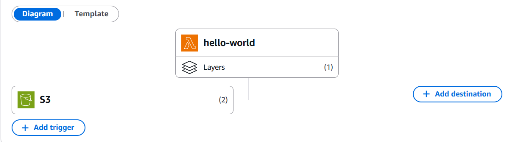
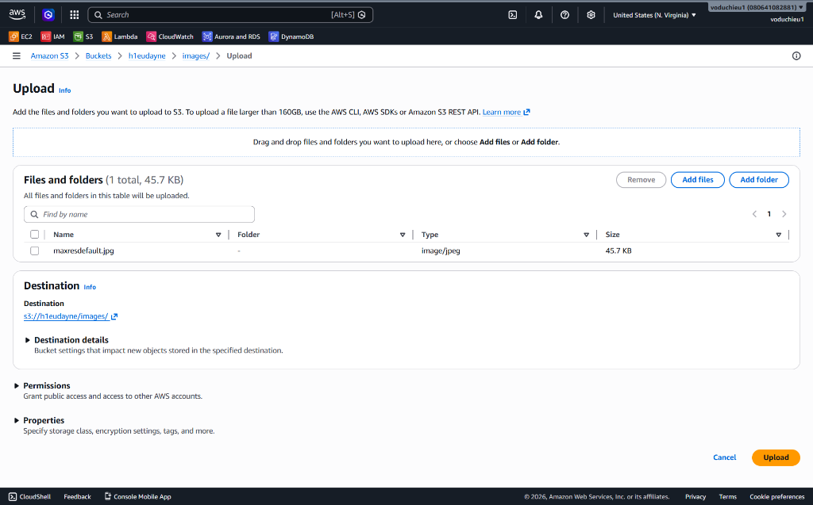
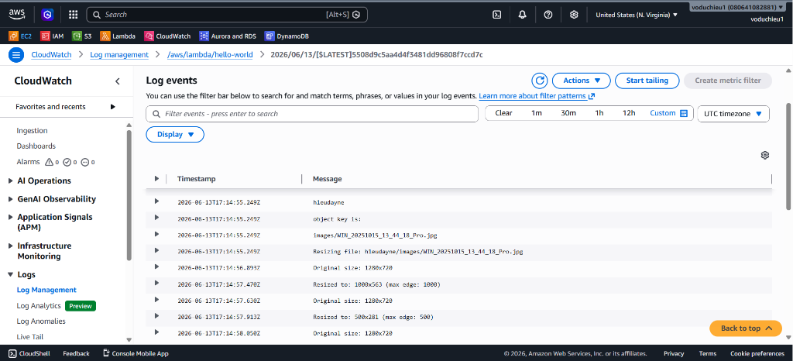

# 2. AWS Lambda Hands-on Lab (Resize ảnh tự động trên Amazon S3) - Hướng dẫn chi tiết

👉 **[Xem Đề bài / Yêu cầu bài Lab](2.%20AWS%20Lambda%20Hands-on%20Lab%28Resize%20Image%20on%20S3%29.md)**

---

## Các bước thực hiện chi tiết

### Bước 1: Tạo S3 Bucket và Thư mục chứa ảnh

1. Truy cập **Amazon S3 Console**.
2. Nhấp chọn **Create bucket**, tạo một bucket mới với tên bất kỳ (ví dụ: `h1eudayne-images-bucket`).
3. Truy cập vào bucket vừa tạo, chọn **Create folder** và tạo một thư mục tên là `images` để chứa các tệp tin hình ảnh tải lên.

---

### Bước 2: Tạo Lambda Layer (Sử dụng Git Bash / Powershell)

Vì môi trường Python của AWS Lambda không tích hợp sẵn thư viện xử lý ảnh **Pillow (PIL)**, chúng ta cần tạo một Lambda Layer chứa thư viện này để nhúng vào hàm.

> [!IMPORTANT]
> Thư viện **Pillow** phải được tải xuống và biên dịch tương thích với hệ điều hành **Amazon Linux 2** (Runtime của Lambda trên cloud) thay vì môi trường local như Windows hay macOS.

1. Mở **Git Bash** hoặc **PowerShell** tại thư mục dự án của bạn.
2. Tạo thư mục tên là `python` để lưu trữ thư viện:
   ```bash
   mkdir python
   ```
3. Chạy lệnh cài đặt Pillow chỉ định nền tảng (platform) và runtime Python tương thích (ví dụ: Python 3.12):

   * **Trên Git Bash / Linux (Lệnh 1 dòng):**
     ```bash
     pip install Pillow --platform manylinux2014_x86_64 --target python --implementation cp --python-version 3.12 --only-binary=:all: --no-deps --upgrade
     ```
   * **Trên PowerShell (Lệnh nhiều dòng):**
     ```powershell
     pip install Pillow `
         --platform manylinux2014_x86_64 `
         --target python `
         --implementation cp `
         --python-version 3.12 `
         --only-binary=:all: `
         --no-deps `
         --upgrade
     ```

<p align="center">
  
</p>

---

### Bước 3: Nén zip thư mục python vừa tạo

1. Sau khi cài đặt xong, bạn sẽ thấy thư mục `python` chứa các thư mục con `PIL`, `pillow_libs`, và metadata.
2. Thực hiện nén thư mục `python` này thành tệp tin `python.zip` (dung lượng sau khi nén khoảng 8.5 MB).

---

### Bước 4: Tải lên Layer lên Lambda

1. Truy cập **AWS Lambda Console** $\rightarrow$ Chọn mục **Layers** ở danh sách menu bên trái.

<p align="center">
  
</p>

2. Nhấp nút **Create layer** ở phía bên phải màn hình.
3. Cấu hình thông tin Layer:
   * **Name**: `python-pillow-layer`.
   * **Upload**: Tải lên tệp tin `python.zip` đã chuẩn bị ở Bước 3.
   * **Compatible architectures**: Chọn `x86_64`.
   * **Compatible runtimes**: Chọn `Python 3.12` (và có thể chọn thêm `Python 3.13`).
4. Nhấp chọn **Create**.

<p align="center">
  
</p>

---

### Bước 5: Tạo Lambda Function

1. Truy cập **AWS Lambda Console** $\rightarrow$ **Functions** $\rightarrow$ **Create function**.
2. Cấu hình các thông số cơ bản:
   * Chọn **Author from scratch** (Tự viết từ đầu).
   * **Function name**: `resize-image-lambda`.
   * **Runtime**: Chọn **Python 3.12** (hoặc Python 3.13 tùy nhu cầu).
   * **Architecture**: Chọn **x86_64**.
3. Nhấp chọn **Create function**.

<p align="center">
  
</p>

---

### Bước 6: Đưa code vào lambda

1. Mở file `lambda_function.py` trong tab **Code**.
2. Thay thế mã mặc định bằng đoạn mã trong file [resize-image-lambda.py](resize-image-lambda.py).
3. Nhấn nút **Deploy** để lưu và áp dụng mã nguồn mới lên AWS.

<p align="center">
  
</p>

---

### Bước 7: Thêm Layer vào Lambda Function (Add Layer)

1. Giao diện Function chi tiết, cuộn xuống dưới cùng mục **Layers**.

<p align="center">
  
</p>

2. Nhấp chọn nút **Edit** bên cạnh tiêu đề **Layers (0)** ở góc phải.
3. Trong giao diện **Choose a layer**:
   * **Layer source**: Tích chọn **Custom layers** (các layer do tài khoản của bạn tự tạo).
   * **Custom layers**: Chọn tên layer `python-pillow-layer` từ danh sách xổ xuống.
   * **Version**: Chọn phiên bản mới nhất bạn đã tải lên (ví dụ: `1`).
4. Nhấn **Add**.

<p align="center">
  
</p>

---

### Bước 8: Cấu hình IAM Role cho Lambda

Để hàm Lambda có đủ quyền truy cập đọc/ghi file từ dịch vụ Amazon S3, ta cần cấp thêm quyền cho Execution Role của Lambda:

1. Tại giao diện quản trị hàm Lambda, chuyển sang tab **Configuration** $\rightarrow$ Chọn mục **Permissions** từ danh sách menu bên trái.
2. Tại khu vực **Execution role**, nhấp chọn vào link đường dẫn của Role Name để chuyển hướng sang IAM Console.

<p align="center">
  
</p>

3. Tại giao diện IAM Role Console, click nút **Add permissions** và chọn **Attach policies**.

<p align="center">
  
</p>

4. Nhập từ khóa tìm kiếm `AmazonS3FullAccess` (hoặc cấu hình Custom Policy chỉ cho phép GetObject và PutObject lên bucket chỉ định), tích chọn policy đó và nhấp **Add permissions** để hoàn thành.

<p align="center">
  
</p>

---

### Bước 9: Thiết lập Trigger từ Amazon S3 cho thư mục `images/`

Ta sẽ cấu hình S3 Event Notification để tự động gửi sự kiện kích hoạt Lambda khi có ảnh tải lên:

1. Truy cập **Amazon S3 Console** $\rightarrow$ Click vào Bucket của bạn $\rightarrow$ Chọn tab **Properties** $\rightarrow$ Cuộn xuống mục **Event notifications** $\rightarrow$ Click chọn nút **Create event notification**.

<p align="center">
  
</p>

2. Tiến hành cấu hình chi tiết sự kiện cho ảnh `.jpg`:
   * **Event name**: Điền `Process JPG image`.
   * **Prefix**: Điền `images/` (để chỉ bắt sự kiện khi upload ảnh vào thư mục `images/`).
   * **Suffix**: Điền `.jpg`.
   * **Event types**: Tích chọn **All object create events**.
   * **Destination**: Chọn **Lambda function** $\rightarrow$ Chọn hàm Lambda `resize-image-lambda` của bạn từ danh sách xổ xuống (hoặc điền ARN trực tiếp).
3. Nhấp nút **Save changes** để lưu lại cấu hình.

<p align="center">
  
</p>

4. **Tạo tiếp Event notification cho ảnh `.png`**:
   > [!IMPORTANT]
   > Vì mỗi Event notification trong Amazon S3 chỉ cho phép cấu hình tối đa một Suffix (đuôi file), để Lambda tự động xử lý cho cả 2 định dạng ảnh phổ biến là `.jpg` và `.png`, bạn cần thực hiện lặp lại bước trên để tạo thêm một Event notification thứ hai:
   > * **Event name**: Điền `Process PNG image`.
   > * **Prefix**: Điền `images/`.
   > * **Suffix**: Điền `.png`.
   > * **Event types**: Tích chọn **All object create events**.
   > * **Destination**: Chọn **Lambda function** $\rightarrow$ Chọn hàm Lambda `resize-image-lambda` của bạn.

Sau khi hoàn tất, bạn sẽ thấy danh sách hiển thị **2 Event notifications** đã được thiết lập thành công như hình bên dưới:

<p align="center">
  
</p>

Đồng thời, khi quay lại giao diện chính của hàm Lambda (Tab **Code** hoặc **Configuration**), phần **Function overview** lúc này sẽ hiển thị trigger từ **S3** với ký hiệu **(2)** (biểu thị đã kết nối thành công 2 trigger sự kiện):

<p align="center">
  
</p>

---

### Bước 10: Thử tải một tệp tin hình ảnh lên S3 (Upload Test Image)

1. Truy cập vào **Amazon S3 Console** $\rightarrow$ Click vào Bucket của bạn $\rightarrow$ Mở thư mục `images/`.
2. Click chọn **Upload** $\rightarrow$ Chọn một tệp tin hình ảnh có định dạng `.jpg` hoặc `.png` từ máy tính (ví dụ: `maxresdefault.jpg`).
   * *Lưu ý: Tên ảnh không nên chứa khoảng trắng hoặc ký tự đặc biệt để tránh lỗi giải mã URL!*
3. Nhấp chọn nút **Upload** ở góc dưới cùng để tiến hành tải ảnh lên.

<p align="center">
  
</p>

---

### Bước 11: Kiểm tra Log thực thi của Lambda trong CloudWatch (Check Logs)

Để kiểm soát và đảm bảo Lambda đã hoạt động bình thường, ta kiểm tra logs ghi nhận:

1. Quay lại giao diện hàm Lambda của bạn $\rightarrow$ Chọn tab **Monitor** $\rightarrow$ Chọn mục **Logs**.
2. Click chọn nút **View CloudWatch logs** (hoặc **View logs in CloudWatch**) để chuyển hướng sang giao diện quản lý CloudWatch Logs.
3. Nhấp chọn vào Log stream mới nhất. Tại đây, bạn sẽ thấy các log chi tiết hiển thị quá trình Lambda nhận sự kiện, tải ảnh xuống, thực hiện resize thành 4 kích thước khác nhau và ghi ngược lại vào các thư mục tương ứng trên S3.

<p align="center">
  
</p>

4. Truy cập lại S3 bucket của bạn để xác nhận các thư mục con sau đã tự động được tạo và chứa các phiên bản ảnh tương ứng:
   * `resized_100/`
   * `resized_200/`
   * `resized_500/`
   * `resized_1000/`

---


## Các lỗi thường gặp và Cách khắc phục (Troubleshooting)

### 1. Lỗi: "cannot import name '_imaging' from 'PIL'"
* **Nguyên nhân**: Thư viện Pillow được tải xuống trên Windows/macOS không tương thích với nhân Linux trên Lambda.
* **Cách khắc phục**: Hãy chắc chắn sử dụng đúng lệnh `pip install Pillow` có tham số `--platform manylinux2014_x86_64` ở Bước 2.

### 2. Lỗi: "Task timed out"
* **Nguyên nhân**: Thời gian thực thi mặc định (3 giây) quá ngắn để xử lý tải và nén ảnh.
* **Cách khắc phục**: Hãy tăng cấu hình timeout của Lambda lên 30 - 60 giây trong Configuration (Configuration → General configuration → Edit).

### 3. Lỗi: "Memory limit exceeded"
* **Nguyên nhân**: Bộ nhớ mặc định (128 MB) không đủ để xử lý ảnh độ phân giải cao.
* **Cách khắc phục**: Tăng cấu hình Memory lên tối thiểu 512 MB trong Configuration (Configuration → General configuration → Edit).

---

* **Bài trước**: [1. Hello Lambda (Làm quen với AWS Lambda Console)](../1.%20Hello%20Lambda.md)
* **Bài tiếp theo**: [3. AWS Lambda Hands-on Lab(EC2 Auto Start-Stop) (Lab bật tắt EC2 tự động)](../3.%20AWS%20Lambda%20Hands-on%20Lab%28EC2%20Auto%20Start-Stop%29/3.%20AWS%20Lambda%20Hands-on%20Lab%28EC2%20Auto%20Start-Stop%29.md)

---

👉 **[Quay lại Đề bài](2.%20AWS%20Lambda%20Hands-on%20Lab%28Resize%20Image%20on%20S3%29.md)**
