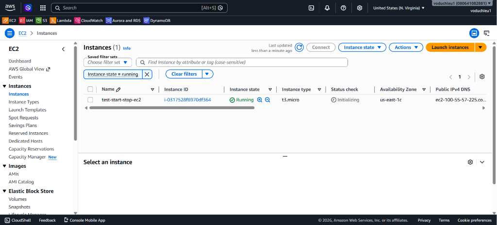
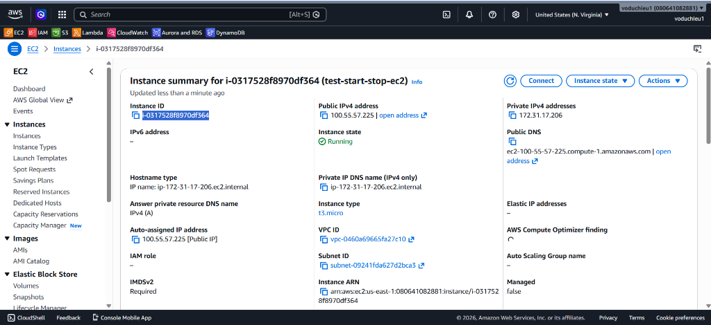
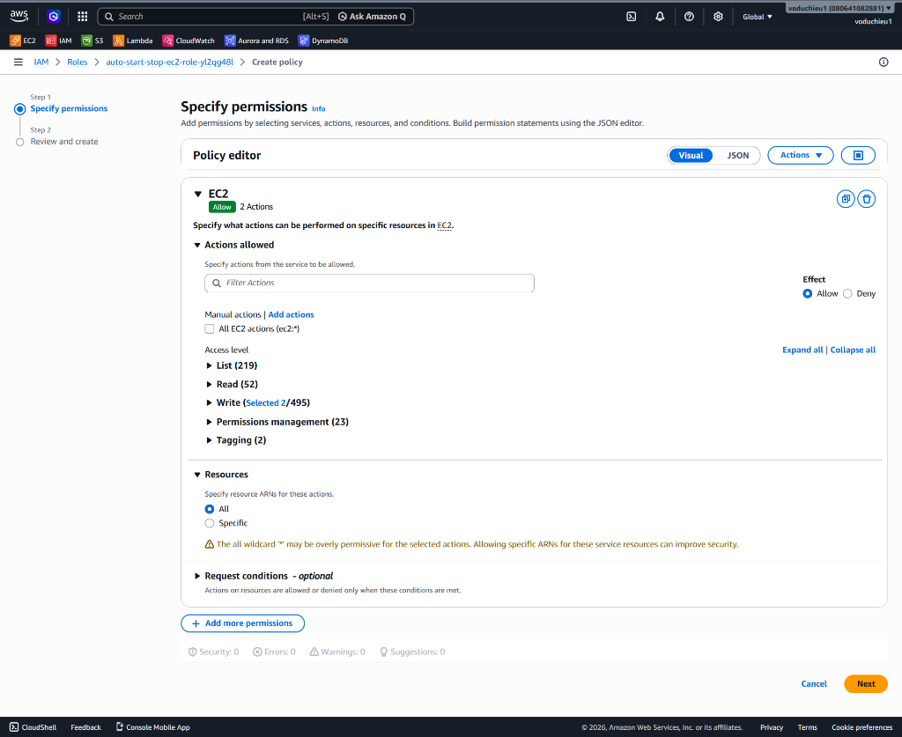
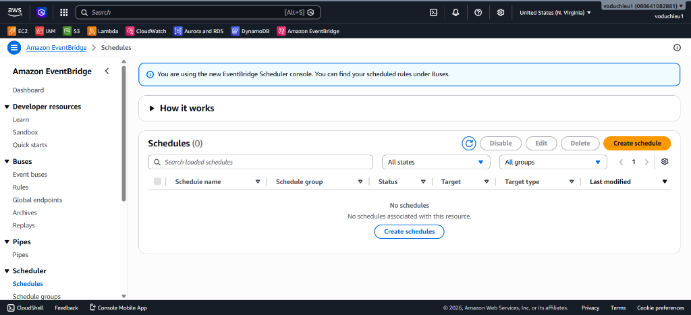
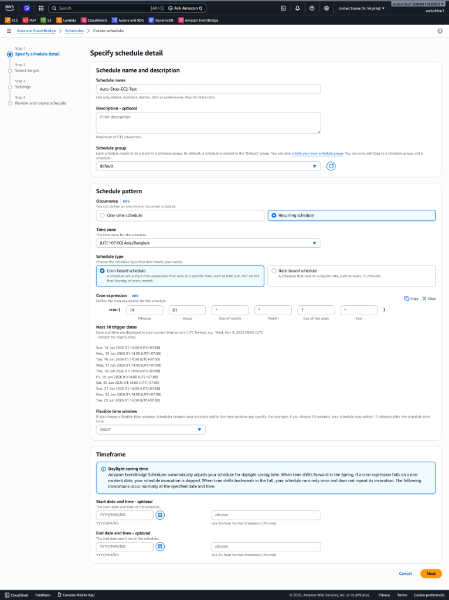

# 3. AWS Lambda Hands-on Lab (Tự động bật/tắt máy chủ EC2 để tiết kiệm chi phí) - Hướng dẫn chi tiết

👉 **[Xem Đề bài / Yêu cầu bài Lab](3.%20AWS%20Lambda%20Hands-on%20Lab%28EC2%20Auto%20Start-Stop%29.md)**

## II. Các bước thực hiện chi tiết

### Bước 1: Tạo máy chủ EC2 (Lấy Instance ID)

Trước tiên, bạn cần chuẩn bị một máy chủ ảo EC2 để thực hiện bật/tắt thử nghiệm:

1. Truy cập **Amazon EC2 Console** $\rightarrow$ **Instances** $\rightarrow$ **Launch instances** để tạo mới một máy chủ ảo (ví dụ: đặt tên máy chủ là `test-start-stop-ec2`, chọn Instance type là `t3.micro`).
2. Sau khi máy chủ được tạo xong và chuyển sang trạng thái **Running**, hãy lưu ý **Availability Zone** của máy chủ (ví dụ trong hình là `us-east-1c` $\rightarrow$ Tương ứng máy chủ nằm ở Region **`us-east-1`**).

<p align="center">
  
</p>

3. Chọn vào instance vừa tạo để xem thông tin chi tiết và copy lại **Instance ID** (ví dụ: `i-0317528f8970df364`).

<p align="center">
  
</p>

---

### Bước 2: Tạo Lambda Function và triển khai Code điều khiển

1. Truy cập **AWS Lambda Console** $\rightarrow$ Chọn **Create function**.
2. Thiết lập cấu hình cơ bản:
   * **Function name**: `auto-start-stop-ec2`.
   * **Runtime**: Chọn **Python 3.12** (hoặc mới nhất).
   * **Architecture**: Chọn `x86_64`.
3. Nhấp chọn **Create function**.
4. Mở tab **Code**, thay thế mã nguồn mặc định của file `lambda_function.py` bằng đoạn mã sử dụng `boto3` dưới đây (đồng bộ với file [auto-start-stop-ec2.py](auto-start-stop-ec2.py)):
   ```python
   import json
   import boto3
   import botocore

   # Khởi tạo client kết nối tới dịch vụ EC2
   # LƯU Ý: region_name phải là tên Region chứa EC2 của bạn (ví dụ: us-east-1), KHÔNG điền tên Availability Zone (như us-east-1c)
   ec2 = boto3.client("ec2", region_name="us-east-1")

   def lambda_handler(event, context):
       instance_id = event['instance_id']
       action = event['action']
       
       if action == 'START':
           try:
               response = ec2.start_instances(InstanceIds=[instance_id], DryRun=False)
               print(response)
           except Exception as e:
               print(e)
       if action == 'STOP':
           try:
               response = ec2.stop_instances(InstanceIds=[instance_id], DryRun=False)
               print(response)
           except Exception as e:
               print(e)
               
       return {
           'statusCode': 200,
           'body': json.dumps('Complete modify EC2 status as your requested!')
       }
   ```
5. Nhấn nút **Deploy** để lưu và sẵn sàng chạy thử.

---

### Bước 3: Cấp quyền cho Lambda (Start / Stop Instance)

Mặc định, Lambda Function không có quyền tương tác với dịch vụ EC2. Bạn cần tạo một Policy và đính kèm (attach) vào Execution role của Lambda:

1. Truy cập **IAM Console** $\rightarrow$ **Policies** $\rightarrow$ **Create policy**.
2. Tại màn hình tạo policy, chọn service **EC2** và tích chọn 2 hành động cho phép ở cột Write:
   * **`StartInstances`**
   * **`StopInstances`**
3. Thiết lập mục **Resources** là `All` (hoặc cấu hình chỉ định ARN của máy chủ để bảo mật hơn).

<p align="center">
  
</p>

4. Đặt tên Policy là `LambdaEC2ControlPolicy` và tiến hành lưu lại.
5. Chuyển sang mục **Roles** $\rightarrow$ Tìm và nhấp chọn role của Lambda Function đã tạo ở Bước 2 (ví dụ: `auto-start-stop-ec2-role-...`) $\rightarrow$ Click **Add permissions** $\rightarrow$ **Attach policies** $\rightarrow$ Tìm chọn `LambdaEC2ControlPolicy` vừa tạo $\rightarrow$ Nhấp **Add permissions** để cấp quyền.

---

### Bước 4: Thiết lập EventBridge Scheduler (Tự động kích hoạt kèm truyền tham số)

Chúng ta sẽ sử dụng EventBridge Scheduler để cấu hình lịch biểu tự động bật/tắt định kỳ đồng thời truyền các tham số đầu vào cần thiết cho Lambda:

1. Truy cập **Amazon EventBridge Console** $\rightarrow$ Chọn mục **Schedules** ở menu bên trái $\rightarrow$ Nhấp chọn nút **Create schedule**.

<p align="center">
  
</p>

2. Tiến hành cấu hình chi tiết cho Schedule (ví dụ lập lịch tự động Tắt máy chủ):
   * **Schedule name**: Điền tên gợi nhớ (ví dụ: `Auto-Stop-EC2-Test`).
   * **Schedule pattern**: Chọn **Recurring schedule** (Lập lịch lặp lại).
   * **Schedule type**: Chọn **Cron-based schedule** và điền thời gian biểu mong muốn. Ví dụ chạy vào 08:14 sáng hàng ngày (tương đương 01:14 UTC): `cron(14 01 * * ? *)`.
   
<p align="center">
  
</p>

3. Nhấp chọn **Next** sang bước tiếp theo:
   * **Target**: Chọn **AWS Lambda**.
   * **Function**: Chọn Lambda Function `auto-start-stop-ec2` của bạn.
   * **Payload (Input)**: Thiết lập tham số JSON truyền sang:
     ```json
     {
       "action": "STOP",
       "instance_id": "<ID_CUA_INSTANCE_CUA_BAN>"
     }
     ```
     *(Lưu ý: Thay thế `<ID_CUA_INSTANCE_CUA_BAN>` bằng Instance ID bạn đã copy ở Bước 1, ví dụ: `i-0317528f8970df364`)*.
4. Tiếp tục nhấp **Next** qua các bước cấu hình Role cho Schedule, sau đó kiểm tra lại và nhấp **Create schedule** để hoàn tất.
5. *(Tùy chọn)*: Để thiết lập tự động Bật máy chủ, bạn chỉ cần lặp lại các bước trên để tạo thêm một Schedule thứ hai với tên `Auto-Start-EC2-Test`, cấu hình giờ chạy tương ứng và truyền payload JSON:
   ```json
   {
     "action": "START",
     "instance_id": "<ID_CUA_INSTANCE_CUA_BAN>"
   }
   ```

---

### Bước 5: Kiểm tra Log thực thi trong CloudWatch Logs

Sau khi EventBridge Scheduler kích hoạt Lambda Function theo đúng khung giờ đã cấu hình:

1. Quay lại Lambda Console $\rightarrow$ Chọn tab **Monitor** $\rightarrow$ Chọn mục **Logs** $\rightarrow$ Nhấp chọn **View CloudWatch logs**.
2. Chọn Log stream mới nhất để kiểm tra nội dung log.
3. Nếu quá trình chạy thành công, bạn sẽ thấy thông tin log ghi nhận lệnh gọi EC2 Start/Stop kèm phản hồi của AWS SDK thành công. Máy chủ EC2 của bạn sẽ tự động thay đổi trạng thái sang **Stopping** (hoặc **Running**).

---

* **Bài trước**: [2. AWS Lambda Hands-on Lab(Resize Image on S3) (Lab Resize ảnh trên S3)](../2.%20AWS%20Lambda%20Hands-on%20Lab%28Resize%20Image%20on%20S3%29/README.md)
* **Bài tiếp theo**: [4. AWS Lambda Hands-on Lab(Read CSV and Save to DynamoDB) (Lab đọc CSV lưu vào DynamoDB)](../4.%20AWS%20Lambda%20Hands-on%20Lab%28Read%20CSV%20and%20Save%20to%20DynamoDB%29/README.md)

---

👉 **[Quay lại Đề bài](3.%20AWS%20Lambda%20Hands-on%20Lab%28EC2%20Auto%20Start-Stop%29.md)**
