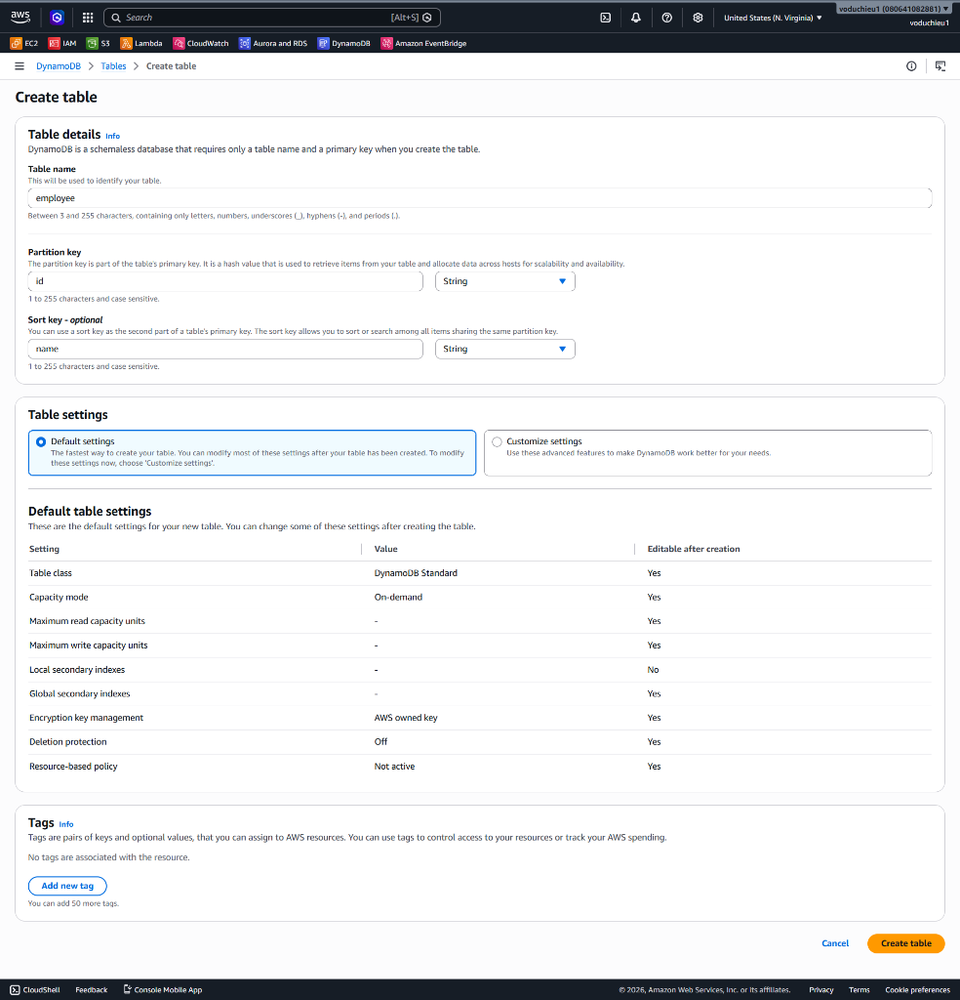
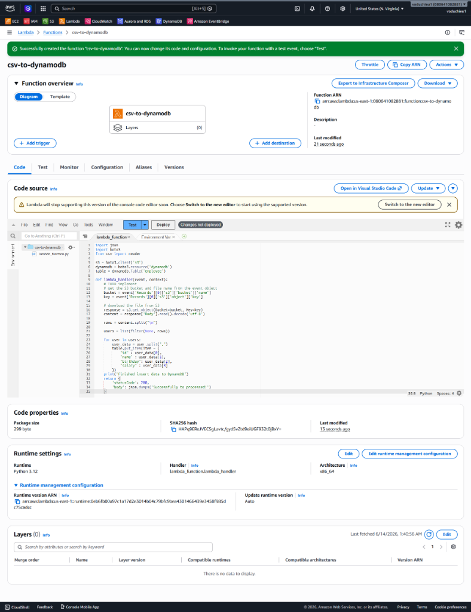
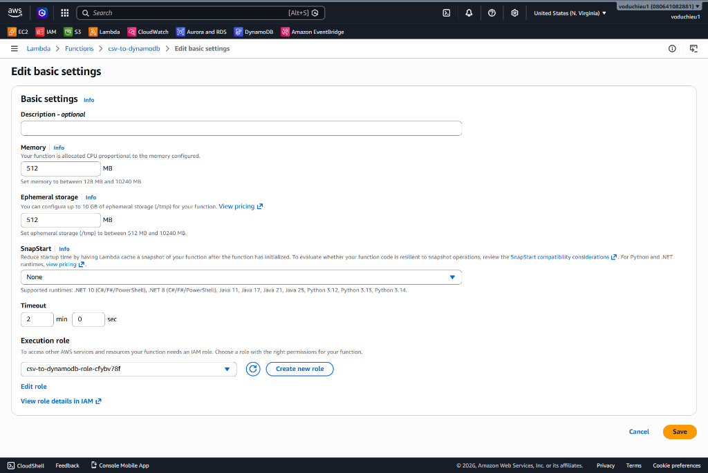
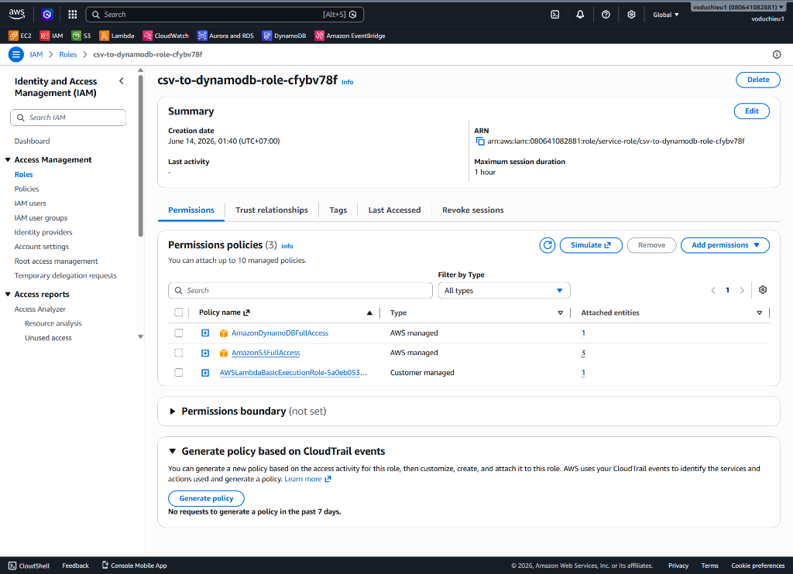
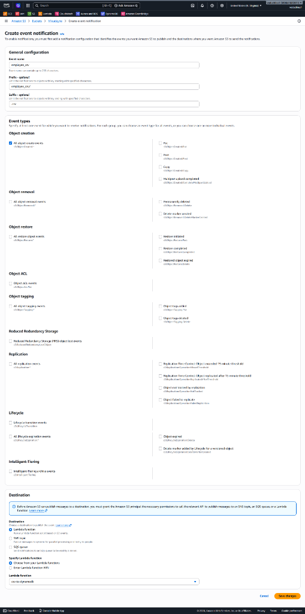
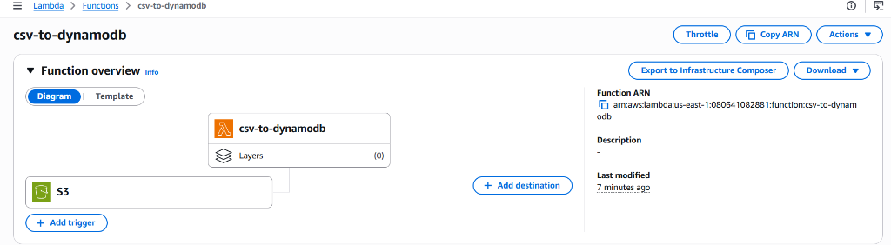

# 4. AWS Lambda Hands-on Lab (Đọc tệp CSV từ S3 và lưu vào DynamoDB) - Hướng dẫn chi tiết

 **[Xem Đề bài / Yêu cầu bài Lab](4.%20AWS%20Lambda%20Hands-on%20Lab%28Read%20CSV%20and%20Save%20to%20DynamoDB%29.md)**

## II. Các bước thực hiện chi tiết

### Bước 1: Tạo bảng DynamoDB

1. Truy cập **Amazon DynamoDB Console** $\rightarrow$ **Tables** $\rightarrow$ **Create table**.
2. Thiết lập thông số:
   * **Table name**: `employee`
   * **Partition key**: `id` (Kiểu dữ liệu: **String**)
   * **Sort key - optional**: `name` (Kiểu dữ liệu: **String**)
3. Nhấp chọn **Create table** và đợi bảng chuyển sang trạng thái *Active*.

<p align="center">
  
</p>

---

### Bước 2: Tạo Lambda Function và đưa code vào

1. Truy cập **AWS Lambda Console** $\rightarrow$ Chọn **Create function**.
2. Thiết lập:
   * **Function name**: `csv-to-dynamodb`
   * **Runtime**: Chọn **Python 3.12** (hoặc phiên bản Python mới nhất).
   * **Execution role**: Chọn *Create a new role with basic permissions* (Hệ thống tự động sinh role tương ứng).
3. Nhấp **Create function**.
4. Tại tab **Code**, thay thế mã nguồn trong tệp `lambda_function.py` bằng đoạn code sau (đồng bộ hoàn toàn với tệp [s3-csv-to-dynamodb.py](s3-csv-to-dynamodb.py)):
   ```python
   import json
   import boto3
   from csv import reader

   s3 = boto3.client('s3')
   dynamodb = boto3.resource('dynamodb')
   table = dynamodb.Table('employee')

   def lambda_handler(event, context):
       # TODO implement
       # get the S3 bucket and file name from the event object
       bucket = event['Records'][0]['s3']['bucket']['name']
       key = event['Records'][0]['s3']['object']['key']

       # download the file from S3
       response = s3.get_object(Bucket=bucket, Key=key)
       content = response['Body'].read().decode('utf-8')
       
       rows = content.split("\n")
       
       users = list(filter(None, rows))
       
       for user in users:
           user_data = user.split(",")
           table.put_item(Item = {
               "id" : user_data[0],
               "name" : user_data[1],
               "birthday": user_data[2],
               "salary" : user_data[3]
           })
       print('Finished insert data to DynamoDB')
       return {
           'statusCode': 200,
           'body': json.dumps('Successfully to processed!')
       }
   ```
5. Nhấn **Deploy** để lưu các thay đổi của mã nguồn.

<p align="center">
  
</p>

---

### Bước 3: Cấu hình tài nguyên cho Lambda (Memory và Timeout)

Mặc định các hàm Lambda được gán RAM 128 MB và Timeout 3 giây. Đối với các tác vụ đọc ghi file từ S3 và lưu vào DynamoDB, ta cần tăng các thông số này để hoạt động trơn tru.

1. Tại giao diện quản lý hàm Lambda `csv-to-dynamodb`, chuyển sang tab **Configuration** $\rightarrow$ Chọn mục **General configuration** ở danh sách bên trái.
2. Click chọn **Edit** để chỉnh sửa:
   * **Memory**: `512` MB.
   * **Timeout**: `2` min `0` sec.
3. Nhấp chọn **Save** để lưu cấu hình.

<p align="center">
  
</p>

---

### Bước 4: Thêm quyền cho Lambda (IAM Role)

Hàm Lambda cần được cấp quyền đọc tệp tin từ Amazon S3 và ghi dữ liệu (PutItem) vào bảng Amazon DynamoDB.

1. Tại tab **Configuration** $\rightarrow$ Chọn mục **Permissions** ở danh sách bên trái.
2. Click vào tên Role tại phần **Execution role** (ví dụ: `csv-to-dynamodb-role-xxxx`) để chuyển tới trang quản lý Role của **IAM Console**.
3. Tại giao diện quản lý Role, chọn tab **Permissions** $\rightarrow$ Click **Add permissions** $\rightarrow$ Chọn **Attach policies**.
4. Tìm kiếm và tích chọn hai policy có sẵn sau:
   * `AmazonDynamoDBFullAccess` (Gán quyền thao tác đầy đủ với DynamoDB)
   * `AmazonS3FullAccess` (Gán quyền thao tác đầy đủ với S3)
5. Nhấp chọn **Add permissions** để hoàn tất đính kèm quyền.

<p align="center">
  
</p>

---

### Bước 5: Cấu hình S3 Event Trigger sang Lambda

Ta cần cấu hình để khi tải file CSV vào đúng thư mục chỉ định trên S3, sự kiện sẽ tự động kích hoạt Lambda.

1. Mở **Amazon S3 Console** $\rightarrow$ Chọn Bucket nguồn của bạn.
2. Chọn tab **Properties**, cuộn xuống phần **Event notifications** $\rightarrow$ Chọn **Create event notification**.
3. Thiết lập các thông số sự kiện:
   * **Event name**: `employee_csv`
   * **Prefix - optional**: `employee_csv/` (chỉ kích hoạt khi upload file vào thư mục này).
   * **Suffix - optional**: `.csv` (chỉ bắt các file có đuôi mở rộng .csv).
   * **Event types**: Tích chọn **All object create events**.
   * **Destination**: Chọn **Lambda function**, sau đó chọn đúng hàm `csv-to-dynamodb` từ menu thả xuống.
4. Nhấn **Save changes** để lưu cấu hình trigger.

<p align="center">
  
</p>

5. Quay trở lại Lambda Console, F5 tải lại trang quản lý hàm `csv-to-dynamodb`. Bạn sẽ thấy S3 Trigger được hiển thị liên kết trực quan trong phần **Function overview**.

<p align="center">
  
</p>

---

## III. Xác minh kết quả thực hành (Validation)

1. Tạo một thư mục có tên `employee_csv` trong S3 Bucket của bạn.
2. Tạo một tệp tin trên máy tính local của bạn tên là `employee.csv` có nội dung như sau (hoặc sử dụng tệp [employee.csv](employee.csv) có sẵn trong dự án):
   ```csv
   emp-001,Linh,1992/05/06,5000000
   emp-002,Trang,1993/06/22,6000000
   emp-003,Thu,1994/07/18,7000000
   emp-004,Bao,1995/08/30,5500000
   emp-005,Duong,1996/09/28,4500000
   ```
3. Tải tệp `employee.csv` lên thư mục `employee_csv/` trong S3 Bucket nguồn của bạn.
4. Chuyển sang **DynamoDB Console** $\rightarrow$ Chọn bảng **employee** $\rightarrow$ Nhấp chọn **Explore table items**.
5. Bạn sẽ thấy các bản ghi nhân viên từ file CSV đã được tự động phân tách và lưu trữ chính xác trong bảng DynamoDB với partition key `id` và sort key `name` tương ứng.

---

* **Bài trước**: [3. AWS Lambda Hands-on Lab(EC2 Auto Start-Stop) (Lab bật tắt EC2 tự động)](../3.%20AWS%20Lambda%20Hands-on%20Lab%28EC2%20Auto%20Start-Stop%29/README.md)
* **Bài tiếp theo**: [8. EKS (Elastic Kubernetes Service)](../../../services/8.%20EKS.md)

---

 **[Quay lại Đề bài](4.%20AWS%20Lambda%20Hands-on%20Lab%28Read%20CSV%20and%20Save%20to%20DynamoDB%29.md)**
