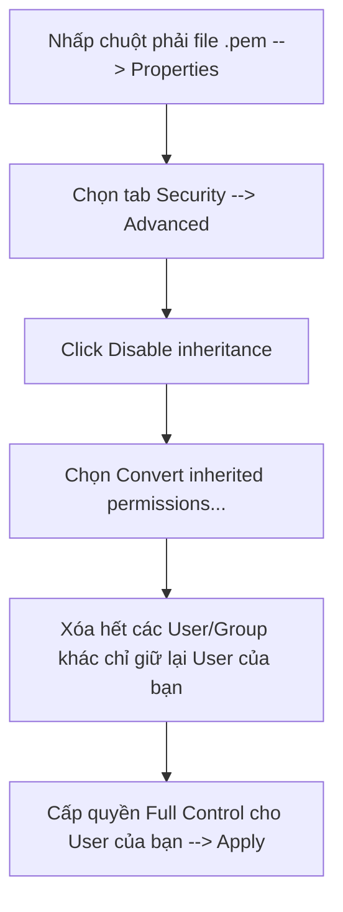

# Hướng Dẫn Thực Hành: Tạo EC2 Và Các Thao Tác Cơ Bản

Tài liệu này cung cấp hướng dẫn từng bước chi tiết (step-by-step) để thực hành khởi tạo một máy chủ ảo EC2, cấu hình tường lửa, kết nối an toàn từ hệ điều hành Windows, thiết lập một máy chủ web cơ bản và tiến hành các bước sao lưu, nhân bản hệ thống trên AWS.

---

## 1. Khởi Tạo EC2 Instance Từ AMI Amazon Linux 2

Để tạo mới một máy chủ ảo EC2:
1.  Truy cập vào **AWS Management Console** -> Chọn dịch vụ **EC2**.
2.  Nhấp chọn nút **Launch Instance**.
3.  **Cấu hình thông tin cơ bản**:
    *   **Name**: Đặt tên cho instance (ví dụ: `My-Web-Server`).
    *   **Application and OS Images (AMI)**: Chọn **Amazon Linux 2 AMI** (được hỗ trợ ở gói Free Tier).
    *   **Instance Type**: Chọn `t2.micro` (hoặc `t3.micro` tùy theo Region để được miễn phí).
4.  **Tạo Key Pair (Khóa truy cập)**:
    *   Tại mục **Key pair (login)**, nhấp chọn **Create new key pair**.
    *   **Key pair name**: Nhập tên (ví dụ: `my-ec2-key`).
    *   **Key pair type**: Lựa chọn **RSA**.
    *   **Private key file format**: Lựa chọn dạng **.pem** (sử dụng cho OpenSSH).
    *   Nhấp **Create key pair** và tải tệp tin `.pem` về máy tính cá nhân.
5.  **Cấu hình Network Settings (Mạng và Tường lửa)**:
    *   Tạm thời giữ nguyên các thiết lập VPC và Subnet mặc định.
    *   Tại mục **Firewall (security groups)**, chọn **Create security group**.
    *   Tạm thời tắt các quyền truy cập tự do từ mọi nơi để tiến hành cấu hình chi tiết ở bước tiếp theo.
6.  Nhấp nút **Launch Instance** ở góc phải để hoàn tất việc khởi tạo.

---

## 2. Cấu Hình Security Group Cho Phép Truy Cập

Để bảo mật, chúng ta sẽ cấu hình Security Group chỉ chấp nhận các truy cập từ địa chỉ IP cá nhân của bạn.

1.  Tại danh sách EC2 Instance đang chạy, nhấp vào tên Instance vừa tạo.
2.  Chọn tab **Security** phía dưới -> Nhấp vào liên kết của **Security Group** đang được gắn vào Instance.
3.  Tại giao diện chi tiết của Security Group, chọn tab **Inbound rules** -> Nhấp chọn **Edit inbound rules**.
4.  Tiến hành thêm (Add) 2 luật truy cập như sau:
    *   **Rule 1 (Cho phép SSH quản trị)**:
        *   *Type*: Chọn **SSH** (Cổng mặc định: 22).
        *   *Source*: Chọn **My IP** (AWS tự động nhận diện địa chỉ IPv4 hiện tại của mạng internet nhà bạn).
    *   **Rule 2 (Cho phép truy cập Website)**:
        *   *Type*: Chọn **HTTP** (Cổng mặc định: 80).
        *   *Source*: Chọn **My IP** (hoặc chọn *Anywhere-IPv4* `0.0.0.0/0` nếu muốn người dùng toàn cầu truy cập được).
5.  Nhấp nút **Save rules** để lưu cấu hình.

---

## 3. Kết Nối Vào Máy Chủ EC2 (SSH Login)

Nếu bạn sử dụng hệ điều hành Windows, OpenSSH yêu cầu tệp tin khóa private `.pem` phải được phân quyền bảo mật chặt chẽ (chỉ có duy nhất tài khoản người dùng hiện tại có quyền đọc), nếu không bạn sẽ gặp lỗi từ chối kết nối (`Permissions are too open`).

### Sửa lỗi quyền truy cập tệp tin Key Pair (.pem) trên Windows:

1.  Nhấp chuột phải vào tệp tin `.pem` đã tải về -> Chọn **Properties**.
2.  Chuyển sang tab **Security** -> Nhấp chọn nút **Advanced** phía dưới.
3.  Nhấp chọn nút **Disable inheritance** (Vô hiệu hóa tính năng kế thừa quyền).
4.  Một bảng thông báo hiện ra, nhấp chọn dòng **Convert inherited permissions into explicit permissions on this object** (Chuyển quyền kế thừa thành quyền rõ ràng).
5.  Tại danh sách **Permission entries**, chọn và **Remove (Xóa)** tất cả các tài khoản user/group thừa (như SYSTEM, Administrators, Users) — chỉ giữ lại duy nhất tài khoản người dùng hiện tại của bạn (tên User đăng nhập Laptop của bạn).
6.  Nếu chưa có tài khoản cá nhân, nhấp **Add** -> **Select a principal** -> Nhập tên User của bạn và nhấn Check Names -> Nhấp OK.
7.  Đảm bảo tài khoản người dùng duy nhất đó có đầy đủ quyền **Full Control** (hoặc Read/Write).
8.  Nhấp chọn **Apply** -> Nhấp **OK** để đóng toàn bộ các hộp thoại.



### Tiến hành SSH vào máy chủ:
Mở chương trình Command Prompt hoặc PowerShell trên máy tính của bạn và chạy lệnh sau để kết nối:

```bash
ssh -i "duong/dan/toi/file/my-ec2-key.pem" ec2-user@<IP_PUBLIC_CUA_EC2>
```
*(Thay thế `<IP_PUBLIC_CUA_EC2>` bằng địa chỉ IPv4 Public thực tế của instance của bạn. User mặc định cho hệ điều hành Amazon Linux 2 luôn là `ec2-user`).*

---

## 4. Cài Đặt Dịch Vụ Máy Chủ Web (HTTPD)

Sau khi đã SSH thành công vào bên trong máy chủ, hãy thực hiện cài đặt máy chủ Apache (httpd) để cấu hình website:

1.  **Cập nhật hệ điều hành**:
    ```bash
    sudo yum update -y
    ```
2.  **Cài đặt Apache HTTP Server**:
    ```bash
    sudo yum install httpd -y
    ```
3.  **Tạo trang chủ tĩnh cơ bản**:
    Dùng lệnh echo để chèn mã HTML vào tệp tin trang chủ:
    ```bash
    echo "<h1>Welcome to AWS EC2 Lab - Chào mừng bạn tới website đầu tiên!</h1>" | sudo tee /var/www/html/index.html
    ```
4.  **Cấu hình tự động khởi động cùng hệ thống**:
    ```bash
    sudo systemctl enable httpd
    ```
5.  **Khởi động dịch vụ Web Server**:
    ```bash
    sudo systemctl start httpd
    ```
6.  **Kiểm tra trạng thái hoạt động của dịch vụ**:
    ```bash
    systemctl status httpd
    ```
    *(Đảm bảo dòng trạng thái hiển thị màu xanh là `active (running)`).*

---

## 5. Truy Cập Website Thực Tế

1.  Quay trở lại giao diện quản trị **AWS EC2 Console**.
2.  Copy địa chỉ **Public IPv4 address** của instance của bạn.
3.  Mở trình duyệt Web (Chrome, Edge, Firefox...) và dán địa chỉ IP đó vào thanh địa chỉ:
    ```text
    http://<IP_PUBLIC_CUA_EC2>
    ```
    *(Lưu ý: Không dùng giao thức `https://` vì chúng ta chưa cấu hình chứng chỉ SSL trên cổng 443).*
4.  Trình duyệt sẽ hiển thị nội dung trang HTML tĩnh bạn vừa tạo ở Bước 4.

---

## 6. Tạo Sao Lưu Ổ Cứng (EBS Volume Root Snapshot)

Để bảo vệ và lưu trữ trạng thái dữ liệu hiện tại của hệ thống:

1.  Tại cột quản trị bên trái của dịch vụ EC2, tìm mục **Elastic Block Store** -> Chọn **Volumes**.
2.  Tìm và tích chọn ổ đĩa (Volume) đang được gắn vào EC2 Instance của bạn làm ổ đĩa gốc (Root Volume - thường có định dạng thiết bị là `/dev/xvda`).
3.  Nhấp chọn menu **Actions** ở góc trên bên phải -> Chọn **Create Snapshot**.
4.  **Cấu hình thông tin**:
    *   **Description**: Nhập ghi chú (ví dụ: `Backup root volume My-Web-Server`).
    *   Có thể thêm các thẻ tag định danh nếu cần.
5.  Nhấp chọn **Create Snapshot**.
6.  Để kiểm tra tiến trình và kết quả tạo bản sao lưu, tìm mục **Snapshots** ở cột quản trị bên trái. Đảm bảo trạng thái chuyển sang màu xanh lá `Completed`.

---

## 7. Tạo Ảnh Đĩa Hệ Thống (AMI từ EC2 Instance)

AMI giúp bạn đóng gói toàn bộ hệ điều hành, cấu hình ứng dụng và dữ liệu hiện tại thành một bản mẫu (Template).

1.  Tại mục **Instances**, tích chọn máy chủ ảo EC2 Web Server đang hoạt động của bạn.
2.  Nhấp chọn menu **Actions** -> Chọn **Image and templates** -> Chọn **Create Image**.
3.  **Cấu hình thông tin ảnh đĩa**:
    *   **Image name**: Nhập tên gợi nhớ (ví dụ: `Amazon-Linux-2-Web-Server-Image`).
    *   **Image description**: Mô tả (ví dụ: `AMI chua cau hinh web server hoan chinh`).
    *   Giữ nguyên mục **No reboot** không tích chọn (để AWS tự động dừng luồng dữ liệu đĩa tạm thời đảm bảo tính nhất quán của dữ liệu khi tạo ảnh).
4.  Nhấp chọn nút **Create Image**.
5.  Tìm mục **AMIs** ở cột quản trị bên trái để theo dõi tiến trình khởi tạo. Đợi trạng thái (Status) của AMI chuyển từ `Pending` sang `Available`.

---

## 8. Khởi Tạo Máy Chủ Mới Từ Bản AMI Vừa Tạo

Bây giờ, chúng ta sẽ nhân bản một máy chủ ảo mới hoàn toàn tự động dựa trên bản AMI nguồn vừa sao lưu.

1.  Tại mục **AMIs** ở cột quản trị bên trái, tích chọn bản AMI `Amazon-Linux-2-Web-Server-Image` vừa khởi tạo thành công.
2.  Nhấp chọn nút **Launch instance from AMI** ở góc trên bên phải.
3.  **Cấu hình thông tin Instance mới**:
    *   **Name**: Đặt tên phân biệt (ví dụ: `My-Cloned-Web-Server`).
    *   Hệ thống sẽ tự động chọn AMI nguồn là bản AMI của bạn thay vì kho ứng dụng chung của AWS.
    *   **Key pair**: Chọn lại tệp tin Key Pair `.pem` đã tạo ở Bước 1.
    *   **Network settings**: Chọn lại đúng **Security Group** đã cấu hình mở cổng 22 và 80 ở Bước 2.
4.  Nhấp chọn nút **Launch Instance**.

---

## 9. Truy Cập Kiểm Tra Kết Quả Nhân Bản

1.  Đợi cho instance mới (`My-Cloned-Web-Server`) khởi động hoàn tất và chuyển sang trạng thái `Running`.
2.  Sao chép địa chỉ **Public IPv4 address** của máy chủ mới này.
3.  Mở một tab mới trên trình duyệt web và truy cập địa chỉ IP đó:
    ```text
    http://<IP_PUBLIC_CUA_EC2_MOI>
    ```
4.  Kiểm tra xem trang web tĩnh có tự động hoạt động và hiển thị chính xác nội dung trang chủ giống hệt như máy chủ gốc hay không. Nếu trang web hiển thị ngay lập tức, quá trình nhân bản máy chủ bằng AMI đã hoàn tất thành công.
