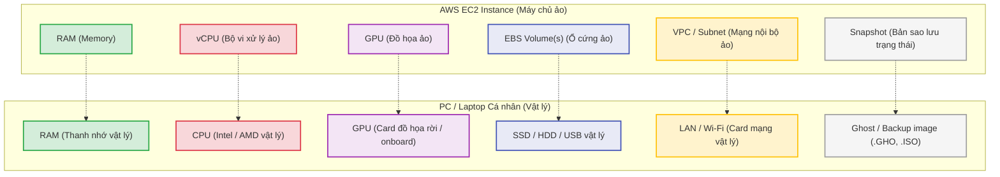

# Amazon EC2 (Elastic Compute Cloud)

## I. Tổng quan về Amazon EC2

**Amazon Elastic Compute Cloud (Amazon EC2)** là một dịch vụ web cung cấp năng lượng tính toán an toàn và có thể thay đổi quy mô (resizable) trong đám mây. Nó được thiết kế để giúp việc tính toán trên nền tảng đám mây ở quy mô web trở nên dễ dàng hơn cho các nhà phát triển.

* **Máy chủ ảo theo yêu cầu**: EC2 cho phép bạn khởi chạy các máy chủ ảo (gọi là các **Instance**) với nhiều hệ điều hành khác nhau, cấu hình CPU, RAM, dung lượng lưu trữ và băng thông mạng tùy ý chỉ trong vài phút.
* **Kiến trúc ảo hóa**: Về mặt kỹ thuật, EC2 là một **máy chủ ảo (Virtual Machine)** chạy trên tầng ảo hóa (**Hypervisor** - trước đây là Xen, hiện nay chủ yếu là AWS Nitro) quản lý bởi AWS, tách biệt tài nguyên vật lý từ các cụm server vật lý khổng lồ của Amazon.

---

## II. So sánh thành phần giữa AWS EC2 và PC / Laptop vật lý

Để dễ hình dung, các thành phần phần cứng của một máy chủ ảo EC2 tương ứng hoàn toàn với các linh kiện vật lý trên chiếc máy tính Laptop hay PC cá nhân của bạn:

### 1. Sơ đồ ánh xạ thành phần

### 2. Bảng so sánh chi tiết

| Thành phần phần cứng | Máy tính PC / Laptop vật lý | Máy chủ ảo AWS EC2 Instance |
|---|---|---|
| **Bộ nhớ tạm thời** | RAM vật lý (DDR4, DDR5 gắn trên Mainboard). | **RAM** được cấp phát động từ tài nguyên RAM dùng chung của máy vật lý vật chủ. |
| **Bộ vi xử lý** | CPU vật lý (Intel Core i7, AMD Ryzen 5...). | **vCPU** (Virtual CPU - luồng xử lý được phân mảnh từ nhân CPU vật lý). |
| **Xử lý đồ họa** | GPU vật lý (NVIDIA RTX, AMD Radeon...). | **GPU ảo hóa** (vGPU chuyên dụng cho AI, Machine Learning, đồ họa 3D). |
| **Ổ cứng lưu trữ** | SSD (NVMe, SATA), HDD, USB cắm ngoài. | **EBS Volume(s)** (Elastic Block Store - ổ cứng ảo được cấp phát qua mạng). |
| **Kết nối mạng** | Cổng mạng LAN (Ethernet), Card mạng Wi-Fi. | **VPC / Subnet / ENI** (Mạng ảo nội bộ và Card mạng ảo). |
| **Bản sao lưu** | Tệp tin Ghost (.gho), Acronis True Image, file ISO. | **Snapshot** (Bản ghi lưu lại trạng thái dữ liệu của EBS Volume tại một thời điểm). |

---

## III. Một số khái niệm cốt lõi của EC2

Khi làm việc với Amazon EC2, bạn cần nắm vững các khái niệm cơ bản sau:

### 1. AMI (Amazon Machine Image)
* **Khái niệm**: AMI giống như một tệp tin **ISO** hoặc bản **Ghost** cài hệ điều hành hoàn chỉnh, chứa toàn bộ thông tin về Hệ điều hành (OS), cấu hình ban đầu và các ứng dụng đi kèm.
* **Cách hoạt động**: Khi bạn khởi chạy một EC2 Instance, bạn bắt buộc phải chọn một AMI nguồn (ví dụ: Ubuntu 22.04 LTS, Amazon Linux 2, Windows Server 2022). Quá trình khởi động EC2 từ AMI tương tự như việc bạn bung một bản Ghost hệ điều hành sạch lên ổ cứng máy tính PC của mình.

### 2. EBS Volume (Elastic Block Store)
* **Khái niệm**: Là **ổ đĩa cứng ảo** hiệu năng cao được cấp phát độc lập bởi hệ thống của AWS.
* **Cách hoạt động**: EBS Volume độc lập với EC2. Một EBS Volume chỉ có thể đọc, ghi dữ liệu khi nó được **gắn (Attach)** vào một Instance cụ thể (tương tự như ổ cứng di động hoặc ổ SSD gắn thêm). Khi hủy EC2 Instance, bạn có thể chọn giữ lại EBS Volume này để gắn sang máy ảo khác mà không lo mất dữ liệu.

### 3. Instance Type (Kiểu máy ảo)
* **Khái niệm**: Là sự kết hợp cụ thể của các thành phần phần cứng (CPU, RAM, Storage, Network performance) được tối ưu hóa cho từng mục đích sử dụng khác nhau (ví dụ: dòng `t3` đa dụng, dòng `c6` tối ưu CPU, dòng `m6` tối ưu RAM).
