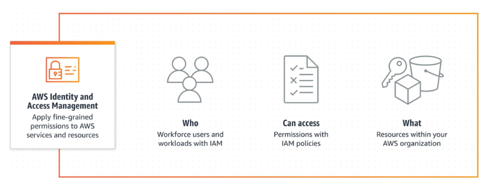

# Amazon IAM (Identity and Access Management)

## I. Tổng quan về Amazon IAM

**Amazon Identity and Access Management (IAM)** là một dịch vụ nền tảng trên AWS có nhiệm vụ định danh và phân quyền. IAM giúp bạn quản lý một cách tập trung ai (who) và cái gì (what) có thể truy cập như thế nào (how) đến tài nguyên trên AWS.

* **Nhiệm vụ định danh và phân quyền**: Xác thực thực thể truy cập (Authentication) và quyết định thực thể đó có quyền thực hiện hành động nào (Authorization).
* **Quản lý ai (Who)**: Quản lý các đối tượng truy cập như người dùng (Users), nhóm người dùng (Groups), hoặc các vai trò ảo (Roles).
* **Quản lý cái gì (What) và như thế nào (How)**: Kiểm soát hành động thao tác (Actions) trên các tài nguyên AWS cụ thể (Resources).
* **Quản lý tập trung các quyền chi tiết**: Định nghĩa các quyền hạn ở mức độ chi tiết (fine-grained permissions) tại một nơi duy nhất thông qua các chính sách JSON (Policies).
* **Phân tích quyền truy cập để tinh chỉnh quyền**: Sử dụng các công cụ phân tích để giám sát hoạt động thực tế của người dùng, từ đó điều chỉnh và tinh chỉnh quyền hạn về mức tối ưu (đặc quyền tối thiểu).

### Sơ đồ mô hình định danh và phân quyền (Who - What - How)

---

## II. Các Use Case Của Amazon IAM

Dưới đây là các trường hợp sử dụng điển hình của IAM dựa trên nhu cầu phân quyền thực tế:

### 1. Áp dụng quyền chi tiết và mở rộng quy mô dựa trên thuộc tính (ABAC)
*   **Mô tả**: Sử dụng cơ chế kiểm soát truy cập dựa trên thuộc tính (**Attribute-Based Access Control - ABAC**) bằng cách gắn các thẻ tag vào thực thể truy cập (Principal) và tài nguyên (Resource).
*   **Đặc điểm**: Giúp áp dụng quyền chi tiết và dễ dàng mở rộng quy mô khi số lượng người dùng tăng lên mà không cần tạo thêm nhiều policy mới.
*   **Ví dụ**: Cấp quyền dựa trên thuộc tính như **phòng ban (department)**, **job roles (vai trò công việc)**, hoặc **tên nhóm (group name)**. Một lập trình viên có tag `Department=Engineering` chỉ có thể truy cập các tài nguyên AWS có tag tương ứng `Department=Engineering`.

### 2. Quản lý truy cập theo từng tài khoản hoặc trên nhiều tài khoản AWS
*   **Mô tả**: Thiết lập phân quyền độc lập cho từng tài khoản AWS đơn lẻ hoặc mở rộng quy mô kiểm soát truy cập nhất quán trên toàn bộ các tài khoản thuộc tổ chức (**AWS Organizations**).
*   **Đặc điểm**: Đảm bảo việc tách biệt tài nguyên giữa các môi trường (Dev, Staging, Prod) hoặc giữa các bộ phận kinh doanh khác nhau trong doanh nghiệp nhưng vẫn quản lý được tập trung.

### 3. Thiết lập các quy tắc bảo vệ và phòng ngừa (Guardrails)
*   **Mô tả**: Thiết lập ranh giới bảo mật để ngăn chặn các hành động nguy hiểm hoặc không được phép trước khi chúng có thể xảy ra.
*   **Đặc điểm**: Sử dụng các công cụ như Service Control Policies (SCPs) hoặc Permissions Boundaries để đảm bảo rằng ngay cả tài khoản có quyền Admin cũng không thể thực hiện các thao tác bị cấm (như xóa log bảo mật, thay đổi cấu hình mạng core).

### 4. Thiết lập, xác minh và điều chỉnh quy mô quyền đối với đặc quyền tối thiểu (Least Privilege)
*   **Mô tả**: Triển khai nguyên tắc chỉ cấp vừa đủ quyền hạn cần thiết để hoàn thành công việc, tránh việc dư thừa quyền gây rủi ro bảo mật.
*   **Đặc điểm**: Quá trình này được thực hiện liên tục thông qua 3 bước khép kín:
    1.  **Thiết lập**: Cấp quyền ban đầu dựa trên tài liệu yêu cầu.
    2.  **Xác minh**: Sử dụng các công cụ phân tích (như IAM Access Analyzer) để xác minh xem các quyền hạn được cấp có quá rộng hay không.
    3.  **Tùy chỉnh và điều chỉnh**: Rút gọn các quyền dư thừa và tối ưu hóa quy mô quyền hạn dựa trên lịch sử hoạt động thực tế.
