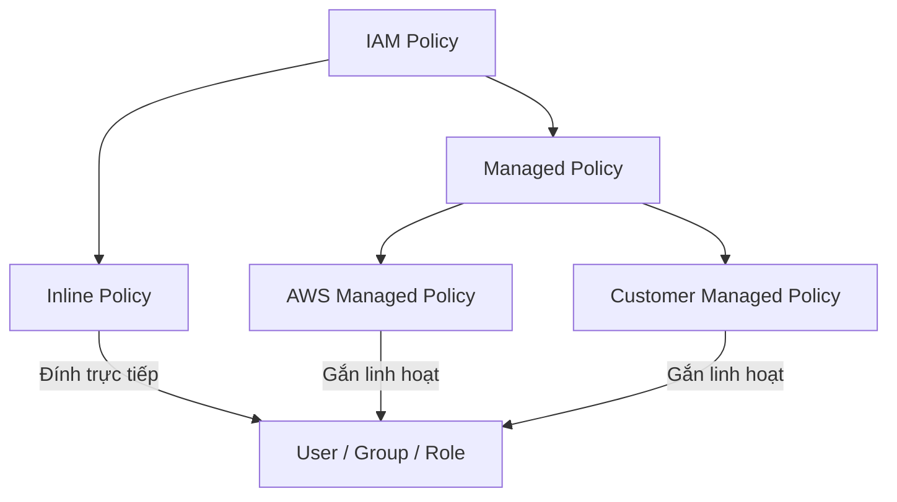

# AWS IAM Policy (Chính Sách Phân Quyền)

**IAM Policy** quy định việc ai/cái gì có thể hoặc không thể làm gì trên hệ thống AWS.

---

## I. Cấu trúc của một IAM Policy

Một Policy thường bao gồm nhiều **Statement** quy định việc **Allow** (Cho phép) hoặc **Deny** (Từ chối) một hay nhiều hành động (Action) trên các tài nguyên (Resource) dựa trên các điều kiện (Condition) cụ thể.

Mỗi Statement cần định nghĩa các thông tin cốt lõi sau:

*   **Effect**: Có 2 loại giá trị là **Allow** (Cho phép) và **Deny** (Từ chối). Trong đó, **Deny** luôn được ưu tiên hơn (nếu có xung đột giữa Allow và Deny, yêu cầu sẽ bị Deny).
*   **Action**: Tập hợp các hành động/API cụ thể cho phép hoặc bị cấm thực thi (ví dụ: `s3:GetObject`, `ec2:StartInstances`).
*   **Resource**: Chỉ định các tài nguyên cụ thể chịu sự tương tác của hành động (được khai báo bằng ARN).
*   **Condition** *(Tùy chọn)*: Điều kiện kèm theo để áp dụng statement này (ví dụ: giới hạn IP nguồn, bắt buộc xác thực MFA).

```json
{
  "Version": "2012-10-17",
  "Statement": [
    {
      "Sid": "ExampleStatement",
      "Effect": "Allow",
      "Action": [
        "s3:ListBucket",
        "s3:GetObject"
      ],
      "Resource": [
        "arn:aws:s3:::my-bucket",
        "arn:aws:s3:::my-bucket/*"
      ],
      "Condition": {
        "IpAddress": {
          "aws:SourceIp": "203.0.113.0/24"
        }
      }
    }
  ]
}
```

---

## II. Cách Gắn Policy Và Các Loại Policy

Policy có thể gắn vào **Role**, **Group**, hoặc **User**.



### 1. Phân loại Policy theo cơ chế hoạt động:

*   **Inline Policy**: Được đính trực tiếp lên duy nhất một Role/User/Group cụ thể và **không thể tái sử dụng** cho các thực thể khác. Tự động bị xóa khi thực thể chứa nó bị xóa.
*   **Managed Policy**: Được tạo riêng độc lập dưới dạng một đối tượng tài nguyên trên AWS và **có thể gắn vào nhiều Role/User/Group** cùng lúc.

### 2. Phân loại Managed Policy:

*   **AWS Managed Policy**: Do chính AWS tạo ra và quản lý. Bạn chỉ có thể sử dụng (đọc và gắn) chứ không thể sửa đổi nội dung.
*   **Customer Managed (User Managed) Policy**: Do bạn tự tạo ra và quản lý trong tài khoản của mình. Cho phép tùy chỉnh hoàn toàn quyền hạn theo nhu cầu thực tế của hệ thống.

---

## III. Tiêu chí lựa chọn: Inline Policy vs Managed Policy

Việc chọn **Inline Policy** hay **Managed Policy** phải được tính toán kỹ lưỡng dựa trên các yếu tố sau:

1.  **Tính tái sử dụng**: Managed Policy vượt trội vì có thể gắn cho nhiều đối tượng. Inline Policy chỉ dùng cho trường hợp phân quyền đặc biệt, duy nhất cho một đối tượng.
2.  **Quản lý thay đổi tập trung**: Khi cần thay đổi quyền, Managed Policy chỉ cần sửa đổi tại một nơi duy nhất và tự động áp dụng cho tất cả thực thể đang gắn nó.
3.  **Versioning (Quản lý phiên bản) và Rollback**: Managed Policy hỗ trợ lưu lịch sử các phiên bản sửa đổi (lên đến 5 phiên bản). Bạn có thể dễ dàng so sánh hoặc thực hiện rollback về phiên bản cũ nếu xảy ra lỗi. Inline Policy không hỗ trợ tính năng này.
