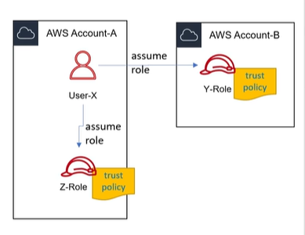

# AWS IAM Role (Vai Trò)

**IAM Role** đại diện cho một tập hợp quyền hạn trên AWS. Khái niệm này không giống với khái niệm "Role" (vai trò) của một người dùng thông thường trong các hệ thống phân quyền phần mềm truyền thống (cần lưu ý đặc biệt điều này để tránh nhầm lẫn).

---

## I. Khái niệm và Đặc điểm cốt lõi

*   **Không gắn với thực thể cố định**: IAM Role không có thông tin đăng nhập tĩnh cố định (như Username/Password hay Access Keys dài hạn).
*   **Cấp quyền cho thực thể tương tác**: Được sử dụng khi muốn cấp quyền cho một thực thể (dịch vụ hoặc ứng dụng) tương tác với các tài nguyên (Resources) khác trên AWS. 
*   **Trường hợp sử dụng phổ biến**: Gắn trực tiếp vào các tài nguyên tính toán như **EC2**, **Lambda**, **Containers (ECS/EKS)** để chúng tự động có quyền tương tác với S3, RDS, DynamoDB... mà không cần lưu trữ Access Keys trên máy chủ.

---

## II. IAM Assume Role và AWS Security Token Service (STS)

**Assume Role** là tính năng cho phép chúng ta yêu cầu **AWS STS (Security Token Service)** cung cấp một bộ thông tin xác thực bảo mật tạm thời (**temporary security credentials**) để có thể truy cập các tài nguyên (Resources) mà bình thường chúng ta không có quyền truy cập trực tiếp.

### 1. Bộ thông tin xác thực tạm thời (Temporary Credentials) bao gồm:
*   **Access Key ID** (Khóa truy cập tạm thời).
*   **Secret Access Key** (Khóa bảo mật tạm thời).
*   **Session Token / Temporary Token** (Token phiên làm việc, bắt buộc phải đính kèm khi gửi yêu cầu API).

> [!NOTE]
> Bộ credentials tạm thời này chỉ có hiệu lực trong một khoảng thời gian nhất định (mặc định là 1 giờ, có thể cấu hình từ 15 phút đến 12 giờ) và sẽ tự động hết hạn, giúp tăng cường tính bảo mật so với Access Key dài hạn.

### 2. Mô hình hoạt động (Same-account & Cross-account)
Hành động **Assume Role** có thể thực hiện trên:
*   **Cùng một tài khoản (Same-account)**: Ví dụ, User-X trong Account-A giả lập thành Z-Role trong cùng Account-A để có thêm quyền hạn thực hiện tác vụ đặc biệt (như deploy, quản trị).
*   **Khác tài khoản (Cross-account)**: Ví dụ, User-X trong Account-A giả lập thành Y-Role nằm trong Account-B để quản trị tài nguyên của Account-B mà không cần phải tạo user mới trên Account-B.

### 3. Các trường hợp sử dụng phổ biến (Use Cases)
*   **Cấp quyền tạm thời**: Cho phép ứng dụng hoặc user thực hiện tác vụ đặc quyền trong thời gian ngắn mà không cần tạo nhiều tài khoản hoặc phát hành access key dài hạn.
*   **Quản lý tập trung (Single-Sign-On - SSO)**: Xác thực người dùng thông qua hệ thống định danh nội bộ (như Active Directory, Okta) và ánh xạ họ vào các IAM Role tương ứng trên AWS thay vì phải tạo IAM User thủ công trên từng Account.
*   **Cross-account Access**: Hỗ trợ môi trường Multi-Account (ví dụ: tài khoản Dev, Staging, Prod riêng biệt) bằng cách cho phép đội ngũ vận hành từ tài khoản trung tâm Assume Role vào các tài khoản con tương ứng.

---

## III. Lưu ý quan trọng khi triển khai (Troubleshooting Guard)

> [!WARNING]
> **Quy tắc bất di bất dịch**: Một tài nguyên trên AWS **không thể** tương tác với bất kỳ tài nguyên nào khác nếu nó không được gán **Role** với các quyền hạn (Permissions) thích hợp.
>
> Đây là nguyên nhân phổ biến nhất khiến các nhà phát triển và kỹ sư DevOps tốn rất nhiều thời gian để gỡ lỗi (troubleshooting) hệ thống khi mới bắt đầu. Nếu ứng dụng báo lỗi từ chối truy cập (Access Denied / Unauthorized), hãy kiểm tra ngay:
> 1. Tài nguyên (như EC2/Lambda) đã được gán IAM Role chưa?
> 2. IAM Role đó đã được đính kèm Permissions Policy chính xác chưa?
> 3. Trust Policy của Role đã cho phép dịch vụ đó giả lập vai trò chưa?
