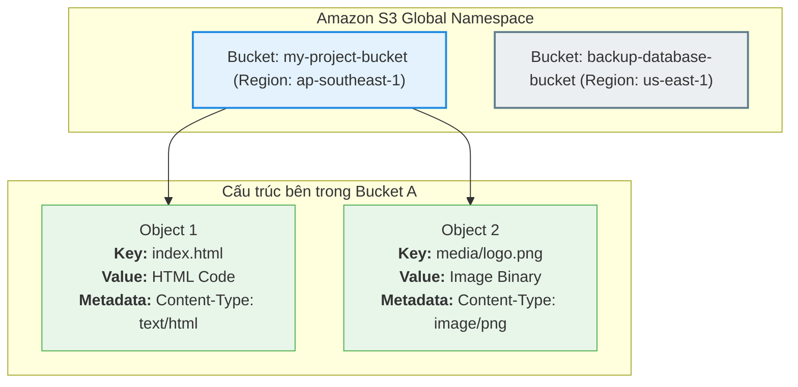

# Amazon S3 (Simple Storage Service)

## I. Tổng quan về Amazon S3

**Amazon Simple Storage Service (Amazon S3)** là một dịch vụ lưu trữ đối tượng (Object Storage) được cung cấp bởi AWS. Đây là một trong những dịch vụ nền tảng và phổ biến nhất của AWS, mang lại khả năng mở rộng (scalability), độ sẵn sàng dữ liệu (data availability), bảo mật (security) và hiệu năng (performance) hàng đầu ngành công nghiệp.

* **Lưu trữ dạng Object**: Khác với Block Storage (như EBS volume) hay File Storage (như EFS), S3 lưu trữ dữ liệu dưới dạng các **đối tượng (Objects)**. Mỗi đối tượng bao gồm dữ liệu (file), metadata (thông tin mô tả dữ liệu) và một khóa duy nhất (Key) dùng làm định danh.
* **Quy mô không giới hạn**: Bạn có thể lưu trữ lượng dữ liệu khổng lồ từ vài Megabytes đến hàng Petabytes mà không cần lo lắng về việc phân bổ hay quản lý dung lượng ổ đĩa vật lý.

---

## II. Các Khái Niệm Cốt Lõi Trong Amazon S3

Để làm việc hiệu quả với Amazon S3, bạn cần hiểu rõ các khái niệm cơ bản sau:

### 1. Bucket (Thùng chứa)
* **Định nghĩa**: Bucket là một container chứa các đối tượng (Objects) được lưu trữ trên S3. Bạn có thể coi Bucket giống như một thư mục gốc (root directory).
* **Tên Bucket là duy nhất trên toàn cầu (Globally Unique)**: Tên của mỗi Bucket trên S3 không được trùng nhau trên toàn bộ hệ thống AWS (không chỉ riêng tài khoản của bạn hay một Region cụ thể). Ví dụ, nếu ai đó đã tạo bucket tên là `my-artifacts`, bạn sẽ không thể tạo thêm bucket có tên đó nữa.
* **Xác định Region**: Khi tạo một Bucket, bạn phải chọn Region vật lý nơi AWS sẽ lưu trữ dữ liệu của bucket đó nhằm tối ưu hóa độ trễ và chi phí.

### 2. Object (Đối tượng/Tệp tin)
* **Định nghĩa**: Object là đơn vị lưu trữ cơ bản trong S3 (đại diện cho các tệp tin của bạn). Một Object bao gồm các thành phần:
  * **Key (Khóa)**: Là đường dẫn hoặc tên file duy nhất trong Bucket dùng để định danh đối tượng (ví dụ: `images/avatar.png`).
  * **Value (Giá trị/Dữ liệu)**: Nội dung thực tế của file bạn tải lên (chấp nhận mọi định dạng: text, ảnh, video, zip, v.v.). Dung lượng tối đa của một Object đơn lẻ là **5 TB**.
  * **Metadata (Siêu dữ liệu)**: Tập hợp các cặp key-value lưu trữ thông tin về đối tượng (ví dụ: loại tệp `Content-Type`, ngày tạo, hoặc metadata tự định nghĩa).
  * **Version ID**: Định danh phiên bản của đối tượng (sử dụng khi bật tính năng S3 Versioning).

### Sơ đồ cấu trúc Bucket và Object trên S3

---

## III. Các Tính Năng Nổi Bật Của Amazon S3

S3 cung cấp nhiều tính năng quản lý (managed features) mạnh mẽ giúp tối ưu hóa, tổ chức và bảo vệ dữ liệu đáp ứng mọi nhu cầu của doanh nghiệp:

1. **Độ bền dữ liệu cực cao (Durability)**
   * S3 được thiết kế để cung cấp độ bền lên tới **99.999999999% (11 con số 9)** cho các đối tượng. Dữ liệu của bạn được tự động sao lưu và phân tán trên tối thiểu 3 Availability Zones (AZs) vật lý khác nhau trong cùng một Region để phòng tránh thiên tai hoặc sự cố phần cứng.
2. **Quản lý phiên bản (S3 Versioning)**
   * Cho phép giữ lại nhiều phiên bản của một đối tượng trong cùng một bucket. Tính năng này giúp bảo vệ dữ liệu khỏi việc vô tình bị ghi đè hoặc xóa mất, cho phép khôi phục lại các phiên bản cũ một cách dễ dàng.
3. **Quản lý vòng đời dữ liệu (S3 Lifecycle)**
   * Tự động chuyển đổi các đối tượng sang các lớp lưu trữ có chi phí rẻ hơn (như S3 Glacier) hoặc tự động xóa bỏ hoàn toàn sau một khoảng thời gian thiết lập trước nhằm tối ưu hóa chi phí lưu trữ.
4. **Bảo mật và Phân quyền (Security & Compliance)**
   * Hỗ trợ mã hóa dữ liệu tự động (Encryption) cả khi truyền tải (in-transit qua HTTPS) và khi lưu trữ (at-rest qua SSE-S3, SSE-KMS).
   * Kiểm soát quyền truy cập chi tiết thông qua **IAM Policies** (phân quyền cho User/Role), **Bucket Policies** (phân quyền ở mức Bucket), và **S3 Block Public Access** (tính năng chặn truy cập công khai ngoài ý muốn).

---

## IV. Các Trường Hợp Sử Dụng Phổ Biến (Use Cases)

Khách hàng có thể sử dụng S3 để lưu trữ và bảo vệ nhiều loại dữ liệu cho các mục đích khác nhau:

* **Data Lake (Hồ dữ liệu)**: Làm trung tâm lưu trữ dữ liệu thô cho các ứng dụng phân tích Big Data, Machine Learning, kết hợp với các công cụ phân tích như AWS Athena, Redshift Spectrum.
* **Backup & Restore (Sao lưu & Phục hồi)**: Lưu trữ các bản sao lưu database, mã nguồn, cấu hình hệ thống với tính an toàn và độ tin cậy tuyệt đối.
* **Archive (Lưu trữ lưu trữ lâu dài)**: Lưu trữ dữ liệu lịch sử hoặc dữ liệu tuân thủ pháp lý (compliance) với chi phí cực thấp bằng lớp lưu trữ S3 Glacier.
* **Static Website Hosting**: Lưu trữ và trực tiếp phân phối các trang web tĩnh (chỉ gồm HTML, CSS, JS, ảnh) mà không cần thuê máy chủ EC2 hay cài đặt Web Server (Nginx, Apache).
* **Lưu trữ Artifact cho CI/CD**: Lưu trữ build output, mã nguồn nén, Docker layers, hoặc tệp tin cấu hình phục vụ các pipeline tự động hóa Deployment.
* **Ứng dụng Doanh nghiệp & IoT**: Lưu trữ tài liệu, log hệ thống từ các thiết bị IoT, hoặc dữ liệu phương tiện (hình ảnh, video) của các ứng dụng Mobile và Web.
