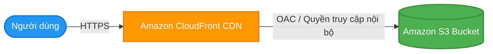

# Hosting Website Tĩnh trên Amazon S3 (S3 Static Website Hosting)

## I. Tổng quan về S3 Static Website Hosting

**Amazon S3 Static Website Hosting** là tính năng cho phép bạn lưu trữ và chạy trực tiếp một trang web tĩnh (Static Website - chỉ bao gồm các tệp tin HTML, CSS, JavaScript, hình ảnh, video...) ngay trên S3 Bucket mà không cần phải thiết lập và quản lý bất kỳ máy chủ nào.

### Ưu điểm vượt trội:
* **Thừa hưởng trọn vẹn đặc tính của S3**: Đảm bảo độ bền dữ liệu cực cao lên tới **99.999999999%** và tính sẵn sàng cao (High Availability).
* **Không cần quản trị máy chủ (Serverless)**: Bạn không phải lo lắng về việc cập nhật hệ điều hành, vá lỗi bảo mật phần mềm, hay nâng cấp máy chủ. Toàn bộ hạ tầng do AWS quản lý tự động.
* **Khả năng tự động mở rộng (Scalability)**: Website tự động xử lý từ vài lượt truy cập đến hàng triệu lượt truy cập đồng thời mà không bị gián đoạn hay cần cấu hình Auto Scaling.
* **Tối ưu chi phí cực lớn**: Bạn chỉ phải trả chi phí rất thấp cho dung lượng lưu trữ thực tế của code và dung lượng băng thông truyền tải dữ liệu (Data Transfer).

---

## II. Cấu hình chia sẻ tài nguyên nguồn gốc chéo (CORS Settings)

Khi host một website tĩnh trên S3, trang web của bạn thường cần tải các tài nguyên (như phông chữ, hình ảnh, hoặc thực hiện gọi API) từ các tên miền khác. Lúc này, bạn cần cấu hình **CORS (Cross-Origin Resource Sharing)**.

* **Mục đích**: CORS là cơ chế bảo mật của trình duyệt giúp ngăn chặn và kiểm soát các yêu cầu tài nguyên từ các website khác. Cấu hình CORS trên S3 giúp bảo vệ tài nguyên của bạn tránh bị khai thác trái phép bởi các trang web lạ.
* **Cấu hình mẫu bằng JSON**:
```json
[
    {
        "AllowedHeaders": ["*"],
        "AllowedMethods": ["GET", "HEAD"],
        "AllowedOrigins": ["https://www.yourdomain.com"],
        "ExposeHeaders": [],
        "MaxAgeSeconds": 3000
    }
]
```

---

## III. Kết hợp với dịch vụ CDN (Amazon CloudFront)

Mặc dù S3 cung cấp sẵn một endpoint URL cho website tĩnh (ví dụ: `http://<bucket-name>.s3-website-<region>.amazonaws.com`), trong thực tế, các doanh nghiệp luôn kết hợp S3 với dịch vụ **Amazon CloudFront (CDN)** vì những lý do bảo mật và hiệu năng sau:

1. **Tăng tốc độ truy cập toàn cầu**: CloudFront sẽ cache nội dung website tĩnh từ S3 tại các Edge Location trên khắp thế giới, giúp người dùng tải trang cực nhanh với độ trễ tối thiểu dù ở bất kỳ khu vực địa lý nào.
2. **Hỗ trợ giao thức bảo mật HTTPS & Tên miền tùy chỉnh (Custom Domain)**: Bản thân S3 Website Endpoint không hỗ trợ HTTPS khi sử dụng tên miền riêng (ví dụ: `https://mycompany.com`). Khi đặt CloudFront làm CDN phía trước, bạn có thể dễ dàng cấu hình chứng chỉ SSL/TLS miễn phí từ **ACM** để bảo mật website.
3. **Bảo mật tuyệt đối thông qua OAC (Origin Access Control)**: Bạn có thể chặn hoàn toàn truy cập public trực tiếp vào S3 Bucket, buộc tất cả traffic phải đi qua CloudFront. Điều này giúp ngăn ngừa việc lộ URL S3 gốc và tránh các cuộc tấn công khai thác băng thông trực tiếp trên bucket.



---

## IV. Triển khai từ các Frontend Frameworks phổ biến

Hầu hết các framework phát triển giao diện hiện nay như **React (Next.js), Angular, Vue, hay Svelte** đều hỗ trợ cơ chế biên dịch dự án thành các tệp tin tĩnh (Static Export):

1. **Quy trình build**: Sau khi lập trình viên code xong, chạy lệnh build (ví dụ: `npm run build` hoặc `yarn build`), framework sẽ biên dịch toàn bộ mã nguồn thành một thư mục chứa các tệp HTML, CSS, JS tĩnh (thường là thư mục `dist/` hoặc `build/`).
2. **Deploy lên S3**: Bạn chỉ cần upload toàn bộ nội dung bên trong thư mục biên dịch này lên S3 Bucket đã bật tính năng Static Website Hosting là website đã có thể chạy trực tuyến ngay lập tức. Quy trình này rất dễ dàng để tự động hóa hoàn toàn bằng các pipeline CI/CD (GitHub Actions, GitLab CI).

---

## V. Hướng dẫn thực hành (Hands-on Lab)

Để thực hành upload mã nguồn bằng AWS CLI, kích hoạt tính năng static website hosting và cấu hình phân quyền trên AWS Console, vui lòng xem hướng dẫn chi tiết tại:
* [5. Amazon S3 Static Website Hosting Lab (Thực hành Web Server Tĩnh)](../../deploy/3.%20S3/5.%20Amazon%20S3%20Static%20Website%20Hosting%20Lab.md)
