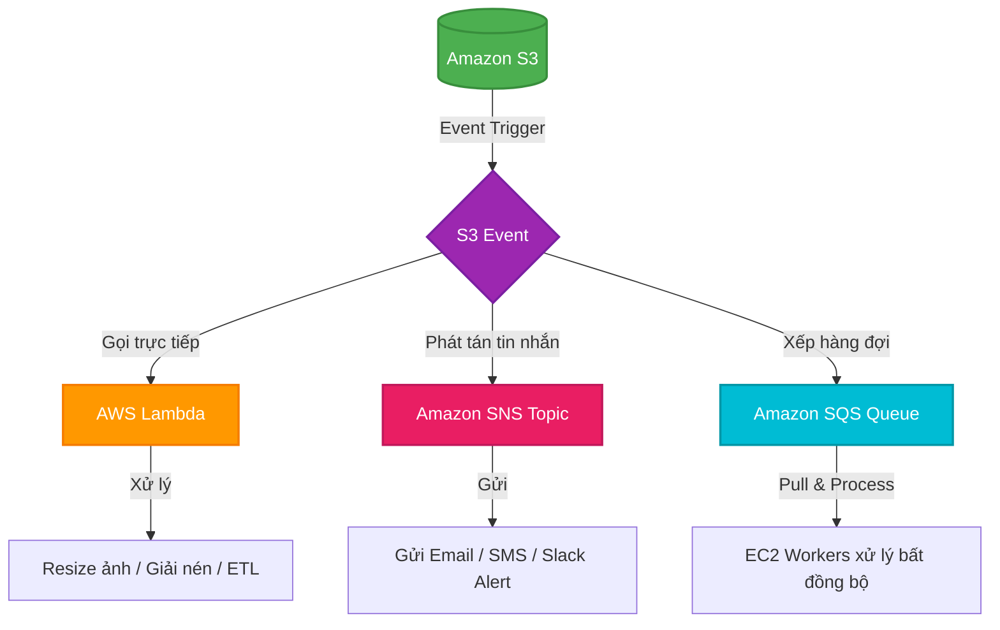

# Cơ chế Kích hoạt Sự kiện S3 (Amazon S3 Event Notifications)

## I. Tổng quan về S3 Event Notifications

**Amazon S3 Event Notifications** (hay S3 Event Trigger) là cơ chế cho phép S3 tự động phát hiện và gửi thông điệp thông báo khi có các thay đổi đối với các đối tượng (Objects) bên trong bucket (ví dụ: khi tải lên đối tượng mới hoặc khi xóa một đối tượng hiện có).

Tính năng này giúp bạn xây dựng các kiến trúc hướng sự kiện (Event-driven Architecture) phản hồi thời gian thực mà không cần phải chạy code giám sát (polling) bucket liên tục.

### Các loại sự kiện S3 phổ biến:
* **`s3:ObjectCreated:*`**: Kích hoạt khi có đối tượng mới được tạo thông qua các hành động `Put`, `Post`, `Copy`, hoặc hoàn thành `Multipart Upload`.
* **`s3:ObjectRemoved:*`**: Kích hoạt khi một đối tượng bị xóa vĩnh viễn (`Delete`) hoặc khi một Delete Marker được tạo ra (`DeleteMarkerCreated`).
* **`s3:ObjectRestore:*`**: Kích hoạt khi bắt đầu hoặc hoàn thành việc khôi phục một đối tượng từ các lớp lưu trữ lạnh Glacier.

---

## II. Các dịch vụ đích nhận sự kiện (Trigger Targets)

Khi một sự kiện xảy ra, Amazon S3 sẽ đóng gói thông tin chi tiết của sự kiện đó (tên bucket, tên object, dung lượng, thời gian, IP...) thành định dạng JSON và gửi đến một trong ba dịch vụ đích hỗ trợ sau:

1. **AWS Lambda (Serverless Compute)**:
   * S3 kích hoạt trực tiếp một Lambda Function để thực thi một đoạn mã xử lý sự kiện ngay lập tức.
   * Đây là đích đến phổ biến nhất cho các bài toán xử lý dữ liệu tự động.
2. **Amazon SNS (Simple Notification Service)**:
   * S3 gửi thông báo tới một SNS Topic. Từ đây, SNS có thể phân phối (fan-out) thông báo này tới nhiều kênh nhận khác nhau cùng một lúc như Email, SMS, Slack, hoặc các dịch vụ HTTP/HTTPS Endpoint.
3. **Amazon SQS (Simple Queue Service)**:
   * S3 gửi thông báo vào một hàng đợi tin nhắn (Message Queue). Các ứng dụng worker hoặc máy chủ EC2 phía sau sẽ chủ động pull tin nhắn từ SQS để xử lý bất đồng bộ, tránh việc quá tải hệ thống khi lượng upload cùng lúc quá lớn.

---

## III. Các trường hợp sử dụng tiêu biểu (Use Cases)

Sự kết hợp giữa S3 Event Notifications và AWS Lambda tạo nên giải pháp tự động hóa cực kỳ mạnh mẽ cho hệ thống DevOps và Cloud:

### 1. Tự động thay đổi kích thước hình ảnh (Image Resizing)
* **Quy trình**: Người dùng upload một hình ảnh độ phân giải cao lên S3 bucket. Sự kiện `s3:ObjectCreated:Put` được kích hoạt → Gọi Lambda function.
* **Hành động**: Lambda tự động tải ảnh đó xuống, thực hiện resize thành các kích thước khác nhau (ví dụ: `thumbnail`, `medium`, `large`) và lưu các tệp tin mới vào các thư mục tương ứng trong S3.

### 2. Tự động giải nén tệp tin (Zip Decompression)
* **Quy trình**: Khi lập trình viên hoặc người dùng upload một file nén dạng `.zip` hoặc `.tar.gz` lên S3 → Trigger Lambda.
* **Hành động**: Lambda giải nén tệp tin ngay trong bộ nhớ ảo và tải ngược các tệp tin đơn lẻ bên trong lên các thư mục đích tương ứng của S3.

### 3. Trích xuất dữ liệu lưu vào Database (ETL CSV to DB)
* **Quy trình**: Hệ thống log hoặc đối tác tải lên một tệp tin dữ liệu dạng `.csv` → Trigger Lambda.
* **Hành động**: Lambda phân tích cú pháp dòng của tệp tin CSV, lọc dữ liệu (ETL) và chèn (insert) các bản ghi này vào cơ sở dữ liệu như Amazon RDS (MySQL/PostgreSQL) hoặc Amazon DynamoDB.

### 4. Cảnh báo bảo mật khi xóa dữ liệu (Delete Notification)
* **Quy trình**: Ai đó thực hiện xóa một tệp tin tài liệu quan trọng khỏi bucket → Kích hoạt sự kiện `s3:ObjectRemoved:*` → Gửi tới SNS.
* **Hành động**: SNS tự động gửi cảnh báo qua Email hoặc đẩy tin nhắn Slack tới Quản trị viên hệ thống (Operator) để kịp thời kiểm tra hành vi truy cập.

---

## IV. Hướng dẫn thực hành (Hands-on Lab)

Xem hướng dẫn từng bước thiết lập thực tế S3 Event Trigger liên kết với Lambda tại đây: [6. Amazon S3 Event Notifications Lab](../../lab/3. S3/6. Amazon S3 Event Notifications Lab.md).
