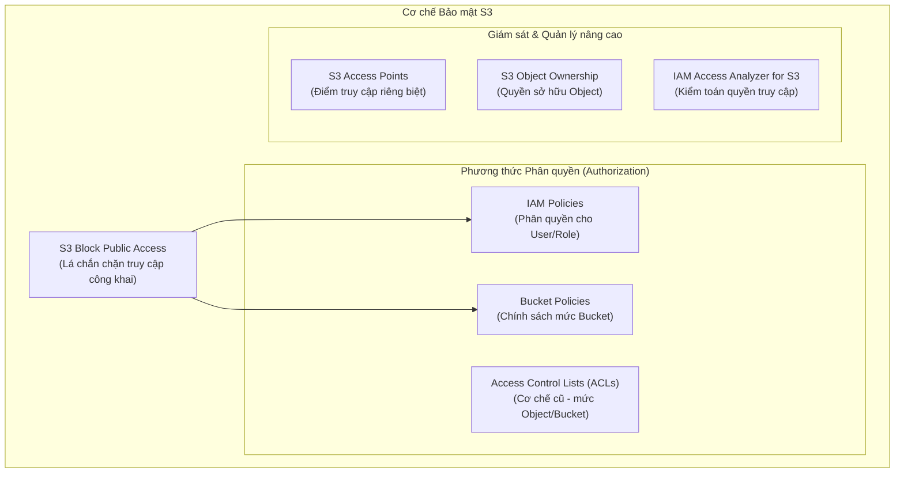

# Các Tính Năng Của Amazon S3 (S3 Features)

## I. Tổng quan về các tính năng của Amazon S3

Để đáp ứng các yêu cầu khắt khe của doanh nghiệp về tối ưu hóa chi phí, bảo mật thông tin, tuân thủ pháp lý và tự động hóa quy trình, Amazon S3 cung cấp một tập hợp đa dạng các tính năng quản lý dữ liệu mạnh mẽ. 

Các tính năng này bao gồm các nhóm tính năng và cơ chế hoạt động chính sau:
1. **Storage Classes (Lớp lưu trữ)**: Tối ưu chi phí dựa trên tần suất truy cập.
2. **Storage Management (Quản lý lưu trữ)**: Kiểm soát phiên bản (versioning), vòng đời (lifecycle), sao chép (replication) và khóa đối tượng (object lock).
3. **Access Management (Quản lý truy cập)**: Bảo mật và phân quyền chi tiết.
4. **Data Processing (Xử lý dữ liệu)**: Tích hợp sự kiện và xử lý dữ liệu tự động.
5. **Logging & Monitoring (Nhật ký & Giám sát)**: Giám sát tự động và thủ công các hoạt động trên bucket.
6. **Analytics & Insights (Phân tích & Thống kê)**: Tối ưu hóa lưu trữ dựa trên phân tích cấu trúc dữ liệu.
7. **Strong Consistency (Tính nhất quán mạnh mẽ)**: Cơ chế đảm bảo dữ liệu mới nhất được truy xuất ngay lập tức sau thao tác ghi/xóa.

---

## II. Storage Classes (Các lớp lưu trữ)

S3 cung cấp nhiều lớp lưu trữ khác nhau phù hợp với nhu cầu sử dụng, tần suất truy cập, yêu cầu về độ bền (durability), độ sẵn sàng (availability) và thời gian lưu trữ tối thiểu. Việc lựa chọn đúng lớp lưu trữ giúp khách hàng tối ưu hóa tối đa chi phí:

* **S3 Standard (Mặc định)**: Dành cho dữ liệu được truy cập thường xuyên (hot data). Độ trễ thấp và throughput cao.
* **S3 Intelligent-Tiering**: Tự động tối ưu chi phí bằng cách di chuyển dữ liệu giữa các tier (truy cập thường xuyên và không thường xuyên) dựa trên lịch sử truy cập thực tế của người dùng mà không cần can thiệp thủ công hay gây ảnh hưởng đến hiệu năng.
* **S3 Standard-Infrequent Access (S3 Standard-IA)**: Dành cho dữ liệu ít truy cập nhưng yêu cầu thời gian truy xuất nhanh khi cần thiết (ví dụ: dữ liệu khôi phục sau thảm họa, backups). Chi phí lưu trữ rẻ hơn Standard nhưng có thêm phí truy xuất dữ liệu.
* **S3 One Zone-Infrequent Access (S3 One Zone-IA)**: Tương tự Standard-IA nhưng dữ liệu chỉ được lưu trữ tại duy nhất **một** Availability Zone (AZ). Lớp này giúp tiết kiệm thêm 20% chi phí so với Standard-IA, thích hợp cho dữ liệu phụ có thể tái tạo được nếu AZ đó gặp sự cố.
* **S3 Glacier Instant Retrieval**: Dành cho dữ liệu lưu trữ dạng archive (lưu trữ lâu dài) nhưng cần truy xuất tức thì (trong vài mili-giây).
* **S3 Glacier Flexible Retrieval (Trước đây là S3 Glacier)**: Dành cho dữ liệu lưu trữ dài hạn không cần truy xuất ngay lập tức. Thời gian lấy dữ liệu linh hoạt từ vài phút đến vài giờ.
* **S3 Glacier Deep Archive**: Lớp lưu trữ có chi phí rẻ nhất của AWS. Phù hợp cho dữ liệu lưu trữ tuân thủ pháp lý (compliance) chỉ cần truy cập 1-2 lần một năm. Thời gian lấy dữ liệu mất từ 12 đến 48 giờ.

---

## III. Storage Management (Quản lý lưu trữ)

S3 cung cấp các tính năng tự động hóa và quản lý dữ liệu ở quy mô lớn:

### 1. S3 Versioning (Quản lý phiên bản)
* **Khái niệm**: Sử dụng khi có nhu cầu lưu trữ nhiều phiên bản (version) của cùng một đối tượng (object) trong cùng một bucket.
* **Lợi ích**:
  * Tránh được việc mất mát dữ liệu khi thao tác xóa nhầm hoặc ghi đè (có thể khôi phục lại các phiên bản trước đó một cách dễ dàng).
  * Đóng vai trò là nền tảng cốt lõi, bắt buộc phải kích hoạt để có thể sử dụng các tính năng nâng cao khác như **S3 Replication** và **S3 Object Lock**.
* **Đặc điểm & Lưu ý quan trọng**:
  * **Chi phí**: Việc lưu giữ nhiều phiên bản đồng nghĩa với việc tổng dung lượng lưu trữ tăng lên, do đó **chi phí sẽ tăng lên** tương ứng so với khi không bật versioning.
  * **Tạm ngưng Versioning (Versioning Suspended)**:
    * AWS không hỗ trợ "tắt" hoàn toàn Versioning sau khi đã bật, mà chỉ cho phép chuyển sang trạng thái **Tạm ngưng (Suspended)**.
    * Khi tạm ngưng:
      * Những đối tượng được sinh ra/tồn tại **trước khi tạm ngưng** vẫn sẽ tiếp tục lưu trữ đầy đủ các phiên bản cũ đã được tạo.
      * Những đối tượng mới tải lên hoặc ghi đè **sau khi tạm ngưng** sẽ không được tạo thêm phiên bản mới (chúng sẽ có `Version ID` mặc định là `null`).

### 2. S3 Lifecycle (Quản lý vòng đời)
* Tự động quản lý vòng đời của đối tượng thông qua hai loại hành động cấu hình:
  * **Transition Actions (Chuyển đổi lớp lưu trữ)**: Tự động chuyển đối tượng sang lớp lưu trữ rẻ hơn sau N ngày (ví dụ: Chuyển từ Standard sang Standard-IA sau 30 ngày, và sang Glacier sau 90 ngày).
  * **Expiration Actions (Hết hạn và xóa)**: Tự động xóa vĩnh viễn đối tượng hoặc các phiên bản cũ của đối tượng sau một khoảng thời gian nhất định.

### 3. S3 Object Lock (Khóa đối tượng)
* Ngăn chặn việc ghi đè hoặc xóa đối tượng trong một khoảng thời gian cố định hoặc vô thời hạn theo mô hình **WORM (Write Once, Read Many)**. Tính năng này cực kỳ quan trọng đối với các ngành nghề yêu cầu tuân thủ quy định pháp lý nghiêm ngặt hoặc chống mã độc tống tiền (ransomware).

### 4. S3 Replication (Sao chép dữ liệu)
* Tự động sao chép các đối tượng (và siêu dữ liệu của chúng) sang một bucket khác một cách không đồng bộ:
  * **Cross-Region Replication (CRR)**: Sao chép dữ liệu sang một Region khác nhằm đáp ứng yêu cầu khắc phục thảm họa hoặc giảm độ trễ cho người dùng địa phương.
  * **Same-Region Replication (SRR)**: Sao chép dữ liệu giữa các bucket trong cùng một Region cho các mục đích phân quyền hoặc tổng hợp log.

### 5. S3 Batch Operations (Thao tác hàng loạt)
* Cho phép thực hiện một hành động duy nhất (như copy, thay đổi tag, khôi phục từ Glacier, chạy Lambda function) trên hàng tỷ đối tượng chứa hàng Petabytes dữ liệu một cách đơn giản và nhanh chóng thông qua một yêu cầu công việc (Job).

---

## IV. Access Management (Quản lý truy cập)

Bảo mật dữ liệu trên S3 là nhiệm vụ tối quan trọng. AWS cung cấp nhiều lớp cơ chế phân quyền và kiểm soát truy cập chặt chẽ:

### 1. S3 Block Public Access
* Lá chắn bảo vệ cấp cao nhất, ngăn chặn việc cấu hình sai khiến Bucket hoặc Object vô tình bị công khai ra ngoài Internet. AWS khuyến nghị luôn bật tính năng này trừ khi Bucket được dùng để chạy Static Website.

### 2. IAM Policies
* Phân quyền dựa trên danh tính người dùng (Identity-based). Xác định rõ IAM User hoặc IAM Role được phép thực hiện những hành động nào trên các S3 Bucket cụ thể.

### 3. Bucket Policies
* Phân quyền dựa trên tài nguyên (Resource-based). Đính kèm trực tiếp chính sách JSON vào S3 Bucket để kiểm soát ai (bao gồm cả tài khoản AWS khác) có quyền truy cập vào bucket hoặc các tiền tố (thư mục) bên trong.

### 4. S3 Access Points
* Tạo ra các điểm truy cập riêng biệt với các chính sách phân quyền chuyên biệt dành cho các nhóm ứng dụng khác nhau khi truy cập chung vào một S3 Bucket lớn. Giúp quản lý phân quyền dễ dàng hơn khi quy mô hệ thống tăng lên.

### 5. Access Control Lists (ACLs)
* Một phương thức phân quyền truyền thống (legacy) ở mức Bucket và từng Object cụ thể. Hầu hết các usecase hiện đại đều khuyến nghị tắt ACLs và sử dụng Bucket Policy/IAM Policy để quản lý phân quyền tập trung.

### 6. S3 Object Ownership
* Thiết lập quyền sở hữu đối với các đối tượng được tải lên bucket. Khi tắt ACLs, chủ sở hữu Bucket sẽ tự động sở hữu và có toàn quyền kiểm soát mọi object được tải lên bởi bất kỳ tài khoản nào khác.

### 7. IAM Access Analyzer for S3
* Công cụ phân tích tự động kiểm tra và cảnh báo nếu có bất kỳ S3 Bucket nào đang có cấu hình cho phép truy cập công khai hoặc chia sẻ ngoài ý muốn với tài khoản AWS khác bên ngoài tổ chức.

---

## V. Data Processing (Xử lý dữ liệu)

S3 không chỉ là nơi lưu trữ tĩnh, nó có thể trực tiếp tham gia vào các luồng xử lý dữ liệu động của doanh nghiệp thông qua việc kết hợp với các dịch vụ Serverless:

* **S3 Event Notifications**: Tự động gửi thông báo khi có các sự kiện xảy ra trên bucket (như tạo mới đối tượng `ObjectCreated`, xóa đối tượng `ObjectRemoved`).
* **Tích hợp dịch vụ**: Các thông báo sự kiện này có thể kích hoạt các dịch vụ sau để xử lý tự động:
  * **AWS Lambda**: Kích hoạt hàm xử lý tự động ngay lập tức (ví dụ: tự động resize ảnh khi có ảnh mới upload, giải nén file log, phân tích dữ liệu).
  * **Amazon SNS (Simple Notification Service)**: Gửi thông báo đến email, điện thoại hoặc chuyển tiếp sự kiện đến các hệ thống khác.
  * **Amazon SQS (Simple Queue Service)**: Đưa sự kiện vào hàng đợi tin nhắn để các ứng dụng backend xử lý dần dần (decoupling), đảm bảo không bị mất mát dữ liệu khi tải cao.

---

## VI. Logging & Monitoring (Nhật ký & Giám sát)

S3 cung cấp các công cụ ghi log và giám sát đa dạng từ tự động đến thủ công để đảm bảo tính minh bạch và truy vết hoạt động bảo mật:

* **Auto Logging and Monitoring (Giám sát và truy vết tự động)**:
  * Tích hợp với **AWS CloudTrail**: Tự động ghi lại các API call thực hiện trên S3 bucket (như tạo/xóa bucket, cấu hình policy), giúp kiểm tra bảo mật (security auditing) và phát hiện các hành động không hợp lệ.
  * Tích hợp với **Amazon CloudWatch**: Giám sát hiệu năng và lưu lượng (như dung lượng bucket, số lượng object, số lượng request) theo thời gian thực dưới dạng biểu đồ.
* **Server Access Logging (Giám sát thủ công/Chi tiết)**:
  * Cho phép cấu hình ghi nhật ký truy cập máy chủ chi tiết. Mỗi khi có request gửi tới bucket (bất kể đọc, ghi, thành công hay thất bại), một bản ghi chi tiết (record) sẽ được lưu lại (bao gồm IP người gửi, thời gian, phương thức request, mã lỗi, v.v.). Các log file này được lưu dưới dạng tệp văn bản trong một S3 bucket đích khác để phục vụ việc phân tích chuyên sâu.

---

## VII. Storage Analytics & Insights (Phân tích & Thống kê)

S3 cung cấp các tính năng thông minh để phân tích thói quen sử dụng dữ liệu, từ đó giúp người quản trị đưa ra quyết định tối ưu hóa tài nguyên:

* **S3 Storage Lens**: Công cụ cung cấp dashboard hiển thị cái nhìn trực quan toàn diện về việc sử dụng lưu trữ và các hoạt động trên toàn bộ tài khoản AWS của bạn, đồng thời đưa ra các đề xuất tối ưu chi phí và tăng cường bảo mật.
* **S3 Storage Class Analysis (Phân tích lớp lưu trữ)**: Tự động phân tích tần suất truy cập của dữ liệu để giúp bạn xác định khi nào nên chuyển đổi dữ liệu ít truy cập sang lớp lưu trữ rẻ hơn (IA hoặc Glacier), hỗ trợ việc lập kế hoạch cho cấu hình S3 Lifecycle.

---

## VIII. Strong Consistency (Tính nhất quán mạnh mẽ)

Amazon S3 cung cấp tính nhất quán mạnh mẽ (**Strong Read-After-Write Consistency**) cho toàn bộ các hoạt động ghi mới (PUT) và xóa (DELETE) các đối tượng:

* **Trước đây (Eventual Consistency)**: S3 sử dụng cơ chế nhất quán cuối cùng. Khi bạn ghi đè hoặc xóa một đối tượng, có thể mất một vài giây để thay đổi đó đồng bộ đến tất cả các máy chủ của AWS trên toàn cầu. Trong khoảng thời gian đó, một request đọc có thể vẫn nhận về dữ liệu cũ.
* **Hiện tại (Strong Consistency)**: Ngay sau khi một thao tác ghi đè (PUT) thành công hoặc xóa (DELETE) thành công đối tượng được thực hiện, bất kỳ yêu cầu đọc tiếp theo nào (GET hoặc LIST) cũng sẽ nhận được dữ liệu mới nhất ngay lập tức mà không có bất kỳ độ trễ đồng bộ nào.
