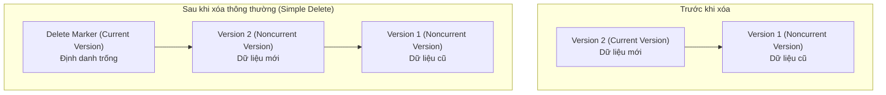

# Amazon S3 Versioning (Quản lý phiên bản)

## I. Tổng quan về S3 Versioning

**Amazon S3 Versioning** là một tính năng ở mức Bucket (Bucket-level feature) cho phép bạn lưu trữ và quản lý nhiều phiên bản khác nhau của cùng một đối tượng (Object) trong cùng một vùng lưu trữ (S3 Bucket). 

Khi tính năng này được kích hoạt, bất kỳ hành động tải lên (upload), chỉnh sửa (modify) hoặc xóa (delete) đối tượng nào cũng sẽ được ghi nhận dưới dạng một phiên bản mới, trong khi các phiên bản cũ vẫn được lưu trữ nguyên vẹn trong hệ thống.

---

## II. Lý do và Lợi ích khi sử dụng S3 Versioning

S3 Versioning đóng vai trò cực kỳ quan trọng trong kiến trúc hệ thống lưu trữ nhờ các lợi ích vượt trội:

1. **Bảo vệ dữ liệu toàn diện**: 
   * Tránh mất mát dữ liệu do các sự cố vô tình xóa nhầm hoặc vô tình ghi đè tệp tin từ phía người dùng hoặc ứng dụng.
   * Cho phép dễ dàng truy xuất và khôi phục lại bất kỳ phiên bản nào của dữ liệu tại một thời điểm cụ thể trong quá khứ.
2. **Nền tảng cho các tính năng bảo mật nâng cao**:
   * **S3 Replication**: Tính năng tự động sao chép dữ liệu chéo tài khoản hoặc vùng địa lý (CRR/SRR) bắt buộc phải bật S3 Versioning ở cả bucket nguồn và bucket đích.
   * **S3 Object Lock**: Cơ chế khóa ghi đè (WORM) yêu cầu kích hoạt S3 Versioning để thiết lập chính sách lưu giữ không thể sửa đổi cho từng phiên bản đối tượng.
3. **Phòng chống Ransomware**: 
   * Nếu dữ liệu của bạn bị mã độc tấn công và mã hóa (ghi đè bằng tệp tin lỗi), bạn chỉ cần khôi phục lại phiên bản chưa bị mã hóa ngay trước thời điểm bị tấn công.

---

## III. Cơ chế hoạt động của S3 Versioning

Khi bật Versioning, mỗi đối tượng trong Bucket sẽ được gán thêm một trường định danh phiên bản duy nhất gọi là **Version ID**. Bất kỳ request nào tác động đến đối tượng sẽ hoạt động như sau:

### 1. Thao tác tải lên và ghi đè (PUT / POST)
* Khi bạn tải lên một tệp tin trùng tên (trùng Key) với tệp đã có:
  * AWS S3 không ghi đè trực tiếp lên tệp cũ.
  * Thay vào đó, S3 sẽ tạo ra một phiên bản đối tượng mới với một **Version ID** duy nhất và đưa nó lên làm **Current Version** (phiên bản hiện tại).
  * Phiên bản cũ sẽ được chuyển trạng thái thành **Noncurrent Version** (phiên bản cũ/không hiện tại) nhưng vẫn được lưu trữ an toàn trong bucket.

### 2. Thao tác xóa đối tượng (DELETE)
Khi bạn thực hiện lệnh xóa một đối tượng trong một bucket đã bật Versioning, cơ chế xử lý sẽ có sự khác biệt lớn tùy thuộc vào cách bạn thực hiện lệnh xóa:

#### a. Xóa thông thường (Simple Delete - không chỉ định Version ID)
* S3 không xóa vĩnh viễn dữ liệu.
* Thay vào đó, S3 sẽ tạo ra một đối tượng đặc biệt gọi là **Delete Marker** (đánh dấu xóa) và đặt nó làm **Current Version**.
* Đối tượng này lúc này sẽ xuất hiện như đã bị xóa khi bạn gọi API hoặc xem trên AWS Console thông thường (không bật chế độ hiển thị phiên bản).
* Các phiên bản cũ trước đó vẫn tồn tại dưới dạng **Noncurrent Versions**.

#### b. Xóa vĩnh viễn (Permanent Delete - chỉ định cụ thể Version ID)
* Nếu bạn chỉ định rõ **Version ID** của một phiên bản cụ thể khi thực hiện hành động DELETE:
  * Phiên bản đó sẽ bị **xóa vĩnh viễn** khỏi bucket và không thể khôi phục lại.
* Nếu bạn xóa chính tệp **Delete Marker** (chỉ định Version ID của Delete Marker):
  * Delete Marker sẽ bị gỡ bỏ.
  * Phiên bản ngay trước đó sẽ tự động trở lại làm **Current Version** (khôi phục lại đối tượng như chưa từng bị xóa).

---

## IV. Các trạng thái của Versioning trên một S3 Bucket

Một S3 Bucket chỉ có thể nằm trong một trong ba trạng thái Versioning sau:

| Trạng thái | Đặc điểm & Hành vi đối tượng |
| :--- | :--- |
| **Unversioned** *(Mặc định khi tạo)* | * Không lưu giữ lịch sử phiên bản.   * Mọi tệp tin tải lên trùng tên sẽ bị ghi đè hoàn toàn.   * Toàn bộ đối tượng trong bucket có Version ID mặc định là `null`. |
| **Versioning Enabled** *(Đã kích hoạt)* | * Sẽ tạo ra một phiên bản mới với Version ID độc nhất cho mỗi lần tải lên/chỉnh sửa.   * Hỗ trợ lưu trữ Delete Marker khi thực hiện thao tác xóa. |
| **Versioning Suspended** *(Tạm ngưng)* | * **Lưu ý quan trọng**: AWS không hỗ trợ "tắt" hoàn toàn Versioning sau khi đã bật, mà bạn chỉ có thể chuyển sang trạng thái **Tạm ngưng (Suspended)**.   * **Hành vi đối với đối tượng trước đó**: Các đối tượng và phiên bản đã tồn tại trước khi tạm ngưng vẫn được giữ nguyên trạng thái cũ (vẫn có đầy đủ các version cũ).   * **Hành vi đối với đối tượng mới**: Các đối tượng được thêm mới hoặc ghi đè sau khi tạm ngưng sẽ không được tạo thêm phiên bản (chúng được lưu với Version ID mặc định là `null` hoặc ghi đè trực tiếp lên phiên bản `null` hiện tại). |

---

## V. Vấn đề chi phí (Cost Implications) khi bật S3 Versioning

> [!IMPORTANT]
> Chi phí lưu trữ của S3 được tính dựa trên tổng dung lượng của **tất cả các phiên bản** (cả Current và Noncurrent) đang tồn tại trong bucket của bạn.

* **Ví dụ thực tế**:
  1. Bạn upload một file có dung lượng **50 MB** lần đầu tiên. (Dung lượng tính phí: 50 MB)
  2. Bạn chỉnh sửa file và tải đè lên lần thứ hai với dung lượng **50 MB**. (Tổng dung lượng tính phí lúc này: **100 MB**, vì S3 đang lưu trữ cả 2 phiên bản độc lập).
  3. Nếu bạn liên tục cập nhật tệp tin tự động qua các script (như ghi file log đè mỗi giờ), dung lượng lưu trữ và chi phí sẽ tăng lên rất nhanh một cách chóng mặt.
* **Giải pháp tối ưu chi phí**:
  * Luôn kết hợp sử dụng **S3 Lifecycle Rules** để tự động dọn dẹp hoặc chuyển đổi các phiên bản cũ không còn sử dụng (**Noncurrent Version Expiration / Transition**) sang các lớp lưu trữ rẻ hơn như S3 Glacier, hoặc tự động xóa vĩnh viễn sau một khoảng thời gian nhất định (ví dụ: chỉ giữ lại các version cũ trong vòng 30 ngày).

---

## VI. Tóm tắt các lưu ý cốt lõi khi thiết kế hệ thống
* **Ransomware Protection**: Phiên bản cũ không thể bị mã hóa trừ khi hacker có quyền truy cập root/admin để xóa vĩnh viễn Version ID cụ thể.
* **MFA Delete**: Để tăng cường bảo mật tối đa, bạn có thể bật tính năng **MFA Delete** (yêu cầu xác thực hai lớp bằng thiết bị MFA) mỗi khi muốn xóa vĩnh viễn một phiên bản đối tượng hoặc thay đổi trạng thái Versioning của Bucket.
* **Sự khác nhau giữa tắt và tạm ngưng**: Nhớ rõ những object sinh ra trước khi tạm ngưng vẫn giữ nguyên nhiều phiên bản, còn object sinh ra sau khi tạm ngưng sẽ không có phiên bản (Version ID = `null`).

---

## VII. Hướng dẫn thực hành (Hands-on Lab)

Để thực hành cấu hình S3 Versioning, kiểm nghiệm việc ghi đè tạo phiên bản mới và cơ chế đánh dấu xóa (Delete Marker) trên giao diện quản lý AWS Console, vui lòng tham khảo hướng dẫn chi tiết từng bước tại:

**[Tài liệu thực hành: 2. Amazon S3 Versioning Lab](../../../deploy/3.%20S3/2.%20Amazon%20S3%20Versioning%20Lab.md)**

*(Đường dẫn thư mục tương đối: `../../deploy/3. S3/2. Amazon S3 Versioning Lab.md`)*
