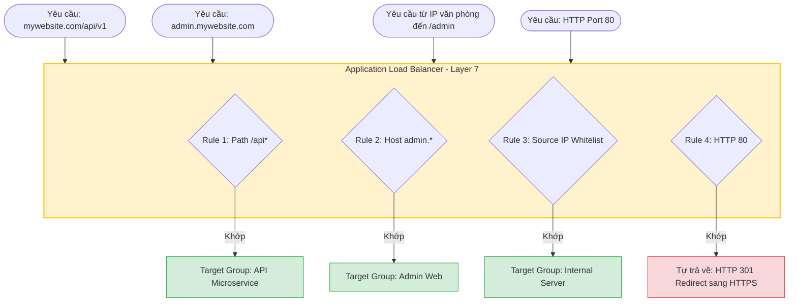
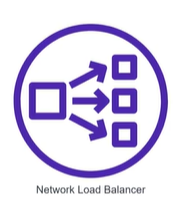
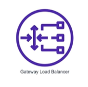
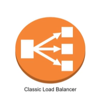
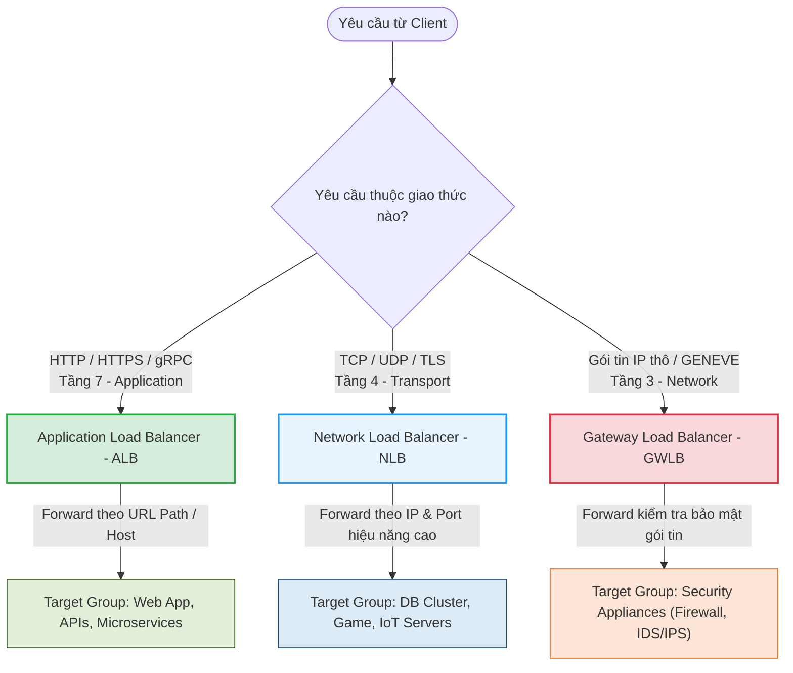

# Phân loại các dòng Elastic Load Balancer (ELB Types)

Trên dịch vụ đám mây AWS, Elastic Load Balancing (ELB) được chia thành nhiều loại khác nhau để tối ưu cho từng mục đích sử dụng. Tiêu chí phân loại chính phụ thuộc vào **tầng hoạt động (Layer) của Load Balancer trong mô hình OSI 7 layers**.

---

## I. Mô hình mạng OSI và Cơ sở phân loại ELB

Mô hình OSI (Open Systems Interconnection) là một mô hình chuẩn hóa gồm 7 tầng để định nghĩa cách thức truyền tải dữ liệu qua mạng. 

Các loại Load Balancer trên AWS hoạt động ở các tầng khác nhau và có khả năng "đọc" dữ liệu gói tin từ tầng đó trở xuống để đưa ra quyết định định tuyến:

*Hình 1: Sơ đồ 7 tầng của mô hình mạng OSI (Open Systems Interconnection).*

### Bảng tóm tắt các tầng OSI liên quan tới Load Balancing:

| Tầng (Layer) | Tên tiếng Anh | Dữ liệu xử lý chính | Thiết bị / Giao thức tiêu biểu | Dòng ELB tương ứng |
|---|---|---|---|---|
| **Layer 7** | Application (Ứng dụng) | Dữ liệu ứng dụng (HTTP headers, URL Path, Cookies, gRPC) | HTTP, HTTPS, DNS, SSH, FTP | **Application Load Balancer (ALB)** |
| **Layer 4** | Transport (Giao vận) | Các phân đoạn dữ liệu đầu-cuối (IP & Port) | TCP, UDP, TLS | **Network Load Balancer (NLB)** |
| **Layer 3** | Network (Mạng) | Các gói tin IP (IP Packets) | IP, ICMP, IPSec, GENEVE | **Gateway Load Balancer (GWLB)** |

---

## II. Chi tiết các dòng Elastic Load Balancer trên AWS

### 1. Application Load Balancer (ALB) - Hoạt động tại Layer 7

*   **Tầng hoạt động**: Tầng Ứng dụng (Layer 7).
*   **Mô tả**: Là loại Load Balancer được sử dụng phổ biến nhất, phù hợp cho đa số các nhu cầu của ứng dụng web.
*   **Giao thức hỗ trợ**: HTTP, HTTPS, HTTP/2, gRPC.

  

#### Các ưu thế vượt trội của ALB (Layer 7 Advantages):
Do hoạt động trên Layer 7 (Application), ALB có khả năng phân tích sâu nội dung request để đưa ra các quyết định định tuyến thông minh, tạo ra một số ưu thế vượt trội so với các loại Load Balancer khác:

*   **Hỗ trợ định tuyến theo đường dẫn (Path routing condition)**:
    *   *Chi tiết*: Cho phép định tuyến request đến các Target Group khác nhau dựa trên đường dẫn URL.
    *   *Ví dụ*: `/api/*` -> Target Group API, `/static/*` -> Target Group tĩnh.
*   **Hỗ trợ định tuyến theo domain (Host routing condition)**:
    *   *Chi tiết*: Cho phép nhiều domain hoặc subdomain khác nhau cùng trỏ vào 1 địa chỉ ALB duy nhất, giúp tiết kiệm chi phí.
    *   *Ví dụ*: `api.mywebsite.com` và `admin.mywebsite.com` cùng chạy qua 1 ALB và được chuyển tiếp tới các nhóm server backend tương ứng.
*   **Hỗ trợ định tuyến dựa trên thuộc tính của request**:
    *   *Chi tiết*: Có thể định tuyến dựa trên các HTTP Headers, HTTP Cookies, địa chỉ IP nguồn (Source IP CIDR), hoặc HTTP Method (GET, POST...).
    *   *Ví dụ*: Định tuyến các thiết bị di động truy cập web sang cụm server riêng dựa trên header `User-Agent`.
*   **Tích hợp linh hoạt với Container và Serverless**:
    *   *Chi tiết*: Kết hợp hoàn hảo với dịch vụ Container (ECS, EKS với cơ chế gán cổng động) và tích hợp gọi trực tiếp các hàm **AWS Lambda** (Serverless).
*   **Hỗ trợ trả về phản hồi tùy chỉnh (Custom HTTP response)**:
    *   *Chi tiết*: ALB có khả năng tự phản hồi cho client bằng một HTTP status code xác định (vd: 200, 301, 404, 503...) kèm trang HTML/JSON mà không cần gửi request xuống backend (rất hữu ích cho trang bảo trì hoặc redirect HTTP -> HTTPS).

#### Sơ đồ minh họa định tuyến thông minh tại Layer 7:

---

### 2. Network Load Balancer (NLB) - Hoạt động tại Layer 4

*   **Tầng hoạt động**: Tầng Giao vận (Layer 4 - Transport).
*   **Mô tả**: Dòng Load Balancer chịu trách nhiệm cân bằng tải cấp độ mạng với hiệu năng siêu cao và độ trễ cực thấp.
*   **Giao thức hỗ trợ**: Hỗ trợ 2 giao thức chính là **TCP** và **UDP** (cùng với TLS).

  

#### Các đặc điểm cốt lõi của NLB:

*   **Hoạt động tại tầng Giao vận (Layer 4)**: NLB không phân tích nội dung ứng dụng bên trong gói tin (không đọc URL Path, Host name, Headers hay Cookies). Nó chỉ kiểm tra và định hướng traffic dựa trên thông tin **địa chỉ IP** và **cổng kết nối (Port)**.
*   **Hạn chế về cấu hình định tuyến (Routing Rules)**: Khác với ALB hoạt động ở Layer 7, NLB **không hỗ trợ nhiều hình thức rule routing** (như định tuyến theo Path, Host hay các thuộc tính HTTP). Traffic đi vào port nào trên NLB sẽ được chuyển tiếp thẳng đến target group ứng với port đó.
*   **Tải trọng cực lớn (High Workload)**: NLB được thiết kế chuyên biệt và thường dùng cho những hệ thống có **workload rất cao, xử lý lên tới hàng triệu request/giây (millions of requests per second)** một cách ổn định với độ trễ cực nhỏ (mức micro-seconds).
*   **Hỗ trợ địa chỉ IP tĩnh**: NLB cho phép gán một địa chỉ IP tĩnh (**Elastic IP**) cố định cho mỗi Availability Zone (AZ) của Load Balancer. Điều này vô cùng quan trọng đối với các đối tác hoặc ứng dụng khách cần cấu hình whitelist IP cố định trên tường lửa của họ để kết nối tới hệ thống của bạn.

#### Trường hợp sử dụng tiêu biểu (Use Cases):
*   Cân bằng tải cho các cụm cơ sở dữ liệu (Database clusters như MySQL, PostgreSQL, Redis).
*   Các ứng dụng real-time streaming, game server, MQTT server (IoT) cần xử lý luồng dữ liệu liên tục tải lượng lớn.
*   Cụm máy chủ API/Web có lượng request cực khủng cần hiệu năng thô tối đa.

### 3. Gateway Load Balancer (GWLB) - Hoạt động tại Layer 3 & Layer 4

*   **Tầng hoạt động**: Hoạt động trên cả **Layer 3 (Network)** và **Layer 4 (Transport)**.
*   **Mô tả**: Giúp dễ dàng triển khai, mở rộng quy mô (scale) và quản lý các thiết bị ảo bảo mật bên thứ ba (**3rd party Virtual Appliances**).
*   **Giao thức hỗ trợ**: GENEVE (cổng `6081`) để đóng gói các gói tin IP thô.

  

#### Các đặc điểm cốt lõi của GWLB (GLB):
*   **Mục đích chuyên biệt**: Được thiết kế đặc thù cho các nhu cầu bảo mật như: Tường lửa (Firewalls), Hệ thống phát hiện và ngăn chặn xâm nhập (**Intrusion Detection and Prevention Systems - IDS/IPS**), hoặc các hệ thống kiểm tra gói tin chuyên sâu (Deep Packet Inspection).
*   **Cơ chế hoạt động**: GLB lắng nghe (**listen**) trên tất cả các cổng (ports) và chuyển tiếp (**forward**) toàn bộ lưu lượng traffic mạng đến các target group (chứa các thiết bị bảo mật ảo) dựa trên các quy tắc định tuyến cấu hình sẵn.
*   **Vị trí và Kết nối**: 
    *   **Gateway LB được đặt bên trong VPC của Security Provider** (Service Provider VPC).
    *   Traffic đi vào và đi ra hệ thống bên **VPC của Consumer** (Service Consumer VPC) được cấu hình bảng định tuyến (Routing Table) để bắt buộc phải đi qua **Gateway LB** trước khi đến được target mong muốn.
    *   Để làm được điều này, GLB sử dụng các điểm cuối chuyên dụng (**Gateway Load Balancer Endpoints - GWLBE**) đặt trong Consumer VPC để thiết lập đường truyền dữ liệu an toàn.
*   **Tích hợp với đối tác bên thứ ba**: Danh sách các nhà cung cấp giải pháp bảo mật tích hợp sẵn với GWLB được AWS công bố chi tiết tại: [AWS Elastic Load Balancing Partners](https://aws.amazon.com/elasticloadbalancing/partners/).

> [!NOTE]
> **Thực tế**: Trong các dự án thực tế thông thường, đây là dòng Load Balancer **ít được sử dụng nhất** trên AWS, thường chỉ xuất hiện ở các kiến trúc mạng doanh nghiệp lớn yêu cầu phân tách và kiểm duyệt an ninh mạng (Network Security Auditing) cực kỳ chặt chẽ.

#### Sơ đồ kiến trúc và Luồng traffic của Gateway Load Balancer:

*Hình 2: Sơ đồ luồng traffic đi vào (Inbound) và đi ra (Outbound) thông qua Gateway Load Balancer và các thiết bị bảo mật ảo.*

**Giải thích luồng dữ liệu (Traffic Flow):**

*   🔵 **Mũi tên màu xanh (Traffic từ Internet đi vào - Inbound Flow)**:
    1.  **[1]** Dữ liệu đi từ **Internet** qua **Internet Gateway**.
    2.  **[2]** Bảng định tuyến (Route Table) chuyển tiếp dữ liệu đến **Gateway Load Balancer Endpoint (GWLBE)** ở Subnet 2 của Consumer VPC.
    3.  **[3]** GWLBE chuyển tiếp gói tin thô qua mạng AWS tới **Gateway Load Balancer** nằm bên phía Service Provider VPC.
    4.  **[4]** GWLB gửi dữ liệu vào các **Security Appliances** (như Firewall, IPS) để quét bảo mật, sau khi sạch sẽ, dữ liệu quay ngược trở lại và được gửi trả về **GWLBE**.
    5.  **[5]** **GWLBE** chuyển tiếp dữ liệu đã kiểm duyệt tới các máy chủ ứng dụng **Application Servers** ở Subnet 1 để xử lý.

*   🟠 **Mũi tên màu cam (Traffic từ bên trong đi ra Internet - Outbound Flow)**:
    1.  **[1]** Máy chủ ứng dụng **Application Servers** gửi dữ liệu đi ra Internet, dữ liệu đi tới **Gateway Load Balancer Endpoint (GWLBE)**.
    2.  **[2]** **GWLBE** chuyển tiếp traffic mạng sang **Gateway Load Balancer** bên phía Service Provider VPC.
    3.  **[3]** GWLB đưa qua **Security Appliances** để quét kiểm tra bảo mật outbound, rồi gửi trả lại kết quả đã quét sạch về **GWLBE**.
    4.  **[4]** **GWLBE** chuyển tiếp dữ liệu an toàn ra **Internet Gateway**.
    5.  **[5]** **Internet Gateway** gửi dữ liệu ra môi trường **Internet**.

### 4. Classic Load Balancer (CLB) - Dòng cũ (Legacy)

*   **Tầng hoạt động**: Hoạt động ở cả Layer 4 và Layer 7.
*   **Mô tả**: Dòng Load Balancer thế hệ cũ được sử dụng để điều phối traffic đi tới các Classic EC2 Instance.

  

> [!WARNING]
> **Lưu ý quan trọng**: AWS hiện đã **ngừng hỗ trợ hoàn toàn mạng EC2-Classic (EC2-Classic network) từ ngày 15/8/2022**. Do vậy, để có thể tạo được dòng ELB Classic này, tài khoản của bạn bắt buộc phải có sẵn các máy chủ EC2 chạy dưới chế độ mạng Classic network cũ này.

#### Các đặc điểm cốt lõi của CLB:
*   Đây là dòng Load Balancer thế hệ đầu tiên của AWS (ra đời từ thời kỳ đầu của dịch vụ cloud).
*   **Thiếu tính năng hiện đại**: Không hỗ trợ các cơ chế định tuyến thông minh cấp Layer 7 (như Path/Host-based routing của ALB) và không có hiệu năng xử lý thô tốc độ cao ở Layer 4 (như NLB).
*   **AWS Khuyến nghị**: **Tuyệt đối không nên sử dụng CLB** cho các dự án mới. AWS khuyến nghị người dùng nhanh chóng lên kế hoạch chuyển đổi các hệ thống cũ chạy CLB sang ALB hoặc NLB để tối ưu chi phí và nâng cao hiệu năng hệ thống.

---

## III. Bảng so sánh nhanh giữa ALB, NLB và GWLB

| Tính chất | Application Load Balancer (ALB) | Network Load Balancer (NLB) | Gateway Load Balancer (GWLB) |
|---|---|---|---|
| **OSI Layer** | **Layer 7** (Application) | **Layer 4** (Transport) | **Layer 3** (Network) |
| **Giao thức chính** | HTTP, HTTPS, HTTP/2, gRPC | TCP, UDP, TLS | GENEVE |
| **Hiệu năng & Độ trễ** | Tốt (Độ trễ mili-seconds) | Cực tốt (Độ trễ micro-seconds) | Tốt (Độ trễ thấp) |
| **Định tuyến thông minh**| Có (Theo Path, Host, Headers, Query) | Không (Chỉ theo IP/Port) | Không (Chuyển tiếp gói tin IP) |
| **Địa chỉ IP cố định** | Không hỗ trợ (IP thay đổi động) | Có hỗ trợ (Gán Elastic IP tĩnh) | Có hỗ trợ |
| **Target hỗ trợ** | EC2, Container (ECS), IP, Lambda | EC2, Container (ECS), IP | EC2, IP (Virtual Appliances) |

---

## IV. Sơ đồ tư duy định tuyến cấp độ OSI

Sơ đồ dưới đây minh họa cách thức phân loại yêu cầu từ người dùng dựa trên giao thức/tầng mạng để đi tới dòng Load Balancer và các cụm server đích phù hợp:

