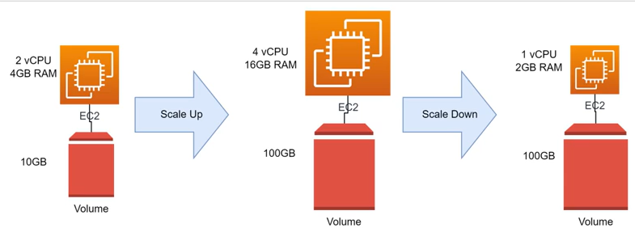
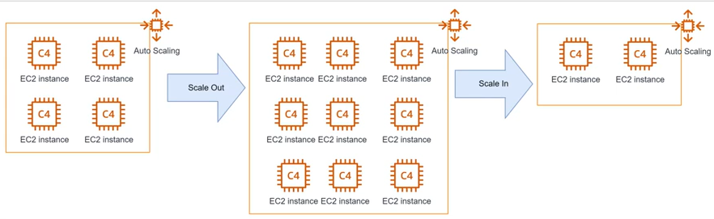
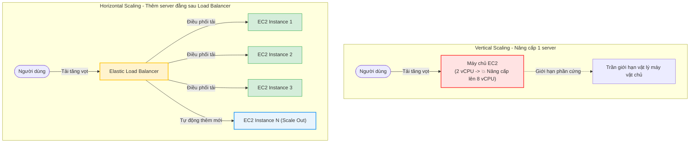

# Chiến lược Co giãn Hệ thống (Scaling Strategies)

Trong thiết kế hệ thống (System Design) và quản trị hạ tầng Cloud, **Scaling (Co giãn)** là khả năng tăng hoặc giảm năng lực xử lý của hệ thống để đáp ứng sự thay đổi của tải truy cập (traffic) từ người dùng. 

Có hai chiến lược co giãn cơ bản và quan trọng nhất: **Vertical Scaling (Mở rộng chiều dọc)** và **Horizontal Scaling (Mở rộng chiều ngang)**.

---

## I. Phân biệt các chiến lược Scaling

### 1. Scale Up / Scale Down (Vertical Scaling - Mở rộng chiều dọc)

> [!NOTE]
> **Mở rộng chiều dọc (Vertical Scaling)** là phương pháp tăng cường sức mạnh tính toán (compute capacity) cho **một máy chủ duy nhất**.

*   **Cách hoạt động**: Bạn nâng cấp cấu hình phần cứng vật lý hoặc thay đổi gói tài nguyên ảo hóa (Instance Type) của máy chủ hiện tại:
    *   **Scale Up**: Tăng số nhân CPU (vCPU), nâng dung lượng bộ nhớ RAM, hoặc mở rộng dung lượng ổ cứng SSD (EBS Volume).
    *   **Scale Down**: Giảm các thông số CPU/RAM khi nhu cầu sử dụng thấp để tiết kiệm chi phí.
*   **Ưu điểm**:
    *   **Đơn giản**: Cực kỳ dễ thực hiện trên môi trường đám mây (Cloud).
    *   **Không cần đổi Code**: Code của ứng dụng không cần thay đổi cấu trúc thiết kế, không phải lo lắng về việc đồng bộ dữ liệu giữa nhiều máy chủ khác nhau.
*   **Nhược điểm**:
    *   **Giới hạn vật lý (Hardware Limit)**: Phần cứng luôn có "giới hạn trần" vật lý. Bạn không thể lắp vô hạn RAM hay CPU vào một bo mạch chủ (mainboard) duy nhất.
    *   **Thời gian gián đoạn (Downtime)**: Thông thường, việc nâng/hạ cấu hình (ví dụ: thay đổi Instance Type của EC2) đòi hỏi phải tắt máy chủ và khởi động lại, dẫn tới gián đoạn dịch vụ tạm thời.
    *   **Single Point of Failure (SPOF)**: Hệ thống vẫn chạy trên 1 server duy nhất. Nếu server này bị sập (lỗi hệ điều hành, hỏng phần cứng vật chủ), toàn bộ ứng dụng sẽ ngừng hoạt động hoàn toàn.

*Hình 1: Minh họa quá trình Scale Up (nâng cấp CPU/RAM) và Scale Down (hạ cấu hình CPU/RAM) trên một máy chủ EC2.*

---

### 2. Scale Out / Scale In (Horizontal Scaling - Mở rộng chiều ngang)

> [!NOTE]
> **Mở rộng chiều ngang (Horizontal Scaling)** là phương pháp tăng hoặc giảm **số lượng máy chủ** để cùng chia sẻ và gánh vác khối lượng công việc của hệ thống.

*   **Cách hoạt động**: Thay vì làm cho một máy tính mạnh lên, bạn bổ sung hoặc giảm bớt số lượng máy tính hoạt động song song trong một nhóm (cluster):
    *   **Scale Out (Mở rộng ra)**: Thêm các server mới vào cụm. Ví dụ: Thêm các node mới vào Kubernetes cluster hoặc khởi tạo thêm các EC2 instance chạy đằng sau một Load Balancer.
    *   **Scale In (Thu hẹp vào)**: Gỡ bỏ bớt các server dư thừa khỏi cụm khi lượng truy cập giảm xuống.
*   **Ưu điểm**:
    *   **Mở rộng vô hạn (Virtually Unlimited)**: Không bị giới hạn bởi trần phần cứng của một máy. Bạn có thể thêm hàng chục, hàng trăm máy chủ để đáp ứng hàng triệu lượng truy cập đồng thời.
    *   **Tính sẵn sàng cao (High Availability & Fault Tolerance)**: Loại bỏ hoàn toàn Single Point of Failure (SPOF). Nếu một hoặc một vài server bị lỗi, Load Balancer sẽ tự động chuyển hướng request sang các server còn lại đang hoạt động bình thường mà người dùng không hề nhận ra sự cố.
    *   **Không gây Downtime**: Có thể thêm/bớt server một cách linh hoạt (on-the-fly) mà không cần dừng hệ thống.
*   **Nhược điểm**:
    *   **Thiết kế ứng dụng phức tạp**: Đòi hỏi cấu trúc ứng dụng phải hỗ trợ tính năng phân tán dữ liệu, đồng bộ hóa cache (như sử dụng Redis Cluster), và giải quyết bài toán quản lý session của người dùng (Session State Management - ví dụ: chuyển sang Stateless Application).

*Hình 2: Minh họa quá trình Scale Out (tăng số lượng instances trong nhóm Auto Scaling) và Scale In (giảm số lượng instances).*

---

## II. Bảng so sánh nhanh Vertical vs Horizontal Scaling

| Tiêu chí | Vertical Scaling (Mở rộng dọc) | Horizontal Scaling (Mở rộng ngang) |
|---|---|---|
| **Khái niệm** | Làm cho 1 server mạnh lên | Tăng số lượng server |
| **Hành động trên AWS** | Thay đổi Instance Type (ví dụ: `t3.micro` -> `t3.medium`) | Tăng/giảm số lượng Instance thông qua **Auto Scaling Group** |
| **Giới hạn tối đa** | Bị giới hạn bởi giới hạn phần cứng | Về mặt lý thuyết là không giới hạn |
| **Downtime khi thay đổi** | Có (yêu cầu khởi động lại máy để áp dụng cấu hình mới) | Không (thêm/bớt máy chủ chạy song song mà không gián đoạn hệ thống) |
| **Khả năng chịu lỗi (SPOF)** | Không (Vẫn tồn tại điểm lỗi duy nhất tại máy chủ đó) | Có (Loại bỏ SPOF nhờ tính dư thừa và điều phối của Load Balancer) |
| **Độ phức tạp ứng dụng** | Thấp (Giữ nguyên cấu trúc code đơn luồng/đa luồng cũ) | Cao (Đòi hỏi Stateless Architecture, lưu trữ session tập trung) |
| **Chi phí ban đầu** | Thấp | Cao (Do cần cấu hình thêm Load Balancer và hệ thống quản lý cụm) |

---

## III. Sơ đồ tư duy co giãn hệ thống

Sơ đồ dưới đây biểu diễn sự khác biệt trong kiến trúc của hai phương pháp khi đối mặt với lượng truy cập tăng vọt:

> [!IMPORTANT]
> **Ứng dụng thực tế trên AWS**:
> *   Đối với các môi trường Production, các doanh nghiệp luôn ưu tiên **Horizontal Scaling** kết hợp với **Application Load Balancer (ALB)** để đảm bảo tính sẵn sàng cao nhất cho hệ thống.
> *   Công cụ tự động hóa quá trình mở rộng/thu hẹp theo chiều ngang trên AWS đối với tài nguyên EC2 được gọi là **Auto Scaling Group (ASG)** - nội dung chúng ta sẽ tìm hiểu sâu ở các bài học tiếp theo.
