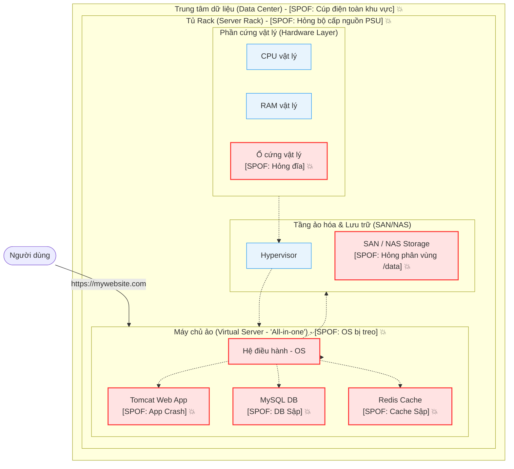
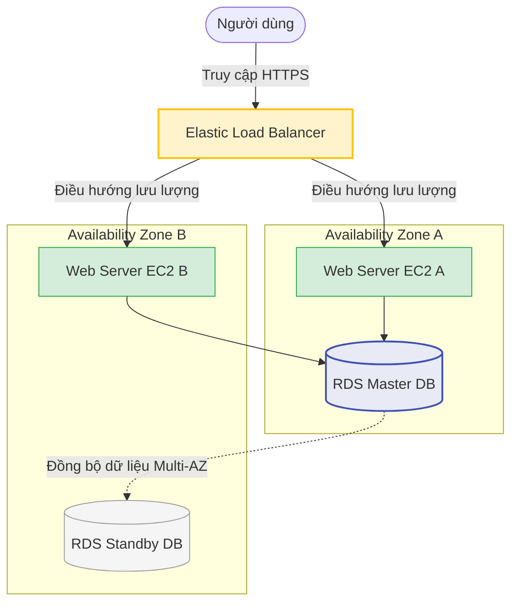

# Amazon ELB (Elastic Load Balancing)

## I. Tổng quan về Amazon ELB

**Amazon Elastic Load Balancing (ELB)** là dịch vụ phân phối tự động lưu lượng truy cập ứng dụng đến (incoming application traffic) trên nhiều mục tiêu khác nhau, chẳng hạn như các máy ảo Amazon EC2, container (ECS/EKS), địa chỉ IP, hoặc các Lambda function.

*   **Tự động co giãn (Scalability)**: ELB có khả năng tự động điều chỉnh quy mô xử lý (scale up/down) để đáp ứng sự thay đổi của lượng traffic truy cập mà không cần can thiệp thủ công.
*   **Giám sát sức khỏe (Health Checks)**: ELB liên tục gửi các yêu cầu ping/HTTP test tới các mục tiêu phía sau (targets). Nếu một mục tiêu không phản hồi (Unhealthy), ELB sẽ dừng chuyển traffic tới đó và chỉ phân phối tới các mục tiêu hoạt động bình thường (Healthy).
*   **Tăng cường bảo mật**: Tích hợp chặt chẽ với AWS Certificate Manager (ACM) để cấu hình SSL/TLS (HTTPS) tập trung tại Load Balancer, giải phóng gánh nặng mã hóa cho các server phía sau (SSL Termination).
*   **Độ sẵn sàng cao (High Availability)**: Phân phối traffic trên nhiều Availability Zones (AZ) khác nhau, đảm bảo hệ thống vẫn chạy ổn định ngay cả khi cả một trung tâm dữ liệu của AWS gặp sự cố.

---

## II. Tại sao cần Load Balancer? Khái niệm Single Point of Failure (SPOF)

Trong thiết kế hệ thống, mục tiêu hàng đầu là đảm bảo tính liên tục và độ tin cậy. Để hiểu tại sao cần Load Balancer, chúng ta cần tìm hiểu khái niệm quan trọng nhất của kiến trúc hạ tầng: **Single Point of Failure (SPOF)**.

### 1. Khái niệm Single Point of Failure (Điểm lỗi duy nhất)

> [!IMPORTANT]
> **Single Point of Failure (SPOF)** là một thành phần hoặc một phần của hệ thống mà nếu nó gặp sự cố hoặc ngừng hoạt động, toàn bộ hệ thống sẽ bị dừng hoạt động hoàn toàn và không thể phục vụ người dùng.

### 2. Các cấp độ sự cố dẫn đến SPOF (Từ nhỏ đến lớn)

Một hệ thống "All-in-One" (tất cả chạy chung trên một máy chủ) chứa rất nhiều điểm lỗi tiềm ẩn ở mọi tầng (layer) khác nhau:

*   **Cấp độ Ứng dụng (Application Level)**:
    *   *Sự cố*: Chương trình bị rò rỉ bộ nhớ (memory leak), mã nguồn phát sinh lỗi logic nghiêm trọng dẫn đến ứng dụng (ví dụ: Tomcat, Node.js) bị treo hoặc crash đột ngột.
*   **Cấp độ Cơ sở dữ liệu (Database Level)**:
    *   *Sự cố*: Database (MySQL, PostgreSQL) bị sập do quá tải kết nối (connection timeout) hoặc lỗi ổ đĩa lưu trữ bảng dữ liệu, khiến ứng dụng không thể đọc/ghi dữ liệu và không thể phản hồi yêu cầu.
*   **Cấp độ Hệ điều hành (Operating System)**:
    *   *Sự cố*: OS (Linux, Windows Server) của máy chủ ảo bị treo cứng do xung đột tài nguyên, hết bộ nhớ swap, hoặc lỗi nhân (Kernel Panic).
*   **Cấp độ Lưu trữ ảo (Virtual Storage)**:
    *   *Sự cố*: Kết nối mạng tới vùng lưu trữ dùng chung SAN/NAS bị gián đoạn, hoặc phân vùng chứa dữ liệu quan trọng (như thư mục `/data`) bị lỗi tập tin hệ thống (filesystem corruption).
*   **Cấp độ Phần cứng vật lý (Hardware Layer)**:
    *   *Sự cố*: Ổ cứng vật lý (HDD/SSD) của máy chủ vật lý bị hỏng bad sector, lỗi thanh RAM vật lý hoặc CPU quá nhiệt trên server vật chủ.
*   **Cấp độ Tủ Rack (Server Rack Level)**:
    *   *Sự cố*: Bộ cấp nguồn điện (Power Supply Unit - PSU) cho cả một tủ chứa server (Rack) bị chập cháy, hoặc thiết bị chuyển mạch switch mạng trung tâm của Rack bị hỏng.
*   **Cấp độ Trung tâm dữ liệu (Data Center Level)**:
    *   *Sự cố*: Xảy ra cúp điện trên toàn bộ Data Center, mất kết nối đường truyền Internet cáp quang trục chính quốc gia, hoặc các thảm họa tự nhiên (lũ lụt, hỏa hoạn, động đất) tại khu vực đặt Data Center.

> [!NOTE]
> **Kết luận**: Để loại bỏ Single Point of Failure, kiến trúc sư hệ thống cần thiết kế **dư thừa tài nguyên (Redundancy)** — nghĩa là cần **nhiều hơn 1 thành phần** hoạt động song song cho mỗi layer (tầng) của hệ thống. Và để phân phối traffic hiệu quả giữa các thành phần dư thừa đó, chúng ta bắt buộc phải có **Load Balancer**.

---

## III. Sơ đồ minh họa các Điểm lỗi duy nhất (SPOF) trên mô hình "All-in-One"

*Hình 1: Sơ đồ trực quan mô tả hệ thống All-in-One với các điểm lỗi duy nhất (SPOF).*

> [!WARNING]
> Trong kiến trúc **Single Point of Failure (SPOF)** như hình trên, bất kỳ sự cố hư hỏng ở một trong các cấp độ từ **App, OS, Hypervisor (ảo hóa) cho tới Hardware** đều có thể ảnh hưởng trực tiếp tới **Availability (tính khả dụng)** của toàn bộ hệ thống.

Dưới đây là sơ đồ mã hóa dạng Mermaid mô phỏng kiến trúc hệ thống chạy trên một máy chủ duy nhất ("All-in-one"). Bất kỳ thành phần nào có đánh dấu ký hiệu nổ 💥 đều là một **SPOF** có thể kéo sập toàn bộ dịch vụ của người dùng:

---

## IV. Giải pháp loại bỏ SPOF bằng Load Balancer

Khi chúng ta bổ sung Load Balancer vào hệ thống và tách biệt các tầng ứng dụng, chúng ta có thể loại bỏ hoàn toàn các SPOF nêu trên:

1.  **Dư thừa tầng Web/App**: Triển khai nhiều máy chủ EC2 (Web server) chạy song song đằng sau Load Balancer. Nếu máy chủ EC2 này bị lỗi, Load Balancer tự động chuyển hướng người dùng sang các máy chủ EC2 còn lại.
2.  **Dư thừa tầng Database**: Sử dụng dịch vụ managed DB như Amazon RDS với tính năng Multi-AZ (tự động đồng bộ sang vùng độc lập khác).
3.  **Bảo vệ ở mức hạ tầng (Multi-AZ)**: Đặt các máy chủ EC2 ở nhiều Availability Zones (các trung tâm dữ liệu độc lập về nguồn điện và mạng). Khi một AZ bị mất điện, hệ thống vẫn hoạt động bình thường nhờ các AZ còn lại.

Nhờ mô hình này, hệ thống sẽ loại bỏ được các điểm lỗi duy nhất, đảm bảo tính sẵn sàng cao (High Availability) và khả năng chịu lỗi cực tốt (Fault Tolerance).
