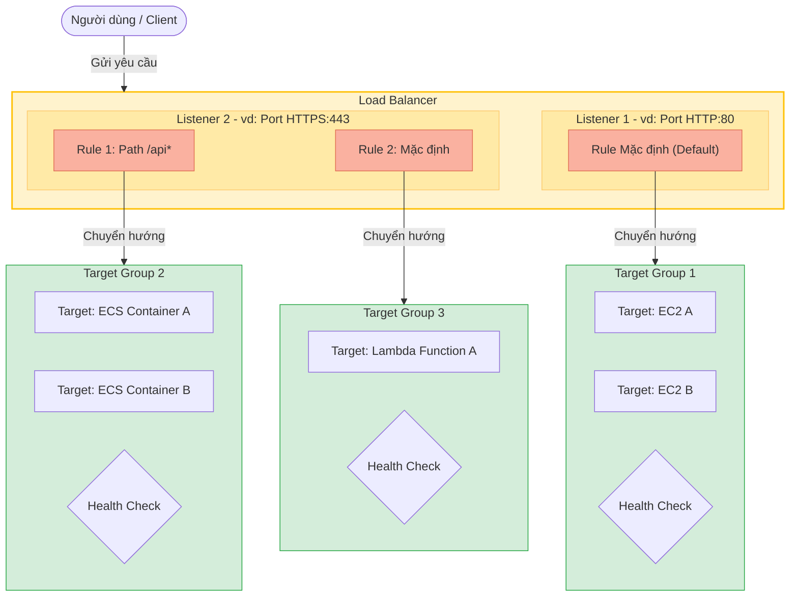

# Các thành phần cơ bản của Amazon ELB

Để hiểu cách hoạt động và cấu hình Amazon Elastic Load Balancing (ELB), bạn cần nắm vững ba thành phần cốt lõi cấu thành nên kiến trúc này: **Listener (Bộ lắng nghe)**, **Rule (Quy tắc định tuyến)**, và **Target Group (Nhóm mục tiêu)**.

---

## I. Sơ đồ kiến trúc các thành phần cơ bản

Dưới đây là sơ đồ tổng quan về cách các thành phần này phối hợp với nhau để điều hướng yêu cầu từ người dùng (Client) tới các ứng dụng backend:

*Hình 1: Sơ đồ kiến trúc các thành phần cơ bản của Amazon Elastic Load Balancer.*

### Sơ đồ luồng xử lý dạng Mermaid:

---

## II. Chi tiết các thành phần cơ bản

### 1. Listener (Bộ lắng nghe)

*   **Khái niệm**: Listener là một tiến trình chạy trên Load Balancer có nhiệm vụ liên tục lắng nghe và kiểm tra các yêu cầu kết nối từ phía client.
*   **Cấu hình**: Khi tạo một Listener, bạn bắt buộc phải cấu hình:
    *   **Giao thức (Protocol)**: vd: HTTP, HTTPS, TCP, UDP.
    *   **Cổng kết nối (Port)**: vd: HTTP sử dụng port `80`, HTTPS sử dụng port `443`.
*   **Ví dụ**: Bạn thiết lập một Listener trên port `80` (HTTP) để đón nhận toàn bộ lưu lượng truy cập web thông thường của người dùng.

### 2. Rule (Quy tắc định tuyến)

*   **Khái niệm**: Rule là quy tắc được đính kèm vào Listener nhằm xác định cách phân phối các yêu cầu (request) đi tới các Target Group tương ứng.
*   **Cấu trúc**: Mỗi Listener cho phép cấu hình nhiều Rule. Mỗi Rule bao gồm các điều kiện đánh giá (Condition) và hành động thực thi (Action):
    *   **Điều kiện (Condition)**: Có thể dựa trên đường dẫn URL (Path condition, ví dụ `/api*`), tên miền truy cập (Host condition, ví dụ `admin.mywebsite.com`), HTTP header, hoặc phương thức HTTP (GET, POST).
    *   **Hành động (Action)**: Forward (chuyển tiếp request đến Target Group), Redirect (chuyển hướng sang URL khác), hoặc Fixed Response (trả về nội dung cố định như lỗi 404/503).
*   **Cơ chế hoạt động**: Request sau khi đi vào Listener sẽ được đánh giá lần lượt qua các Rule từ trên xuống dưới theo thứ tự ưu tiên (Priority). Khi khớp với điều kiện của một Rule nào đó, request sẽ được **forward tới Target Group phù hợp**. Nếu không khớp với bất kỳ rule tùy chỉnh nào, request sẽ đi vào **Rule mặc định (Default Rule)**.

### 3. Target Group (Nhóm mục tiêu) và Target (Mục tiêu)

*   **Target (Mục tiêu)**: Là các tài nguyên tính toán thực tế nhận và xử lý request ở phía sau. Target có thể là:
    *   **EC2 Instance** (Máy ảo EC2).
    *   **ECS Task / Container** (Ứng dụng chạy trên Docker).
    *   **Địa chỉ IP** (Thậm chí IP của các server vật lý on-premise kết nối qua VPN/Direct Connect).
    *   **Lambda Function** (Các hàm serverless chạy theo sự kiện).
*   **Target Group (Nhóm mục tiêu)**: Là một nhóm tập hợp các Target có cùng chức năng để Load Balancer chuyển tiếp traffic tới.
*   **Nhiệm vụ Health Check (Kiểm tra sức khỏe)**:
    *   Target Group có nhiệm vụ thực hiện kiểm tra sức khỏe (**Health check**) định kỳ đối với từng target riêng lẻ bên trong nhóm bằng cách gửi các request thử nghiệm (ping/HTTP GET) đến một port và đường dẫn được định nghĩa trước.
    *   Nếu một Target không phản hồi hoặc trả về mã lỗi liên tục (vượt quá ngưỡng cấu hình), nó sẽ bị đánh dấu là **Unhealthy** (không khỏe mạnh). Load Balancer sẽ lập tức **loại bỏ** target này ra khỏi danh sách định tuyến, không chuyển request mới đến nó nữa nhằm tránh gián đoạn dịch vụ của người dùng.
    *   Khi Target đó được sửa chữa và vượt qua các bài kiểm tra sức khỏe thành công, nó sẽ được đánh dấu lại là **Healthy** và tiếp tục nhận traffic bình thường.
