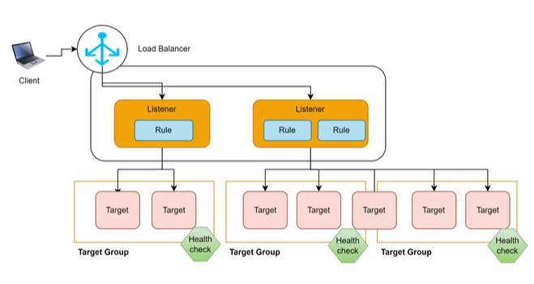
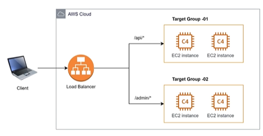
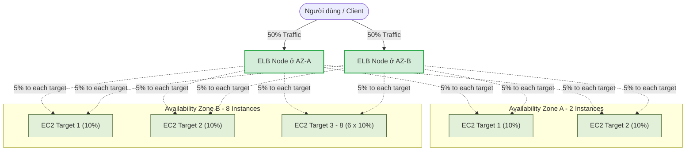

# Các thành phần cơ bản của Amazon ELB

Để hiểu cách hoạt động và cấu hình Amazon Elastic Load Balancing (ELB), bạn cần nắm vững ba thành phần cốt lõi cấu thành nên kiến trúc này: **Listener (Bộ lắng nghe)**, **Rule (Quy tắc định tuyến)**, và **Target Group (Nhóm mục tiêu)**.

---

## I. Sơ đồ kiến trúc các thành phần cơ bản

Dưới đây là sơ đồ tổng quan về cách các thành phần này phối hợp với nhau để điều hướng yêu cầu từ người dùng (Client) tới các ứng dụng backend:

*Hình 1: Sơ đồ kiến trúc các thành phần cơ bản của Amazon Elastic Load Balancer.*

### Sơ đồ luồng xử lý dạng Mermaid:

---

## II. Chi tiết các thành phần cơ bản

### 1. Listener (Bộ lắng nghe)

*   **Khái niệm**: Listener là một tiến trình chạy trên Load Balancer có nhiệm vụ liên tục lắng nghe và kiểm tra các yêu cầu kết nối từ phía client.
*   **Cấu hình**: Khi tạo một Listener, bạn bắt buộc phải cấu hình:
    *   **Giao thức (Protocol)**: vd: HTTP, HTTPS, TCP, UDP.
    *   **Cổng kết nối (Port)**: vd: HTTP sử dụng port `80`, HTTPS sử dụng port `443`.
*   **Ví dụ**: Bạn thiết lập một Listener trên port `80` (HTTP) để đón nhận toàn bộ lưu lượng truy cập web thông thường của người dùng.

### 2. Rule (Quy tắc định tuyến)

*   **Khái niệm**: Rule là quy tắc được đính kèm vào Listener nhằm xác định cách phân phối các yêu cầu (request) đi tới các Target Group tương ứng.
*   **Cấu trúc**: Mỗi Listener cho phép cấu hình nhiều Rule. Mỗi Rule bao gồm các điều kiện đánh giá (Condition) và hành động thực thi (Action):
    *   **Điều kiện (Condition)**: Có thể dựa trên đường dẫn URL (Path condition, ví dụ `/api*`), tên miền truy cập (Host condition, ví dụ `admin.mywebsite.com`), HTTP header, hoặc phương thức HTTP (GET, POST).
    *   **Hành động (Action)**: Forward (chuyển tiếp request đến Target Group), Redirect (chuyển hướng sang URL khác), hoặc Fixed Response (trả về nội dung cố định như lỗi 404/503).
*   **Cơ chế hoạt động**: Request sau khi đi vào Listener sẽ được đánh giá lần lượt qua các Rule từ trên xuống dưới theo thứ tự ưu tiên (Priority). Khi khớp với điều kiện của một Rule nào đó, request sẽ được **forward tới Target Group phù hợp**. Nếu không khớp với bất kỳ rule tùy chỉnh nào, request sẽ đi vào **Rule mặc định (Default Rule)**.

*   **Điều phối trong trường hợp nhiều Target Group (Multi-target Routing)**:
    Load Balancer có khả năng điều hướng lưu lượng truy cập tới **nhiều hơn một Target Group**. Trong kịch bản multi-target, việc quyết định request từ client được gửi tới target group nào sẽ được xác định bởi một số quy tắc sau:
    *   **Cổng kết nối (Listener Port)**: Quyết định dựa trên port mà request đi vào. Ví dụ: Port 80 chuyển tới Target Group 01, Port 443 chuyển tới Target Group 02.
    *   **Đường dẫn URL (Path pattern - Chỉ áp dụng cho Application Load Balancer - ALB)**: Định tuyến dựa trên đường dẫn tài nguyên của URL.
        *   *Ví dụ*: `/api/*` -> forward tới **Target Group -01**; `/admin/*` -> forward tới **Target Group -02**.
    *   **Tỷ lệ trọng số cố định (Fixed ratio / Weighted Routing)**: Chia tỷ lệ phần trăm phân phối traffic trực tiếp cho các Target Group khác nhau.
        *   *Ví dụ*: Target Group 01 nhận **20%** traffic, Target Group 02 nhận **80%** traffic (rất hữu ích trong mô hình triển khai Blue/Green deployment hoặc chạy thử nghiệm A/B testing).

*Hình 2: Sơ đồ minh họa định tuyến dựa trên Path Pattern tới nhiều Target Group khác nhau.*

### 3. Target Group (Nhóm mục tiêu) và Target (Mục tiêu)

*   **Target (Mục tiêu)**: Là các tài nguyên tính toán thực tế nhận và xử lý request ở phía sau. Target có thể là:
    *   **EC2 Instance** (Máy ảo EC2).
    *   **ECS Task / Container** (Ứng dụng chạy trên Docker).
    *   **Địa chỉ IP** (Thậm chí IP của các server vật lý on-premise kết nối qua VPN/Direct Connect).
    *   **Lambda Function** (Các hàm serverless chạy theo sự kiện).
*   **Target Group (Nhóm mục tiêu)**: Là một nhóm tập hợp các Target có cùng chức năng để Load Balancer chuyển tiếp traffic tới.
*   **Nhiệm vụ Health Check (Kiểm tra sức khỏe)**:
    *   Target Group có nhiệm vụ thực hiện kiểm tra sức khỏe (**Health check**) định kỳ đối với từng target riêng lẻ bên trong nhóm bằng cách gửi các request thử nghiệm (ping/HTTP GET) đến một port và đường dẫn được định nghĩa trước.
    *   Nếu một Target không phản hồi hoặc trả về mã lỗi liên tục (vượt quá ngưỡng cấu hình), nó sẽ bị đánh dấu là **Unhealthy** (không khỏe mạnh). Load Balancer sẽ lập tức **loại bỏ** target này ra khỏi danh sách định tuyến, không chuyển request mới đến nó nữa nhằm tránh gián đoạn dịch vụ của người dùng.
    *   Khi Target đó được sửa chữa và vượt qua các bài kiểm tra sức khỏe thành công, nó sẽ được đánh dấu lại là **Healthy** và tiếp tục nhận traffic bình thường.

---

### 4. Cơ chế phân phối Traffic trong Target Group (Traffic Distribution)

*   **Thuật toán mặc định (Round Robin)**: Mặc định, Load Balancer sẽ phân phối request từ client đến các target trong cùng một Target Group theo tỷ lệ cân bằng bằng thuật toán **Round Robin** (xoay vòng).
*   **Phân phối độc lập cho từng Target Group**: Cơ chế phân phối này hoạt động độc lập trên từng nhóm mục tiêu. Kể cả khi một target (ví dụ: một EC2 instance) **được đăng ký vào nhiều hơn 1 target group**, Load Balancer vẫn sẽ áp dụng thuật toán phân phối độc lập cho từng nhóm mà target đó tham gia.
    *   *Ví dụ*: Nếu Instance A đăng ký vào cả Target Group X (có 2 instances) và Target Group Y (có 2 instances). Khi có request gửi đến Target Group X, Instance A nhận ~50% traffic của group X. Khi có request gửi đến Target Group Y, Instance A cũng nhận ~50% traffic của group Y.
*   **Phân phối qua nhiều Availability Zones**: 
    *   Các instance (target) có thể được phân bổ ở **các Availability Zone (zone) khác nhau** để tăng tính sẵn sàng cao (High Availability).
    *   Xem chi tiết cơ chế phân phối tải liên zone ở phần **III. Tính năng Cross-Zone Load Balancing** bên dưới.

*Hình 3: Sơ đồ minh họa phân phối traffic đều cho các target trong Target Group trải rộng trên nhiều Availability Zones khi Cross-Zone Load Balancing được kích hoạt.*

---

## III. Tính năng Cross-Zone Load Balancing (Cân bằng tải liên Zone)

### 1. Khái niệm Cross-Zone Load Balancing
Khi bạn khởi tạo một Load Balancer, AWS đề xuất bạn nên chọn **tất cả các Availability Zone (AZ)** khả dụng trong Region đó để tăng tính dự phòng (High Availability). 

Tại mỗi AZ được chọn, ELB sẽ tạo ra một **Load Balancer Node** (thực chất là một thực thể ảo chạy dưới nền để nhận traffic).

**Cross-Zone Load Balancing** là tính năng điều chỉnh cách các Load Balancer Node này phân phối traffic tới các mục tiêu (targets):
*   **Khi BẬT (Enabled)**: Mỗi Load Balancer Node sẽ phân phối lưu lượng truy cập **đều khắp cho toàn bộ targets ở tất cả các AZ** được kích hoạt.
*   **Khi TẮT (Disabled)**: Mỗi Load Balancer Node sẽ **chỉ phân phối lưu lượng truy cập cho các targets nằm trong cùng AZ** với nó.

---

### 2. Sự khác biệt về phân bổ traffic (Ví dụ thực tế)

Giả sử hệ thống của bạn có **10 instances** phân bổ không đồng đều: **2 instances ở Availability Zone A** và **8 instances ở Availability Zone B**. Client gửi traffic vào DNS của Load Balancer, DNS sẽ phân bổ đều 50% traffic cho Node ở Zone A và 50% traffic cho Node ở Zone B.

#### Trường hợp 1: Cross-Zone Load Balancing bị TẮT (Disabled)
*   **Node ở AZ-A** nhận 50% traffic và chỉ chuyển tiếp cho 2 instances ở AZ-A.
    *   => Mỗi instance ở AZ-A nhận: $50\% / 2 = \mathbf{25\%}$ traffic.
*   **Node ở AZ-B** nhận 50% traffic và chỉ chuyển tiếp cho 8 instances ở AZ-B.
    *   => Mỗi instance ở AZ-B nhận: $50\% / 8 = \mathbf{6.25\%}$ traffic.
*   *Hệ quả*: Có sự mất cân bằng tải nghiêm trọng. Các server ở Zone A chịu tải gấp 4 lần các server ở Zone B.

*Hình 4: Sơ đồ minh họa phân bổ request tới các targets trong trường hợp Cross-Zone bị tắt (Disabled).*

#### Trường hợp 2: Cross-Zone Load Balancing được BẬT (Enabled)
*   Cả hai Node ở AZ-A và AZ-B đều có thể phân phối traffic tới toàn bộ 10 instances trong Target Group.
*   Tổng số traffic (100%) sẽ được chia đều cho 10 instances.
    *   => Mỗi instance nhận: $100\% / 10 = \mathbf{10\%}$ traffic, bất kể nó nằm ở zone nào.
*   *Hệ quả*: Tải được phân bổ hoàn toàn cân bằng giữa các server.

---

### 3. So sánh cấu hình mặc định và chi phí giữa các loại ELB

| Đặc tính | Application Load Balancer (ALB) | Network Load Balancer (NLB) | Gateway Load Balancer (GLB) | Classic Load Balancer (CLB) |
|---|---|---|---|---|
| **Cấu hình mặc định** | **Kích hoạt sẵn (Enabled)** | **Vô hiệu hóa (Disabled)** | **Vô hiệu hóa (Disabled)** | **Vô hiệu hóa (Disabled)** |
| **Thay đổi cấu hình** | **Không thể tắt** (Luôn bật ở cấp độ Load Balancer) | Có thể bật/tắt (Cần kích hoạt sau khi tạo) | Có thể bật/tắt | Có thể bật/tắt |
| **Chi phí truyền dữ liệu (Data Transfer Charges)** | **Miễn phí** | **Có phí** (Tính phí truyền dữ liệu liên Zone - Inter-AZ Data Transfer) | **Có phí** (Tính phí truyền dữ liệu liên Zone) | **Miễn phí** |

> [!IMPORTANT]
> **Khuyến nghị thiết kế tối ưu chi phí:**
> *   Đối với **ALB**, mặc định luôn bật và không thể tắt ở cấp độ Load Balancer. Điều này giúp tối ưu hóa phân phối tải hoàn toàn miễn phí.
> *   Đối với **NLB**, mặc định tính năng này bị tắt. Bạn cần chủ động **kích hoạt (enable) sau khi tạo** nếu có sự chênh lệch phân bổ instances giữa các zone, nhưng hãy lưu ý chi phí chuyển dữ liệu liên zone (Inter-AZ Data Transfer - thường là $0.01/GB).
