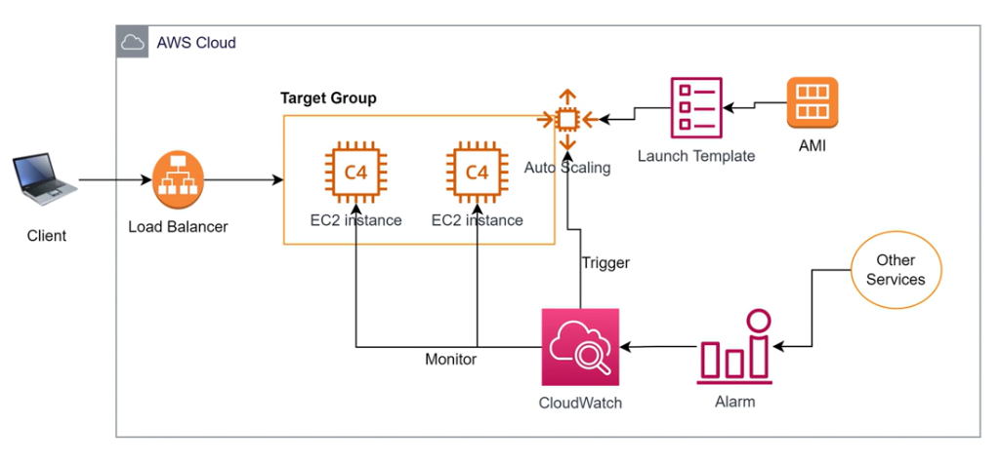

# Amazon Auto Scaling Group (ASG)

Trong một hệ thống thực tế, lưu lượng truy cập (workload) từ người dùng không bao giờ cố định mà luôn biến động theo thời gian. Để đảm bảo ứng dụng luôn chạy ổn định với chi phí tối ưu, AWS cung cấp dịch vụ **Auto Scaling Group (ASG)**.

---

## I. Tổng quan về Auto Scaling Group (ASG)

> [!IMPORTANT]
> **Auto Scaling Group (ASG)** là dịch vụ của AWS có nhiệm vụ quản lý và tự động điều chỉnh số lượng các máy chủ ảo (EC2 instances) trong một nhóm sao cho phù hợp với khối lượng công việc (workload) thực tế tại từng thời điểm.

### Mục đích cốt lõi của ASG:

1.  **Tiết kiệm chi phí (Cost Optimization)**:
    *   Tự động giảm số lượng máy chủ (**Scale In**) vào những khung giờ thấp điểm (ví dụ: ban đêm hoặc ngày nghỉ) để tránh lãng phí tài nguyên nhàn rỗi. Bạn chỉ trả tiền cho những gì thực sự sử dụng.
2.  **Tự động mở rộng & Phục hồi sự cố (Scalability & Self-healing)**:
    *   **Mở rộng tự động (Auto Scaling)**: Tự động bổ sung thêm máy chủ (**Scale Out**) khi lượng truy cập tăng đột biến (ví dụ: ngày hội mua sắm, flash sale) nhằm duy trì hiệu năng ổn định cho ứng dụng.
    *   **Tự động phục hồi (Self-healing)**: ASG liên tục giám sát trạng thái hoạt động của các instance. Nếu phát hiện một instance bị lỗi phần cứng hoặc sập OS (Unhealthy), ASG sẽ lập tức **hủy bỏ (terminate)** instance lỗi đó và **khởi chạy (launch)** một instance mới tinh từ template ban đầu để thay thế, đảm bảo số lượng máy chủ tối thiểu luôn được duy trì.

---

## II. Thành phần cấu hình cốt lõi của ASG

Để hoạt động, ASG cần biết chính xác loại máy chủ nào cần khởi chạy khi có yêu cầu scale-out. Thông tin này được cấu hình thông qua **Launch Template (Mẫu khởi chạy)**.

### 1. Launch Template là gì?
Launch Template đóng vai trò như một bản thiết kế chi tiết chứa đầy đủ các cấu hình để khởi tạo một EC2 Instance:
*   **Amazon Machine Image (AMI)**: Hệ điều hành và các ứng dụng cốt lõi đã được cài đặt, đóng gói sẵn.
*   **Instance Type**: Cấu hình phần cứng (ví dụ: `t3.micro`, `c5.large`).
*   **Key Pair**: Khóa mật mã dùng để đăng nhập SSH vào server.
*   **Security Groups**: Các quy tắc tường lửa (cho phép mở port HTTP 80, HTTPS 443, SSH 22).
*   **EBS Volumes**: Dung lượng và loại ổ cứng lưu trữ.
*   **User Data**: Các đoạn script tự động chạy ngay sau khi máy chủ được khởi động lần đầu tiên (ví dụ: tự động tải code mới nhất, khởi chạy service).

---

## III. Cơ chế giám sát và Co giãn tự động với CloudWatch

Để đưa ra quyết định khi nào cần thêm máy chủ (**Scale Out**) hoặc khi nào cần giảm bớt máy chủ (**Scale In**), Auto Scaling Group không hoạt động độc lập mà phải kết hợp chặt chẽ với dịch vụ giám sát **Amazon CloudWatch**.

> [!NOTE]
> **Amazon CloudWatch** là mắt xích quan trọng giúp ASG biết được "khi nào" hệ thống đang quá tải hoặc nhàn rỗi để đưa ra quyết định co giãn chính xác.

1.  **Monitor (Giám sát)**: CloudWatch liên tục thu thập các thông số hiệu năng (Metrics) từ các EC2 instance đang chạy trong Target Group như:
    *   Tỷ lệ sử dụng CPU (`CPUUtilization`).
    *   Lưu lượng mạng ra/vào (`NetworkIn` / `NetworkOut`).
    *   Số lượng request gửi đến Target Group thông qua Load Balancer.
2.  **Alarm (Cảnh báo)**: Bạn thiết lập các ngưỡng cảnh báo (Alarms) trên CloudWatch.
    *   *Ví dụ*: Tạo một Alarm kích hoạt khi **CPUUtilization > 70%** trong thời gian 2 phút liên tiếp.
    *   Alarm này cũng có thể nhận dữ liệu hoặc được kích hoạt từ các dịch vụ khác bên ngoài AWS (Other Services).
3.  **Trigger (Kích hoạt co giãn)**: Khi metrics vượt ngưỡng, CloudWatch Alarm chuyển sang trạng thái cảnh báo và gửi một tín hiệu **Trigger** tới Auto Scaling Group. Hệ thống ASG sẽ dựa trên chính sách co giãn (Scaling Policy) để tăng hoặc giảm số lượng instance tương ứng.

---

## IV. Sơ đồ kiến trúc hoạt động của Auto Scaling Group

Dưới đây là sơ đồ luồng hoạt động khép kín phối hợp giữa Client, Load Balancer, Target Group, Auto Scaling, Launch Template và CloudWatch:

*Hình 1: Luồng xử lý phân phối tải và tự động co giãn hệ thống dựa trên Launch Template và CloudWatch Alarm.*

### Các bước hoạt động chi tiết theo sơ đồ:

1.  **Gửi yêu cầu**: Client gửi request đến hệ thống thông qua địa chỉ của **Load Balancer**.
2.  **Phân phối tải**: Load Balancer điều phối các request này vào các instance khỏe mạnh bên trong **Target Group**.
3.  **Giám sát (Monitor)**: Dịch vụ **CloudWatch** liên tục giám sát các thông số (như CPU, RAM, Network) của các EC2 Instance đang chạy.
4.  **Kích hoạt cảnh báo (Alarm)**: Khi tải hệ thống tăng vượt ngưỡng quy định, CloudWatch chuyển trạng thái sang **Alarm** và gửi tín hiệu **Trigger** sang bộ phận điều phối **Auto Scaling**.
5.  **Khởi chạy Instance mới**: Auto Scaling nhận tín hiệu Trigger, truy xuất thông tin cấu hình phần cứng và hệ điều hành từ **Launch Template** (liên kết với bản **AMI** gốc) để tự động tạo thêm các EC2 instance mới.
6.  **Đăng ký vào Target Group**: Các máy chủ EC2 mới tạo sẽ tự động được đăng ký (**Register**) vào **Target Group** tương ứng. Load Balancer nhận biết máy chủ mới đã Healthy và bắt đầu phân phối một phần traffic sang để giảm tải cho các server cũ.
