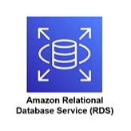
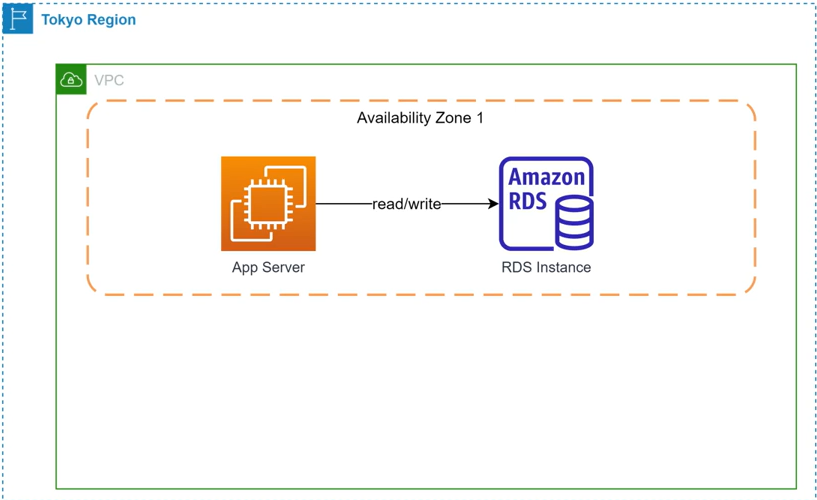
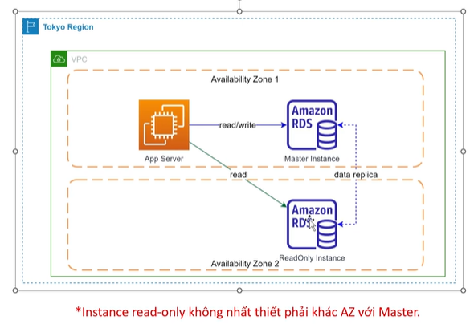
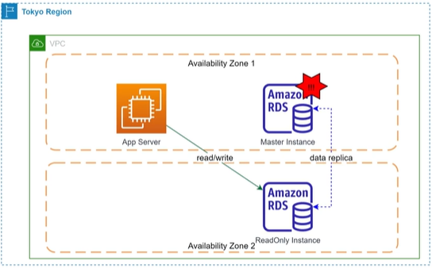
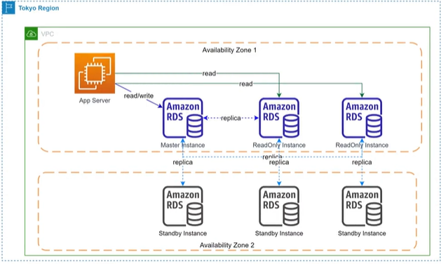
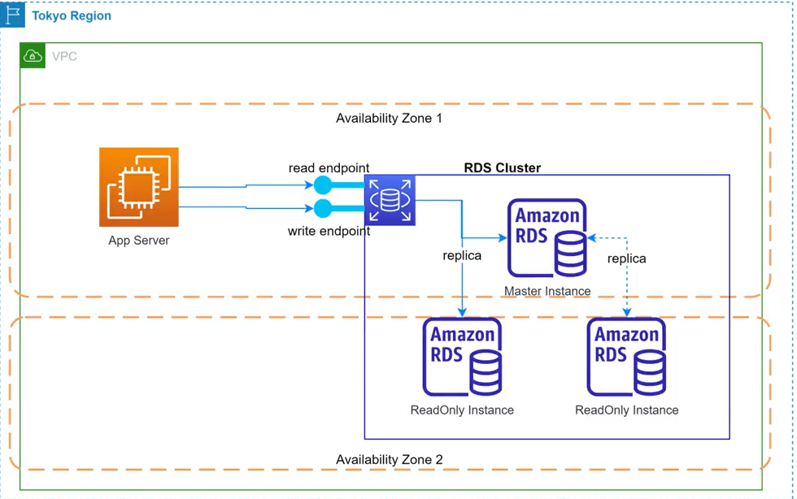

# Amazon Relational Database Service (RDS)

## I. Tổng quan về Amazon RDS

### 1. Amazon RDS là gì?
> **Amazon RDS (Relational Database Service)** là một dịch vụ quản lý cơ sở dữ liệu quan hệ (Managed Relational Database Service) được cung cấp bởi AWS. Dịch vụ này giúp người dùng dễ dàng khởi tạo, vận hành, cấu hình và co giãn các cơ sở dữ liệu quan hệ (SQL) phổ biến trên nền tảng đám mây.

Thay vì phải tự tay cài đặt và cấu hình cơ sở dữ liệu từ đầu, Amazon RDS tự động hóa các tác vụ quản trị tốn thời gian như: thiết lập phần cứng, cài đặt bản vá hệ điều hành (OS patching), sao lưu dữ liệu tự động (backups), và cấu hình dự phòng lỗi (failover).

---

### 2. Mô hình Database as a Service (DBaaS)
Amazon RDS hoạt động theo mô hình **Database as a Service (Cơ sở dữ liệu dưới dạng dịch vụ - DBaaS)**. 

* **Bản chất**: Người dùng chỉ cần tập trung vào việc thiết kế cơ sở dữ liệu, viết câu lệnh truy vấn (SQL queries) và phát triển ứng dụng. Toàn bộ hạ tầng mạng, máy chủ vật lý, ảo hóa, lưu trữ và bảo mật hệ thống bên dưới đều do AWS chịu trách nhiệm quản lý hoàn toàn.
* **Sự khác biệt lớn so với tự cài đặt**: Khi sử dụng RDS, người dùng **không thể truy cập vào cấp độ hệ điều hành (No OS-level Login/Access)**. Bạn không thể SSH (đối với Linux) hoặc RDP (đối với Windows) vào instance chạy DB. Điều này giúp ngăn chặn các cấu hình sai lệch từ người dùng và cho phép AWS tự động hóa quy trình quản trị an toàn.

#### Bảng so sánh: Tự cài đặt DB trên EC2 vs Sử dụng Amazon RDS

| Tiêu chí so sánh | Tự cài đặt DB trên EC2 | Sử dụng Amazon RDS |
|---|---|---|
| **Quyền truy cập OS** | **Có toàn quyền** (SSH/RDP để sửa đổi tệp cấu hình hệ thống). | **Không hỗ trợ** (Chỉ được cung cấp Endpoint kết nối cơ sở dữ liệu). |
| **Cài đặt & Vá lỗi (Patching)** | Quản trị viên tự thực hiện thủ công cho cả OS và DB engine. | **AWS tự động thực hiện** (Có thể lên lịch thời gian bảo trì định kỳ). |
| **Sao lưu dữ liệu (Backup)** | Tự lên kịch bản (cronjob, script) sao lưu và lưu trữ bản backup. | **Tự động sao lưu hàng ngày** (Automated Backups) và lưu trữ trên S3. |
| **Tính sẵn sàng cao (High Availability)** | Tự cấu hình Replication, clustering, sentinel thủ công. | **Kích hoạt chỉ bằng 1-Click** (Multi-AZ Deployment với tự động Failover). |
| **Co giãn (Scaling)** | Tự mua thêm ổ cứng vật lý, cấu hình phân vùng đĩa cứng. | **Co giãn linh hoạt** thông qua vài nút bấm hoặc cấu hình tự động. |

---

## II. Các đặc trưng cơ bản của Amazon RDS

### 1. Khởi tạo instance độc lập hoặc cụm Cluster
Amazon RDS cho phép bạn linh hoạt cấu hình theo nhu cầu và ngân sách của dự án:
* **Database Instance độc lập (Single-AZ)**: Chạy một thực thể DB duy nhất trên một Availability Zone. Tiết kiệm chi phí, phù hợp cho môi trường thử nghiệm (Development/Staging).
* **Cụm Instance hoạt động dưới chế độ Cluster**: Nhiều thực thể DB phối hợp với nhau (như Amazon Aurora Cluster), mang lại hiệu năng đọc/ghi vượt trội và tính dự phòng cực cao cho môi trường Production.

---

### 2. Hai cơ chế co giãn tài nguyên (Scalability)
Khi nhu cầu truy cập của người dùng thay đổi, RDS hỗ trợ mở rộng quy mô hệ thống theo hai hướng:

#### A. Co giãn theo chiều dọc (Scale Vertical)
* **Khái niệm**: Thay đổi sức mạnh phần cứng của chính DB instance đang chạy.
* **Cách thực hiện**: Nâng cấp hoặc hạ cấp Class cấu hình máy chủ (ví dụ từ loại instance nhỏ `db.t3.micro` lên các dòng tối ưu bộ nhớ `db.m5.large`, `db.r6g.xlarge`...).
* **Lưu ý**: Quá trình Scale Vertical thường yêu cầu hệ thống phải khởi động lại (Reboot) DB instance, do đó có thể gây gián đoạn dịch vụ ngắn (downtime).

#### B. Co giãn theo chiều ngang (Scale Horizontal)
* **Khái niệm**: Thêm hoặc bớt số lượng máy chủ (nodes) trong cụm để chia tải.
* **Cơ chế hoạt động**: Đối với các cơ sở dữ liệu quan hệ truyền thống chạy trên RDS, việc ghi dữ liệu đồng thời vào nhiều máy chủ rất phức tạp. Do đó, RDS hỗ trợ Scale Horizontal bằng cách tạo ra các **Read Replicas (Bản sao chỉ đọc)**:
  - Dữ liệu từ Master Node (Write Node) sẽ được đồng bộ bất đồng bộ (Asynchronously) sang các Read Replicas.
  - Các Read Replicas này **chỉ chấp nhận truy vấn đọc dữ liệu (Read-only)**.
  - Ứng dụng của bạn có thể chuyển hướng toàn bộ traffic đọc (ví dụ: các câu lệnh SELECT báo cáo, tải trang) sang các Read Replicas để gánh tải cho Master Node, giúp Master Node tập trung xử lý các tác vụ ghi/sửa dữ liệu (INSERT/UPDATE/DELETE).

---

### 3. Giới hạn dung lượng lưu trữ tối đa (Storage Limits)
Mặc dù hỗ trợ ổ đĩa có khả năng tự động mở rộng dung lượng (Storage Autoscaling), Amazon RDS vẫn có các giới hạn vật lý về kích thước ổ cứng tối đa cho từng Database Engine cụ thể:

* **MySQL, MariaDB, PostgreSQL, Oracle**: Giới hạn dung lượng tối đa là **64 TB**.
* **Microsoft SQL Server**: Giới hạn dung lượng tối đa là **16 TB**.

> [!NOTE]
> Nếu hệ thống của bạn có khối lượng dữ liệu khổng lồ vượt quá các giới hạn trên, hãy cân nhắc sử dụng **Amazon Aurora** (hỗ trợ lưu trữ tự động co giãn lên đến **128 TB** với hiệu năng vượt trội).

---

## III. Các mô hình triển khai của Amazon RDS (Deployment Models)

Amazon RDS hỗ trợ nhiều mô hình triển khai khác nhau để đáp ứng yêu cầu về chi phí, hiệu năng, và tính sẵn sàng cao (High Availability):

### 1. Single Instance
* **Đặc trưng**:
  - Chỉ có 1 database instance duy nhất được tạo ra trên 1 Availability Zone (AZ).
  - Nếu sự cố xảy ra ở cấp độ AZ, database không thể truy cập.
  - Phù hợp cho môi trường Dev-Test để tiết kiệm chi phí.
* **Mô hình hoạt động**: 
  
  *Ứng dụng kết nối trực tiếp đến một RDS Instance duy nhất cho cả tác vụ Đọc và Ghi (Read/Write).*

### 2. Single Instance với tùy chọn Multi-AZ (Multi-AZ option = yes)
* **Đặc điểm**: Triển khai một DB Instance chính (Primary/Master) ở Availability Zone này và một DB Instance dự phòng (Standby) ở một Availability Zone khác.
* **Mô hình hoạt động**: 
  - **Trạng thái bình thường (Normal)**: Ứng dụng kết nối trực tiếp tới Master Instance (để Read/Write). Dữ liệu được đồng bộ liên tục (Synchronous Replication) từ Master sang Standby Instance.
    
    
    *Ứng dụng kết nối tới Master Instance (AZ1) và dữ liệu được đồng bộ sang Standby (AZ2).*

  - **Trạng thái sự cố (Failover)**: Khi Master Instance gặp sự cố (như mất điện, lỗi phần cứng ở AZ1), AWS tự động thăng cấp Standby Instance ở AZ2 lên thành Master Instance mới. Ứng dụng tự động chuyển hướng truy cập sang Master mới này mà không bị thay đổi Endpoint URL. Instance cũ sau khi phục hồi sẽ trở thành Standby Instance.
    
    
    *Khi AZ1 gặp sự cố, Standby Instance ở AZ2 được nâng lên làm Master mới. Standby Instance này không cho phép người dùng kết nối trực tiếp.*
* **Đặc trưng & Lưu ý**: 
  - **Không thể kết nối**: Instance Standby được AWS tạo ra ngầm cho mục đích dự phòng, người dùng/ứng dụng **không thể kết nối trực tiếp** tới instance standby này.
  - **Chi phí**: Nếu kích hoạt Multi-AZ, chi phí (số tiền bỏ ra) sẽ tăng gấp đôi (x2).
  - **Mục đích**: Rất phù hợp cho cấu hình Database Production nhằm đảm bảo tính sẵn sàng cao.

### 3. Master – Read Only cluster
* **Đặc điểm**: Gồm một Master Node xử lý cả Read và Write, cùng với một hoặc nhiều Read Replica Nodes (chạy ở chế độ ReadOnly) được tạo ra và liên tục nhân bản dữ liệu (replica data) từ Master Instance. Sau khi thiết lập quan hệ này, các instance sẽ kết hợp với nhau thành 1 cluster.
* **Mô hình hoạt động**: 
  - **Trạng thái bình thường (Normal)**: Master Node xử lý cả đọc và ghi (Read/Write), dữ liệu được đồng bộ bất đồng bộ (Asynchronous Replication) sang các Read Replica Nodes chỉ để đọc.
    
    
    *Master Instance xử lý Read/Write và đồng bộ dữ liệu sang ReadOnly Instance ở AZ2 để gánh tải truy vấn Read.*

  - **Trạng thái sự cố (Failover)**: Trong trạng thái 2 instance đã hình thành cluster, nếu Master instance gặp sự cố, failover sẽ được tự động thực hiện, ReadOnly instance được promote (thăng cấp) lên làm Master.
    
    
    *Khi Master Instance ở AZ1 gặp sự cố, ReadOnly Instance ở AZ2 được tự động thăng cấp lên làm Master mới để xử lý các yêu cầu Read/Write.*

* **Đặc trưng & Lưu ý**: 
  - **Vị trí triển khai**: Instance read-only **không nhất thiết phải khác AZ** với Master.
  - **Tối ưu hóa**: Phù hợp cho hệ thống có workload đọc nhiều hơn ghi (read > write), muốn tối ưu hiệu năng (performance) của Database.
  - **Lưu ý về Endpoint & Failover**: 
    - Nếu 2 instance được tạo ra riêng biệt sau đó mới thiết lập quan hệ read-replica, endpoint của 2 instance sẽ riêng biệt nên sau khi failover, **cần chỉnh lại connection từ ứng dụng (App)**.
    - **Khuyến nghị**: Nên tạo cluster trước, sau đó mới add node read vào để quản lý connection ở **cluster level** (số lượng node read có thể tùy chọn), giúp tự động hóa việc định tuyến mà không phải cấu hình lại App khi failover.

### 4. Master – Read Only cluster với tùy chọn Multi-AZ (Multi-AZ option = yes)
* **Đặc điểm**: Tương tự mô hình Master – Read Only tuy nhiên các node đều được bật multi-AZ enabled. Kết hợp giữa cụm Master – Read Only và tính năng Multi-AZ cho các Node.
* **Mô hình hoạt động**: Master Node được triển khai Multi-AZ (có standby instance đồng bộ đồng thời ở AZ khác), đồng thời các Read Replica Nodes bổ sung ở các AZ khác nhau cũng được cấu hình Multi-AZ (có standby instance riêng biệt ở AZ khác).
  
  
  *Sơ đồ hoạt động của cụm Master - Read Only khi bật Multi-AZ cho tất cả các node.*

* **Đặc trưng & Lưu ý**: 
  - **Độ tin cậy**: Đảm bảo tối đa tính sẵn sàng cao nhất cho cả cụm ghi (Write/Master) lẫn hiệu năng co giãn tải đọc (Read Scaling).
  - **Chi phí**: Vì tất cả các node đều có instance standby tương ứng ở AZ khác, chi phí sẽ **gấp 4 lần** mô hình Single Instance.

### 5. Master – Multi Read cluster
* **Đặc điểm**: Với mô hình này, nhiều hơn 1 reader instance (các instance chỉ đọc) sẽ được tạo ra để đáp ứng tải truy vấn đọc cực lớn. Đây cũng là mô hình tối ưu hóa đặc thù của các dịch vụ database thế hệ mới (ví dụ điển hình là cụm Amazon Aurora DB Cluster).
* **Mô hình hoạt động**: 
  - Cụm cơ sở dữ liệu sẽ bao gồm 1 Master Instance phục vụ ghi/đọc và nhiều hơn 1 ReadOnly Instance phục vụ đọc dữ liệu. 
  - Khi bật Multi-AZ, mỗi instance hoạt động (Master và các ReadOnly) đều có một Standby Instance tương ứng được đồng bộ liên tục ở Availability Zone khác.
    
    
    *Sơ đồ cụm Master - Multi Read gồm 1 Master Instance và 2 ReadOnly Instances ở AZ1 cùng các Standby tương ứng ở AZ2.*

* **Đặc trưng**: Tốc độ đồng bộ cực nhanh (đặc biệt khi dùng chung lớp lưu trữ như Amazon Aurora) và khả năng tự động failover chỉ mất vài giây nếu Primary Node gặp sự cố.

### 6. RDS Cluster vs RDS Instance (Nên lựa chọn mô hình nào?)
AWS cung cấp cơ chế cho phép tạo ra **1 Cluster RDS** giúp việc quản lý các node và quá trình khắc phục sự cố (failover) trở nên dễ dàng và tối ưu hơn rất nhiều so với việc tạo các RDS Instance thông thường.

#### Ưu điểm của RDS Cluster so với RDS Instance thông thường:
* **Quản lý Endpoint ở cấp độ Cluster**: 
  - Hệ thống cung cấp sẵn các Endpoint cố định ở mức cluster (gồm **Writer Endpoint** để ghi/đọc dữ liệu và **Reader Endpoint** để chia tải đọc dữ liệu). 
  - Kết nối của ứng dụng (App Server) trỏ tới các Endpoint này sẽ không bị ảnh hưởng hay thay đổi cấu hình kết nối khi các instance bên trong cluster gặp sự cố hoặc xảy ra failover.
* **Failover tự động (Auto-Failover)**: Quá trình chuyển đổi dự phòng diễn ra hoàn toàn tự động dưới sự quản lý của AWS.
* **Mở rộng (Scale) dễ dàng**: Cho phép thêm hoặc bớt các Read Replica (ReadOnly Instances) một cách nhanh chóng mà không cần thay đổi cấu hình Endpoint kết nối đọc của ứng dụng.

*Ứng dụng kết nối tới Writer/Reader Endpoint cố định của RDS Cluster, giúp tự động định hướng tới Master/ReadOnly Instances mà không bị gián đoạn.*

---

## IV. Các Database Engine được hỗ trợ trên Amazon RDS

Amazon RDS hỗ trợ 6 dòng database engine phổ biến hàng đầu hiện nay (với lưu ý rằng Amazon Aurora hiện tại chỉ tương thích và hỗ trợ 2 engine là MySQL và PostgreSQL), chia làm 3 nhóm chính:

1. **Cơ sở dữ liệu mã nguồn mở**:
   * **MySQL**: Hệ quản trị cơ sở dữ liệu quan hệ phổ biến nhất thế giới.
   * **MariaDB**: Nhánh phát triển tối ưu từ MySQL do cộng đồng xây dựng.
   * **PostgreSQL**: Database mã nguồn mở mạnh mẽ nhất với nhiều tính năng nâng cao.
2. **Cơ sở dữ liệu thương mại (Enterprise)**:
   * **Oracle Database**: Hỗ trợ đầy đủ các tính năng doanh nghiệp lớn.
   * **Microsoft SQL Server**: Thích hợp cho các ứng dụng chạy trên nền tảng .NET và Windows.
3. **Cơ sở dữ liệu tối ưu hóa cho điện toán đám mây**:
   * **Amazon Aurora**: Công nghệ DB thế hệ mới do AWS tự phát triển, hoàn toàn tương thích với MySQL và PostgreSQL nhưng cung cấp tốc độ nhanh gấp 3 đến 5 lần và độ tin cậy vượt trội.

---

## V. Các tính năng nâng cao quan trọng

### 1. Multi-AZ Deployment (Đảm bảo tính sẵn sàng cao)
* **Hoạt động**: Khi kích hoạt Multi-AZ, AWS sẽ tự động khởi tạo thêm một instance dự phòng gọi là **Standby Instance** nằm tại một Availability Zone (AZ) khác hoàn toàn. 
* Dữ liệu từ Primary Instance (Master) sẽ được **đồng bộ đồng thời (Synchronous Replication)** sang Standby Instance.
* **Quyền kết nối**: Người dùng hoặc ứng dụng **không thể kết nối trực tiếp** tới Standby Instance này (nó chỉ chạy ngầm để nhận dữ liệu sao chép và dự phòng).
* **Tự động phục hồi lỗi (Auto-Failover)**: Khi AZ chứa Primary Instance bị cúp điện, hỏng phần cứng hoặc mất mạng, AWS sẽ tự động chuyển hướng Endpoint kết nối sang Standby Instance ở AZ kia làm Master mới trong vòng vài chục giây mà không cần thay đổi bất kỳ dòng cấu hình nào trong ứng dụng của bạn.

### 2. Bảo mật dữ liệu toàn diện
* **Mã hóa tĩnh (Encryption at Rest)**: Sử dụng dịch vụ **AWS KMS (Key Management Service)** để mã hóa toàn bộ dữ liệu lưu trữ trong ổ đĩa, bản backup và bản chụp (snapshots).
* **Mã hóa động (Encryption in Transit)**: Bắt buộc sử dụng giao thức bảo mật SSL/TLS khi truyền tải dữ liệu giữa ứng dụng và RDS.
* **Kiểm soát truy cập mạng**: Sử dụng **Security Group** đóng vai trò tường lửa chỉ cho phép các máy chủ cụ thể (ví dụ: các EC2 Instances thuộc Web Security Group) kết nối tới cơ sở dữ liệu thông qua đúng cổng quy định (ví dụ: `3306`).

---

## VI. Các trường hợp sử dụng (Use Cases) của Amazon RDS

* **Lưu trữ dữ liệu quan hệ phổ thông**: RDS được sử dụng trong hầu hết các trường hợp cần cơ sở dữ liệu dạng quan hệ. Ví dụ: lưu trữ thông tin người dùng (user profiles), các website thương mại điện tử (e-commerce), hệ thống giáo dục trực tuyến (education),...
* **Các bài toán OLAP (Online Analytical Processing)**: RDS thích hợp cho các bài toán phân tích, báo cáo dữ liệu nhờ khả năng truy vấn mạnh mẽ, kết hợp với cấu hình máy chủ có khả năng co giãn (scale) linh hoạt theo yêu cầu thực tế.
