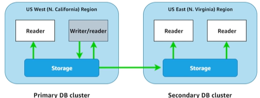

# 10. Amazon Aurora (Giải pháp Database cao cấp của AWS)

## I. Amazon Aurora là gì?
> **Amazon Aurora** là công nghệ cơ sở dữ liệu quan hệ độc quyền được xây dựng riêng cho điện toán đám mây bởi AWS. Nó hoàn toàn tương thích với **MySQL** và **PostgreSQL**, kết hợp hiệu năng và tính sẵn sàng của các cơ sở dữ liệu thương mại cao cấp với sự đơn giản và chi phí tối ưu của cơ sở dữ liệu mã nguồn mở.

---

## II. Các hình thức triển khai chính của Amazon Aurora

Aurora hỗ trợ hai hình thức triển khai chính để đáp ứng tải công việc linh hoạt của ứng dụng:

### 1. Aurora Provisioned Cluster (Master + Multi Read Replica)
* **Cấu hình**: Tài nguyên phần cứng cố định cho cụm máy chủ (CPU, RAM).
* **Cơ chế**: Gồm 1 Primary DB Instance (phục vụ cả Đọc/Ghi) và nhiều bản sao chỉ đọc (Read Replicas - hỗ trợ tối đa lên đến 15 bản sao) cùng chia sẻ chung một lớp lưu trữ ảo hóa dùng chung (shared storage cluster volume).
* **Đặc trưng**: Tốc độ đồng bộ cực nhanh giữa các node và khả năng tự động failover chỉ mất vài chục giây nếu Primary Node gặp sự cố.

### 2. Aurora Serverless
* **Cấu hình**: Tự động hóa việc khởi tạo, cấu hình tài nguyên phần cứng (CPU, RAM) dựa trên nhu cầu thực tế của ứng dụng.
* **Cơ chế**: Tài nguyên được đo lường bằng đơn vị **ACU (Aurora Capacity Units)**. Hệ thống tự động scale up khi tải tăng cao và scale down (thậm chí dừng hẳn về 0 ACU để tiết kiệm chi phí) khi không có truy cập.
* **Phù hợp**: Các tải công việc biến động thất thường, khó dự đoán trước hoặc chạy không thường xuyên.

## III. Mô hình Cluster của Aurora

Cấu trúc cụm của Amazon Aurora được thiết kế dựa trên sự phân tách hoàn toàn giữa năng lực tính toán (Compute instances) và hạ tầng lưu trữ (Storage layer):

### 1. Cơ cấu cụm Aurora Cluster bao gồm:
* **1 Master Node (Primary DB Instance)**: Đóng vai trò máy chủ chính, thực hiện xử lý cả tác vụ Đọc và Ghi (Read/Write) vào Cluster Volume. Mỗi Cluster chỉ có duy nhất 1 Primary Instance này.
* **1 hoặc nhiều Replica Nodes (tối đa 15 nodes)**: Các máy chủ bản sao đóng vai trò chỉ đọc (Read-Only) kết nối tới chung một Cluster Volume. Ngoài việc chia tải đọc, các Reader này còn đóng vai trò dự phòng sẵn sàng thăng cấp lên làm Master mới khi xảy ra sự cố.

### 2. Lớp lưu trữ dùng chung (Cluster Volume)
* Dữ liệu của cụm Aurora được lưu trữ tập trung trên một lớp ổ đĩa ảo hóa gọi là **Cluster Volume**. Lớp lưu trữ này trải rộng (**span**) trên nhiều Availability Zones (AZs) khác nhau để đảm bảo tính sẵn sàng cao (High Availability).
* **Tự động sao chép (Automatic Replication)**: Dữ liệu được Cluster Volume tự động nhân bản ra nhiều bản sao (thường là 6 bản sao trên 3 AZs khác nhau) để phòng tránh lỗi. *Đặc biệt, số lượng bản sao dữ liệu này hoàn toàn độc lập và không phụ thuộc vào số lượng instance (Writer/Reader) hiện có trong cụm.*
* **Tự động co giãn ổ đĩa (Auto-scaling Storage)**: Dung lượng của Cluster Volume tự động mở rộng tương ứng với khối lượng dữ liệu thực tế tải lên của người dùng (tối đa lên đến 128 TB). Bạn không thể chọn cấu hình hoặc gán cố định (fix cứng) kích thước ổ đĩa ảo này trước khi khởi tạo.

### 3. Aurora Global Cluster (Cụm cơ sở dữ liệu toàn cầu)
* **Khái niệm**: Là cơ chế cho phép tạo ra cụm cơ sở dữ liệu liên vùng trải rộng trên nhiều AWS Regions khác nhau (Cross-Region Cluster).

* **Các ưu điểm vượt trội**:
  * **Tốc độ đọc nhanh (Local Read)**: Cho phép ứng dụng ở các khu vực địa lý khác nhau thực hiện truy vấn đọc dữ liệu với độ trễ thấp tương đương local read, nhờ dữ liệu được sao chép sẵn ở các region phụ (secondary regions).
  * **Tăng khả năng mở rộng (Scale Out)**: Cho phép mở rộng thêm tới 15 Read Nodes (Reader instances) cho mỗi cụm cluster tại từng Region phụ để phân tán tải đọc.
  * **Khắc phục sự cố & Dự phòng thảm họa (Disaster Recovery)**: Rút ngắn tối đa thời gian phục hồi hệ thống (**RTO** chỉ trong vài phút khi thăng cấp region phụ lên làm chính) và giảm thiểu lượng dữ liệu bị mất (**RPO** xuống dưới 1 giây) khi xảy ra sự cố nghiêm trọng ở cấp độ toàn bộ một Region.
  * **Chuyển tiếp lệnh ghi (Write Forwarding)**: Mặc định, các cụm DB cluster ở secondary regions chỉ chấp nhận truy vấn đọc dữ liệu. Tuy nhiên, bạn có thể bật tính năng **Write Forwarding** để ứng dụng tại secondary region có thể gửi lệnh ghi; Aurora sẽ tự động điều hướng (forward) an toàn lệnh ghi đó về Primary Cluster ở region chính để xử lý.
* **Cơ chế đồng bộ độc quyền ở tầng lưu trữ**:
  * > [!NOTE]
  * > **Khác biệt cốt lõi so với RDS thông thường**: Đối với RDS thông thường, việc đồng bộ dữ liệu giữa các máy chủ (hoặc giữa các vùng) phải do Database Engine xử lý bằng cách truyền tải transaction logs. Với Aurora, quá trình nhân bản dữ liệu được thực hiện trực tiếp **ở tầng Storage ảo hóa (Storage Layer / Cluster Volume)** mà không gây hao tốn tài nguyên tính toán (CPU/RAM) của các Database Instances con, giúp giảm thiểu tối đa độ trễ replication xuống dưới 1 giây.

---

## IV. Mô hình Serverless của Aurora

**Aurora Serverless** là công nghệ cho phép khởi tạo và vận hành cơ sở dữ liệu quan hệ dưới dạng Serverless hoàn toàn, loại bỏ hoàn toàn gánh nặng cấu hình phần cứng máy chủ vật lý.

### 1. Cơ chế hoạt động bằng đơn vị ACU (Aurora Capacity Unit)
* Đối với mô hình này, thay vì chọn cấu hình phần cứng cụ thể (vCPU, RAM) cho DB instance, người dùng sẽ thiết lập phạm vi giới hạn năng lực xử lý bằng đơn vị **ACU (Aurora Capacity Unit)** (bao gồm cả giới hạn ACU tối thiểu và tối đa).
* **ACU càng cao, hiệu suất DB càng mạnh**: 1 ACU tương đương với khoảng 2 GB RAM kèm theo năng lượng CPU và băng thông mạng tương ứng.
* **Tự động co giãn (Auto-scaling)**: Hệ thống tự động đo lường mức độ sử dụng tài nguyên (CPU, RAM, kết nối mạng) và tự động tăng (scale up) hoặc giảm (scale down) số lượng ACU theo thời gian thực để đáp ứng chính xác tải công việc hiện tại.

### 2. Trường hợp áp dụng (Use Cases) phù hợp nhất
* **Workload chưa xác định**: Thích hợp cho các hệ thống mới triển khai, chưa nắm rõ hoặc chưa đo lường được khối lượng tải công việc (workload) thực tế của người dùng.
* **Tải biến động thường xuyên**: Các ứng dụng có đặc trưng truy cập thay đổi lên xuống thường xuyên hoặc có chu kỳ (ví dụ: lượng truy cập tăng vọt vào giờ hành chính và giảm mạnh/không có ai dùng vào ban đêm).
* **Tối ưu hóa chi phí**: Khi không có kết nối hay truy cập, hệ thống có thể tự động giảm dung lượng về mức tối thiểu giúp bạn chỉ phải trả tiền cho giây thực sự sử dụng.

---

## V. Những tính năng vượt trội của Aurora so với RDS thông thường

### 1. Hiệu năng vượt trội hơn hẳn
* **Đặc điểm**: Theo kiểm nghiệm và quảng cáo của AWS, Aurora cung cấp hiệu năng đọc/ghi vượt trội so với các DB Instance RDS thông thường có cùng thông số phần cứng cơ bản:
  * Nhanh gấp **5 lần** đối với MySQL.
  * Nhanh gấp **3 lần** đối với PostgreSQL.
* **Lý do**: Nhờ kiến trúc lưu trữ phân tán, tối ưu hóa ghi log trực tiếp vào lớp lưu trữ ảo hóa dùng chung mà không cần thực hiện ghi tuần tự xuống đĩa cứng vật lý như các cơ sở dữ liệu truyền thống.

### 2. Hỗ trợ tính năng Backtracking (Quay ngược thời gian)
* **Đặc điểm**: Cho phép bạn "quay ngược thời gian" và đưa cơ sở dữ liệu về một thời điểm chính xác trong quá khứ (lên tới tối đa **72 giờ**) chỉ trong vài giây.
* **Sự khác biệt lớn so với Restore từ Snapshot**:
  * **Restore từ Snapshot**: Đòi hỏi AWS phải khởi tạo một database instance mới hoàn toàn từ đầu (rất tốn thời gian đối với dữ liệu lớn và phải đổi endpoint kết nối).
  * **Backtracking**: Khôi phục trực tiếp ngay trên chính Cluster đang chạy giúp giảm tối thiểu thời gian phục hồi dịch vụ (RTO) xuống còn vài giây mà không cần thay đổi Endpoint.

### 3. Tự động quản lý Endpoint cấp độ Cluster
* **Đặc điểm**: Tự động cung cấp và cập nhật trạng thái của hai Endpoint cố định mức cụm: **Writer Endpoint** (định tuyến tự động tới máy chủ ghi hiện hành) và **Reader Endpoint** (tự động chia đều tải đọc qua cơ chế cân bằng tải đến tất cả các bản sao Read Replicas).
* **Lợi ích**: Lập trình viên không bao giờ cần phải chỉnh sửa cấu hình kết nối của ứng dụng khi xảy ra sự cố hoán đổi node (Failover) hoặc khi thêm bớt các bản sao Read Replicas.

---

* **Bài trước**: [9. Amazon RDS Hands-on Lab(Cluster) (Lab 2)](9.%20Amazon%20RDS%20Hands-on%20Lab%28Cluster%29.md)
