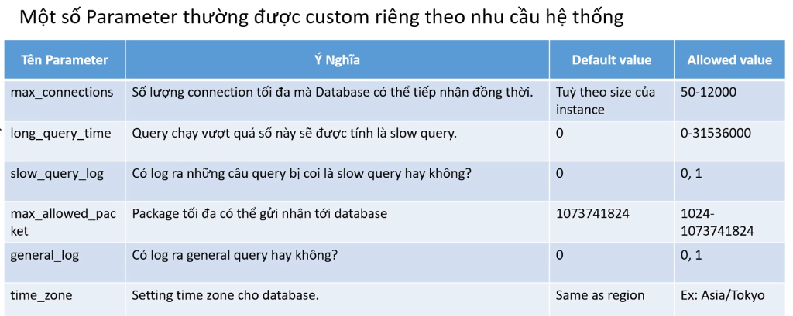

# 12. Amazon RDS Parameter Groups (Cấu hình tham số Database)

Vì Amazon RDS là một dịch vụ được AWS quản lý hoàn toàn (Managed Service) nên người dùng không thể đăng nhập trực tiếp vào hệ điều hành (OS) để chỉnh sửa các tệp cấu hình (như `my.cnf` đối với MySQL hay `postgresql.conf` đối với PostgreSQL). Thay vào đó, AWS cung cấp một cơ chế cấu hình gián tiếp gọi là **Parameter Groups**.

---

## I. Khái niệm và Vai trò của Parameter Groups

* **Bản chất**: **Parameter Group** đóng vai trò như một container chứa đựng tất cả các tham số cấu hình (variables/settings) cho Database Engine (ví dụ: cấu hình múi giờ `time_zone`, bảng mã ký tự `character_set_server`, giới hạn số kết nối tối đa `max_connections`...).
* **Phạm vi can thiệp**: Chỉ tác động ở cấp độ cài đặt của hệ quản trị cơ sở dữ liệu (Database-level settings), không can thiệp vào cài đặt của hệ điều hành (OS-level settings).

---

## II. Phân loại Parameter Groups: Default vs Custom

### 1. Default Parameter Group (Mặc định)
* Khi bạn khởi tạo một DB Instance hoặc DB Cluster mới, nếu không cấu hình gì thêm, AWS sẽ tự động áp dụng **Default Parameter Group** tương ứng với Database Engine và phiên bản đang chọn.
* **Lưu ý cực kỳ quan trọng**: Default Parameter Group **không thể chỉnh sửa hoặc thay đổi** bất kỳ tham số nào bên trong để đảm bảo hệ thống luôn có cấu hình an toàn tối thiểu để hoạt động ổn định.

### 2. Custom Parameter Group (Tùy chỉnh)
* Khi hệ thống yêu cầu thay đổi tham số (ví dụ: tăng dung lượng cache, bật slow query log, đổi bảng mã tiếng Việt...), bạn phải tạo mới một **Custom Parameter Group**.
* **Cách tạo**: Tạo mới bằng cách nhân bản (copy) từ một Default Parameter Group mẫu, sau đó tiến hành chỉnh sửa các giá trị tham số phù hợp với nhu cầu dự án và gán (apply) Custom Parameter Group này vào DB Instance hoặc DB Cluster.

---

## III. Phân loại theo phạm vi áp dụng (Scope)

Parameter Groups được chia thành 2 loại chính tùy thuộc vào quy mô cấu hình bạn muốn áp dụng:

1. **Cluster Parameter Group (Mức cụm)**:
   * **Phạm vi**: Áp dụng các cấu hình giống nhau cho toàn bộ các thực thể DB Instances (cả Writer và Readers) nằm bên trong một **DB Cluster**.
   * **Sử dụng**: Thường dùng để cấu hình các tham số quy định chung cho cả cụm (ví dụ: các biến liên quan đến quá trình đồng bộ dữ liệu, lưu trữ chung).
2. **Instance Parameter Group (Mức máy chủ)**:
   * **Phạm vi**: Chỉ áp dụng các cấu hình cho duy nhất một **DB Instance** độc lập (hoặc một máy chủ cụ thể trong cụm).
   * **Sử dụng**: Dùng để cấu hình các tham số đặc thù của riêng thực thể đó (ví dụ: các tham số tối ưu hóa bộ nhớ tạm thời của máy chủ Reader).

---

## IV. Một số Parameter thường được tùy chỉnh theo nhu cầu hệ thống

Dưới đây là các tham số quan trọng thường được điều chỉnh trong thực tế để tối ưu hóa hiệu năng, giám sát và bảo mật hệ thống:

| Tên Parameter | Ý nghĩa / Công dụng | Giá trị mặc định (Default) | Giá trị cho phép (Allowed) |
|---|---|---|---|
| **`max_connections`** | Số lượng kết nối đồng thời tối đa mà Database có thể tiếp nhận. | Tùy thuộc vào kích thước (size) của DB instance. | `50 - 12000` |
| **`long_query_time`** | Ngưỡng thời gian (tính bằng giây). Nếu truy vấn chạy vượt quá số này sẽ được ghi nhận là slow query (truy vấn chậm). | `0` | `0 - 31536000` |
| **`slow_query_log`** | Quyết định có kích hoạt ghi nhật ký (log) cho những truy vấn chậm hay không. | `0` (Tắt) | `0` (Tắt), `1` (Bật) |
| **`max_allowed_packet`** | Kích thước gói tin tối đa (bằng byte) mà database có thể gửi hoặc nhận trong một yêu cầu. | `1073741824` | `1024 - 1073741824` |
| **`general_log`** | Quyết định có ghi lại toàn bộ các câu lệnh SQL được gửi tới database hay không (thường chỉ bật khi debug vì gây tốn dung lượng). | `0` (Tắt) | `0` (Tắt), `1` (Bật) |
| **`time_zone`** | Thiết lập múi giờ hoạt động cho hệ thống database. | Trùng với múi giờ của AWS Region hiện tại. | Ví dụ: `Asia/Tokyo`, `Asia/Ho_Chi_Minh` |

---

* **Bài trước**: [11. Amazon Aurora Hands-on Lab(Backtrack) (Lab 3)](11.%20Amazon%20Aurora%20Hands-on%20Lab%28Backtrack%29.md)
