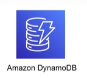
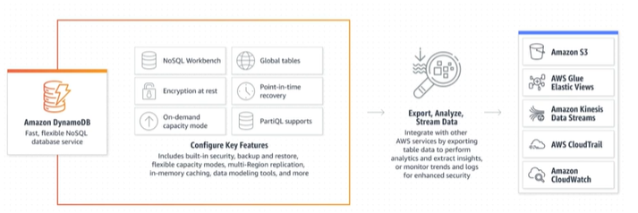

# 1. Amazon DynamoDB Overview (Tổng quan về Amazon DynamoDB)

## I. NoSQL là gì?

> **Non-Relational Database**, còn được gọi là **NoSQL (Not Only SQL)** là một hệ thống cơ sở dữ liệu mà không sử dụng mô hình quan hệ truyền thống dưới dạng các bảng và các quan hệ khóa ngoại. Thay vào đó, nó sử dụng một cấu trúc dữ liệu khác, phù hợp hơn với các ứng dụng có khối lượng dữ liệu lớn, tốc độ truy vấn nhanh và tính mở rộng cao hơn.

### Tại sao cần NoSQL?

Cơ sở dữ liệu quan hệ (SQL) truyền thống (như MySQL, PostgreSQL, SQL Server) hoạt động rất tốt cho các dữ liệu có cấu trúc định sẵn và các giao dịch phức tạp cần tính ACID nghiêm ngặt. Tuy nhiên, khi đối mặt với kỷ nguyên dữ liệu lớn (Big Data) và các ứng dụng thời gian thực (Real-time apps) phục vụ hàng triệu người dùng đồng thời, SQL bộc lộ một số hạn chế:
* **Khó mở rộng theo chiều ngang (Horizontal Scaling)**: SQL được thiết kế để chạy tốt nhất trên một máy chủ đơn lẻ (Scale Vertical - nâng cấp RAM, CPU). Việc phân tán một cơ sở dữ liệu quan hệ ra nhiều máy chủ (Sharding/Clustering) là cực kỳ phức tạp và tốn kém.
* **Schema cứng nhắc**: Mỗi khi muốn thêm một trường thông tin mới vào bảng, bạn phải thực hiện lệnh `ALTER TABLE`, điều này có thể gây treo hệ thống hoặc làm chậm ứng dụng nếu bảng có hàng triệu dòng dữ liệu.
* **Tốc độ truy vấn giảm khi JOIN nhiều bảng**: Khi dữ liệu lớn lên, các câu lệnh `JOIN` phức tạp giữa nhiều bảng sẽ làm giảm đáng kể hiệu năng hệ thống.

NoSQL ra đời để giải quyết các bài toán trên bằng cách **bỏ qua tính chuẩn hóa dữ liệu (normalization)**, tập trung vào **hiệu năng**, **khả năng co giãn không giới hạn** và **sự linh hoạt của schema**.

---

## II. Các loại cơ sở dữ liệu NoSQL phổ biến

NoSQL không phải là một loại cơ sở dữ liệu duy nhất mà được chia làm 4 nhóm chính dựa trên cách lưu trữ dữ liệu:

### 1. Key-Value Store (Kho lưu trữ Khóa - Giá trị)
* **Định nghĩa**: Lưu trữ dữ liệu dưới dạng các cặp key-value (khóa-giá trị). Các khóa được sử dụng để truy cập và lấy dữ liệu, trong khi giá trị có thể là bất kỳ kiểu dữ liệu nào.
* **Đại diện**: **Amazon DynamoDB**, Redis, Memcached.
* **Trường hợp sử dụng**: Lưu Session ID, giỏ hàng (Shopping Cart), Cache dữ liệu.

### 2. Document Store (Kho lưu trữ Tài liệu)
* **Định nghĩa**: Lưu trữ dữ liệu dưới dạng tài liệu, thường là định dạng JSON hoặc XML. Các tài liệu được lưu trữ theo dạng phi cấu trúc, cho phép dữ liệu được lưu trữ một cách linh hoạt và thêm vào dễ dàng.
* **Đại diện**: **Amazon DocumentDB**, MongoDB, CouchDB.
* **Trường hợp sử dụng**: Hồ sơ người dùng (User Profile), Hệ thống quản trị nội dung (CMS), Catalogue sản phẩm.

### 3. Column Oriented Store (Kho lưu trữ hướng Cột)
* **Định nghĩa**: Lưu trữ dữ liệu dưới dạng các bảng với hàng và cột, nhưng khác với cơ sở dữ liệu quan hệ, các cột có thể được thêm và loại bỏ một cách độc lập.
* **Đại diện**: **Amazon Keyspaces** (Cassandra), Apache HBase, Google Bigtable.
* **Trường hợp sử dụng**: Phân tích dữ liệu lớn (Big Data Analytics), Hệ thống ghi Log tập trung, Dữ liệu thiết bị IoT (Time-series data).

### 4. Graph Database (Cơ sở dữ liệu Đồ thị)
* **Định nghĩa**: Lưu trữ dữ liệu dưới dạng các nút (nodes) và mối quan hệ giữa chúng, cung cấp khả năng xử lý dữ liệu phức tạp.
* **Đại diện**: **Amazon Neptune**, Neo4j.
* **Trường hợp sử dụng**: Mạng xã hội (Social Networks), Hệ thống gợi ý (Recommendation Engine), Phát hiện gian lận tài chính (Fraud Detection).

---

## III. Bảng so sánh chi tiết: SQL vs NoSQL

---

## IV. Amazon DynamoDB là gì?

> **Amazon DynamoDB** là một cơ sở dữ liệu key-value NoSQL, fully managed và serverless, được thiết kế để vận hành các ứng dụng high-performance ở mọi quy mô. DynamoDB cung cấp built-in security, continuous backups, automated multi-Region replication, in-memory caching, cùng các công cụ data import và export.

DynamoDB hỗ trợ cả hai mô hình dữ liệu là **Key-Value Store** và **Document Store** (JSON).

### Các đặc trưng nổi bật của Amazon DynamoDB:

1. **Hiệu năng nhất quán ở mọi quy mô (Consistent Performance)**
   * DynamoDB duy trì thời gian phản hồi truy vấn ở mức **dưới 10 mili-giây (Single-digit Millisecond Latency)** đối với cả tác vụ đọc và ghi, bất kể kích thước bảng dữ liệu của bạn là vài GB hay hàng trăm TB.
2. **Serverless (Không máy chủ)**
   * Bạn không cần phải khởi tạo, cấu hình hay quản lý bất kỳ DB instance hay hệ điều hành nào (như RDS). Bạn chỉ cần tạo bảng và sử dụng. Hệ thống tự động co giãn tài nguyên xử lý ẩn bên dưới.
3. **Độ tin cậy và Tính sẵn sàng cực cao**
   * Dữ liệu của bạn được DynamoDB tự động **nhân bản đồng thời sang 3 Availability Zones (AZs)** trong một Region được chọn để phòng tránh rủi ro mất dữ liệu hoặc thảm họa phần cứng.
4. **Hỗ trợ hai chế độ tính dung lượng linh hoạt (Capacity Modes)**
   * **On-Demand Capacity**: Tự động scale lượng Request (đọc/ghi) ngay lập tức khi tải tăng vọt, chỉ tính tiền trên số lượng Request thực tế phát sinh.
   * **Provisioned Capacity**: Bạn khai báo trước giới hạn Read/Write mong muốn để tối ưu hóa chi phí khi lưu lượng tải đã ổn định và dự đoán được.

---

## V. Cấu trúc dữ liệu cơ bản của DynamoDB

Để chuẩn bị cho việc thiết kế bảng, bạn cần nắm rõ các thuật ngữ cốt lõi sau:
* **Table (Bảng)**: Tương tự như bảng trong cơ sở dữ liệu quan hệ, là nơi lưu trữ tập hợp dữ liệu.
* **Item (Bản ghi)**: Tương tự như một dòng (Row) trong SQL. Mỗi bảng chứa không giới hạn số lượng Items. Kích thước tối đa của một Item là **400 KB**.
* **Attribute (Thuộc tính)**: Tương tự như một cột (Column) trong SQL. Là các cặp khóa-giá trị (ví dụ: `"Age": 25`).
* **Primary Key (Khóa chính)**: Thuộc tính duy nhất bắt buộc phải khai báo khi tạo bảng để xác định danh tính của một Item. Khóa chính trong DynamoDB có 2 loại:
  * **Partition Key (khóa đơn)**: Dùng 1 thuộc tính làm khóa.
  * **Partition Key + Sort Key (khóa kết hợp)**: Dùng tổ hợp 2 thuộc tính làm khóa chính.

---

* **Bài tiếp theo**: [2. Amazon DynamoDB Data Model (Mô hình dữ liệu của DynamoDB)](2.%20Amazon%20DynamoDB%20Data%20Model.md)
