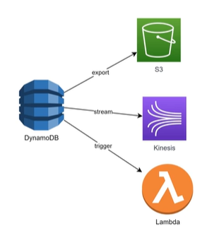

# 11. Amazon DynamoDB Export and Streams (Xuất và Truyền dữ liệu)

## I. Tổng quan về tính năng Export và Streams

> Amazon DynamoDB cung cấp hai cơ chế mạnh mẽ để di chuyển, sao lưu và xử lý dữ liệu ra bên ngoài: **Export to Amazon S3** (cho phép xuất dữ liệu tĩnh hàng loạt) và **DynamoDB Streams / Kinesis integration** (cho phép truyền dữ liệu thay đổi thời gian thực).

Các tính năng này giúp tích hợp DynamoDB với các dịch vụ phân tích dữ liệu lớn, lưu trữ dài hạn hoặc xây dựng các kiến trúc hướng sự kiện (Event-Driven Architecture) tự động hóa.

---

## II. DynamoDB Export to Amazon S3 (Xuất dữ liệu tĩnh)

Tính năng này cho phép bạn xuất dữ liệu từ một bảng DynamoDB sang một Amazon S3 bucket để phân tích hoặc lưu trữ.

* **Không ảnh hưởng đến hiệu năng bảng**: Quá trình xuất dữ liệu được thực hiện ngầm bởi AWS và **không tiêu tốn Read Capacity Units (RCU)** của bảng. Do đó ứng dụng của bạn vẫn hoạt động bình thường mà không bị chậm hay giảm hiệu suất.
* **Thời điểm xuất dữ liệu**: Bạn có thể xuất dữ liệu hiện tại hoặc dữ liệu tại một thời điểm bất kỳ trong vòng 35 ngày qua (sử dụng tính năng Point-in-Time Recovery - PITR).
* **Định dạng hỗ trợ**: Dữ liệu xuất sang S3 hỗ trợ định dạng **DynamoDB JSON** hoặc **Amazon Ion**.
* **Các kịch bản sử dụng phổ biến**:
  - **Phân tích dữ liệu lớn (Big Data Analytics)**: Sử dụng Amazon Athena, AWS Glue, hoặc Amazon EMR để chạy các câu lệnh truy vấn phân tích SQL phức tạp trực tiếp trên S3 mà không gây quá tải cho DynamoDB.
  - **Lưu trữ lâu dài (Archiving)**: Xuất dữ liệu cũ sang S3 và cấu hình S3 Lifecycle để chuyển sang S3 Glacier lưu trữ với chi phí siêu rẻ nhằm mục đích tuân thủ pháp lý.
  - **Sao lưu ngoại tuyến**: Lưu giữ các bản snapshot dữ liệu định kỳ để phục vụ kiểm toán hoặc chia sẻ dữ liệu an toàn cho bên thứ ba.

---

## III. DynamoDB Streams và Triggers (Xử lý dữ liệu thời gian thực)

DynamoDB Streams ghi lại một chuỗi các thay đổi diễn ra trên các Item trong bảng theo thứ tự thời gian thực tế.

1. **Nguyên lý hoạt động**:
   - Khi có thao tác thêm mới (Insert), sửa đổi (Modify) hoặc xóa (Delete) trên bảng, một bản ghi nhật ký (Stream Record) sẽ được tạo ra trong Stream.
   - Bản ghi này có thể chứa thông tin cũ (Old Image) trước khi sửa đổi, thông tin mới (New Image) sau khi sửa đổi, hoặc cả hai.
   - Các bản ghi thay đổi này được lưu trữ trong Stream tối đa **24 giờ**, sau đó sẽ tự động bị xóa.

2. **Kích hoạt tự động với AWS Lambda (Triggers)**:
   - Bạn có thể cấu hình để AWS Lambda lắng nghe liên tục các thay đổi từ DynamoDB Streams.
   - Khi có thay đổi dữ liệu, hàm Lambda sẽ tự động được kích hoạt (triggered) để xử lý logic:
     - *Ví dụ*: Gửi email chào mừng khi có bản ghi user mới được tạo; Gửi cảnh báo SMS khi số dư tài khoản của khách hàng xuống dưới mức tối thiểu.

3. **Tích hợp Amazon Kinesis Data Streams**:
   - Ngoài AWS Lambda, bạn có thể cấu hình truyền dữ liệu thay đổi trực tiếp từ DynamoDB sang **Amazon Kinesis Data Streams**.
   - Kinesis cho phép giữ dữ liệu lên đến **1 năm** (so với 24 giờ của DynamoDB Streams) và hỗ trợ tích hợp với các công cụ phân tích thời gian thực mạnh mẽ như Amazon Kinesis Data Firehose để đẩy trực tiếp dữ liệu sang OpenSearch, Redshift hoặc S3.

---

## IV. Bảng so sánh nhanh: Export vs Streams

| Tiêu chí | Export to Amazon S3 | DynamoDB Streams / Kinesis |
|---|---|---|
| **Phương thức xử lý** | Batch (Hàng loạt theo lô) | Real-time (Thời gian thực liên tục) |
| **Tác động hiệu năng** | Không ảnh hưởng (Zero RCU consumption) | Không ảnh hưởng (Zero RCU/WCU consumption) |
| **Dịch vụ đích chính** | Amazon S3 | AWS Lambda, Amazon Kinesis |
| **Thời gian lưu trữ dữ liệu** | Vĩnh viễn (Phụ thuộc cấu hình S3) | 24 giờ (DynamoDB Streams) hoặc tối đa 1 năm (Kinesis) |
| **Mục đích chính** | Phân tích, báo cáo (OLAP), sao lưu | Kích hoạt tác vụ tự động, đồng bộ hệ thống |

---

* **Bài trước**: [10. Amazon DynamoDB Accelerator (DAX) (Bộ nhớ đệm DAX)](10.%20Amazon%20DynamoDB%20Accelerator%20%28DAX%29.md)
