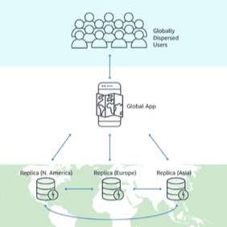

# 7. Amazon DynamoDB Global Tables (Bảng toàn cầu)

## I. DynamoDB Global Tables là gì?

> **Amazon DynamoDB Global Tables** là một tính năng của Amazon DynamoDB, cung cấp giải pháp cơ sở dữ liệu **fully managed, multi-Region, và active-active database** hoạt động trên phạm vi toàn cầu. Tính năng này cho phép bạn tạo các bảng DynamoDB ở nhiều AWS Region khác nhau và tự động sao chép, đồng bộ dữ liệu giữa chúng.

Nhờ đó, dữ liệu của bạn được phân phối đồng đều trên toàn cầu và luôn sẵn sàng với độ trễ cực thấp cho các ứng dụng chạy ở các vùng địa lý khác nhau.

---

## II. Cách thức hoạt động của Global Tables

Global Tables hoạt động dựa trên các nguyên lý cốt lõi sau:

1. **Dựa trên DynamoDB Streams**:
   - Khi bạn kích hoạt Global Tables, DynamoDB sẽ sử dụng **DynamoDB Streams** để theo dõi tất cả các thay đổi dữ liệu (tạo mới, cập nhật, xóa) trên mỗi bảng thành viên (**Replica Table**).
   - Các thay đổi này sau đó sẽ được tự động sao chép sang các Replica Tables ở các Region khác dưới dạng bất đồng bộ (asynchronous replication).

2. **Mô hình Active-Active Replication**:
   - Mọi Replica Table ở bất kỳ Region nào đều có quyền **đọc và ghi** dữ liệu. 
   - Ứng dụng ở mỗi Region có thể thực hiện thao tác ghi cục bộ (local write), và DynamoDB sẽ tự động đồng bộ hóa dữ liệu này tới toàn bộ các Region còn lại.

3. **Cơ chế giải quyết xung đột (Conflict Resolution)**:
   - Vì hỗ trợ Active-Active (ghi đồng thời ở nhiều Region), DynamoDB sử dụng cơ chế **Last Writer Wins (LWW)** để giải quyết xung đột.
   - Nếu có hai yêu cầu ghi đè lên cùng một thuộc tính của một Item diễn ra gần như đồng thời ở hai Region khác nhau, DynamoDB sẽ so sánh timestamp của các request và giữ lại dữ liệu của request có timestamp mới nhất.

---

## III. Các lợi ích nổi bật

* **Độ trễ local cực thấp (Low Latency Local Access)**:
  Ứng dụng ở các khu vực khác nhau (ví dụ: Mỹ, Châu Âu, Châu Á) có thể truy cập dữ liệu trực tiếp từ Replica Table nằm cùng Region của chúng với độ trễ chỉ vài mili-giây (single-digit millisecond).
* **Khả năng chịu lỗi cao & Khôi phục sau thảm họa (Disaster Recovery)**:
  Nếu một AWS Region gặp sự cố kỹ thuật hoặc thiên tai, ứng dụng của bạn có thể chuyển hướng (failover) lưu lượng đọc/ghi sang một Region khác chứa Replica Table ngay lập tức mà không làm mất mát dữ liệu hoặc gián đoạn hoạt động.
* **SLA tính sẵn sàng vượt trội**:
  Kích hoạt Global Tables giúp tăng cam kết mức độ dịch vụ (SLA) về tính sẵn sàng từ **99.99%** (cho bảng Single-Region) lên đến **99.999%**.
* **Quản lý tự động hoàn toàn (Fully Managed)**:
  AWS tự động xử lý toàn bộ quá trình thiết lập replica, quản lý kết nối mạng và đồng bộ hóa ngầm mà không yêu cầu bạn phải viết code hay quản lý hạ tầng đồng bộ phức tạp.

---

## IV. Một số lưu ý quan trọng khi cấu hình

* **Bật DynamoDB Streams**: Bảng gốc bắt buộc phải kích hoạt tính năng DynamoDB Streams với tùy chọn **New and Old Images** trước khi có thể thêm các Replica Region.
* **Tên bảng & Khóa chính**: Các Replica Tables ở tất cả các Region phải có cùng tên bảng và cùng cấu hình khóa chính (Partition Key và Sort Key).
* **Nhất quán sau cùng (Eventual Consistency)**: Quá trình sao chép dữ liệu giữa các Region diễn ra bất đồng bộ, do đó các thay đổi cần một khoảng thời gian ngắn để đồng bộ hoàn toàn (thông thường dưới 1 giây). Truy vấn đọc từ Region khác ngay sau khi ghi có thể nhận được dữ liệu cũ.
* **Chế độ dung lượng (Capacity Modes)**: Để tránh nghẽn luồng đồng bộ, bạn nên cấu hình đồng nhất chế độ dung lượng (On-Demand hoặc cùng mức Provisioned RCU/WCU) cho tất cả các Replica Tables.
* **Chi phí**: 
  - Chi phí lưu trữ và ghi dữ liệu sẽ tính riêng trên từng Replica Table ở mỗi Region.
  - Sẽ có thêm chi phí truyền dữ liệu xuyên vùng (**Cross-Region Data Transfer**) khi đồng bộ dữ liệu giữa các Region.

---

* **Bài trước**: [6. Amazon DynamoDB Hands-on Lab(Index) (Lab 2 - Chỉ mục trong DynamoDB)](6.%20Amazon%20DynamoDB%20Hands-on%20Lab%28Index%29.md)
* **Bài tiếp theo**: [8. Amazon DynamoDB Accelerator (DAX) (Bộ nhớ đệm DAX)](8.%20Amazon%20DynamoDB%20Accelerator%20%28DAX%29.md)
