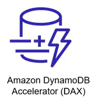
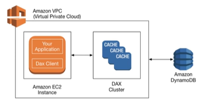

# 8. Amazon DynamoDB Accelerator (DAX) (Bộ nhớ đệm DAX)

## I. Amazon DynamoDB Accelerator (DAX) là gì?

> **Amazon DynamoDB Accelerator (DAX)** là một dịch vụ in-memory cache **fully managed, highly available** (quản lý hoàn toàn và có tính sẵn sàng cao) được thiết kế chuyên biệt cho Amazon DynamoDB. DAX giúp tăng tốc hiệu năng đọc dữ liệu lên tới **10 lần** — cải thiện thời gian phản hồi từ mức mili-giây (milliseconds) xuống mức **micro-giây (microseconds)** — ngay cả với quy mô hàng triệu yêu cầu mỗi giây.

---

## II. Nguyên lý hoạt động của DAX

DAX hoạt động dưới dạng một **Cluster** trong môi trường Amazon VPC. Điểm đặc biệt của DAX so với các giải pháp cache thông thường (như Redis hay Memcached) là cơ chế tích hợp sâu và hoạt động liền mạch:

1. **Yêu cầu DAX Client**:
   - Để ứng dụng có thể truy cập dữ liệu thông qua DAX, bạn cần cài đặt và cấu hình **DAX Client** (bộ thư viện SDK hỗ trợ DAX của AWS) trong mã nguồn ứng dụng thay vì client DynamoDB thông thường.

2. **Inline Cache (Bộ nhớ đệm tích hợp)**:
   - Các hệ thống cache ngoài thường dùng mô hình **Cache-Aside** (ứng dụng phải tự kiểm tra cache, nếu thiếu thì đọc từ DB rồi tự cập nhật vào cache).
   - DAX hoạt động như một **Inline Cache** (bao gồm cả **Read-Through** và **Write-Through**). Ứng dụng của bạn tương tác trực tiếp với DAX thông qua DAX Client như thể nó là bảng DynamoDB gốc.

3. **Tương thích API 100% (API-Compatible)**:
   - DAX hỗ trợ cùng một bộ API SDK với DynamoDB. 
   - Bạn chỉ cần thay đổi cấu hình endpoint trong code của ứng dụng để trỏ sang DAX Cluster thay vì trỏ trực tiếp đến DynamoDB. Bạn không cần viết lại logic truy vấn dữ liệu.

4. **Cơ chế Đọc/Ghi dữ liệu qua DAX**:
   - **Khi đọc (Read-Through)**:
     - Ứng dụng gửi yêu cầu đọc (`GetItem`, `BatchGetItem`, `Query`, `Scan`) tới DAX.
     - Nếu dữ liệu đã có trong DAX (**Cache Hit**), DAX sẽ trả về kết quả ngay lập tức ở tốc độ micro-giây.
     - Nếu chưa có (**Cache Miss**), DAX tự động gọi đến DynamoDB để lấy dữ liệu, lưu một bản sao vào bộ nhớ đệm của nó, rồi trả kết quả về cho ứng dụng.
     - **Chuyển tiếp Strongly Consistent Reads**: Khi ứng dụng chỉ định chế độ đọc nhất quán mạnh (Strongly Consistent Read), request sẽ được **forward thẳng tới DynamoDB** mà không đi qua bộ nhớ đệm của DAX để đảm bảo dữ liệu trả về luôn là mới nhất.
   - **Khi ghi (Write-Through)**:
     - Khi ứng dụng thực hiện các lệnh ghi dữ liệu (`PutItem`, `UpdateItem`, `DeleteItem`), dữ liệu sẽ được ghi đồng thời vào cả DAX Cluster và bảng DynamoDB gốc.
     - Thao tác ghi chỉ được coi là thành công khi dữ liệu đã được ghi nhận ở cả hai nơi, giúp đảm bảo tính đồng bộ của bộ nhớ đệm.

---

## III. Khi nào nên và không nên sử dụng DAX?

### 1. Trường hợp NÊN sử dụng DAX:
* **Ứng dụng yêu cầu thời gian phản hồi cực nhanh**: Các hệ thống trò chơi trực tuyến (game leaderboard), ứng dụng giao dịch tài chính, đấu giá trực tuyến, hoặc ứng dụng cá nhân hóa thời gian thực.
* **Workload thiên về Đọc (Read-Heavy)**: Tỷ lệ đọc vượt trội so với ghi.
* **Gặp vấn đề Hot Key (Điểm nóng dữ liệu)**: Khi một vài bản ghi cụ thể được truy cập liên tục với tần suất cực lớn (ví dụ: thông tin của một sản phẩm đang flash-sale), việc đọc qua DAX giúp tránh tình trạng quá tải hoặc nghẽn khóa chính của bảng DynamoDB.
* **Tối ưu hóa chi phí RCU**: Việc đọc trúng cache trên DAX không tiêu tốn Read Capacity Units (RCU) của bảng DynamoDB, giúp bạn duy trì mức RCU thấp và tiết kiệm đáng kể chi phí khi lượng request đọc khổng lồ.

### 2. Trường hợp KHÔNG NÊN sử dụng DAX:
* **Yêu cầu Strongly Consistent Reads**: DAX chỉ lưu trữ kết quả của các truy vấn Eventually Consistent Reads. Nếu ứng dụng bắt buộc phải đọc dữ liệu mới nhất 100% tại mọi thời điểm (Strongly Consistent), request sẽ được chuyển tiếp thẳng đến DynamoDB, bỏ qua DAX.
* **Workload thiên về Ghi (Write-Heavy)**: Nếu ứng dụng thực hiện ghi dữ liệu liên tục nhưng rất ít khi đọc lại, việc sử dụng DAX chỉ làm tăng thêm chi phí vận hành cluster mà không đem lại lợi ích hiệu năng đọc.
* **Không yêu cầu độ trễ mức micro-giây**: Nếu thời gian phản hồi mức mili-giây (dưới 10ms) của DynamoDB gốc đã đủ đáp ứng yêu cầu của ứng dụng.

---

## IV. Các đặc điểm kỹ thuật cần lưu ý

* **Kiến trúc Cluster**: DAX hoạt động dưới dạng một Cluster nằm trong Amazon VPC của bạn. Cluster này gồm một node chính (**Primary Node**) chịu trách nhiệm ghi và đồng bộ, cùng các node phụ (**Replica Nodes**) để phục vụ các yêu cầu đọc.
* **Cơ chế thu hồi bộ nhớ (Eviction)**: 
  - **TTL (Time to Live)**: Bạn cấu hình thời gian tồn tại tối đa của dữ liệu trong cache (mặc định là 5 phút).
  - **LRU (Least Recently Used)**: Khi bộ nhớ đệm của DAX bị đầy, nó sẽ tự động xóa các bản ghi ít được truy cập nhất để giải phóng không gian cho dữ liệu mới.
* **Bảo mật**: DAX tích hợp chặt chẽ với IAM để kiểm soát quyền truy cập và hỗ trợ mã hóa dữ liệu cả khi lưu trữ (Encryption at rest) lẫn khi truyền tải (Encryption in transit).

---

* **Bài trước**: [7. Amazon DynamoDB Global Tables (Bảng toàn cầu)](7.%20Amazon%20DynamoDB%20Global%20Tables.md)
* **Bài tiếp theo**: [9. Amazon DynamoDB Capacity Modes (Các chế độ dung lượng)](9.%20Amazon%20DynamoDB%20Capacity%20Modes.md)
