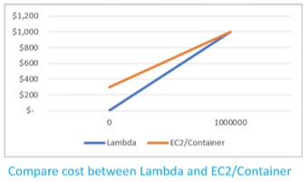

# 1. AWS Lambda (Serverless Compute)

  
  

## I. Tổng quan về AWS Lambda

**Nó là gì:**
> **AWS Lambda** là một dịch vụ tính toán serverless (Serverless Compute) của AWS, cho phép người dùng thực thi mã nguồn (code) mà không cần quan tâm, thiết lập hay quản lý hạ tầng máy chủ phía sau. Bạn chỉ phải chi trả cho thời gian thực tế mã chạy (compute time) tính bằng mili-giây, và không phát sinh bất kỳ chi phí nào khi code không hoạt động.

**Các ngôn ngữ và runtime hỗ trợ:**
AWS Lambda hỗ trợ nhiều ngôn ngữ lập trình phổ biến thông qua các runtime chính thức hoặc tùy biến:
* **Java**
* **Python**
* **.NET**
* **Go**
* **Ruby**
* **Node.js** (JavaScript)
* **Custom Runtime**: Cho phép bạn tự đóng gói và chạy bất kỳ ngôn ngữ nào khác (như C++, Rust, PHP...).
* **Container Image**: Cho phép đóng gói mã nguồn và mọi thư viện phụ thuộc (dependencies) dưới dạng Docker Container Image với dung lượng lên đến 10 GB.

**Khi nào sử dụng:**
* **Kiến trúc hướng sự kiện (Event-Driven Architecture)**: Tự động kích hoạt khi có sự kiện từ các dịch vụ khác (ví dụ: tự động resize ảnh khi tải lên S3, xử lý dữ liệu thay đổi từ DynamoDB Streams).
* **Xây dựng Serverless APIs**: Kết hợp với Amazon API Gateway để xử lý các request HTTP từ ứng dụng web/mobile.
* **Tự động hóa tác vụ hệ thống (Cron Jobs)**: Kích hoạt định kỳ qua Amazon EventBridge để dọn dẹp log, backup database, hoặc bật/tắt EC2 instance theo lịch.
* **Xử lý luồng dữ liệu lớn (Stream Processing)**: Xử lý dữ liệu thời gian thực được đẩy về từ Amazon Kinesis hoặc Amazon MSK (Managed Streaming for Apache Kafka).

## II. Các đặc trưng cơ bản của AWS Lambda

  

Khi thiết kế và triển khai Lambda Function, bạn cần nắm rõ các đặc trưng kỹ thuật và giới hạn cốt lõi sau:

> [!NOTE]
> ### 1. Cấu hình Bộ nhớ & CPU (Memory & CPU Allocation)
> * **Giới hạn**: Cấu hình Memory từ **128 MB đến 10 GB**.
> * **Cơ chế**: Bạn chỉ cấu hình trực tiếp dung lượng Memory. AWS sẽ tự động cấp phát tài nguyên CPU tỷ lệ thuận tương ứng (Memory càng cao, CPU được cấp phát càng lớn).

> [!TIP]
> ### 2. Vùng nhớ tạm thời (Ephemeral Storage - `/tmp`)
> * **Giới hạn**: Dung lượng thư mục tạm `/tmp` từ **512 MB đến 10 GB**.
> * **Đặc điểm**: Vùng nhớ này dùng để lưu trữ file tạm thời trong quá trình xử lý và sẽ bị giải phóng/xóa sạch ngay sau khi Lambda hoàn thành thực thi và container bị thu hồi.

> [!WARNING]
> ### 3. Giới hạn thời gian chạy (Execution Timeout)
> * **Giới hạn**: Timeout tối đa là **15 phút** (900 giây).
> * **Hệ quả**: Nếu hàm thực thi vượt quá thời gian cấu hình mà chưa hoàn tất, hệ thống sẽ cưỡng chế dừng (Failed) và thu hồi toàn bộ tài nguyên.

> [!IMPORTANT]
> ### 4. Cơ chế kích hoạt đa dạng (Triggers)
> Lambda hoạt động theo mô hình hướng sự kiện (Event-Driven) và có thể được kích hoạt bởi:
> * **Trigger trực tiếp**: Gọi thủ công từ Console, AWS CLI hoặc ứng dụng qua AWS SDK.
> * **API Gateway / ALB**: Chuyển đổi HTTP Request thành sự kiện để Lambda xử lý.
> * **Event-driven từ dịch vụ AWS**: Kích hoạt tự động bởi các dịch vụ S3 (tải file), SQS (hàng đợi), DynamoDB/Kinesis (luồng dữ liệu), IoT,...
> * **Lập lịch (Cron Job)**: Kích hoạt định kỳ theo thời gian thông qua **Amazon EventBridge**.

> [!NOTE]
> ### 5. Chế độ mạng (VPC vs Non-VPC Mode)
> Lambda hỗ trợ 2 chế độ chạy mạng:
> * **Ngoài VPC (Mặc định)**: Lambda có thể truy cập trực tiếp các public endpoint ngoài internet và các dịch vụ AWS công khai.
> * **Trong VPC**: Cần thiết khi Lambda cần giao tiếp trực tiếp với các tài nguyên riêng tư trong mạng nội bộ (ví dụ: cơ sở dữ liệu **RDS Database**, cache ElastiCache).
> * *Lưu ý*: Khi chạy trong VPC, Lambda cần sử dụng Elastic Network Interface (ENI). Do đó, hãy lưu ý cấu hình dải Subnet đủ rộng để tránh tình trạng cạn kiệt địa chỉ IP của subnet chứa Lambda khi hệ thống tự động co giãn (scale).

> [!TIP]
> ### 6. Tính chất Stateless & Nơi lưu trữ dữ liệu đầu ra
> Lambda là một dịch vụ **Stateless** (không lưu trạng thái). Sau khi hàm thực thi xong và container bị hủy, mọi dữ liệu cục bộ sẽ biến mất hoàn toàn. Để lưu trữ dữ liệu lâu dài hoặc ghi nhận thông tin, bạn cần xuất dữ liệu ra các dịch vụ lưu trữ chuyên biệt:
> * **Nhật ký hoạt động (Logs)**: Ghi trực tiếp ra **Amazon CloudWatch Logs** (thông qua stdout/stderr).
> * **Tệp tin (File Output)**: Lưu trữ lâu dài hoặc chia sẻ tệp lớn trên **Amazon S3** hoặc **Amazon EFS** (Elastic File System).
> * **Dữ liệu cấu trúc (Data Output)**: Ghi vào cơ sở dữ liệu quan hệ **RDS Database** hoặc NoSQL **Amazon DynamoDB**.

> [!IMPORTANT]
> ### 7. Quyền hạn thực thi (IAM Execution Role)
> * **Cơ chế**: Lambda luôn yêu cầu một **IAM Execution Role** đi kèm để có quyền tương tác với các tài nguyên AWS khác.
> * **Mặc định**: Khi tạo mới, Lambda sẽ được gán hoặc tạo tự động một Role cơ bản (như policy `AWSLambdaBasicExecutionRole`) để có quyền tối thiểu ghi log vào Amazon CloudWatch. Bạn cần mở rộng Role này khi Lambda cần thao tác với S3, DynamoDB hay RDS.

> [!NOTE]
> ### 8. Sử dụng AWS Lambda Layers để tái sử dụng mã nguồn
> * **Vấn đề**: Một Lambda Function không chỉ chứa một file code xử lý chính mà có thể chứa các file thư viện phụ thuộc (library), các module dùng chung (common logic, helper functions), v.v.
> * **Giải pháp**: Để tối ưu dung lượng gói code và tránh trùng lặp mã nguồn (duplicate code), AWS hỗ trợ công cụ **Lambda Layers**. Bạn có thể gom nhóm các thư viện hoặc phần code chung này lại thành một Layer riêng biệt để tái sử dụng và chia sẻ cho nhiều hàm Lambda khác nhau.

> [!TIP]
> ### 9. Cơ chế co giãn tự động (Horizontal Scaling & Concurrency Limits)
> * **Co giãn**: Khi nhận được nhiều request đồng thời từ client, Lambda tự động scale horizontal (mở rộng theo chiều ngang) bằng cách khởi chạy thêm các container song song để xử lý (concurrent executions).
> * **Giới hạn mặc định (Sandbox Limit)**: Khi mới khởi tạo tài khoản AWS, giới hạn concurrency mặc định ban đầu có thể rất thấp (ví dụ: **10 concurrent executions** cho tài khoản sandbox mới).
> * **Khuyến nghị**: Bạn bắt buộc phải gửi yêu cầu nâng hạn mức concurrency (Request Service Quota Increase) lên AWS trước khi chạy ứng dụng trên môi trường Production để tránh lỗi nghẽn (throttling).

> [!WARNING]
> ### 10. Reserved Concurrency (Tài nguyên chạy đồng thời dành riêng)
> * **Ý nghĩa**: Để đảm bảo một Lambda function luôn có đủ tài nguyên chạy và không bị ảnh hưởng (bị chiếm dụng hết concurrency) bởi các hàm Lambda khác chạy chung tài khoản AWS, bạn có thể thiết lập **Reserved Concurrency** (số lượng chạy đồng thời bảo lượng) cho hàm đó.
> * **Hệ quả**: Hàm được cấu hình Reserved Concurrency sẽ luôn được giữ riêng một lượng concurrency nhất định, đồng thời hạn mức co giãn tối đa của nó cũng được giới hạn ở chính con số này.

## III. Mô hình tính giá AWS Lambda (Lambda Pricing)

AWS Lambda hoạt động theo mô hình **Pay-as-you-go** với chi phí chờ (idle cost) bằng **0**. Bạn không tốn bất kỳ chi phí nào khi code không hoạt động, và chỉ phải trả tiền cho tài nguyên tiêu thụ thực tế khi có request xử lý.

Chi phí của AWS Lambda được tính dựa trên hai yếu tố chính:

1. **Thời gian thực thi của hàm (Compute Time)**: Tính theo đơn vị **GB-second** (Dung lượng Memory được cấu hình $\times$ Thời gian chạy thực tế tính bằng giây).
   * *Ví dụ đơn giá tại Region Singapore*: **$0.0000167 / GB-second**.
2. **Số lượng yêu cầu (Request Count)**: Số lần hàm được kích hoạt (gọi thực thi).
   * *Ví dụ đơn giá*: **$0.2 / 1,000,000 requests** (0.2 USD cho mỗi 1 triệu lượt kích hoạt).

---

### Ví dụ tính toán chi phí thực tế

Giả sử bạn cấu hình một Lambda Function với **512 MB Memory**, mỗi request xử lý mất **5 giây** và hệ thống nhận được **100,000 requests/tháng**. Cách tính chi phí như sau:

#### 1. Tính chi phí thời gian thực thi (Compute Cost)
* Quy đổi dung lượng Memory sang GB:
  $$\text{Memory (GB)} = \frac{512\text{ MB}}{1024\text{ MB}} = 0.5\text{ GB}$$
* Tính tổng thời gian thực thi trong tháng:
  $$\text{Tổng thời gian} = 100,000\text{ requests} \times 5\text{ giây} = 500,000\text{ giây}$$
* Tính tổng số lượng GB-second tiêu thụ:
  $$\text{GB-second} = 0.5\text{ GB} \times 500,000\text{ giây} = 250,000\text{ GB-second}$$
* Chi phí Compute:
  $$\text{Chi phí Compute} = 250,000 \times \$0.0000167 = \$4.175$$

#### 2. Tính chi phí số lượng yêu cầu (Request Cost)
* Chi phí Request:
  $$\text{Chi phí Request} = \left(\frac{100,000\text{ requests}}{1,000,000}\right) \times \$0.2 = \$0.02$$

#### 3. Tổng chi phí một tháng
$$\text{Tổng chi phí} = \$4.175\text{ (Compute)} + \$0.02\text{ (Request)} = \$4.195\text{ USD}$$

---

### So sánh chi phí: Lambda vs EC2 / Container

Do tính chất idle cost bằng 0, Lambda cực kỳ tiết kiệm đối với các hệ thống có lượng request không liên tục hoặc tải thấp. Dưới đây là biểu đồ so sánh chi phí trực quan giữa AWS Lambda và mô hình máy chủ EC2/Container truyền thống:

  
   
  <em>Biểu đồ so sánh chi phí giữa Lambda và EC2/Container</em>

* **AWS Lambda**: Chi phí xuất phát từ mốc **$0** (khi không có request) và tăng tuyến tính theo lưu lượng thực tế.
* **EC2 / Container**: Có chi phí cố định tối thiểu (idle cost) ban đầu tương đối lớn để duy trì máy chủ chạy 24/7, ngay cả khi không có lượt truy cập nào.

---

## IV. Hướng dẫn cơ bản để bắt đầu

1. **Viết mã xử lý (Handler Function)**:
   Viết logic xử lý bằng ngôn ngữ bạn chọn, định nghĩa điểm đầu vào (handler) nhận hai tham số chính là `event` (dữ liệu sự kiện truyền vào) và `context` (thông tin runtime của Lambda).
2. **Khởi tạo Lambda Function**:
   Tạo Lambda Function thông qua AWS Management Console, AWS CLI hoặc các công cụ IaC (Terraform, AWS SAM, Serverless Framework).
3. **Cấu hình IAM Execution Role**:
   Gắn một IAM Role vào Lambda Function để cấp quyền cho phép hàm tương tác an toàn với các dịch vụ khác của AWS (như ghi logs vào CloudWatch Logs, đọc dữ liệu từ S3 hay DynamoDB).
4. **Cấu hình Trigger (Nguồn kích hoạt)**:
   Liên kết hàm Lambda của bạn với một nguồn sự kiện (ví dụ: API Gateway, S3 Bucket, EventBridge rule hoặc DynamoDB Stream).
5. **Theo dõi và kiểm tra (Monitoring)**:
   Gọi thử nghiệm hàm Lambda và theo dõi kết quả thực thi, số lượng request, thời gian chạy và nhật ký chi tiết (Application Logs) được tự động ghi lại trong **Amazon CloudWatch Logs**.

---

* **Bài trước**: [11. Amazon DynamoDB Export and Streams (Xuất và Truyền dữ liệu)](../6.%20DynamoDB/11.%20Amazon%20DynamoDB%20Export%20and%20Streams.md)
* **Bài tiếp theo**: [8. EKS (Elastic Kubernetes Service)](../8. EKS.md)
