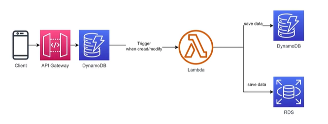

# 7. AWS Lambda Use Cases (Các trường hợp sử dụng thực tế)

AWS Lambda được ứng dụng rộng rãi trong nhiều mô hình kiến trúc phần mềm hiện đại nhờ khả năng tích hợp linh hoạt và tính chất serverless tự động co giãn. Dưới đây là 4 nhóm Use Case điển hình nhất trong thực tế.

---

## 1. Xử lý async khi nhận trigger từ S3

Mô hình này tận dụng kiến trúc hướng sự kiện (Event-Driven) và cơ chế gọi bất đồng bộ (Asynchronous Invocation) của AWS Lambda để tự động hóa quy trình xử lý dữ liệu ngay sau khi tệp tin được tải lên.

<p align="center">
  
  <br/>
  <em>Xử lý bất đồng bộ kết hợp S3 Trigger, Lambda, DynamoDB và RDS</em>
</p>

* **Mô tả luồng hoạt động**:
  1. **S3 Source**: Người dùng hoặc ứng dụng thực hiện tải tệp tin lên S3 Bucket Nguồn.
  2. **Trigger when upload**: Sự kiện tạo mới tệp tin (`ObjectCreated`) lập tức gửi tín hiệu kích hoạt bất đồng bộ tới **AWS Lambda**.
  3. **Lambda Function** nhận thông tin sự kiện, chạy ngầm (in background) và thực hiện song song các tác vụ:
     * **transform file**: Biến đổi tệp tin (ví dụ: resize hình ảnh, nén dữ liệu, convert định dạng video/audio) và lưu trữ kết quả đầu ra vào **Destination** (S3 Bucket Đích).
     * **save metadata**: Lưu trữ các thông tin đặc tả dữ liệu (Metadata như kích thước, định dạng, tên tệp, ngày tạo) trực tiếp vào cơ sở dữ liệu NoSQL **Amazon DynamoDB** và cơ sở dữ liệu quan hệ **Amazon RDS**.
* **Lợi ích**:
  * Tối ưu hóa hiệu năng và trải nghiệm người dùng bằng cách chuyển các tác vụ nặng vào luồng xử lý chạy ngầm bất đồng bộ.
  * Tự động co giãn (Auto-scaling) theo số lượng file được upload cùng lúc.
  * Không tốn chi phí duy trì hạ tầng khi không có file cần xử lý (Zero Idle Cost).

---

## 2. Dùng làm backend API khi kết hợp với API Gateway

Mô hình thiết kế hệ thống backend Serverless này giúp ứng dụng Web/Mobile tự động co giãn và mở rộng linh hoạt theo số lượng yêu cầu truy cập từ client mà không cần duy trì các cụm Web Server truyền thống.

<p align="center">
  
  <br/>
  <em>Kiến trúc Serverless API sử dụng API Gateway và AWS Lambda</em>
</p>

* **Mô tả luồng hoạt động**:
  1. **Client** (Thiết bị di động hoặc ứng dụng Web) gửi các HTTP Request (POST, GET,...) tới **Amazon API Gateway**.
  2. **API Gateway** gửi thông tin xác thực đến **Authorizer Lambda** để thực hiện kiểm tra quyền truy cập (Authentication & Authorization).
  3. Sau khi xác thực thành công, API Gateway định tuyến và chuyển tiếp yêu cầu đến **Backend Lambda** để thực thi logic nghiệp vụ.
  4. Trong quá trình chạy, **Backend Lambda** tự động ghi nhận nhật ký và số liệu đo lường (Logs & Metrics) về **Amazon CloudWatch**.
  5. Đồng thời, **Backend Lambda** thực hiện các thao tác dữ liệu (CRUD - Create, Read, Update, Delete) trực tiếp với cơ sở dữ liệu NoSQL **Amazon DynamoDB** hoặc cơ sở dữ liệu quan hệ **Amazon RDS**.
  6. Kết quả xử lý từ Lambda được trả ngược về API Gateway để chuyển đổi thành HTTP Response phản hồi lại cho Client.

---

## 3. Thực hiện các tác vụ đơn giản theo lịch kết hợp với EventBridge

Thay thế các máy chủ Jenkins hay Cron Server truyền thống để thực hiện các tác vụ quản trị hệ thống và vận hành tự động định kỳ.

<p align="center">
  
  <br/>
  <em>Tự động hóa vận hành hệ thống kết hợp EventBridge và AWS Lambda</em>
</p>

* **Mô tả luồng hoạt động**:
  1. **Amazon EventBridge** đóng vai trò kích hoạt:
     * **Scheduler**: Chạy định kỳ theo thời gian thiết lập trước (như Cron expression để dọn dẹp hệ thống, backup database).
     * **Event**: Phản hồi lại các sự kiện thay đổi trạng thái tài nguyên trong hệ thống AWS.
  2. EventBridge gửi tín hiệu kích hoạt trực tiếp đến **AWS Lambda**.
  3. **Lambda Function** thực thi mã nguồn xử lý và thực hiện:
     * **Start/Stop**: Gửi lệnh Bật hoặc Tắt các cụm máy chủ ảo **EC2** để tiết kiệm chi phí vận hành.
     * **Notification**: Đẩy thông điệp cảnh báo/báo cáo trạng thái đến **Amazon SNS** để gửi Email hoặc tin nhắn SMS cho quản trị viên hệ thống.

---

## 4. Xử lý async khi nhận trigger từ DynamoDB

Đây là mô hình kiến trúc lưu vết và xử lý bất đồng bộ dữ liệu (Change Data Capture - CDC) sử dụng DynamoDB Streams để tự động kích hoạt Lambda khi có sự thay đổi dữ liệu trong cơ sở dữ liệu.

<p align="center">
  
  <br/>
  <em>Xử lý bất đồng bộ khi dữ liệu thay đổi trong DynamoDB</em>
</p>

* **Mô tả luồng hoạt động**:
  1. **Client** gửi yêu cầu ghi nhận/cập nhật dữ liệu qua **API Gateway**.
  2. API Gateway thực hiện ghi trực tiếp hoặc định tuyến yêu cầu ghi vào bảng **DynamoDB** chính.
  3. **Trigger when create/modify**: Khi một bản ghi mới được tạo hoặc sửa đổi, **DynamoDB Streams** ghi nhận sự thay đổi đó và tự động kích hoạt **AWS Lambda** chạy bất đồng bộ.
  4. **Lambda Function** nhận bản ghi dữ liệu thay đổi từ stream, thực hiện phân tích/xử lý và lưu trữ dữ liệu (save data) sang:
     * Bảng **DynamoDB** khác (ví dụ: bảng tổng hợp báo cáo, bảng audit log).
     * Cơ sở dữ liệu quan hệ **Amazon RDS** (để đồng bộ hóa dữ liệu phục vụ các truy vấn phức tạp hoặc làm Data Warehouse).
* **Lợi ích**:
  * Tách biệt hoàn toàn luồng ghi dữ liệu chính (Write Path) và luồng xử lý hậu kỳ (Post-processing Path), giúp cải thiện hiệu năng của ứng dụng chính.
  * Đảm bảo tính nhất quán cuối cùng (Eventual Consistency) giữa các nguồn dữ liệu khác nhau.
  * Tự động phản hồi thời gian thực với các thay đổi dữ liệu mà không cần cơ chế thăm dò (Polling).

---

## 5. Xử lý luồng dữ liệu thời gian thực (Real-time Stream Processing)

Phục vụ phân tích dữ liệu lớn và giám sát hoạt động thời gian thực.

```
[Thiết bị IoT / Clickstream] ──> Đẩy dữ liệu liên tục
                                      │
                                      ▼
                              [Amazon Kinesis] (Hứng luồng dữ liệu)
                                      │
                                      ▼ (Kích hoạt theo Batch)
                              [AWS Lambda Function] (Lọc, chuẩn hóa dữ liệu)
                                      │
                                      ▼ (Lưu dữ liệu sạch)
                            [Amazon S3 / OpenSearch]
```

* **Mô tả luồng**:
  1. Hàng ngàn thiết bị IoT hoặc các sự kiện click chuột của người dùng đẩy dữ liệu thô liên tục về **Amazon Kinesis**.
  2. **AWS Lambda** được cấu hình để đọc dữ liệu từ Kinesis theo từng nhóm (batch).
  3. Lambda thực hiện lọc bỏ thông tin rác, chuẩn hóa cấu trúc dữ liệu, và đẩy dữ liệu sạch vào hệ thống lưu trữ **S3** hoặc cơ sở dữ liệu tìm kiếm **Amazon OpenSearch**.

---

* **Bài trước**: [6. When to Use and Not Use AWS Lambda (Khi nào nên/không nên dùng)](6.%20When%20to%20Use%20and%20Not%20Use%20AWS%20Lambda.md)
* **Bài tiếp theo**: [8. Hello Lambda - AWS Console Introduction (Giới thiệu trên AWS Console)](8.%20Hello%20Lambda%20-%20AWS%20Console%20Introduction.md)
