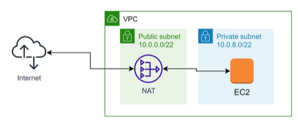

# 4. Các thành phần của VPC (detail) (Detailed VPC Components)

Dưới đây là thông tin chi tiết về các thành phần quan trọng trong hạ tầng mạng Amazon VPC:

---

## I. Internet Gateway (IGW)

**Internet Gateway (IGW)** là một cổng kết nối có tính sẵn sàng cao và co giãn tự động được quản lý bởi AWS, đóng vai trò kết nối VPC của bạn với mạng Internet công cộng.

*   **Cửa ngõ truy cập:** Là cửa ngõ duy nhất cho phép dữ liệu (traffic) di chuyển ra vào giữa VPC và Internet.
*   **Điều kiện bắt buộc cho SSH:** Nếu VPC không được gắn (attach) Internet Gateway, bạn **không thể kết nối SSH** (hoặc RDP) tới các instance bên trong VPC từ bên ngoài Internet, ngay cả khi các instance đó đã được gắn địa chỉ Public IP và cấu hình đúng Security Group.
*   **Default VPC:** Mặc định khi tài khoản AWS được tạo, AWS sẽ tự động cung cấp một **Default VPC** trong đó đã được gắn sẵn một Internet Gateway cùng cấu hình định tuyến cơ bản để người dùng có thể sử dụng ngay lập tức.

---

## II. NAT Gateway

**NAT Gateway** (Network Address Translation Gateway) là dịch vụ NAT được quản lý hoàn toàn bởi AWS, cho phép các tài nguyên nằm trong Private Subnet giao tiếp với Internet nhưng ngăn chặn Internet kết nối trực tiếp vào chúng.

*   **Kết nối Internet không cần Public IP:** Giúp cho các instance trong Private Subnet có thể đi ra internet (ví dụ: để cập nhật bản vá hệ điều hành, cài đặt thư viện code, kết nối API bên thứ ba) mà bản thân instance đó không cần được gắn địa chỉ Public IP.
*   **Bảo mật nâng cao:** NAT Gateway đóng vai trò như một bức chắn bảo vệ, giúp tăng cường bảo mật cho các tài nguyên nhạy cảm cần được giữ riêng tư như máy chủ ứng dụng (App Servers) hoặc cơ sở dữ liệu (Database).
*   **Vị trí triển khai:** NAT Gateway bắt buộc phải được triển khai trong một **Public Subnet** (mạng con có kết nối trực tiếp với Internet thông qua Internet Gateway) và được liên kết với một địa chỉ IP tĩnh **Elastic IP (EIP)**.

---

*   **Bài trước:** [3. Thiết kế VPC phổ biến (Common VPC Design)](3.%20Common%20VPC%20Design.md)
*   **Bài tiếp theo:** [9. EKS (Elastic Kubernetes Service)](../9. EKS.md)
