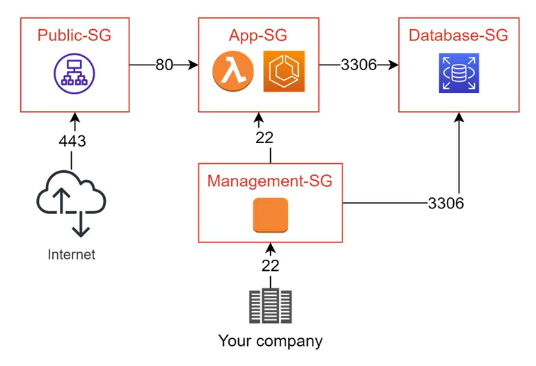

# 5. Chi tiết thành phần của VPC (Security Group)

**Security Group (SG)** đóng vai trò như một bức tường lửa ảo (virtual firewall) ở cấp độ instance (như EC2, RDS, Lambda) để kiểm soát lưu lượng dữ liệu đi vào và đi ra.

---

## I. Đặc điểm cốt lõi của Security Group

*   **Gom nhóm tài nguyên:** Thường được sử dụng để gom nhóm các tài nguyên có chung thiết lập mạng (các cổng port, giao thức protocol, hướng in/out).
*   **Thiết kế thông minh:** Khi thiết kế Security Group, cần đặc biệt quan tâm tới tính tái sử dụng cao và khả năng dễ dàng quản lý (tránh tạo quá nhiều Security Group nhỏ lẻ trùng lặp).
*   **Nguồn linh hoạt (Source):** Source (Nguồn) hoặc Destination (Đích) của một rule trong Security Group có thể cấu hình linh hoạt:
    *   Một dải **CIDR** cụ thể (ví dụ: `10.0.0.0/24` hoặc `0.0.0.0/0` cho Internet).
    *   **ID của một Security Group khác** (Security Group Chaining). Điều này cho phép các tài nguyên thuộc Security Group này tự động tin cậy và chấp nhận kết nối từ các tài nguyên thuộc Security Group kia mà không cần mở rộng dải IP (như minh họa trong sơ đồ trên: `App-SG` chỉ cho phép cổng `80` từ `Public-SG`).
*   **Cơ chế Stateful:** Quy tắc của Security Group hoạt động theo cơ chế **Stateful** (lưu trạng thái kết nối). Có nghĩa là nếu bạn đã cấu hình Inbound cho phép traffic đi vào, khi có request thực tế gửi tới, hệ thống sẽ tự động cho phép traffic phản hồi đi ra mà không cần cấu hình thêm quy tắc Outbound tương ứng.
*   **Chỉ cho phép Allow:** Quy tắc của Security Group chỉ có các rule **Allow** (Cho phép), không hỗ trợ các rule **Deny** (Chặn). Mọi traffic không khớp với bất kỳ rule Allow nào mặc định sẽ bị chặn hoàn toàn.

---

*   **Bài trước:** [4. Các thành phần của VPC (detail) (Detailed VPC Components)](4.%20VPC%20Components%20%28Internet%20Gateway,%20NAT,%20ACL%29.md)
*   **Bài tiếp theo:** [9. EKS (Elastic Kubernetes Service)](../9. EKS.md)
