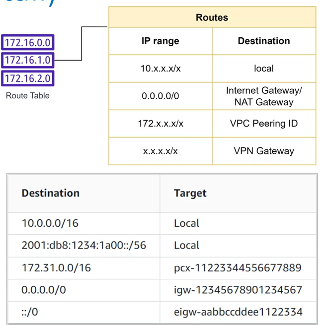

# 6. Chi tiết thành phần của VPC (Route Table)

**Route Table (Bảng định tuyến)** chứa một tập hợp các quy tắc định tuyến (routes) dùng để xác định các luồng dữ liệu (network traffic) từ subnet hoặc gateway trong VPC của bạn sẽ được điều hướng đi đâu.

---

## I. Đặc điểm cốt lõi của Route Table

*   **Quyết định tính chất Subnet (Public vs Private):** Route Table là thành phần chính quyết định một subnet là Public hay Private:
    *   **Public Subnet:** Khi Route Table liên kết với subnet đó có chứa một quy tắc định tuyến (route) trỏ dải IP Internet (`0.0.0.0/0` hoặc `::/0`) đi tới **Internet Gateway (IGW)**.
    *   **Private Subnet:** Khi Route Table liên kết với subnet đó **không** có route trỏ tới Internet Gateway (thường chỉ có route đi tới NAT Gateway hoặc local).
*   **Liên kết Subnet:** Một Subnet tại một thời điểm **chỉ có thể được liên kết (associate) với duy nhất 1 Route Table**. Tuy nhiên, một Route Table có thể được liên kết với nhiều Subnet khác nhau cùng một lúc.
*   **Main Route Table (Bảng định tuyến chính):** Mặc định khi bạn khởi tạo VPC, AWS sẽ tự động tạo ra một **Main Route Table**. Tất cả các Subnets mới tạo ra trong VPC nếu không được cấu hình liên kết rõ ràng với một Route Table tùy chỉnh nào khác thì sẽ mặc định được liên kết và định tuyến theo Main Route Table này.
*   **Định tuyến mặc định (Local Route):** Mọi Route Table đều tự động chứa một quy tắc định tuyến mặc định cho phép các tài nguyên giao tiếp nội bộ với nhau trong cùng VPC (Target là `local`), quy tắc này không thể chỉnh sửa hoặc xóa bỏ.

---

*   **Bài trước:** [5. Chi tiết thành phần của VPC (Security Group)](5.%20VPC%20Components%20%28Security%20Group%29.md)
*   **Bài tiếp theo:** [9. EKS (Elastic Kubernetes Service)](../9. EKS.md)
