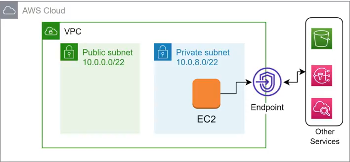

# 7. Chi tiết thành phần của VPC (VPC Endpoint)

**VPC Endpoint** giúp các tài nguyên (resource) trong VPC của bạn có thể kết nối tới các dịch vụ khác của AWS (như S3, DynamoDB, SQS, CloudWatch...) một cách bảo mật và tin cậy thông qua một đường kết nối riêng tư (private connection) mà không cần đi qua môi trường Internet công cộng hay sử dụng các cổng như Internet Gateway, NAT Gateway, hay VPN.

---

## I. Công dụng của VPC Endpoint

*   **Tăng cường bảo mật (Secure):** Lưu lượng truy cập (network traffic) giữa các tài nguyên trong VPC và dịch vụ AWS khác hoàn toàn được định tuyến trong mạng nội bộ của AWS (AWS global network). Điều này giúp dữ liệu không bị lộ ra môi trường Internet công cộng.
*   **Tăng tốc độ truy cập (Performance):** Kết nối nội bộ riêng tư giúp tối ưu hóa băng thông, giảm độ trễ (latency) và tăng tốc độ truyền tải dữ liệu giữa các dịch vụ.

---

## II. Phân loại VPC Endpoint

AWS cung cấp 2 loại VPC Endpoint chính phục vụ cho các dịch vụ khác nhau:

### 1. Gateway Endpoint
*   **Dịch vụ hỗ trợ:** Chỉ hỗ trợ **Amazon S3** và **Amazon DynamoDB**.
*   **Cơ chế hoạt động:** Tạo ra một gateway (cổng ảo) được định tuyến trực tiếp thông qua Route Table của subnet. Bạn chỉ cần cấu hình Route Table để chuyển traffic đi tới dải IP dịch vụ qua Target là Gateway Endpoint ID (ví dụ: `vpce-xxxxxx`).
*   **Chi phí:** Hoàn toàn **miễn phí** sử dụng.

### 2. Interface Endpoint (AWS PrivateLink)
*   **Dịch vụ hỗ trợ:** Hỗ trợ hầu hết các dịch vụ AWS còn lại (như **SQS, CloudWatch, SNS, ECS, EKS, Kinesis, Systems Manager...**) cùng các dịch vụ SaaS của bên thứ ba.
*   **Cơ chế hoạt động:** Triển khai một card mạng ảo **Elastic Network Interface (ENI)** với địa chỉ IP Private nằm trực tiếp trong subnet của bạn. Hệ thống sẽ sử dụng cơ chế DNS để phân giải các yêu cầu truy cập dịch vụ về địa chỉ IP Private này.
*   **Bảo mật:** Có thể cấu hình **Security Group** đi kèm trực tiếp với Interface Endpoint (ENI) này để giới hạn và hạn chế các luồng truy cập từ các resource cụ thể trong VPC.
*   **Chi phí:** Có tính phí theo số lượng Endpoint được tạo và lưu lượng dữ liệu truyền qua.

---

*   **Bài trước:** [6. Chi tiết thành phần của VPC (Route Table)](6.%20VPC%20Components%20%28Route%20Table%29.md)
*   **Bài tiếp theo:** [8. Chi tiết thành phần của VPC (VPC Definition & CIDR)](8.%20VPC%20Components%20%28VPC%20Definition%29.md)
